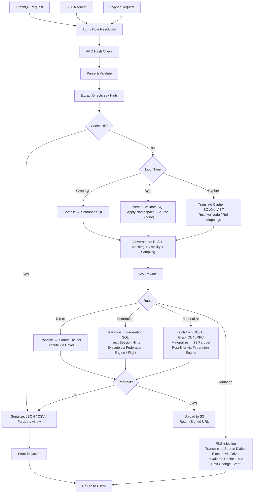

# Provisa Architecture

## Overview

Provisa is a config-driven data virtualization platform, specifically designed to power a semantic layer from small teams to large enterprises. It provides a unified API over heterogeneous data sources with governance, security, and performance optimization. Clients query via SQL, GraphQL, or Cypher; all three are first-class interfaces with identical governance applied. (REQ-002, REQ-038)

The semantic layer distinction is important. To add to the semantic layer you must create new data sources or aggregates within the data virtualization layer. This creates a clean separation — no new additions to the semantics can be made outside the platform, enabling true data governance. (REQ-136) Enforcement is at the compiler level: the approved relationship catalog is the source of truth regardless of which query language is used. (REQ-002)

Provisa is designed to be highly performant for operational needs and highly scalable for enterprise analytical needs. A single platform serves both without sacrificing speed or scalability.

```
Config YAML → PG Metadata → Federation Catalogs
                               ↓
         Federation engine metadata → Schema Generator → SDL / SQL catalog / Cypher labels / gRPC proto (per role)
                                     ↓
                     Query → Parser → SQL Compiler → Transpiler
                                     ↓
                             Router (Smart Dispatch)
                         /           |            \
                    Federation  Direct PG      Direct MySQL/etc.
                         \           |            /
                              Executor Pool
                                     ↓
                         ┌───── Inline ─────┐     ┌──── Redirect ────┐
                         │  JSON (HTTP)     │     │  CTAS → S3       │
                         │  Arrow (Flight)  │     │  (Parquet, ORC)  │
                         │  Protobuf (gRPC) │     │  Provisa → S3    │
                         └─────────────────-┘     │  (JSON, CSV, …)  │
                                                  └─────────────────-┘
```

## Query Interfaces

Each interface is a distinct transport. All four apply the same security pipeline (RLS, masking, sampling, role checks). (REQ-002, REQ-038) Clients never talk directly to the federation engine. (REQ-266) "Query language" (SQL / GraphQL / Cypher) is orthogonal to transport — multiple languages can arrive over the same transport.

| Port | Transport | Accepted query languages | Use case |
|------|-----------|--------------------------|----------|
| 8001 | HTTP | GraphQL, SQL, Cypher | Web clients, BI tools, curl, REST consumers |
| 8815 | Arrow Flight (gRPC) | SQL (via Arrow Flight SQL) | Data tools (Pandas, DuckDB, Spark, ADBC) |
| 50051 | Protobuf gRPC | Per-role generated proto RPCs | Service-to-service with typed contracts |
| configurable¹ | PostgreSQL wire protocol (pgwire) | SQL | psql, DBeaver, SQLAlchemy, any PG-compatible client |

¹ Set `PROVISA_PGWIRE_PORT` (e.g. 5433). Disabled when unset or `0`.

### HTTP (port 8001)

Multiple endpoints under the same port, distinguished by path:

| Path | Language | Notes |
|------|----------|-------|
| `POST /data/graphql` | GraphQL | Reads and mutations; APQ hash accepted via `extensions.persistedQuery` |
| `POST /data/sql` | SQL | Read-only; requires `query_development` capability |
| `POST /data/query` | Cypher | Read-only; standard role |
| `GET /data/nl` | Natural language | Translates to SQL/GraphQL/Cypher based on source type |
| `GET /data/subscribe` | GraphQL | SSE subscription stream |
| `GET /neo4j/...` | Cypher (Neo4j compat) | Neo4j HTTP API compatibility shim |
| `POST /admin/graphql` | GraphQL | Admin API (superuser/admin role required) |

All paths return JSON by default. `Accept: text/csv`, `application/vnd.apache.parquet`, `application/vnd.apache.arrow.stream`, and `application/octet-stream` (raw binary) are supported via content negotiation. Results exceeding the configured size threshold are automatically redirected to a signed S3 URL. (REQ-029, REQ-137)

### Arrow Flight (port 8815)

Native Arrow columnar transport over gRPC. (REQ-045, REQ-143) Clients send a JSON ticket:
```json
{"query": "SELECT name, email FROM customers", "role": "analyst"}
```
and receive Arrow RecordBatches streamed lazily. When the Zaychik Flight SQL proxy is available, data flows as a stream of Arrow record batches end-to-end: (REQ-144)

```
Client ←(Arrow batches)← Provisa Flight Server ←(Arrow batches)← Zaychik ←(JDBC)← Federation Engine
```

The full result is never materialized in Provisa memory — batches are forwarded as they arrive. (REQ-145) This makes Arrow Flight an unbounded path suitable for arbitrarily large results.

### Protobuf gRPC (port 50051)

Auto-generated `.proto` from the data schema, generated per role. (REQ-525) Streaming queries (one message per row), unary mutations. Server reflection enabled. (REQ-526) Role via `x-provisa-role` metadata key.

### PostgreSQL wire protocol / pgwire (configurable port)

Implements the PostgreSQL frontend/backend wire protocol using the `buenavista` library. (REQ-527) Any PostgreSQL-compatible client — `psql`, DBeaver, SQLAlchemy with `psycopg2`, JDBC — can connect without modification. Accepts SQL only. The full governance pipeline (RLS, masking, domain permissions) applies identically to pgwire connections. (REQ-266, REQ-002) Enabled by setting `PROVISA_PGWIRE_PORT` to a non-zero port.

## Request Pipeline

Three query languages are accepted. All converge at governance after their respective parse/compile steps. (REQ-262, REQ-263) Only GraphQL supports writes. (REQ-037)

| Interface | Reads | Writes | Capability required |
|---|---|---|---|
| GraphQL (`/data/graphql`) | Yes | Yes (mutations) | Standard role |
| SQL (`/data/sql`) | Yes | No | `query_development` |
| Cypher (`/data/query`) | Yes | No | Standard role |



**Route decisions:**

| Route | When |
|---|---|
| **Direct** | Single source + has native driver + has federation connector |
| **Federation** | Multi-source federation, or source has connector but no driver |
| **Materialize** | Source has no federation connector — fetch and cache to S3/PG first |
| **Mutation** | GraphQL mutation — always direct, never federated |

### Multi-Root Queries

GraphQL queries with multiple root fields (e.g., `{ orders { id } customers { name } }`) are compiled into separate SQL queries and executed independently. (REQ-534) SQL and Cypher requests are single-root by definition. Results are merged into a single response:
- Fields below the redirect threshold are returned inline in `data`
- Fields above the threshold are redirected, with per-field entries in `redirects`
- Binary formats (Parquet, Arrow) are only supported for single-root queries

## Federation Execution Paths

| Path | Transport | Via | When used |
|------|-----------|-----|-----------|
| REST | federation engine client (HTTP :8080) | Direct query | Default, always available |
| Flight SQL | `adbc-driver-flightsql` (gRPC :8480) | Zaychik proxy → JDBC | When Zaychik is running |
| CTAS | federation engine client (HTTP :8080) | Direct write, Iceberg to S3 | Parquet/ORC redirect |

### Zaychik Arrow Flight SQL Proxy

The federation engine does not natively support the Arrow Flight SQL protocol. [Zaychik](https://github.com/Raiffeisen-DGTL/zaychik-trino-proxy) is a Java proxy that implements the Arrow Flight SQL gRPC interface, translates requests to JDBC queries, and streams results back as Arrow record batches. (REQ-144)

```
ADBC client → gRPC :8480 → Zaychik → JDBC :8080 → Federation Engine → results → Arrow batches → client
```

The Provisa Flight server (port 8815) connects to Zaychik as an ADBC client, enabling streaming Arrow end-to-end without materializing results. (REQ-145)

### Iceberg Results Catalog

CTAS redirect uses an Iceberg connector (`results` catalog) backed by a JDBC catalog on the existing PostgreSQL instance. (REQ-169) Iceberg writes Parquet/ORC files directly to MinIO/S3 via the native S3 filesystem (`fs.native-s3.enabled=true`).

## Large Result Redirect

Results exceeding a row threshold are redirected to S3-compatible storage (MinIO) instead of being returned inline. (REQ-029)

### Redirect Modes

| Mode | How it works | Data touches Provisa? |
|------|-------------|----------------------|
| **CTAS** (Parquet, ORC) | Federation engine writes directly to S3 via `CREATE TABLE AS SELECT` | No |
| **Provisa upload** (JSON, NDJSON, CSV, Arrow IPC) | Provisa serializes and uploads via boto3 | Yes |

For CTAS-native formats, Provisa never handles the data — the federation engine writes files directly to MinIO/S3. (REQ-138) This is the preferred path for large analytical exports.

### Redirect Headers

| Header | Effect |
|--------|--------|
| `X-Provisa-Redirect-Format: <mime>` | Redirect in this format (implies force unless threshold set) |
| `X-Provisa-Redirect-Threshold: N` | Only redirect if result exceeds N rows |
| `X-Provisa-Redirect: true` | Force redirect using default format |

These headers implement client-controlled redirect. (REQ-137)

**Response:**
```json
{
  "data": {"orders": null},
  "redirect": {
    "redirect_url": "https://minio:9000/provisa-results/results/abc.parquet?...",
    "row_count": 50000,
    "expires_in": 3600,
    "content_type": "application/vnd.apache.parquet"
  }
}
```

### Server Configuration

| Env var | Default | Purpose |
|---------|---------|---------|
| `PROVISA_REDIRECT_ENABLED` | `false` | Enable server-side threshold redirect |
| `PROVISA_REDIRECT_THRESHOLD` | `1000` | Default row count threshold |
| `PROVISA_REDIRECT_FORMAT` | `parquet` | Default redirect format |
| `PROVISA_REDIRECT_BUCKET` | `provisa-results` | S3 bucket name |
| `PROVISA_REDIRECT_ENDPOINT` | | S3-compatible endpoint URL |
| `PROVISA_REDIRECT_TTL` | `3600` | Presigned URL TTL (seconds) |

## Routing Decision Tree

```
Multi-source query? → Federation engine
NoSQL source (MongoDB, Cassandra)? → Federation engine
Uses path columns on non-PG source? → Federation engine
Single RDBMS with driver? → Direct (sub-100ms target)
Single RDBMS without driver? → Federation engine
Steward hint "federated"? → Federation engine (override)
Steward hint "direct"? → Direct (if possible)
Redirect to Parquet/ORC? → Federation engine (CTAS, regardless of source count)
```

(REQ-027, REQ-028, REQ-030, REQ-279)

## Federation Query Optimization

Provisa primes the federation engine's cost-based optimizer automatically so cross-source query plans are based on real data distribution, not hardcoded defaults.

### Automatic Statistics (`ANALYZE`)

On source registration, Provisa runs `ANALYZE catalog.schema.table` for every published table. (REQ-275) This collects:

- Row count
- Per-column: null fraction, distinct value count, min/max, histograms (connector-dependent)

The optimizer uses these to estimate selectivity for filtered queries. Without statistics, it falls back to fixed defaults (e.g., 10% selectivity for equality predicates) which produce poor join plans on skewed or high-cardinality data. With statistics, estimates are accurate enough to make correct broadcast vs. partitioned join decisions for most workloads.

**Coverage**: statistics support varies by connector. PostgreSQL, MySQL, Hive, Iceberg, and Delta Lake fully support `ANALYZE`. MongoDB and Cassandra connectors have partial or no support. Provisa swallows `ANALYZE` failures silently — registration is never blocked. (REQ-275)

**Selectivity limits**: statistics provide per-column estimates. For correlated predicates (`WHERE region = 'US' AND city = 'Seattle'`), the optimizer assumes column independence, which may underestimate row counts. This is a known limitation of column-level statistics in all cost-based optimizers.

**API sources**: `api_cache_{table_name}` tables in PostgreSQL are analyzed automatically after each cache refresh cycle, so the optimizer has current row estimates when joining API-backed sources with relational sources. (REQ-280)

### Admin: Refresh Statistics

Re-run statistics collection on demand via the admin API: (REQ-276)

```graphql
mutation {
  refreshSourceStatistics(sourceId: "sales-pg") {
    tablesAnalyzed
    failures { table message }
  }
}
```

Useful when a source has received significant new data since registration.

## Materialized Views

MVs transparently optimize expensive queries by pre-computing and caching results.

### Relationships as MV Hints

A relationship declaration is not only a governance artifact — it is also the structural description of a join shape. That shape is exactly what the MV optimizer needs: two tables, two columns, a join type. This means a relationship can directly drive materialization.

For **cross-source relationships**, this happens automatically at startup: every approved cross-source relationship generates a `JoinPattern` MV (`auto-mv-<rel_id>`). (REQ-158) No separate MV config is required. When the compiler sees that join in a query, the rewriter substitutes the pre-materialized result transparently.

For **same-source relationships**, stewards can opt in explicitly via `materialize: true`. Same-source JOINs are already fast via direct execution, so materialization is only worthwhile for very hot join paths. (REQ-159)

The practical consequence: stewards who approve a relationship are implicitly deciding whether the join is a good candidate for materialization. The governance act and the optimization hint are the same declaration.

### Modes

| Mode | Config | Behavior |
|------|--------|----------|
| **Join-pattern** | `join_pattern` in MV config | Rewrites matching JOINs to read from MV table |
| **Custom SQL** | `sql` in MV config | Arbitrary SELECT, optionally exposed in SDL |
| **Auto-materialized relationship** | cross-source relationship (automatic) | Auto-generates a join-pattern MV; no config required |
| **Steward-materialized relationship** | `materialize: true` on same-source relationship | Explicit opt-in for hot same-source join paths |

### Auto-Materialization

Cross-source JOINs are the most expensive queries (always federated). Cross-source relationships automatically generate MV definitions at startup: (REQ-158)

```yaml
relationships:
  - id: orders-to-reviews
    source_table_id: orders        # sales-pg
    target_table_id: product_reviews  # reviews-mongo
    source_column: product_id
    target_column: product_id
    cardinality: one-to-many
    materialize: true              # auto-create MV
    refresh_interval: 600          # refresh every 10 minutes
```

Only cross-source relationships generate MVs (same-source JOINs are already fast via direct execution). (REQ-159) The MV starts in `STALE` status and is refreshed by the background refresh loop before being used by the query optimizer. (REQ-160)

### Refresh Lifecycle

```
STALE → (refresh loop picks up) → REFRESHING → FRESH
  ↑                                                |
  └──── mutation hits source table ────────────────┘
```

The refresh loop runs every 30 seconds, checks `get_due_for_refresh()`, and executes `CREATE TABLE AS SELECT` (first run) or `DELETE + INSERT` (subsequent) against the MV target table via the federation engine. (REQ-160, REQ-234)

## Module Map

| Module | Purpose |
|--------|---------|
| `api/` | FastAPI app, routers, middleware, lifespan management |
| `api/flight/` | Arrow Flight server (gRPC, port 8815) |
| `api/admin/` | Strawberry GraphQL admin API — config, discovery, views |
| `api/rest/` | Auto-generated REST endpoints from registered tables |
| `api/jsonapi/` | Auto-generated JSON:API endpoints with pagination and error handling |
| `api/data/subscribe.py` | SSE subscriptions — LISTEN/NOTIFY, polling, Debezium CDC |
| `compiler/` | Query parsers (GraphQL, SQL, Cypher), semantic SQL generator, RLS, masking, sampling |
| `compiler/federation.py` | Apollo Federation v2 subgraph support |
| `transpiler/` | SQLGlot transpilation, routing logic |
| `executor/` | Federated/direct execution, serialization, output formats |
| `executor/trino_flight.py` | ADBC Flight SQL client for the federation engine |
| `executor/ctas_write.py` | CTAS-based redirect (federation engine writes to S3) |
| `executor/redirect.py` | S3 redirect logic, Provisa-side upload |
| `registry/` | Governed query store, governance |
| `security/` | Visibility, rights, column masking |
| `cache/` | Redis-backed query result caching (hot tier) |
| `mv/` | Materialized view registry, refresh, SQL rewriter |
| `events/` | Dataset change events and trigger dispatch |
| `webhooks/` | Outbound webhook execution for mutations and events |
| `scheduler/` | APScheduler-based background job management — cron and interval triggers that fire webhooks, mutations, or Kafka sink publishes |
| `apq/` | Apollo APQ wire protocol — Redis-backed query hash cache; separate from result caching |
| `compiler/cursor.py` | Relay-style cursor pagination — `first`/`after`/`last`/`before` arguments and `pageInfo` generation on all list queries |
| `compiler/aggregate_gen.py` | Auto-generated `{table}_aggregate` query types with `count`, `sum`, `avg`, `min`, `max` sub-fields and filtered `nodes` access |
| `compiler/enum_detect.py` | Enum type auto-detection — PostgreSQL native enum types (`pg_enum`) exposed as GraphQL enum types rather than string scalars |
| `compiler/hints.py` | Federation performance hints — query-level routing directives embedded as SQL comments (`/* @provisa route=federated */`) that override automatic routing |
| `compiler/mutation_gen.py` | Mutation compiler; column presets — server-side static or session-variable values applied on insert/update, not exposed in the mutation input type |
| `auth/approval_hook.py` | ABAC approval hook — pluggable external authorization called before query execution; webhook, gRPC, and unix_socket transports; per-table/source/global scope; configurable fallback policy |
| `subscriptions/` | SSE subscription state and delivery |
| `discovery/` | LLM relationship discovery (Claude API) |
| `grpc/` | Proto generation, gRPC server, reflection |
| `api_source/` | REST/GraphQL/gRPC API sources with PG cache |
| `kafka/` | Kafka topic sources, sink, Schema Registry |
| `auth/` | Pluggable auth providers, middleware, role mapping |
| `core/` | Config, models, DB, repositories, secrets; role model supports `parent_role_id` and `flatten_roles()` for recursive role inheritance |
| `hasura_v2/` | Hasura v2 metadata → Provisa config converter |
| `ddn/` | Hasura DDN supergraph → Provisa config converter |
| `mongodb/` | MongoDB source connector |
| `elasticsearch/` | Elasticsearch source connector |
| `cassandra/` | Cassandra source connector |
| `accumulo/` | Apache Accumulo source connector |
| `prometheus/` | Prometheus metrics source connector |
| `source_adapters/` | Generic adapter layer for source connections |

## Admin API

The admin Strawberry GraphQL API is mounted at `/admin/graphql` (HTTP port 8001). It is separate from the data GraphQL endpoint and requires superuser or admin role.

| Capability | Description |
|-----------|-------------|
| Config download/upload | Export or replace the full Provisa YAML config |
| Relationship editor | Create, update, delete relationship definitions |
| AI FK discovery | Trigger Claude-powered FK candidate analysis |
| Schema introspection | Browse published tables, columns, and roles |
| View management | Register and manage materialized view definitions |

(REQ-164, REQ-165, REQ-166, REQ-167)

## Auto-Generated REST & JSON:API Endpoints

Registered tables are exposed as REST and JSON:API endpoints alongside the GraphQL interface. (REQ-256, REQ-257)

| Interface | Mount path | Spec |
|-----------|-----------|------|
| REST | `/rest/<table-id>` | Simple GET/POST with query parameters |
| JSON:API | `/jsonapi/<table-id>` | [jsonapi.org](https://jsonapi.org) compliant — pagination, relationships, error objects |

These endpoints apply the same security pipeline (RLS, masking, role checks) as the GraphQL endpoint. (REQ-002, REQ-038)

## Subscriptions

SSE subscriptions are served at `POST /data/subscribe`. Three delivery modes: (REQ-258)

| Mode | Mechanism | When used |
|------|-----------|-----------|
| **LISTEN/NOTIFY** | PostgreSQL `LISTEN` on a channel | PG sources with mutation activity |
| **Polling** | Re-execute query on interval | Non-PG sources, or when CDC unavailable |
| **Debezium CDC** | Kafka topic from Debezium connector | High-frequency change streams |

(REQ-258, REQ-260, REQ-261)

The client receives `text/event-stream` with one JSON event per changed row or diff.

## Event & Webhook System

Database mutations (INSERT/UPDATE/DELETE) can trigger outbound events via the `events/` and `webhooks/` modules. (REQ-172, REQ-173, REQ-220)

```
Mutation executed → EventDispatcher → match event trigger rules
                                          ↓
                               WebhookExecutor → HTTP POST to configured URL
```

Event triggers are defined in config and matched on table, operation type, and optional row filter. Webhook payloads include the operation type, changed row, and role context.

## Background Services

Four background loops start during app lifespan (`api/app.py`):

| Service | Interval | Purpose |
|---------|----------|---------|
| MV refresh loop | 30 s | Polls `get_due_for_refresh()`, executes CTAS or DELETE+INSERT on stale MVs |
| Warm table manager | Configurable | Promotes frequently-queried tables to Iceberg local SSD cache |
| Hot table loader | Configurable | Loads small reference tables into in-memory cache for sub-millisecond access |
| API source poller | Per-source interval | Re-fetches and re-caches remote REST/GraphQL/gRPC sources |

(REQ-160, REQ-238, REQ-239, REQ-236)

### Hot/Warm Table Caching Tiers

| Tier | Storage | Promotion criteria | Access latency |
|------|---------|-------------------|----------------|
| Hot | In-process memory | Row count < threshold, or is a relationship target | <1 ms |
| Warm | Iceberg on local SSD | Query frequency threshold exceeded | ~5–20 ms |
| Cold | Remote source | Default | 50–500 ms |

(REQ-230, REQ-236, REQ-238, REQ-241)

## Metadata Import (Hasura v2 / DDN)

Existing Hasura deployments can be converted to Provisa config without manual rewriting. (REQ-182, REQ-183)

| Module | Input | Output |
|--------|-------|--------|
| `hasura_v2/` | Hasura v2 `metadata.yaml` | Provisa `config.yaml` |
| `ddn/` | Hasura DDN supergraph JSON | Provisa `config.yaml` |

Both converters map tracked tables, relationships, permissions, and remote schemas. The result is a complete Provisa config ready for deployment. (REQ-182, REQ-183)

## Apollo Federation

`compiler/federation.py` exposes Provisa as an Apollo Federation v2 subgraph. (REQ-259) The subgraph SDL is auto-generated from the published schema with `@key` directives on primary-key columns and `@external`/`@provides` annotations on cross-subgraph relationships. Provisa responds to `_entities` and `_service` queries required by the federation gateway. (REQ-259)

## Cursor-Based Pagination

All list queries support Relay-style cursor pagination via `compiler/cursor.py`. (REQ-218) Clients pass `first`/`after` (forward) or `last`/`before` (backward) arguments. The compiler encodes row position as an opaque base64 cursor and injects the appropriate `WHERE`/`LIMIT` clauses. Every list query returns a `pageInfo` object:

| Field | Type | Description |
|-------|------|-------------|
| `hasNextPage` | Boolean | True if more results exist after this page |
| `hasPreviousPage` | Boolean | True if results exist before this page |
| `startCursor` | String | Cursor of the first node in this page |
| `endCursor` | String | Cursor of the last node in this page |

## Aggregate Queries

Every registered table gets an auto-generated `{table}_aggregate` root field (`compiler/aggregate_gen.py`). (REQ-196) The aggregate type exposes `count`, `sum`, `avg`, `min`, `max` per numeric column, and `nodes` for filtered row access with full field selection (same RLS/masking as the base query). (REQ-196, REQ-198) Aggregate queries are eligible for Aggregate MV routing — see `mv/aggregate_catalog.py`. (REQ-198)

## Automatic Persisted Queries (APQ)

`apq/cache.py` implements the Apollo APQ wire protocol. (REQ-288) When a client sends only a query hash (`extensions.persistedQuery`), Provisa looks it up in Redis. (REQ-289) On a miss it returns a `PersistedQueryNotFound` error; the client retries with the full query body, which Provisa stores. (REQ-288) This is separate from result caching (`cache/`).

## Inherited Roles

Roles in `core/models.py` can reference a `parent_role_id`. (REQ-215) `flatten_roles()` recursively resolves the inheritance chain and merges RLS WHERE clauses (ANDed), column visibility (union, most restrictive wins), and masking policies (child overrides parent per column). This avoids duplicating permission sets across similar roles (e.g., `analyst` inheriting from `reader`). (REQ-215)

## ABAC Approval Hook

`auth/approval_hook.py` is a pluggable authorization hook invoked before query execution, after RLS and masking. (REQ-203) It integrates with external policy engines (OPA, custom ABAC services).

| Setting | Description |
|---------|-------------|
| Transport | `webhook` (HTTP POST), `grpc`, or `unix_socket` |
| Scope | Per-table, per-source, or global |
| Fallback policy | `allow` or `deny` when the hook endpoint is unreachable |

(REQ-246, REQ-247, REQ-204)

## Enum Type Auto-Detection

`compiler/enum_detect.py` introspects PostgreSQL native enum types (`pg_enum`) at schema generation time. (REQ-221) Columns using a PostgreSQL user-defined enum type are promoted to GraphQL enum types — their values become enum members rather than string scalars.

## Scheduled Triggers

`scheduler/jobs.py` uses APScheduler to run background jobs defined as cron or interval triggers. (REQ-216) Each job can POST to a webhook URL, execute a mutation against the data endpoint, or publish query results to a Kafka topic. Triggers are configured via the admin API (`scheduledTrigger` mutations) or the `scheduled_triggers` key in the YAML config. (REQ-216)

## Federation Performance Hints

`compiler/hints.py` parses steward hints embedded in queries as comments using Provisa's comment syntax. (REQ-279) The hint format varies by query language:

```graphql
# @provisa route=federated
{ orders { id amount } }
```
```sql
/* @provisa route=federated */
SELECT id, amount FROM orders
```
```cypher
// @provisa route=federated
MATCH (o:Order) RETURN o.id, o.amount
```

| Hint | Effect |
|------|--------|
| `route=federated` | Force federation through the federation engine, bypassing direct-driver routing |
| `route=direct` | Force direct-driver execution |

(REQ-279, REQ-277, REQ-278)

## Column Presets in Mutations

`compiler/mutation_gen.py` supports per-column server-side presets applied on `INSERT` or `UPDATE`. (REQ-214) Presets are not included in the generated GraphQL mutation input type — they are injected by the compiler transparently. Preset types: `static` (literal value) or `session` (value from request session/header, e.g. `x-hasura-user-id`). (REQ-214)

## GraphQL Voyager Schema Explorer

The admin UI (`provisa-ui/src/pages/SchemaExplorer.tsx`) embeds GraphQL Voyager as an interactive schema visualization tool. (REQ-248) It renders the role-scoped schema as a navigable entity relationship diagram — tables as nodes, relationships as edges. The schema shown is always filtered to the currently selected role.

## Security Enforcement Order

1. **Rights**: Check role has `query_development` capability (REQ-267, REQ-042)
2. **Schema Visibility**: Per-role schema hides unauthorized tables/columns (REQ-039)
3. **RLS**: Per-table per-role WHERE clause injection (REQ-040, REQ-041)
4. **Column Masking**: Per-column per-role data transformation (REQ-263)
5. **Sampling**: LIMIT cap for non-full_results roles (REQ-263, REQ-005)
6. **Governance**: Test mode vs production (registry-required) (REQ-004)

All three query interfaces (HTTP, Flight, gRPC) enforce the same security pipeline. (REQ-002, REQ-038)

## Scalability Limits

Provisa is a thin compilation and routing layer — it adds single-digit milliseconds to query latency. However, paths where Provisa serializes result data are bounded by process memory. Two paths are truly unbounded:

| Path | Memory bound? | Suitable for |
|------|--------------|-------------|
| JSON inline (HTTP) | Yes | Small-medium results |
| **Arrow Flight streaming (gRPC :8815)** | **No** | **Unbounded — streaming via Zaychik** |
| Protobuf gRPC inline (:50051) | Yes | Medium results, service-to-service |
| Redirect: Provisa upload (JSON, CSV, NDJSON, Arrow IPC) | Yes | Medium results, file download |
| **Redirect: CTAS (Parquet, ORC)** | **No** | **Unbounded — federation engine writes to S3** |

(REQ-145, REQ-138)

### Threshold Probing

For threshold-based redirect, Provisa injects `LIMIT threshold + 1` into the query as a probe. (REQ-140) If the result has fewer rows, it returns inline (complete result, no wasted work). If the result hits the limit, the probe is discarded and the full query is re-executed via CTAS or Provisa upload. This avoids `SELECT COUNT(*)` (which some sources don't optimize) and works on every source.

For large analytical workloads, use either:
- **Arrow Flight** (port 8815) for streaming to data tools — batches flow through Provisa without materializing (REQ-145)
- **Parquet/ORC redirect** for file-based exports — the federation engine writes directly to S3, Provisa returns a presigned URL (REQ-138, REQ-044)

## Infrastructure

| Service | Image | Port | Purpose |
|---------|-------|------|---------|
| Provisa API | (host process) | 8001 | HTTP/REST endpoint |
| Provisa Flight | (host process) | 8815 | Arrow Flight gRPC server |
| Provisa gRPC | (host process) | 50051 | Protobuf gRPC server |
| Federation Engine | `trinodb/trino` | 8080 | Query federation engine |
| Zaychik | `provisa-zaychik` (built from source) | 8480 | Arrow Flight SQL proxy for federation engine |
| PostgreSQL | `postgres:16` | 5432 | Config metadata + Iceberg catalog |
| MongoDB | `mongo:7` | 27017 | Demo NoSQL data source |
| MinIO | `minio/minio` | 9000/9001 | S3-compatible object storage |
| Redis | `redis:7-alpine` | 6379 | Query result cache |
| PgBouncer | `edoburu/pgbouncer` | 6432 | Connection pooling for PG |
| Kafka | `confluentinc/cp-kafka:7.6.0` | 9092 | Streaming data sources |
| Schema Registry | `confluentinc/cp-schema-registry:7.6.0` | 8081 | Avro/Protobuf schema management |

(REQ-055, REQ-169)
