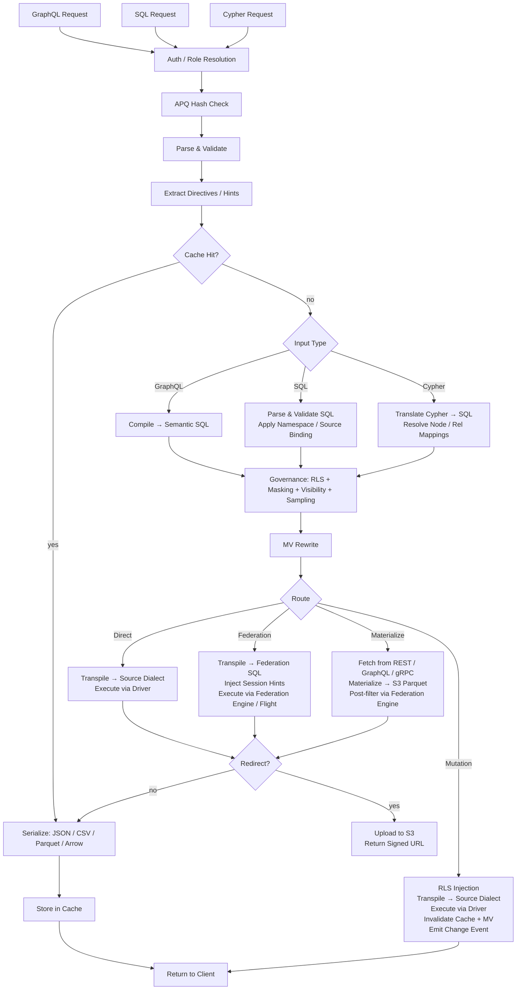

# Provisa-Architektur

## Überblick

Provisa ist eine konfigurationsgesteuerte Datenvirtualisierungsplattform, die speziell dafür entwickelt wurde, einen Semantic Layer anzutreiben — von kleinen Teams bis zu großen Unternehmen. Sie bietet eine einheitliche API über heterogene Datenquellen mit Governance, Sicherheit und Performance-Optimierung. Clients fragen über SQL, GraphQL oder Cypher ab; alle drei sind erstklassige Schnittstellen mit identisch angewendeter Governance. (REQ-002, REQ-038)

Die Unterscheidung des Semantic Layer ist wichtig. Um dem Semantic Layer etwas hinzuzufügen, müssen Sie neue Datenquellen oder Aggregate innerhalb der Datenvirtualisierungsschicht erstellen. Das schafft eine saubere Trennung — keine neuen Ergänzungen der Semantik können außerhalb der Plattform vorgenommen werden, was echte Data Governance ermöglicht. (REQ-136) Die Durchsetzung erfolgt auf Compiler-Ebene: Der genehmigte Beziehungskatalog ist die Source of Truth, unabhängig davon, welche Abfragesprache verwendet wird. (REQ-002)

Provisa ist darauf ausgelegt, für operative Bedürfnisse hochperformant und für analytische Bedürfnisse von Unternehmen hochskalierbar zu sein. Eine einzige Plattform bedient beides, ohne Geschwindigkeit oder Skalierbarkeit zu opfern.

```text
Config YAML → PG Metadata → Federation Catalogs
                               ↓
         Federation engine metadata → Schema Generator → SDL / SQL catalog / Cypher labels / gRPC proto (per role)
                                     ↓
                     Query → Parser → SQL Compiler → Transpiler
                                     ↓
                             Router (Smart Dispatch)
                         /           |            \
                    Federation  Direct PG      Direct MySQL/etc.
                         \           |            /
                              Executor Pool
                                     ↓
                         ┌───── Inline ─────┐     ┌──── Redirect ────┐
                         │  JSON (HTTP)     │     │  CTAS → S3       │
                         │  Arrow (Flight)  │     │  (Parquet, ORC)  │
                         │  Protobuf (gRPC) │     │  Provisa → S3    │
                         └─────────────────-┘     │  (JSON, CSV, …)  │
                                                  └─────────────────-┘
```

## Abfrageschnittstellen

Jede Schnittstelle ist ein eigenständiger Transport. Alle vier wenden dieselbe Sicherheits-Pipeline an (RLS, Maskierung, Sampling, Rollenprüfungen). (REQ-002, REQ-038) Clients sprechen nie direkt mit der Federation-Engine. (REQ-266) Die „Abfragesprache" (SQL / GraphQL / Cypher) ist orthogonal zum Transport — mehrere Sprachen können über denselben Transport ankommen.

| Port | Transport | Akzeptierte Abfragesprachen | Anwendungsfall |
| ------ | ----------- | -------------------------- | ---------- |
| 8001 | HTTP | GraphQL, SQL, Cypher | Web-Clients, BI-Tools, curl, REST-Konsumenten |
| 8815 | Arrow Flight (gRPC) | SQL (über Arrow Flight SQL) | Daten-Tools (Pandas, DuckDB, Spark, ADBC) |
| 50051 | Protobuf gRPC | Pro Rolle generierte Proto-RPCs | Service-zu-Service mit typisierten Verträgen |
| konfigurierbar¹ | PostgreSQL-Wire-Protokoll (pgwire) | SQL | psql, DBeaver, SQLAlchemy, jeder PG-kompatible Client |

¹ Setzen Sie `PROVISA_PGWIRE_PORT` (z. B. 5433). Deaktiviert, wenn nicht gesetzt oder `0`.

### HTTP (Port 8001)

Mehrere Endpunkte unter demselben Port, unterschieden nach Pfad:

| Pfad | Sprache | Hinweise |
| ------ | ---------- | ------- |
| `POST /data/graphql` | GraphQL | Reads und Mutations; APQ-Hash wird über `extensions.persistedQuery` akzeptiert |
| `POST /data/sql` | SQL | Nur lesend; kein Capability-Gate — geregelt durch Objektsichtbarkeit + RLS + Maskierung (REQ-001, REQ-267) |
| `POST /data/query` | Cypher | Nur lesend; Standardrolle |
| `GET /data/nl` | Natürliche Sprache | Übersetzt basierend auf dem Quelltyp in SQL/GraphQL/Cypher |
| `GET /data/subscribe/{table}` | GraphQL | SSE-Subscription-Stream |
| `GET /neo4j/...` | Cypher (Neo4j-kompatibel) | Neo4j-HTTP-API-Kompatibilitäts-Shim |
| `POST /admin/graphql` | GraphQL | Admin-API (Superuser-/Admin-Rolle erforderlich) |

Alle Pfade geben standardmäßig JSON zurück. `Accept: text/csv`, `application/vnd.apache.parquet`, `application/vnd.apache.arrow.stream` und `application/octet-stream` (Rohbinär) werden per Content Negotiation unterstützt. Ergebnisse, die den konfigurierten Größenschwellenwert überschreiten, werden automatisch zu einer signierten S3-URL umgeleitet. (REQ-029, REQ-137)

### Arrow Flight (Port 8815)

Natives Arrow-Columnar-Transport über gRPC. (REQ-045, REQ-143) Clients senden ein JSON-Ticket:

```json
{"query": "SELECT name, email FROM customers", "role": "analyst"}
```

und empfangen Arrow-RecordBatches als Lazy-Stream. Wenn der Zaychik-Flight-SQL-Proxy verfügbar ist, fließen Daten End-to-End als Strom von Arrow-Record-Batches: (REQ-144)

```text
Client ←(Arrow batches)← Provisa Flight Server ←(Arrow batches)← Zaychik ←(JDBC)← Federation Engine
```

Das vollständige Ergebnis wird im Provisa-Speicher nie materialisiert — Batches werden weitergeleitet, sobald sie eintreffen. (REQ-145) Das macht Arrow Flight zu einem unbegrenzten Pfad, geeignet für beliebig große Ergebnisse.

### Protobuf gRPC (Port 50051)

Automatisch generierte `.proto`-Datei aus dem Datenschema, pro Rolle generiert. (REQ-525) Streaming-Abfragen (eine Nachricht pro Zeile), unäre Mutations. Server Reflection aktiviert. (REQ-526) Rolle über den Metadaten-Key `x-provisa-role`.

### PostgreSQL-Wire-Protokoll / pgwire (konfigurierbarer Port)

Implementiert das PostgreSQL-Frontend-/Backend-Wire-Protokoll über die `buenavista`-Bibliothek. (REQ-527) Jeder PostgreSQL-kompatible Client — `psql`, DBeaver, SQLAlchemy mit `psycopg2`, JDBC — kann sich ohne Änderung verbinden. Akzeptiert nur SQL. Die vollständige Governance-Pipeline (RLS, Maskierung, Domänenberechtigungen) gilt identisch für pgwire-Verbindungen. (REQ-266, REQ-002) Aktiviert durch Setzen von `PROVISA_PGWIRE_PORT` auf einen Port ungleich null.

## Anfrage-Pipeline

Drei Abfragesprachen werden akzeptiert. Alle laufen nach ihren jeweiligen Parse-/Kompilierschritten bei der Governance zusammen. (REQ-262, REQ-263) Nur GraphQL unterstützt Schreibvorgänge. (REQ-037) Es gibt kein Capability-Gate für das Abfragen selbst — jede authentifizierte Identität darf in jeder Sprache abfragen, und Daten werden ausschließlich durch Objektsichtbarkeit, RLS und Maskierung geregelt. (REQ-001)

| Schnittstelle | Reads | Writes | Abfrage-Gate |
| --- | --- | --- | --- |
| GraphQL (`/data/graphql`) | Ja | Ja (Mutations) | Keines — nur Governance auf Datenebene |
| SQL (`/data/sql`) | Ja | Nein | Keines — nur Governance auf Datenebene (REQ-267) |
| Cypher (`/data/query`) | Ja | Nein | Keines — nur Governance auf Datenebene |



**Routing-Entscheidungen:**

| Route | Wann |
| --- | --- |
| **Cache** | Result-Cache-Treffer — wird zuerst ausgewertet, liefert das gespeicherte Ergebnis ohne Ausführung (REQ-865) |
| **Cheap-Count** | `count(*)`-förmige Abfrage über einer nicht materialisierten Quelle, die einen exakten nativen Zähler anbietet — wird zum nativen Count-Aufruf geroutet, statt zum Zählen zu materialisieren (REQ-875) |
| **Direct** | Einzelne Quelle + hat nativen Treiber + hat Federation-Connector |
| **Federation** | Mehrquellen-Federation, oder Quelle hat Connector, aber keinen Treiber |
| **Materialize** | Quelle hat keinen Federation-Connector — zuerst nach S3/PG abrufen und cachen |
| **Mutation** | GraphQL-Mutation — immer direkt, nie föderiert |

Das Routing verbraucht die Ausgabe der Post-Governance-Optimierungsstufe, nie das vor der Optimierung geregelte SQL. Governance kann Quellen HINZUFÜGEN (RLS-Subquery-Prädikate); die Optimierungsstufe kann sie ENTFERNEN (Hot-Table-VALUES-CTE-Inlining, API-Cache-Rewrites, Union-Branch-Pruning). Eine föderierte Abfrage, die nach dem Inlining zu einer einzigen Live-Quelle kollabiert, wird daher als direkt neu geroutet. (REQ-863)

### Multi-Root-Abfragen

GraphQL-Abfragen mit mehreren Root-Feldern (z. B. `{ orders { id } customers { name } }`) werden zu separaten SQL-Abfragen kompiliert und unabhängig ausgeführt. (REQ-534) SQL- und Cypher-Anfragen sind per Definition Single-Root. Ergebnisse werden zu einer einzigen Antwort zusammengeführt:

- Felder unterhalb des Redirect-Schwellenwerts werden inline in `data` zurückgegeben
- Felder oberhalb des Schwellenwerts werden umgeleitet, mit Einträgen pro Feld in `redirects`
- Binärformate (Parquet, Arrow) werden nur für Single-Root-Abfragen unterstützt

## Federation-Ausführungspfade

| Pfad | Transport | Über | Wann verwendet |
| ------ | ----------- | ----- | ----------- |
| REST | Federation-Engine-Client (HTTP :8080) | Direkte Abfrage | Standard, immer verfügbar |
| Flight SQL | `adbc-driver-flightsql` (gRPC :8480) | Zaychik-Proxy → JDBC | Wenn Zaychik läuft |
| CTAS | Federation-Engine-Client (HTTP :8080) | Direktes Schreiben, Iceberg nach S3 | Parquet-/ORC-Redirect |

### Zaychik-Arrow-Flight-SQL-Proxy

Die Federation-Engine unterstützt das Arrow-Flight-SQL-Protokoll nicht nativ. [Zaychik](https://github.com/Raiffeisen-DGTL/zaychik-trino-proxy) ist ein Java-Proxy, der die Arrow-Flight-SQL-gRPC-Schnittstelle implementiert, Anfragen in JDBC-Abfragen übersetzt und Ergebnisse als Arrow-Record-Batches zurückstreamt. (REQ-144)

```text
ADBC client → gRPC :8480 → Zaychik → JDBC :8080 → Federation Engine → results → Arrow batches → client
```

Der Provisa-Flight-Server (Port 8815) verbindet sich als ADBC-Client mit Zaychik und ermöglicht Arrow-Streaming End-to-End, ohne Ergebnisse zu materialisieren. (REQ-145)

### Iceberg-Ergebniskatalog

Der CTAS-Redirect verwendet einen Iceberg-Connector (Katalog `results`), unterstützt durch einen JDBC-Katalog auf der bestehenden PostgreSQL-Instanz. (REQ-169) Iceberg schreibt Parquet-/ORC-Dateien direkt über das native S3-Dateisystem (`fs.native-s3.enabled=true`) nach MinIO/S3.

## Federation-Engines

Provisa wählt beim Start eine Federation-Engine über die Umgebungsvariable `PROVISA_ENGINE`, die persistierte Admin-UI-Konfiguration oder den Standardwert. Ist nichts gesetzt, ist DuckDB der Standard — vollständig in-process, kein externer Dienst (REQ-989). Details zur Auswahl siehe [Konfiguration](configuration.md#federation-engine).

Jede Engine ist eine `FederationEngine`-Instanz, definiert in `provisa/federation/engine.py`. Die Instanz besitzt eine Connector-Sammlung, die bestimmt, welche Quelltypen die Engine live lesen kann (ATTACH) versus welche zuerst in den Materialisierungs-Store der Engine landen müssen. [tool-verified: `engine.py` `_ENGINE_BUILDERS`, `ENGINE_REGISTRY`]

### Treiberklassen (REQ-840) [tool-verified: `engine.py` `DriverClass`]

| Klasse | Bedeutung | Beispiele |
| ------- | --------- | --------- |
| `BROAD` | Erreicht viele externe Quelltypen über native Connectors | Trino |
| `PARTIAL` | Erreicht eine Teilmenge (relational, Dateien, Cloud-Objekt/-Lake) und landet alles andere | DuckDB, PostgreSQL, ClickHouse, Databricks, Snowflake, BigQuery, Fabric, Synapse |
| `SELF_ONLY` | Erreicht nur seinen eigenen Store; jede andere Quelle landet dort | SQLAlchemy |

### Verfügbare Engines [tool-verified: `engine.py` `_ENGINE_BUILDERS`]

| Engine-Key | Dialekt | MPP | Externer-Link-Mechanismus | Auth |
| ----------- | --------- | ----- | ------------------------ | ------ |
| `trino` / `trino-byo` | Trino SQL | Ja | Trino-Kataloge (breite Connector-Menge) | JDBC-Zugangsdaten |
| `pg` | PostgreSQL | Nein | FDW / pg_duckdb | PostgreSQL-Zugangsdaten |
| `duckdb` | DuckDB | Nein | Extension-natives ATTACH | Keine (in-process) |
| `clickhouse` / `clickhouse-server` | ClickHouse | Ja (Shards) | S3-/IcebergS3-/DeltaLake-Table-Engines (REQ-986) | ClickHouse-Zugangsdaten |
| `snowflake` | Snowflake | Ja | External Stage + External Table (REQ-988) | `PROVISA_ENGINE_URL` |
| `databricks` | Databricks SQL | Ja | Unity-Catalog-External-Tables über REST (REQ-987) | Bearer-Token (`http_path` in `federation_hints`) |
| `bigquery` | BigQuery | Ja (Dremel) | BigQuery External / BigLake Tables | `GOOGLE_APPLICATION_CREDENTIALS`-Service-Account-Key |
| `fabric` | T-SQL | Ja | OneLake-Shortcuts → OPENROWSET | Azure AD (`az login` / Managed Identity) |
| `synapse` | T-SQL | Ja | ADLS OPENROWSET / External Tables | Azure AD |
| `sqlalchemy` | Beliebiger SQLAlchemy-Dialekt | Nein | Keiner (nur Landen) | Zugangsdaten pro Dialekt |

### Zero-Config-Standard: DuckDB (REQ-989) [tool-verified: `engine.py` `build_duckdb_engine`, `_embedded_duckdb_materialize_default`]

Ist `PROVISA_ENGINE` nicht gesetzt, verwendet Provisa die vollständig eingebettete In-Process-DuckDB-Engine. Der Materialisierungs-Store von DuckDB ist eine eingebettete DuckDB-Datei unter `$PROVISA_DATA_DIR/materialize.duckdb` (Standard `~/.provisa/materialize.duckdb`). Keine externe Datenbank oder Dienst erforderlich.

Da DuckDB pro Datei nur einen einzigen Writer erlaubt, schreibt `store_connection.py` über die eigene Verbindung der Engine in den eingebetteten Store — nie über eine zweite, unabhängige Verbindung. Das ist der eine Fall, in dem Engine und Materialisierungs-Store per Design einen Datei-Handle teilen. [tool-verified: `store_connection.py` module docstring]

### Arrow-natives Lese-Transport (REQ-986, REQ-987, REQ-988) [tool-verified: `engine.py` `build_*_engine` `capabilities=`]

ClickHouse, DuckDB, Snowflake, Databricks, BigQuery, Fabric und Synapse bewerben alle `EngineCapability.ARROW` und `EngineCapability.ARROW_STREAM`. Abfragen gegen diese Engines geben Arrow-RecordBatches direkt zurück — der Zeilen-Serialisierungspfad wird vollständig umgangen. Der Flight-Server streamt diese Batches an Clients, ohne das vollständige Ergebnis im Prozessspeicher von Provisa zu materialisieren. Für Trino stützt sich Arrow-Streaming auf den Zaychik-Proxy; für die Warehouse-Engines speist die eigene Arrow-native API der Engine (Cloud Fetch für Databricks, Storage Read API für BigQuery, `fetch_arrow_table` für DuckDB und Snowflake) den Flight-Stream.

### Externe Datenverknüpfungen (ATTACH) [tool-verified: `engine.py` `_warehouse_connectors`]

Jede Warehouse-Engine kann Cloud-Objekt-/Lake-Daten vor Ort scannen, ohne eine Kopie zu landen. Parquet-, CSV-, Iceberg- und Delta-Lake-Dateien auf S3, GCS oder OneLake werden der Engine direkt angehängt, als wären sie native Tabellen. Die Strategie — ATTACH (vor Ort scannen) oder LAND (in den Store kopieren) — wird durch den deklarierten `Mechanism` des Connectors bestimmt; im Planner existiert kein Engine-spezifisches Branching. Ein `Mechanism.ATTACH_R`-Connector löst einen Zero-Copy-Scan aus; ein `Mechanism.DIRECT`- oder fehlender Connector löst ein Landen aus. [tool-verified: `connector_base.py` `Mechanism`, `engine.py` `_warehouse_connectors`]

Attach stellt alle Voraussetzungen zur Attach-Zeit automatisch bereit:

| Engine | Objekt-/Lake-Formate | Mechanismus | Auto-Provisioning [tool-verified] |
| -------- | ------------------- | ---------- | ---------------------------------- |
| Databricks | parquet, csv, iceberg, delta_lake | UC External Table (`ATTACH_R`) | REST installiert Unity-Catalog-Storage-Credential + External Location, dann `CREATE TABLE … USING <format> LOCATION …` — live-verifiziert über Cloudflare R2 |
| BigQuery | parquet, csv, json, iceberg, delta_lake | BigQuery External / BigLake Table (`ATTACH_R`) | `CREATE OR REPLACE EXTERNAL TABLE … OPTIONS(format=…, uris=[…])` — live-verifiziert |
| ClickHouse | csv, parquet, iceberg, delta_lake | S3-/IcebergS3-/DeltaLake-Table-Engine (`ATTACH_R`) | Validierungssonde bei der Attach-Zeit ausgeführt — live-verifiziert über Cloudflare R2 |
| Fabric | parquet, csv, iceberg, delta_lake | OneLake-Shortcut → OPENROWSET (`ATTACH_R`) | REST erstellt eine `AmazonS3Compatible`-Verbindung + Lakehouse + Shortcut; gibt den OneLake-`BULK`-Pfad zurück — live-verifiziert beim Lesen von R2 über Fabric |
| Snowflake | parquet, csv, json, iceberg, delta_lake | External Stage + External Table (`ATTACH_R`) | `CREATE STAGE … URL=… CREDENTIALS=…`, dann `CREATE OR REPLACE EXTERNAL TABLE … LOCATION=@stage FILE_FORMAT=(TYPE=…)` — implementiert; nicht live getestet (kein Konto verfügbar) |

Zugangsdaten für Cloud-Storage reisen in den `federation_hints` der Quelle (siehe [Sources](sources.md#warehouses-as-named-sources)). Jeder Quelltyp, der nicht ATTACH kann, landet zuerst im Materialisierungs-Store der Engine.

### Columnar-Materialisierungs-Writes (REQ-990) [tool-verified: `core/database.py:436`, `store_connection.py:99`]

`Connection.bulk_copy` in `provisa/core/database.py` wählt den schnellsten Bulk-Ingest-Pfad pro Store-Dialekt: binäres `COPY` (asyncpg `copy_records_to_table`) für PostgreSQL-Stores und ein einzelnes vorbereitetes `executemany`-Statement für alle anderen relationalen Stores. Der eingebettete DuckDB-Store landet über `land_duckdb_native` in `store_connection.py` — ein `executemany`-Aufruf für den gesamten Batch, nie eine Pro-Zeile-Schleife.

## Große-Ergebnis-Umleitung

Ergebnisse, die einen Zeilenschwellenwert überschreiten, werden statt inline zurückgegeben zu S3-kompatiblem Storage (MinIO) umgeleitet. (REQ-029)

### Redirect-Modi

| Modus | Funktionsweise | Berühren Daten Provisa? |
| ------ | ------------- | ---------------------- |
| **CTAS** (Parquet, ORC) | Federation-Engine schreibt direkt über `CREATE TABLE AS SELECT` nach S3 | Nein |
| **Provisa-Upload** (JSON, NDJSON, CSV, Arrow IPC) | Provisa serialisiert und lädt via boto3 hoch | Ja |

Bei CTAS-nativen Formaten verarbeitet Provisa die Daten nie — die Federation-Engine schreibt Dateien direkt nach MinIO/S3. (REQ-138) Das ist der bevorzugte Pfad für große analytische Exporte.

### Redirect-Header

| Header | Effekt |
| -------- | -------- |
| `X-Provisa-Redirect-Format: <mime>` | Umleitung in diesem Format (impliziert Erzwingung, sofern kein Schwellenwert gesetzt) |
| `X-Provisa-Redirect-Threshold: N` | Nur umleiten, wenn das Ergebnis N Zeilen überschreitet |
| `X-Provisa-Redirect: true` | Umleitung mit Standardformat erzwingen |

Diese Header implementieren clientgesteuerte Umleitung. (REQ-137)

**Antwort:**

```json
{
  "data": {"orders": null},
  "redirect": {
    "redirect_url": "https://minio:9000/provisa-results/results/abc.parquet?...",
    "row_count": 50000,
    "expires_in": 3600,
    "content_type": "application/vnd.apache.parquet"
  }
}
```

### Serverkonfiguration

| Env-Var | Standard | Zweck |
| --------- | --------- | --------- |
| `PROVISA_REDIRECT_ENABLED` | `false` | Serverseitige Schwellenwert-Umleitung aktivieren |
| `PROVISA_REDIRECT_THRESHOLD` | `1000` | Standard-Zeilenanzahl-Schwellenwert |
| `PROVISA_REDIRECT_FORMAT` | `parquet` | Standard-Redirect-Format |
| `PROVISA_REDIRECT_BUCKET` | `provisa-results` | S3-Bucket-Name |
| `PROVISA_REDIRECT_ENDPOINT` | | S3-kompatible Endpunkt-URL |
| `PROVISA_REDIRECT_TTL` | `3600` | TTL der signierten URL (Sekunden) |

## Routing-Entscheidungsbaum

```text
Multi-source query? → Federation engine
NoSQL source (MongoDB, Cassandra)? → Federation engine
Uses path columns on non-PG source? → Federation engine
Single RDBMS with driver? → Direct (sub-100ms target)
Single RDBMS without driver? → Federation engine
Steward hint "federated"? → Federation engine (override)
Steward hint "direct"? → Direct (if possible)
Redirect to Parquet/ORC? → Federation engine (CTAS, regardless of source count)
```

(REQ-027, REQ-028, REQ-030, REQ-279)

## Federation-Abfrageoptimierung

Provisa initialisiert den kostenbasierten Optimizer der Federation-Engine automatisch, sodass quellenübergreifende Abfragepläne auf realer Datenverteilung basieren, nicht auf fest codierten Standardwerten.

### Automatische Statistiken (`ANALYZE`)

Bei der Quellenregistrierung führt Provisa für jede veröffentlichte Tabelle `ANALYZE catalog.schema.table` aus. (REQ-275) Dies erfasst:

- Zeilenanzahl
- Pro Spalte: Null-Anteil, Anzahl eindeutiger Werte, Min/Max, Histogramme (connectorabhängig)

Der Optimizer nutzt diese, um die Selektivität für gefilterte Abfragen zu schätzen. Ohne Statistiken greift er auf feste Standardwerte zurück (z. B. 10 % Selektivität für Gleichheitsprädikate), was bei schiefen oder hochkardinalen Daten schlechte Join-Pläne erzeugt. Mit Statistiken sind die Schätzungen genau genug, um für die meisten Workloads korrekte Broadcast- vs. Partitioned-Join-Entscheidungen zu treffen.

**Abdeckung**: Die Statistikunterstützung variiert je nach Connector. PostgreSQL, MySQL, Hive, Iceberg und Delta Lake unterstützen `ANALYZE` vollständig. Die Connectors für MongoDB und Cassandra bieten teilweise oder keine Unterstützung. Provisa schluckt `ANALYZE`-Fehler stillschweigend — die Registrierung wird nie blockiert. (REQ-275)

**Selektivitätsgrenzen**: Statistiken liefern Schätzungen pro Spalte. Bei korrelierten Prädikaten (`WHERE region = 'US' AND city = 'Seattle'`) nimmt der Optimizer Spaltenunabhängigkeit an, was Zeilenanzahlen unterschätzen kann. Das ist eine bekannte Einschränkung spaltenbasierter Statistiken in allen kostenbasierten Optimizern.

**API-Quellen**: `api_cache_{table_name}`-Tabellen in PostgreSQL werden nach jedem Cache-Refresh-Zyklus automatisch analysiert, sodass der Optimizer aktuelle Zeilenschätzungen hat, wenn API-gestützte Quellen mit relationalen Quellen gejoint werden. (REQ-280)

### Admin: Statistiken aktualisieren

Statistikerfassung bei Bedarf über die Admin-API erneut ausführen: (REQ-276)

```graphql
mutation {
  refreshSourceStatistics(sourceId: "sales-pg") {
    tablesAnalyzed
    failures { table message }
  }
}
```

Nützlich, wenn eine Quelle seit der Registrierung erhebliche neue Daten erhalten hat.

## Materialisierte Sichten

Materialisierte Sichten optimieren teure Abfragen transparent, indem sie Ergebnisse vorberechnen und cachen.

### Beziehungen als Hinweise für materialisierte Sichten

Eine Beziehungsdeklaration ist nicht nur ein Governance-Artefakt — sie ist auch die strukturelle Beschreibung einer Join-Form. Genau diese Form braucht der Optimizer für materialisierte Sichten: die Tabellen, die Spalten, den Join-Typ. Das bedeutet, eine Beziehung kann die Materialisierung direkt antreiben.

Für **quellenübergreifende Beziehungen** geschieht dies automatisch beim Start: Jede Beziehung mit `materialize: true`, deren Beine in mehr als einer Quelle landen, erzeugt eine `JoinPattern`-materialisierte Sicht (`auto-mv-<rel_id>`). (REQ-158) Keine separate Konfiguration einer materialisierten Sicht ist erforderlich. Sieht der Compiler diesen Join in einer Abfrage, ersetzt der Rewriter transparent das vormaterialisierte Ergebnis. Beziehungen innerhalb derselben Quelle erzeugen nichts — diese JOINs sind über direkte Ausführung bereits schnell. (REQ-159) [tool-verified: `provisa/api/app_loaders.py`]

Eine **junction-gestützte Beziehung** materialisiert ihre Traversierung statt eines direkten Joins: Die assoziative Tabelle ist ein drittes Bein, sodass das Muster den Quell-Hop, den Junction-Hop und den Diskriminator trägt, der die Zeilenmenge auf einen Kantentyp festlegt, wobei die eigenen Spalten der Junction neben denen des Ziels in der Sicht landen. (REQ-1586) Da die Junction als Bein zählt, ist eine Kante, deren Junction in einer anderen Quelle sitzt als die beiden Tabellen, die sie verbindet, quellenübergreifend, selbst wenn diese beiden übereinstimmen. Der Rewriter matcht die beiden Hops als Kette — der zweite muss beim Alias beginnen, das der erste eingeführt hat —, sodass eine Abfrage, die dieselben zwei Tabellen ohne Durchlaufen der Junction erreicht, die Basistabellen liest, und eine für einen Diskriminatorwert gebaute Sicht nie eine auf einen anderen gefilterte Traversierung beantwortet.

Die praktische Konsequenz: Stewards, die eine Beziehung genehmigen, entscheiden implizit auch, ob der Join ein guter Kandidat für die Materialisierung ist. Der Governance-Akt und der Optimierungshinweis sind dieselbe Deklaration.

### Modi

| Modus | Konfiguration | Verhalten |
| ------ | -------- | ---------- |
| **Join-Pattern** | `join_pattern` in der MV-Konfiguration | Schreibt passende JOINs so um, dass sie aus der MV-Tabelle lesen |
| **Custom SQL** | `sql` in der MV-Konfiguration | Beliebiges SELECT, optional in der SDL offengelegt |
| **Automatisch materialisierte Beziehung** | quellenübergreifende Beziehung (automatisch) | Generiert automatisch eine Join-Pattern-MV; keine Konfiguration erforderlich |
| **Junction-gestützte Beziehung** | `materialize: true` auf einer Junction-Beziehung | Materialisiert die Zwei-Hop-Traversierung, Diskriminator und Kantenattribute inklusive |

### Auto-Materialisierung

Quellenübergreifende JOINs sind die teuersten Abfragen (immer föderiert). Quellenübergreifende Beziehungen generieren beim Start automatisch MV-Definitionen: (REQ-158)

```yaml
relationships:
  - id: orders-to-reviews
    source_table_id: orders        # sales-pg
    target_table_id: product_reviews  # reviews-mongo
    source_column: product_id
    target_column: product_id
    cardinality: one-to-many
    materialize: true              # auto-create MV
    refresh_interval: 600          # refresh every 10 minutes
```

Nur quellenübergreifende Beziehungen erzeugen materialisierte Sichten (JOINs innerhalb derselben Quelle sind über direkte Ausführung bereits schnell). (REQ-159) Die materialisierte Sicht startet im Status `STALE` und wird von der Hintergrund-Refresh-Schleife aktualisiert, bevor sie vom Abfrage-Optimizer verwendet wird. (REQ-160)

### Refresh-Lebenszyklus

```text
STALE → (refresh loop picks up) → REFRESHING → FRESH
  ↑                                                |
  └──── mutation hits source table ────────────────┘
```

Die Refresh-Schleife läuft alle 30 Sekunden, prüft `get_due_for_refresh()` und führt `CREATE TABLE AS SELECT` (erster Lauf) oder `DELETE + INSERT` (nachfolgend) gegen die MV-Zieltabelle über die Federation-Engine aus. (REQ-160, REQ-234)

## Modulübersicht

| Modul | Zweck |
| -------- | --------- |
| `api/` | FastAPI-App, Router, Middleware, Lifespan-Management |
| `api/flight/` | Arrow-Flight-Server (gRPC, Port 8815) |
| `api/admin/` | Strawberry-GraphQL-Admin-API — Konfiguration, Discovery, Views |
| `api/rest/` | Automatisch generierte REST-Endpunkte aus registrierten Tabellen |
| `api/jsonapi/` | Automatisch generierte JSON:API-Endpunkte mit Paginierung und Fehlerbehandlung |
| `api/data/subscribe.py` | SSE-Subscriptions — LISTEN/NOTIFY, Polling, Debezium-CDC |
| `compiler/` | GraphQL-/SQL-Parser, Semantic-SQL-Generator, RLS, Maskierung, Sampling, zweistufige Governance (`stage2.py`) |
| `cypher/` | Cypher-→-SQL-Übersetzer, Parser, Label-Map (REQ-351), Write-Übersetzer für Cypher-Mutations |
| `pgwire/` | PostgreSQL-Wire-Protokoll-Server; `catalog.py` fängt pg_catalog/information_schema für die Objektsichtbarkeit pro Rolle ab (REQ-527, REQ-883, REQ-891) |
| `vector/` | Vektorsuche — Modellregistry, Embedding-Provider (openai/ollama/huggingface), `cosine_similarity()`-Übersetzung, pgvector-Fallback-Cache, deklarative Embedding-Generierung (REQ-419–431) |
| `compiler/federation.py` | Unterstützung für Apollo-Federation-v2-Subgraph |
| `transpiler/` | Dialekt-Transpilation, Routing-Logik |
| `executor/` | Föderierte/direkte Ausführung, Serialisierung, Ausgabeformate |
| `executor/drivers/` | Direkte Quelltreiber (PostgreSQL, MySQL, DuckDB, Snowflake, Databricks, ClickHouse, …) |
| `executor/trino_flight.py` | ADBC-Flight-SQL-Client für die Federation-Engine |
| `executor/ctas_write.py` | CTAS-basierter Redirect (Federation-Engine schreibt nach S3) |
| `executor/redirect.py` | S3-Redirect-Logik, Provisa-seitiger Upload |
| `federation/engine.py` | `FederationEngine`, `DriverClass`, `_ENGINE_BUILDERS`, `ENGINE_REGISTRY`, `build_engine` |
| `federation/connector.py` | Connector-Abstraktionen — Trino, ClickHouse; `Mechanism`, `WarehouseNativeConnector` |
| `federation/connector_duckdb.py` | DuckDB- und PostgreSQL-FDW-Connector-Definitionen |
| `federation/snowflake_connectors.py` | Snowflake-External-Stage-+-External-Table-ATTACH-Connectors (REQ-988) |
| `federation/databricks_connectors.py` | Databricks-UC-External-Table-ATTACH-Connectors (REQ-987) |
| `federation/bigquery_connectors.py` | BigQuery-External-/BigLake-ATTACH-Connectors |
| `federation/databricks_uc.py` | Auto-Provisioning von Unity-Catalog-Credential + External Location |
| `federation/databricks_backend.py` | Databricks-SQL-Warehouse-Ausführungs-Backend |
| `federation/snowflake_backend.py` | Snowflake-Ausführungs-Backend |
| `federation/bigquery_backend.py` | BigQuery-Ausführungs-Backend (Storage-Read-API-Arrow-Transport) |
| `federation/mssql_warehouse_backend.py` | Fabric-Warehouse- + Synapse-Ausführungs-Backends (T-SQL über ODBC) |
| `federation/mssql_warehouse_connectors.py` | OPENROWSET-ATTACH-Connectors für Fabric / Synapse |
| `federation/fabric_shortcuts.py` | Auto-Provisioning von OneLake-Shortcuts (Verbindung → Lakehouse → Shortcut) |
| `federation/clickhouse_backend.py` | ClickHouse-Ausführungs-Backend |
| `federation/duckdb_backend.py` | DuckDB-In-Process-Ausführungs-Backend |
| `federation/pg_backend.py` | PostgreSQL-Ausführungs-Backend |
| `federation/store_connection.py` | DuckDB-natives Materialisierungs-Store-Write-Interface (REQ-989, REQ-990) |
| `registry/` | Persistierte Query-Registry, Governance |
| `security/` | Sichtbarkeit, Rechte, Spaltenmaskierung |
| `cache/` | Redis-gestütztes Query-Result-Caching (Hot-Tier) |
| `mv/` | Registry, Refresh und SQL-Rewriter für materialisierte Sichten |
| `events/` | Dataset-Change-Events und Trigger-Dispatch |
| `webhooks/` | Ausgehende Webhook-Ausführung für Mutations und Events |
| `scheduler/` | APScheduler-basiertes Hintergrund-Job-Management — Cron- und Intervall-Trigger, die Webhooks, Mutations oder Kafka-Sink-Veröffentlichungen auslösen |
| `apq/` | Apollo-APQ-Wire-Protokoll — Redis-gestützter Query-Hash-Cache; getrennt vom Result-Caching |
| `compiler/cursor.py` | Relay-artige Cursor-Paginierung — `first`/`after`/`last`/`before`-Argumente und `pageInfo`-Generierung für alle Listenabfragen |
| `compiler/aggregate_gen.py` | Automatisch generierte `{table}_aggregate`-Query-Typen mit `count`, `sum`, `avg`, `min`, `max`-Unterfeldern und gefiltertem `nodes`-Zugriff |
| `compiler/enum_detect.py` | Automatische Enum-Typ-Erkennung — native PostgreSQL-Enum-Typen (`pg_enum`) als GraphQL-Enum-Typen statt String-Skalare offengelegt |
| `compiler/hints.py` | Federation-Performance-Hinweise — abfrageweite Routing-Direktiven, als SQL-Kommentare eingebettet (`/* @provisa route=federated */`), die automatisches Routing überschreiben |
| `compiler/mutation_gen.py` | Mutation-Compiler; Column Presets — serverseitig statische oder Session-Variable-Werte, angewendet bei Insert/Update, nicht im Mutation-Input-Typ offengelegt |
| `auth/approval_hook.py` | ABAC-Genehmigungs-Hook — pluggable externe Autorisierung, vor der Abfrageausführung aufgerufen; Webhook-, gRPC- und unix_socket-Transporte; Scope pro Tabelle/Quelle/global; konfigurierbare Fallback-Richtlinie |
| `subscriptions/` | SSE-Subscription-Zustand und -Zustellung |
| `discovery/` | LLM-Beziehungserkennung (Claude-API) |
| `grpc/` | Proto-Generierung, gRPC-Server, Reflection |
| `api_source/` | REST-/GraphQL-/gRPC-API-Quellen mit PG-Cache |
| `kafka/` | Kafka-Topic-Quellen, Sink, Schema Registry |
| `auth/` | Pluggable Auth-Provider, Middleware, Rollenzuordnung |
| `core/` | Konfiguration, Modelle, DB, Repositories, Secrets; Rollenmodell unterstützt `parent_role_id` und `flatten_roles()` für rekursive Rollenvererbung |
| `hasura_v2/` | Hasura-v2-Metadaten-→-Provisa-Konfigurationskonverter |
| `ddn/` | Hasura-DDN-Supergraph-→-Provisa-Konfigurationskonverter |
| `mongodb/` | MongoDB-Quell-Connector |
| `elasticsearch/` | Elasticsearch-Quell-Connector |
| `cassandra/` | Cassandra-Quell-Connector |
| `prometheus/` | Prometheus-Metriken-Quell-Connector |
| `source_adapters/` | Generische Adapterschicht für Quellverbindungen |

## Admin-API

Die Admin-Strawberry-GraphQL-API ist unter `/admin/graphql` (HTTP-Port 8001) eingehängt. Sie ist vom Daten-GraphQL-Endpunkt getrennt und erfordert die Rolle Superuser oder Admin.

| Capability | Beschreibung |
| ----------- | ------------- |
| Konfigurations-Download/-Upload | Vollständige Provisa-YAML-Konfiguration exportieren oder ersetzen |
| Beziehungs-Editor | Beziehungsdefinitionen erstellen, aktualisieren, löschen |
| KI-FK-Erkennung | Von Claude angetriebene FK-Kandidatenanalyse auslösen |
| Schema-Introspektion | Veröffentlichte Tabellen, Spalten und Rollen durchsuchen |
| View-Management | Definitionen materialisierter Sichten registrieren und verwalten |

(REQ-164, REQ-165, REQ-166, REQ-167)

## KI-Modell-Konfiguration

`GET /admin/ai-models` und `PUT /admin/ai-models` konfigurieren die LLM-Pipeline für jede Organisation. (REQ-464, REQ-419, REQ-500, REQ-370, REQ-1349)

Einstellungen sind **organisationsbezogen**: Die Wahl jeder Organisation legt sich über die Deployment-Konfiguration und wirkt ab der nächsten Anfrage — kein Neustart erforderlich. (REQ-1349) [tool-verified: `provisa/api/admin/ai_models_router.py:38-39`]

**Modellzuweisungen pro Operation.** Fünf NL-Operationen haben jeweils einen konfigurierbaren Vendor und Model-String:

| Operation | Was sie antreibt |
| --------- | -------------- |
| `table_description` | LLM-generierte Tabellenbeschreibungen |
| `column_description` | LLM-generierte Spaltenbeschreibungen |
| `relationship_inference` | FK-Kandidatenerkennung |
| `sql_generation` | NL-→-SQL-Generierung |
| `table_selection` | Auswahl der Tabellen für den NL-Prompt |

Das Vendor-Feld akzeptiert jeden `aisuite`-kompatiblen Vendor (`anthropic`, `openai`, `groq`, `mistral`, `cohere` und andere) oder einen lokalen Endpunkt (`ollama`, `lmstudio`). Ein leerer Model-String entfernt den Override der Organisation und kehrt zum Deployment-Standard zurück. [tool-verified: `provisa/api/admin/ai_models_router.py:29-35`, `provisa-ui/src/components/admin/AiModelsTab.tsx:43-60`]

**NL-Rate-Limit.** Eine optionale Obergrenze für Anfragen pro Zeitraum, angewendet pro Rolle. Überschüssige Anfragen geben `429` mit `Retry-After` zurück. [tool-verified: `provisa-ui/src/components/admin/AiModelsTab.tsx:306-313`]

**Vektormodell-Registry.** Eine Liste von Embedding-Modellen (Felder: `id`, `provider`, `dimensions`, optional `api_key_env` und `base_url`, Flag `enabled`). Vollständiger Listenersatz: Jeder Eintrag muss `id`, `provider` und `dimensions` haben, sonst wird der Schreibvorgang mit `400` abgelehnt. [tool-verified: `provisa/api/admin/ai_models_router.py:122-131`]

**API-Keys.** LLM-API-Keys pro Vendor werden verschlüsselt über `provisa.core.org_secrets` gespeichert (siehe unten). Die `GET`-Antwort meldet nur, ob für jeden Vendor ein Key gesetzt ist — der Wert wird nie zurückgegeben. Das Senden eines leeren Strings für einen Vendor löscht diesen Key und setzt LLM-Aufrufe für diesen Vendor auf die Umgebungsvariablen-Zugangsdaten des Deployments zurück. (REQ-1395, REQ-1398) [tool-verified: `provisa/api/admin/ai_models_router.py:76-78`, `provisa/api/admin/ai_models_router.py:149-165`]

## Verschlüsselte Secrets pro Organisation

`provisa/core/org_secrets.py` speichert Zugangsdaten, die niemals im Klartext in der Datenbank erscheinen dürfen. Derzeit beschränkt auf LLM-Vendor-API-Keys (`{vendor}_api_key`). (REQ-1395, REQ-1398) [tool-verified: `provisa/core/org_secrets.py`]

Werte werden über den prozessweiten `encryption_service` aus `provisa.encryption.runtime` verschlüsselt — derselbe Mechanismus wie `api_sources.auth`. [tool-verified: `provisa/core/org_secrets.py:16-17`]

Zwölf `aisuite`-kompatible Vendors werden unterstützt: `anthropic`, `openai`, `cohere`, `groq`, `mistral`, `xai`, `deepseek`, `together`, `fireworks`, `nebius`, `sambanova` und `inception`. Google, AWS und Azure sind ausgeschlossen, da sie Konfiguration über einen reinen API-Key hinaus erfordern (Projekt-IDs, IAM-Rollen, Region). Vendors mit lokalem Endpunkt (`ollama`, `lmstudio`) haben keinen Key und sind aus demselben Grund ausgeschlossen. [tool-verified: `provisa/core/org_secrets.py:33-53`]

Die Übergabe von `value=None` an `write_org_secret` löscht die Zeile. Aufrufer, die ein Secret lesen, verbrauchen es sofort (z. B. um einen LLM-Client zu erstellen) und dürfen es in keiner API-Antwort widerspiegeln. [tool-verified: `provisa/core/org_secrets.py:97-117`]

## Automatisch generierte REST- & JSON:API-Endpunkte

Registrierte Tabellen werden neben der GraphQL-Schnittstelle als REST- und JSON:API-Endpunkte offengelegt. (REQ-256, REQ-257)

| Schnittstelle | Mount-Pfad | Spezifikation |
| ----------- | ----------- | ------ |
| REST | `/rest/<table-id>` | Einfaches GET/POST mit Query-Parametern |
| JSON:API | `/jsonapi/<table-id>` | konform mit [jsonapi.org](https://jsonapi.org) — Paginierung, Beziehungen, Fehlerobjekte |

Diese Endpunkte wenden dieselbe Sicherheits-Pipeline (RLS, Maskierung, Rollenprüfungen) an wie der GraphQL-Endpunkt. (REQ-002, REQ-038)

## Subscriptions

SSE-Subscriptions werden unter `GET /data/subscribe/{table}` bereitgestellt. Drei Zustellungsmodi: (REQ-258)

| Modus | Mechanismus | Wann verwendet |
| ------ | ----------- | ----------- |
| **LISTEN/NOTIFY** | PostgreSQL-`LISTEN` auf einem Kanal | PG-Quellen mit Mutationsaktivität |
| **Polling** | Abfrage im Intervall erneut ausführen | Nicht-PG-Quellen, oder wenn CDC nicht verfügbar ist |
| **Debezium-CDC** | Kafka-Topic von Debezium-Connector | Hochfrequente Change-Streams |

(REQ-258, REQ-260, REQ-261)

Der Client empfängt `text/event-stream` mit einem JSON-Event pro geänderter Zeile oder Diff.

## Event- & Webhook-System

Datenbankmutationen (INSERT/UPDATE/DELETE) können über die Module `events/` und `webhooks/` ausgehende Events auslösen. (REQ-172, REQ-173, REQ-220)

```text
Mutation executed → EventDispatcher → match event trigger rules
                                          ↓
                               WebhookExecutor → HTTP POST to configured URL
```

Event-Trigger werden in der Konfiguration definiert und nach Tabelle, Operationstyp und optionalem Zeilenfilter gematcht. Webhook-Payloads enthalten den Operationstyp, die geänderte Zeile und den Rollenkontext.

## Hintergrunddienste

Vier Hintergrundschleifen starten während der App-Lifespan (`api/app.py`):

| Dienst | Intervall | Zweck |
| --------- | ---------- | --------- |
| MV-Refresh-Schleife | 30 s | Pollt `get_due_for_refresh()`, führt CTAS oder DELETE+INSERT auf veralteten materialisierten Sichten aus |
| Warm-Table-Manager | konfigurierbar | Befördert häufig abgefragte Tabellen in den Iceberg-Local-SSD-Cache |
| Hot-Table-Loader | konfigurierbar | Lädt kleine Referenztabellen in den In-Memory-Cache für Zugriff unter einer Millisekunde |
| API-Source-Poller | Intervall pro Quelle | Ruft entfernte REST-/GraphQL-/gRPC-Quellen erneut ab und cacht sie neu |

(REQ-160, REQ-238, REQ-239, REQ-236)

### Hot-/Warm-Table-Caching-Stufen

| Stufe | Storage | Beförderungskriterium | Zugriffslatenz |
| ------ | --------- | ------------------- | ---------------- |
| Hot | In-Process-Speicher | Zeilenanzahl < Schwellenwert, oder ist Beziehungsziel | <1 ms |
| Warm | Iceberg auf lokaler SSD | Abfragehäufigkeits-Schwellenwert überschritten | ~5–20 ms |
| Cold | Entfernte Quelle | Standard | 50–500 ms |

(REQ-230, REQ-236, REQ-238, REQ-241)

## Metadaten-Import (Hasura v2 / DDN)

Bestehende Hasura-Deployments können ohne manuelles Umschreiben in eine Provisa-Konfiguration konvertiert werden. (REQ-182, REQ-183)

| Modul | Eingabe | Ausgabe |
| -------- | ------- | -------- |
| `hasura_v2/` | Hasura-v2-`metadata.yaml` | Provisa-`config.yaml` |
| `ddn/` | Hasura-DDN-Supergraph-JSON | Provisa-`config.yaml` |

Beide Konverter bilden getrackte Tabellen, Beziehungen, Berechtigungen und Remote-Schemas ab. Das Ergebnis ist eine vollständige Provisa-Konfiguration, bereit für das Deployment. (REQ-182, REQ-183)

## Apollo Federation

`compiler/federation.py` legt Provisa als Apollo-Federation-v2-Subgraph offen. (REQ-259) Die Subgraph-SDL wird automatisch aus dem veröffentlichten Schema generiert, mit `@key`-Direktiven auf Primärschlüsselspalten und `@external`-/`@provides`-Annotationen auf quellenübergreifenden Beziehungen. Provisa beantwortet die vom Federation-Gateway benötigten `_entities`- und `_service`-Abfragen. (REQ-259)

## Cursor-basierte Paginierung

Alle Listenabfragen unterstützen Relay-artige Cursor-Paginierung über `compiler/cursor.py`. (REQ-218) Clients übergeben `first`/`after` (vorwärts) oder `last`/`before` (rückwärts). Der Compiler kodiert die Zeilenposition als opaken Base64-Cursor und injiziert die passenden `WHERE`-/`LIMIT`-Klauseln. Jede Listenabfrage gibt ein `pageInfo`-Objekt zurück:

| Feld | Typ | Beschreibung |
| ------- | ------ | ------------- |
| `hasNextPage` | Boolean | Wahr, wenn nach dieser Seite weitere Ergebnisse existieren |
| `hasPreviousPage` | Boolean | Wahr, wenn vor dieser Seite Ergebnisse existieren |
| `startCursor` | String | Cursor des ersten Knotens auf dieser Seite |
| `endCursor` | String | Cursor des letzten Knotens auf dieser Seite |

## Aggregatabfragen

Jede registrierte Tabelle erhält ein automatisch generiertes `{table}_aggregate`-Root-Feld (`compiler/aggregate_gen.py`). (REQ-196) Der Aggregat-Typ legt `count`, `sum`, `avg`, `min`, `max` pro numerischer Spalte offen sowie `nodes` für gefilterten Zeilenzugriff mit voller Feldauswahl (dieselbe RLS/Maskierung wie die Basisabfrage). (REQ-196, REQ-198) Aggregatabfragen sind für das Aggregate-MV-Routing geeignet — siehe `mv/aggregate_catalog.py`. (REQ-198)

## Automatic Persisted Queries (APQ)

`apq/cache.py` implementiert das Apollo-APQ-Wire-Protokoll. (REQ-288) Sendet ein Client nur einen Abfrage-Hash (`extensions.persistedQuery`), schlägt Provisa ihn in Redis nach. (REQ-289) Bei einem Miss gibt es einen `PersistedQueryNotFound`-Fehler zurück; der Client wiederholt mit dem vollständigen Abfragetext, den Provisa speichert. (REQ-288) Das ist getrennt vom Result-Caching (`cache/`).

## Vererbte Rollen

Eine Rolle benennt über `parent_role_id` höchstens eine übergeordnete Rolle. (REQ-215) Beim Runtime-Build durchläuft `security/inheritance.py` die Kette jeder Rolle vom Kind aufwärts und faltet sie in die eigenen Kopien der geladenen Daten des Builds, sodass jeder spätere Lookup weiterhin nach der handelnden Rollen-ID indiziert bleibt. (REQ-1677) Capabilities und Domänenzugriff sind die Vereinigung der Kette. Die `visible_to`, `writable_by` und `unmasked_to` einer Spalte sowie das `visible_to` einer Metrik, Funktion oder eines Webhooks gelten für eine Rolle, wenn sie diese oder einen Vorfahren nennen. RLS wird pro Tabelle aufgelöst, wobei das Kind Vorrang hat: die nächstgelegene Rolle in der Kette, die eine Regel für die Tabelle hat, ihre eigene Tabellenregel vor ihrer Domänenregel, liefert das eine Prädikat, das läuft; die Regel eines Vorfahren wird nie damit kombiniert. Eine Rolle erbt das Rate-Limit ihrer übergeordneten Rolle, wenn sie keines setzt. Eine übergeordnete Rolle muss existieren, darf nicht die Rolle selbst sein und darf keinen Zyklus schließen; eine Rolle, von der andere Rollen erben, kann nicht gelöscht werden, bis sie umgehängt wurden. (REQ-1677)

## ABAC-Genehmigungs-Hook

`auth/approval_hook.py` ist ein pluggable Autorisierungs-Hook, der vor der Abfrageausführung, nach RLS und Maskierung, aufgerufen wird. (REQ-203) Er integriert sich mit externen Policy Engines (OPA, benutzerdefinierte ABAC-Dienste).

| Einstellung | Beschreibung |
| --------- | ------------- |
| Transport | `webhook` (HTTP POST), `grpc` oder `unix_socket` |
| Scope | Pro Tabelle, pro Quelle oder global |
| Fallback-Richtlinie | `allow` oder `deny`, wenn der Hook-Endpunkt nicht erreichbar ist |

(REQ-246, REQ-247, REQ-204)

## Automatische Enum-Typ-Erkennung

`compiler/enum_detect.py` introspiziert native PostgreSQL-Enum-Typen (`pg_enum`) zur Schema-Generierungszeit. (REQ-221) Spalten, die einen benutzerdefinierten PostgreSQL-Enum-Typ verwenden, werden zu GraphQL-Enum-Typen hochgestuft — ihre Werte werden zu Enum-Membern statt zu String-Skalaren.

## Geplante Trigger

`scheduler/jobs.py` verwendet APScheduler, um Hintergrund-Jobs auszuführen, die als Cron- oder Intervall-Trigger definiert sind. (REQ-216) Jeder Job kann an eine Webhook-URL POSTen, eine Mutation gegen den Daten-Endpunkt ausführen oder Abfrageergebnisse an ein Kafka-Topic veröffentlichen. Trigger werden über die Admin-API (`scheduledTrigger`-Mutations) oder den Schlüssel `scheduled_triggers` in der YAML-Konfiguration konfiguriert. (REQ-216)

## Federation-Performance-Hinweise

`compiler/hints.py` parst Steward-Hinweise, die als Kommentare in Abfragen eingebettet sind, mit Provisas Kommentarsyntax. (REQ-279) Das Hinweisformat variiert je nach Abfragesprache:

```graphql
# @provisa route=federated
{ orders { id amount } }
```

```sql
/* @provisa route=federated */
SELECT id, amount FROM orders
```

```cypher
// @provisa route=federated
MATCH (o:Order) RETURN o.id, o.amount
```

| Hinweis | Effekt |
| ------ | -------- |
| `route=federated` | Federation über die Federation-Engine erzwingen, direktes Treiber-Routing umgehen |
| `route=direct` | Direkte Treiberausführung erzwingen |

(REQ-279, REQ-277, REQ-278)

## Column Presets in Mutations

`compiler/mutation_gen.py` unterstützt serverseitige Presets pro Spalte, angewendet bei `INSERT` oder `UPDATE`. (REQ-214) Presets sind nicht im generierten GraphQL-Mutation-Input-Typ enthalten — sie werden vom Compiler transparent injiziert. Preset-Typen: `static` (Literalwert) oder `session` (Wert aus Request-Session/-Header, z. B. `x-hasura-user-id`). (REQ-214)

## GraphQL-Voyager-Schema-Explorer

Die Admin-UI (`provisa-ui/src/pages/SchemaExplorer.tsx`) bettet GraphQL Voyager als interaktives Schema-Visualisierungstool ein. (REQ-248) Es rendert das rollenbezogene Schema als navigierbares Entity-Relationship-Diagramm — Tabellen als Knoten, Beziehungen als Kanten. Das angezeigte Schema ist immer auf die aktuell gewählte Rolle gefiltert.

## Reihenfolge der Sicherheitsdurchsetzung

Es gibt kein Capability-Gate für das Abfragen — Governance wird vollständig über Kontrollen auf Datenebene ausgedrückt. (REQ-001) Eine Raw-SQL-Anfrage lehnt jede Tabelle außerhalb des Objekt-Scopes der Rolle ab (HTTP 403), bevor die Governance läuft. (REQ-267)

1. **Objektsichtbarkeit**: Rollenspezifisches Schema verbirgt nicht autorisierte Tabellen/Spalten; Tabellen außerhalb des Scopes in Raw-SQL werden abgelehnt (REQ-039, REQ-267)
2. **Beziehungsdurchsetzung**: Traversierungen müssen im genehmigten Beziehungskatalog existieren, sofern die Rolle nicht `ignore_relationships` hält — unter den vordefinierten Systemrollen nur `modeler` (REQ-001, REQ-1297). Im Hochsicherheitsmodus wird die Capability ignoriert, und keine Traversierung entkommt dem Katalog (REQ-693)
3. **RLS**: WHERE-Klausel-Injektion pro Tabelle, pro Rolle (REQ-040, REQ-041, REQ-263)
4. **Spaltenmaskierung**: Datentransformation pro Spalte, pro Rolle (REQ-263)
5. **Zeilenobergrenze (LIMIT)**: Zeilenanzahl-Obergrenze für Rollen ohne `full_results`; zufälliges statistisches Sampling ist ein separates Nutzer-Abfrage-Feature (REQ-263, REQ-478)

Alle vier Abfrageschnittstellen (HTTP, Flight, gRPC, pgwire) setzen dieselbe Stage-2-Governance-Pipeline durch; kein Client-Pfad kann sie umgehen, ohne den Server zu umgehen. (REQ-002, REQ-038, REQ-266)

## Skalierbarkeitsgrenzen

Provisa ist eine dünne Kompilierungs- und Routing-Schicht — sie fügt der Abfragelatenz einstellige Millisekunden hinzu. Pfade, auf denen Provisa Ergebnisdaten serialisiert, sind jedoch durch den Prozessspeicher begrenzt. Zwei Pfade sind wirklich unbegrenzt:

| Pfad | Speicherbegrenzt? | Geeignet für |
| ------ | -------------- | ------------- |
| JSON inline (HTTP) | Ja | Kleine bis mittlere Ergebnisse |
| **Arrow-Flight-Streaming (gRPC :8815)** | **Nein** | **Unbegrenzt — Streaming über Zaychik oder Warehouse-Arrow-API** |
| Protobuf gRPC inline (:50051) | Ja | Mittlere Ergebnisse, Service-zu-Service |
| Redirect: Provisa-Upload (JSON, CSV, NDJSON, Arrow IPC) | Ja | Mittlere Ergebnisse, Datei-Download |
| **Redirect: CTAS (Parquet, ORC)** | **Nein** | **Unbegrenzt — Federation-Engine schreibt nach S3** |

(REQ-145, REQ-138)

### Schwellenwert-Sondierung

Für schwellenwertbasierten Redirect injiziert Provisa `LIMIT threshold + 1` als Sonde in die Abfrage. (REQ-140) Hat das Ergebnis weniger Zeilen, wird es inline zurückgegeben (vollständiges Ergebnis, keine verschwendete Arbeit). Erreicht das Ergebnis das Limit, wird die Sonde verworfen und die vollständige Abfrage über CTAS oder Provisa-Upload erneut ausgeführt. Das vermeidet `SELECT COUNT(*)` (das manche Quellen nicht optimieren) und funktioniert bei jeder Quelle.

Für große analytische Workloads verwenden Sie entweder:

- **Arrow Flight** (Port 8815) für Streaming zu Daten-Tools — Batches fließen durch Provisa, ohne materialisiert zu werden (REQ-145)
- **Parquet-/ORC-Redirect** für dateibasierte Exporte — die Federation-Engine schreibt direkt nach S3, Provisa gibt eine signierte URL zurück (REQ-138, REQ-044)

## Infrastruktur

| Dienst | Image | Port | Zweck |
| --------- | ------- | ------ | --------- |
| Provisa API | (Host-Prozess) | 8001 | HTTP-/REST-Endpunkt |
| Provisa Flight | (Host-Prozess) | 8815 | Arrow-Flight-gRPC-Server |
| Provisa gRPC | (Host-Prozess) | 50051 | Protobuf-gRPC-Server |
| Federation Engine | `trinodb/trino` (Standard) oder externes Warehouse | 8080 / variiert | Query-Federation-Engine — Trino für den eingebetteten Stack; Snowflake/Databricks/BigQuery/Fabric/Synapse/DuckDB für Warehouse-Ziele |
| Zaychik | `provisa-zaychik` (aus dem Quellcode gebaut) | 8480 | Arrow-Flight-SQL-Proxy für Trino; für Warehouse-Engines nicht erforderlich |
| PostgreSQL | `postgres:16` | 5432 | Konfigurationsmetadaten + Iceberg-Katalog |
| MongoDB | `mongo:7` | 27017 | Demo-NoSQL-Datenquelle |
| MinIO | `minio/minio` | 9000/9001 | S3-kompatibler Objektspeicher |
| Redis | `redis:7-alpine` | 6379 | Query-Result-Cache |
| PgBouncer | `edoburu/pgbouncer` | 6432 | Connection Pooling für PG |
| Kafka | `confluentinc/cp-kafka:7.6.0` | 9092 | Streaming-Datenquellen |
| Schema Registry | `confluentinc/cp-schema-registry:7.6.0` | 8081 | Avro-/Protobuf-Schema-Management |

(REQ-055, REQ-169)
