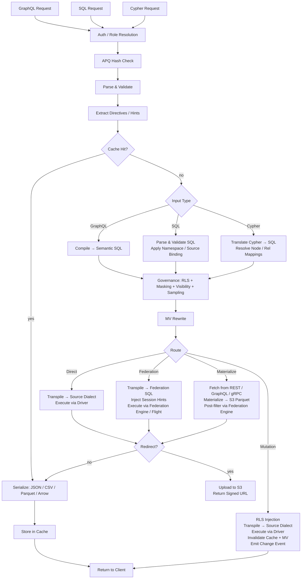

# Provisa-Architektur

## Überblick

Provisa ist eine konfigurationsgesteuerte Data-Virtualization-Plattform, die speziell dafür entwickelt wurde, eine semantische Schicht anzutreiben — von kleinen Teams bis hin zu Großunternehmen. Sie stellt eine einheitliche API über heterogene Datenquellen hinweg bereit, mit Governance, Sicherheit und Performance-Optimierung. Clients fragen per SQL, GraphQL oder Cypher ab; alle drei sind vollwertige Schnittstellen mit identischer angewandter Governance. (REQ-002, REQ-038)

Die Unterscheidung der semantischen Schicht ist wichtig. Um die semantische Schicht zu erweitern, müssen neue Datenquellen oder Aggregate innerhalb der Data-Virtualization-Schicht erstellt werden. Das schafft eine saubere Trennung — außerhalb der Plattform können keine neuen Ergänzungen an der Semantik vorgenommen werden, was echte Data Governance ermöglicht. (REQ-136) Die Durchsetzung erfolgt auf Compiler-Ebene: Der genehmigte Beziehungskatalog ist die Quelle der Wahrheit, unabhängig davon, welche Abfragesprache verwendet wird. (REQ-002)

Provisa ist darauf ausgelegt, für operative Anforderungen hochperformant und für analytische Anforderungen auf Unternehmensebene hochgradig skalierbar zu sein. Eine einzige Plattform bedient beides, ohne Geschwindigkeit oder Skalierbarkeit zu opfern.

```
Config YAML → PG Metadata → Federation Catalogs
                               ↓
         Federation engine metadata → Schema Generator → SDL / SQL catalog / Cypher labels / gRPC proto (per role)
                                     ↓
                     Query → Parser → SQL Compiler → Transpiler
                                     ↓
                             Router (Smart Dispatch)
                         /           |            \
                    Federation  Direct PG      Direct MySQL/etc.
                         \           |            /
                              Executor Pool
                                     ↓
                         ┌───── Inline ─────┐     ┌──── Redirect ────┐
                         │  JSON (HTTP)     │     │  CTAS → S3       │
                         │  Arrow (Flight)  │     │  (Parquet, ORC)  │
                         │  Protobuf (gRPC) │     │  Provisa → S3    │
                         └─────────────────-┘     │  (JSON, CSV, …)  │
                                                  └─────────────────-┘
```

## Abfrageschnittstellen

Jede Schnittstelle ist ein eigenständiger Transport. Alle vier wenden dieselbe Sicherheitspipeline an (RLS, Maskierung, Sampling, Rollenprüfungen). (REQ-002, REQ-038) Clients kommunizieren niemals direkt mit der Föderations-Engine. (REQ-266) Die „Abfragesprache“ (SQL / GraphQL / Cypher) ist orthogonal zum Transport — mehrere Sprachen können über denselben Transport eintreffen.

| Port | Transport | Accepted query languages | Use case |
|------|-----------|--------------------------|----------|
| 8001 | HTTP | GraphQL, SQL, Cypher | Web clients, BI tools, curl, REST consumers |
| 8815 | Arrow Flight (gRPC) | SQL (via Arrow Flight SQL) | Data tools (Pandas, DuckDB, Spark, ADBC) |
| 50051 | Protobuf gRPC | Per-role generated proto RPCs | Service-to-service with typed contracts |
| configurable¹ | PostgreSQL wire protocol (pgwire) | SQL | psql, DBeaver, SQLAlchemy, any PG-compatible client |

¹ `PROVISA_PGWIRE_PORT` festlegen (z. B. 5433). Deaktiviert, wenn nicht gesetzt oder `0`.

### HTTP (Port 8001)

Mehrere Endpunkte unter demselben Port, unterschieden nach Pfad:

| Path | Language | Notes |
|------|----------|-------|
| `POST /data/graphql` | GraphQL | Reads and mutations; APQ hash accepted via `extensions.persistedQuery` |
| `POST /data/sql` | SQL | Read-only; no capability gate — governed by object visibility + RLS + masking (REQ-001, REQ-267) |
| `POST /data/query` | Cypher | Read-only; standard role |
| `GET /data/nl` | Natural language | Translates to SQL/GraphQL/Cypher based on source type |
| `GET /data/subscribe/{table}` | GraphQL | SSE subscription stream |
| `GET /neo4j/...` | Cypher (Neo4j compat) | Neo4j HTTP API compatibility shim |
| `POST /admin/graphql` | GraphQL | Admin API (superuser/admin role required) |

Alle Pfade liefern standardmäßig JSON zurück. `Accept: text/csv`, `application/vnd.apache.parquet`, `application/vnd.apache.arrow.stream` und `application/octet-stream` (rohe Binärdaten) werden per Content Negotiation unterstützt. Ergebnisse, die den konfigurierten Größenschwellenwert überschreiten, werden automatisch an eine signierte S3-URL umgeleitet. (REQ-029, REQ-137)

### Arrow Flight (Port 8815)

Nativer spaltenorientierter Arrow-Transport über gRPC. (REQ-045, REQ-143) Clients senden ein JSON-Ticket:
```json
{"query": "SELECT name, email FROM customers", "role": "analyst"}
```
und erhalten Arrow-RecordBatches, die verzögert (lazy) gestreamt werden. Wenn der Zaychik-Flight-SQL-Proxy verfügbar ist, fließen die Daten als durchgängiger Strom von Arrow-Record-Batches Ende-zu-Ende: (REQ-144)

```
Client ←(Arrow batches)← Provisa Flight Server ←(Arrow batches)← Zaychik ←(JDBC)← Federation Engine
```

Das vollständige Ergebnis wird niemals im Provisa-Speicher materialisiert — Batches werden weitergeleitet, sobald sie eintreffen. (REQ-145) Das macht Arrow Flight zu einem unbegrenzten Pfad, der für beliebig große Ergebnisse geeignet ist.

### Protobuf gRPC (Port 50051)

Automatisch generierte `.proto`-Datei aus dem Datenschema, pro Rolle erzeugt. (REQ-525) Streaming-Abfragen (eine Nachricht pro Zeile), unäre Mutationen. Server-Reflection aktiviert. (REQ-526) Rolle über den Metadatenschlüssel `x-provisa-role`.

### PostgreSQL-Wire-Protokoll / pgwire (konfigurierbarer Port)

Implementiert das PostgreSQL-Frontend/Backend-Wire-Protokoll mithilfe der `buenavista`-Bibliothek. (REQ-527) Jeder PostgreSQL-kompatible Client — `psql`, DBeaver, SQLAlchemy mit `psycopg2`, JDBC — kann sich ohne Änderungen verbinden. Akzeptiert ausschließlich SQL. Die vollständige Governance-Pipeline (RLS, Maskierung, Domänenberechtigungen) gilt für pgwire-Verbindungen identisch. (REQ-266, REQ-002) Aktiviert durch Setzen von `PROVISA_PGWIRE_PORT` auf einen Port ungleich null.

## Anfragepipeline

Drei Abfragesprachen werden akzeptiert. Alle laufen nach ihren jeweiligen Parse-/Compile-Schritten in der Governance zusammen. (REQ-262, REQ-263) Nur GraphQL unterstützt Schreibvorgänge. (REQ-037) Es gibt kein Capability-Gate auf die Abfrage selbst — jede authentifizierte Identität darf in jeder Sprache abfragen, und Daten werden ausschließlich durch Objektsichtbarkeit, RLS und Maskierung gesteuert. (REQ-001)

| Interface | Reads | Writes | Query gate |
|---|---|---|---|
| GraphQL (`/data/graphql`) | Yes | Yes (mutations) | None — data-layer governance only |
| SQL (`/data/sql`) | Yes | No | None — data-layer governance only (REQ-267) |
| Cypher (`/data/query`) | Yes | No | None — data-layer governance only |



**Routing-Entscheidungen:**

| Route | When |
|---|---|
| **Cache** | Result cache hit — evaluated first, serves the stored result with no execution (REQ-865) |
| **Cheap-count** | `count(*)`-shaped query over an unmaterialized source that exposes an exact native count — routed to the native count call instead of materializing to count (REQ-875) |
| **Direct** | Single source + has native driver + has federation connector |
| **Federation** | Multi-source federation, or source has connector but no driver |
| **Materialize** | Source has no federation connector — fetch and cache to S3/PG first |
| **Mutation** | GraphQL mutation — always direct, never federated |

Das Routing nutzt die Ausgabe der Optimierungsstufe nach der Governance, niemals das gouvernierte SQL vor der Optimierung. Governance kann Quellen HINZUFÜGEN (RLS-Subquery-Prädikate); die Optimierungsstufe kann sie ENTFERNEN (Inlining von VALUES-CTE für Hot Tables, API-Cache-Umschreibungen, Pruning von Union-Zweigen). Eine föderierte Abfrage, die nach dem Inlining auf eine einzige aktive Quelle zusammenschrumpft, wird daher als direkt neu geroutet. (REQ-863)

### Multi-Root-Abfragen

GraphQL-Abfragen mit mehreren Root-Feldern (z. B. `{ orders { id } customers { name } }`) werden in separate SQL-Abfragen kompiliert und unabhängig voneinander ausgeführt. (REQ-534) SQL- und Cypher-Anfragen sind per Definition Single-Root. Ergebnisse werden in einer einzigen Antwort zusammengeführt:
- Felder unterhalb des Redirect-Schwellenwerts werden inline in `data` zurückgegeben
- Felder oberhalb des Schwellenwerts werden umgeleitet, mit Einträgen pro Feld in `redirects`
- Binärformate (Parquet, Arrow) werden nur für Single-Root-Abfragen unterstützt

## Föderations-Ausführungspfade

| Path | Transport | Via | When used |
|------|-----------|-----|-----------|
| REST | federation engine client (HTTP :8080) | Direct query | Default, always available |
| Flight SQL | `adbc-driver-flightsql` (gRPC :8480) | Zaychik proxy → JDBC | When Zaychik is running |
| CTAS | federation engine client (HTTP :8080) | Direct write, Iceberg to S3 | Parquet/ORC redirect |

### Zaychik Arrow-Flight-SQL-Proxy

Die Föderations-Engine unterstützt das Arrow-Flight-SQL-Protokoll nicht nativ. [Zaychik](https://github.com/Raiffeisen-DGTL/zaychik-trino-proxy) ist ein Java-Proxy, der die gRPC-Schnittstelle von Arrow Flight SQL implementiert, Anfragen in JDBC-Abfragen übersetzt und Ergebnisse als Arrow-Record-Batches zurückstreamt. (REQ-144)

```
ADBC client → gRPC :8480 → Zaychik → JDBC :8080 → Federation Engine → results → Arrow batches → client
```

Der Provisa-Flight-Server (Port 8815) verbindet sich mit Zaychik als ADBC-Client und ermöglicht so das durchgängige Streaming von Arrow-Daten, ohne Ergebnisse zu materialisieren. (REQ-145)

### Iceberg-Ergebniskatalog

Das CTAS-Redirect verwendet einen Iceberg-Connector (Katalog `results`), der auf einem JDBC-Katalog auf der bestehenden PostgreSQL-Instanz basiert. (REQ-169) Iceberg schreibt Parquet-/ORC-Dateien direkt über das native S3-Dateisystem (`fs.native-s3.enabled=true`) nach MinIO/S3.

## Föderations-Engines

Provisa wählt beim Start eine Föderations-Engine über die Umgebungsvariable `PROVISA_ENGINE`, die persistierte Admin-UI-Konfiguration oder den Standardwert aus. Ist nichts gesetzt, ist DuckDB der Standard — vollständig in-process, ohne externen Dienst (REQ-989). Details zur Auswahl siehe [Konfiguration](configuration.md#foderations-engine).

Jede Engine ist eine `FederationEngine`-Instanz, definiert in `provisa/federation/engine.py`. Die Instanz besitzt eine Connector-Sammlung, die bestimmt, welche Quelltypen die Engine live lesen kann (ATTACH) und welche zunächst in den Materialisierungsspeicher der Engine landen müssen. [tool-verified: `engine.py` `_ENGINE_BUILDERS`, `ENGINE_REGISTRY`]

### Driver-Klassen (REQ-840) [tool-verified: `engine.py` `DriverClass`]

| Class | Meaning | Examples |
|-------|---------|---------|
| `BROAD` | Reaches many external source types via native connectors | Trino |
| `PARTIAL` | Reaches a subset (relational, files, cloud object/lake) plus lands everything else | DuckDB, PostgreSQL, ClickHouse, Databricks, Snowflake, BigQuery, Fabric, Synapse |
| `SELF_ONLY` | Reaches only its own store; every other source lands in | SQLAlchemy |

### Verfügbare Engines [tool-verified: `engine.py` `_ENGINE_BUILDERS`]

| Engine key | Dialect | MPP | External-link mechanism | Auth |
|-----------|---------|-----|------------------------|------|
| `trino` / `trino-byo` | Trino SQL | Yes | Trino catalogs (broad connector set) | JDBC credentials |
| `pg` | PostgreSQL | No | FDW / pg_duckdb | PostgreSQL credentials |
| `duckdb` | DuckDB | No | Extension-native ATTACH | None (in-process) |
| `clickhouse` / `clickhouse-server` | ClickHouse | Yes (shards) | S3 / IcebergS3 / DeltaLake table engines (REQ-986) | ClickHouse credentials |
| `snowflake` | Snowflake | Yes | External stage + external table (REQ-988) | `PROVISA_ENGINE_URL` |
| `databricks` | Databricks SQL | Yes | Unity Catalog external tables via REST (REQ-987) | Bearer token (`http_path` in `federation_hints`) |
| `bigquery` | BigQuery | Yes (Dremel) | BigQuery external / BigLake tables | `GOOGLE_APPLICATION_CREDENTIALS` service-account key |
| `fabric` | T-SQL | Yes | OneLake shortcuts → OPENROWSET | Azure AD (`az login` / managed identity) |
| `synapse` | T-SQL | Yes | ADLS OPENROWSET / external tables | Azure AD |
| `sqlalchemy` | Any SQLAlchemy dialect | No | None (land-only) | Per-dialect credentials |

### Konfigurationsfreier Standard: DuckDB (REQ-989) [tool-verified: `engine.py` `build_duckdb_engine`, `_embedded_duckdb_materialize_default`]

Wenn `PROVISA_ENGINE` nicht gesetzt ist, verwendet Provisa die vollständig eingebettete, in-process laufende DuckDB-Engine. Der Materialisierungsspeicher von DuckDB ist eine eingebettete DuckDB-Datei unter `$PROVISA_DATA_DIR/materialize.duckdb` (Standard: `~/.provisa/materialize.duckdb`). Es ist keine externe Datenbank oder kein externer Dienst erforderlich.

Da DuckDB pro Datei nur einen einzigen Schreibprozess zulässt, schreibt `store_connection.py` über die eigene Verbindung der Engine in den eingebetteten Speicher — niemals über eine zweite, unabhängige Verbindung. Dies ist der einzige Fall, in dem Engine und Materialisierungsspeicher absichtlich einen Datei-Handle teilen. [tool-verified: `store_connection.py` module docstring]

### Arrow-natives Lese-Transport (REQ-986, REQ-987, REQ-988) [tool-verified: `engine.py` `build_*_engine` `capabilities=`]

ClickHouse, DuckDB, Snowflake, Databricks, BigQuery, Fabric und Synapse melden alle `EngineCapability.ARROW` und `EngineCapability.ARROW_STREAM`. Abfragen gegen diese Engines liefern direkt Arrow-RecordBatches zurück — der Pfad der zeilenweisen Serialisierung wird vollständig umgangen. Der Flight-Server streamt diese Batches an Clients, ohne das vollständige Ergebnis im Prozessspeicher von Provisa zu materialisieren. Bei Trino stützt sich das Arrow-Streaming auf den Zaychik-Proxy; bei den Warehouse-Engines speist die eigene Arrow-native API der jeweiligen Engine (Cloud Fetch bei Databricks, Storage Read API bei BigQuery, `fetch_arrow_table` bei DuckDB und Snowflake) den Flight-Stream.

### Externe Datenanbindungen (ATTACH) [tool-verified: `engine.py` `_warehouse_connectors`]

Jede Warehouse-Engine kann Cloud-Objekt-/Lake-Daten an Ort und Stelle scannen, ohne eine Kopie zu landen. Parquet-, CSV-, Iceberg- und Delta-Lake-Dateien auf S3, GCS oder OneLake werden direkt an die Engine angehängt, als wären sie native Tabellen. Die Strategie — ATTACH (Scan an Ort und Stelle) oder LAND (Kopieren in den Speicher) — wird durch den deklarierten `Mechanism` des Connectors bestimmt; im Planer existiert keine engine-spezifische Verzweigung. Ein `Mechanism.ATTACH_R`-Connector löst einen kopierfreien Scan aus; ein `Mechanism.DIRECT`-Connector oder ein fehlender Connector löst ein Landen aus. [tool-verified: `connector_base.py` `Mechanism`, `engine.py` `_warehouse_connectors`]

Attach stellt alle Voraussetzungen zum Zeitpunkt des Anhängens automatisch bereit:

| Engine | Object/lake formats | Mechanism | Auto-provisioning [tool-verified] |
|--------|-------------------|----------|----------------------------------|
| Databricks | parquet, csv, iceberg, delta_lake | UC external table (`ATTACH_R`) | REST installs Unity Catalog storage credential + external location, then `CREATE TABLE … USING <format> LOCATION …` — live-verified over Cloudflare R2 |
| BigQuery | parquet, csv, json, iceberg, delta_lake | BigQuery external / BigLake table (`ATTACH_R`) | `CREATE OR REPLACE EXTERNAL TABLE … OPTIONS(format=…, uris=[…])` — live-verified |
| ClickHouse | csv, parquet, iceberg, delta_lake | S3 / IcebergS3 / DeltaLake table engine (`ATTACH_R`) | Validation probe executed at attach time — live-verified over Cloudflare R2 |
| Fabric | parquet, csv, iceberg, delta_lake | OneLake shortcut → OPENROWSET (`ATTACH_R`) | REST creates an `AmazonS3Compatible` connection + lakehouse + shortcut; returns the OneLake `BULK` path — live-verified reading R2 through Fabric |
| Snowflake | parquet, csv, json, iceberg, delta_lake | External stage + external table (`ATTACH_R`) | `CREATE STAGE … URL=… CREDENTIALS=…`, then `CREATE OR REPLACE EXTERNAL TABLE … LOCATION=@stage FILE_FORMAT=(TYPE=…)` — implemented; not live-tested (no account available) |

Anmeldeinformationen für Cloud-Speicher werden im `federation_hints` der Quelle übermittelt (siehe [Sources](sources.md#warehouses-als-benannte-quellen)). Jeder Quelltyp, der kein ATTACH ausführen kann, landet zunächst im Materialisierungsspeicher der Engine.

### Spaltenorientierte Materialisierungs-Schreibvorgänge (REQ-990) [tool-verified: `core/database.py:436`, `store_connection.py:99`]

`Connection.bulk_copy` in `provisa/core/database.py` wählt je nach Speicher-Dialekt den schnellsten Bulk-Ingest-Pfad: binäres `COPY` (`copy_records_to_table` von asyncpg) für PostgreSQL-Speicher und eine einzelne vorbereitete `executemany`-Anweisung für alle anderen relationalen Speicher. Der eingebettete DuckDB-Speicher landet Daten über `land_duckdb_native` in `store_connection.py` — ein einziger `executemany`-Aufruf für den gesamten Batch, niemals eine Schleife pro Zeile.

## Umleitung großer Ergebnisse

Ergebnisse, die einen Zeilen-Schwellenwert überschreiten, werden statt inline an S3-kompatiblen Speicher (MinIO) umgeleitet. (REQ-029)

### Umleitungsmodi

| Mode | How it works | Data touches Provisa? |
|------|-------------|----------------------|
| **CTAS** (Parquet, ORC) | Federation engine writes directly to S3 via `CREATE TABLE AS SELECT` | No |
| **Provisa upload** (JSON, NDJSON, CSV, Arrow IPC) | Provisa serializes and uploads via boto3 | Yes |

Bei CTAS-nativen Formaten fasst Provisa die Daten niemals an — die Föderations-Engine schreibt die Dateien direkt nach MinIO/S3. (REQ-138) Dies ist der bevorzugte Pfad für große analytische Exporte.

### Umleitungs-Header

| Header | Effect |
|--------|--------|
| `X-Provisa-Redirect-Format: <mime>` | Redirect in this format (implies force unless threshold set) |
| `X-Provisa-Redirect-Threshold: N` | Only redirect if result exceeds N rows |
| `X-Provisa-Redirect: true` | Force redirect using default format |

Diese Header implementieren eine clientseitig gesteuerte Umleitung. (REQ-137)

**Antwort:**
```json
{
  "data": {"orders": null},
  "redirect": {
    "redirect_url": "https://minio:9000/provisa-results/results/abc.parquet?...",
    "row_count": 50000,
    "expires_in": 3600,
    "content_type": "application/vnd.apache.parquet"
  }
}
```

### Serverkonfiguration

| Env var | Default | Purpose |
|---------|---------|---------|
| `PROVISA_REDIRECT_ENABLED` | `false` | Enable server-side threshold redirect |
| `PROVISA_REDIRECT_THRESHOLD` | `1000` | Default row count threshold |
| `PROVISA_REDIRECT_FORMAT` | `parquet` | Default redirect format |
| `PROVISA_REDIRECT_BUCKET` | `provisa-results` | S3 bucket name |
| `PROVISA_REDIRECT_ENDPOINT` | | S3-compatible endpoint URL |
| `PROVISA_REDIRECT_TTL` | `3600` | Presigned URL TTL (seconds) |

## Routing-Entscheidungsbaum

```
Multi-source query? → Federation engine
NoSQL source (MongoDB, Cassandra)? → Federation engine
Uses path columns on non-PG source? → Federation engine
Single RDBMS with driver? → Direct (sub-100ms target)
Single RDBMS without driver? → Federation engine
Steward hint "federated"? → Federation engine (override)
Steward hint "direct"? → Direct (if possible)
Redirect to Parquet/ORC? → Federation engine (CTAS, regardless of source count)
```

(REQ-027, REQ-028, REQ-030, REQ-279)

## Optimierung der Föderationsabfragen

Provisa initialisiert automatisch den kostenbasierten Optimierer der Föderations-Engine, sodass quellenübergreifende Abfragepläne auf der tatsächlichen Datenverteilung basieren und nicht auf fest codierten Standardwerten.

### Automatische Statistiken (`ANALYZE`)

Bei der Registrierung einer Quelle führt Provisa `ANALYZE catalog.schema.table` für jede veröffentlichte Tabelle aus. (REQ-275) Dies erfasst:

- Zeilenzahl
- Pro Spalte: Null-Anteil, Anzahl unterschiedlicher Werte, Min/Max, Histogramme (connector-abhängig)

Der Optimierer verwendet diese Werte, um die Selektivität gefilterter Abfragen zu schätzen. Ohne Statistiken greift er auf feste Standardwerte zurück (z. B. 10 % Selektivität für Gleichheitsprädikate), was bei schiefen oder hochkardinalen Daten zu schlechten Join-Plänen führt. Mit Statistiken sind die Schätzungen präzise genug, um für die meisten Workloads korrekte Entscheidungen zwischen Broadcast- und partitionierten Joins zu treffen.

**Abdeckung**: Die Unterstützung für Statistiken variiert je nach Connector. PostgreSQL, MySQL, Hive, Iceberg und Delta Lake unterstützen `ANALYZE` vollständig. Die Connectoren für MongoDB und Cassandra bieten teilweise oder keine Unterstützung. Provisa schluckt `ANALYZE`-Fehler stillschweigend — die Registrierung wird niemals blockiert. (REQ-275)

**Grenzen der Selektivität**: Statistiken liefern Schätzungen pro Spalte. Bei korrelierten Prädikaten (`WHERE region = 'US' AND city = 'Seattle'`) geht der Optimierer von Spaltenunabhängigkeit aus, was die Zeilenzahl unterschätzen kann. Dies ist eine bekannte Einschränkung spaltenbasierter Statistiken in allen kostenbasierten Optimierern.

**API-Quellen**: `api_cache_{table_name}`-Tabellen in PostgreSQL werden nach jedem Cache-Aktualisierungszyklus automatisch analysiert, sodass der Optimierer beim Verbinden von API-basierten Quellen mit relationalen Quellen über aktuelle Zeilenschätzungen verfügt. (REQ-280)

### Administration: Statistiken aktualisieren

Statistikerfassung bei Bedarf über die Admin-API erneut ausführen: (REQ-276)

```graphql
mutation {
  refreshSourceStatistics(sourceId: "sales-pg") {
    tablesAnalyzed
    failures { table message }
  }
}
```

Nützlich, wenn eine Quelle seit der Registrierung erhebliche neue Daten erhalten hat.

## Materialisierte Sichten

Materialisierte Sichten (MV) optimieren teure Abfragen transparent, indem sie Ergebnisse vorab berechnen und zwischenspeichern.

### Beziehungen als MV-Hinweise

Eine Beziehungsdeklaration ist nicht nur ein Governance-Artefakt — sie ist auch die strukturelle Beschreibung einer Join-Form. Genau diese Form benötigt der MV-Optimierer: zwei Tabellen, zwei Spalten, ein Join-Typ. Das bedeutet, eine Beziehung kann die Materialisierung direkt steuern.

Für **quellenübergreifende Beziehungen** geschieht dies automatisch beim Start: Jede genehmigte quellenübergreifende Beziehung erzeugt eine `JoinPattern`-MV (`auto-mv-<rel_id>`). (REQ-158) Es ist keine separate MV-Konfiguration erforderlich. Erkennt der Compiler diesen Join in einer Abfrage, ersetzt der Rewriter das vormaterialisierte Ergebnis transparent.

Für **Beziehungen innerhalb derselben Quelle** können Stewards explizit über `materialize: true` optieren. JOINs innerhalb derselben Quelle sind bereits durch direkte Ausführung schnell, daher lohnt sich die Materialisierung nur für sehr stark frequentierte Join-Pfade. (REQ-159)

Die praktische Konsequenz: Stewards, die eine Beziehung genehmigen, entscheiden implizit mit, ob der Join ein guter Kandidat für die Materialisierung ist. Der Governance-Akt und der Optimierungshinweis sind ein und dieselbe Deklaration.

### Modi

| Mode | Config | Behavior |
|------|--------|----------|
| **Join-pattern** | `join_pattern` in MV config | Rewrites matching JOINs to read from MV table |
| **Custom SQL** | `sql` in MV config | Arbitrary SELECT, optionally exposed in SDL |
| **Auto-materialized relationship** | cross-source relationship (automatic) | Auto-generates a join-pattern MV; no config required |
| **Steward-materialized relationship** | `materialize: true` on same-source relationship | Explicit opt-in for hot same-source join paths |

### Automatische Materialisierung

Quellenübergreifende JOINs sind die teuersten Abfragen (immer föderiert). Quellenübergreifende Beziehungen erzeugen beim Start automatisch MV-Definitionen: (REQ-158)

```yaml
relationships:
  - id: orders-to-reviews
    source_table_id: orders        # sales-pg
    target_table_id: product_reviews  # reviews-mongo
    source_column: product_id
    target_column: product_id
    cardinality: one-to-many
    materialize: true              # auto-create MV
    refresh_interval: 600          # refresh every 10 minutes
```

Nur quellenübergreifende Beziehungen erzeugen MVs (JOINs innerhalb derselben Quelle sind durch direkte Ausführung bereits schnell). (REQ-159) Die MV startet im Status `STALE` und wird von der Hintergrund-Aktualisierungsschleife aktualisiert, bevor sie vom Abfrageoptimierer verwendet wird. (REQ-160)

### Aktualisierungs-Lebenszyklus

```
STALE → (refresh loop picks up) → REFRESHING → FRESH
  ↑                                                |
  └──── mutation hits source table ────────────────┘
```

Die Aktualisierungsschleife läuft alle 30 Sekunden, prüft `get_due_for_refresh()` und führt `CREATE TABLE AS SELECT` (erster Lauf) oder `DELETE + INSERT` (nachfolgende Läufe) gegen die MV-Zieltabelle über die Föderations-Engine aus. (REQ-160, REQ-234)

## Modulübersicht

| Module | Purpose |
|--------|---------|
| `api/` | FastAPI app, routers, middleware, lifespan management |
| `api/flight/` | Arrow Flight server (gRPC, port 8815) |
| `api/admin/` | Strawberry GraphQL admin API — config, discovery, views |
| `api/rest/` | Auto-generated REST endpoints from registered tables |
| `api/jsonapi/` | Auto-generated JSON:API endpoints with pagination and error handling |
| `api/data/subscribe.py` | SSE subscriptions — LISTEN/NOTIFY, polling, Debezium CDC |
| `compiler/` | GraphQL/SQL parsers, semantic SQL generator, RLS, masking, sampling, two-stage governance (`stage2.py`) |
| `cypher/` | Cypher → SQL translator, parser, label map (REQ-351), write translator for Cypher mutations |
| `pgwire/` | PostgreSQL wire-protocol server; `catalog.py` intercepts pg_catalog/information_schema for per-role object visibility (REQ-527, REQ-883, REQ-891) |
| `vector/` | Vector search — model registry, embedding providers (openai/ollama/huggingface), `cosine_similarity()` translation, pgvector fallback cache, declarative embedding generation (REQ-419–431) |
| `compiler/federation.py` | Apollo Federation v2 subgraph support |
| `transpiler/` | Dialect transpilation, routing logic |
| `executor/` | Federated/direct execution, serialization, output formats |
| `executor/drivers/` | Direct source drivers (PostgreSQL, MySQL, DuckDB, Snowflake, Databricks, ClickHouse, …) |
| `executor/trino_flight.py` | ADBC Flight SQL client for the federation engine |
| `executor/ctas_write.py` | CTAS-based redirect (federation engine writes to S3) |
| `executor/redirect.py` | S3 redirect logic, Provisa-side upload |
| `federation/engine.py` | `FederationEngine`, `DriverClass`, `_ENGINE_BUILDERS`, `ENGINE_REGISTRY`, `build_engine` |
| `federation/connector.py` | Connector abstractions — Trino, ClickHouse; `Mechanism`, `WarehouseNativeConnector` |
| `federation/connector_duckdb.py` | DuckDB and PostgreSQL FDW connector definitions |
| `federation/snowflake_connectors.py` | Snowflake external stage + external table ATTACH connectors (REQ-988) |
| `federation/databricks_connectors.py` | Databricks UC external table ATTACH connectors (REQ-987) |
| `federation/bigquery_connectors.py` | BigQuery external / BigLake ATTACH connectors |
| `federation/databricks_uc.py` | Unity Catalog credential + external location auto-provisioning |
| `federation/databricks_backend.py` | Databricks SQL warehouse execution backend |
| `federation/snowflake_backend.py` | Snowflake execution backend |
| `federation/bigquery_backend.py` | BigQuery execution backend (Storage Read API Arrow transport) |
| `federation/mssql_warehouse_backend.py` | Fabric Warehouse + Synapse execution backends (T-SQL over ODBC) |
| `federation/mssql_warehouse_connectors.py` | OPENROWSET ATTACH connectors for Fabric / Synapse |
| `federation/fabric_shortcuts.py` | OneLake shortcut auto-provisioning (connection → lakehouse → shortcut) |
| `federation/clickhouse_backend.py` | ClickHouse execution backend |
| `federation/duckdb_backend.py` | DuckDB in-process execution backend |
| `federation/pg_backend.py` | PostgreSQL execution backend |
| `federation/store_connection.py` | DuckDB-native materialization store write face (REQ-989, REQ-990) |
| `registry/` | Persisted query registry, governance |
| `security/` | Visibility, rights, column masking |
| `cache/` | Redis-backed query result caching (hot tier) |
| `mv/` | Materialized view registry, refresh, SQL rewriter |
| `events/` | Dataset change events and trigger dispatch |
| `webhooks/` | Outbound webhook execution for mutations and events |
| `scheduler/` | APScheduler-based background job management — cron and interval triggers that fire webhooks, mutations, or Kafka sink publishes |
| `apq/` | Apollo APQ wire protocol — Redis-backed query hash cache; separate from result caching |
| `compiler/cursor.py` | Relay-style cursor pagination — `first`/`after`/`last`/`before` arguments and `pageInfo` generation on all list queries |
| `compiler/aggregate_gen.py` | Auto-generated `{table}_aggregate` query types with `count`, `sum`, `avg`, `min`, `max` sub-fields and filtered `nodes` access |
| `compiler/enum_detect.py` | Enum type auto-detection — PostgreSQL native enum types (`pg_enum`) exposed as GraphQL enum types rather than string scalars |
| `compiler/hints.py` | Federation performance hints — query-level routing directives embedded as SQL comments (`/* @provisa route=federated */`) that override automatic routing |
| `compiler/mutation_gen.py` | Mutation compiler; column presets — server-side static or session-variable values applied on insert/update, not exposed in the mutation input type |
| `auth/approval_hook.py` | ABAC approval hook — pluggable external authorization called before query execution; webhook, gRPC, and unix_socket transports; per-table/source/global scope; configurable fallback policy |
| `subscriptions/` | SSE subscription state and delivery |
| `discovery/` | LLM relationship discovery (Claude API) |
| `grpc/` | Proto generation, gRPC server, reflection |
| `api_source/` | REST/GraphQL/gRPC API sources with PG cache |
| `kafka/` | Kafka topic sources, sink, Schema Registry |
| `auth/` | Pluggable auth providers, middleware, role mapping |
| `core/` | Config, models, DB, repositories, secrets; role model supports `parent_role_id` and `flatten_roles()` for recursive role inheritance |
| `hasura_v2/` | Hasura v2 metadata → Provisa config converter |
| `ddn/` | Hasura DDN supergraph → Provisa config converter |
| `mongodb/` | MongoDB source connector |
| `elasticsearch/` | Elasticsearch source connector |
| `cassandra/` | Cassandra source connector |
| `prometheus/` | Prometheus metrics source connector |
| `source_adapters/` | Generic adapter layer for source connections |

## Admin-API

Die Strawberry-GraphQL-Admin-API ist unter `/admin/graphql` (HTTP-Port 8001) eingebunden. Sie ist vom Daten-GraphQL-Endpunkt getrennt und erfordert die Rolle Superuser oder Admin.

| Capability | Description |
|-----------|-------------|
| Config download/upload | Export or replace the full Provisa YAML config |
| Relationship editor | Create, update, delete relationship definitions |
| AI FK discovery | Trigger Claude-powered FK candidate analysis |
| Schema introspection | Browse published tables, columns, and roles |
| View management | Register and manage materialized view definitions |

(REQ-164, REQ-165, REQ-166, REQ-167)

## Automatisch generierte REST- und JSON:API-Endpunkte

Registrierte Tabellen werden zusätzlich zur GraphQL-Schnittstelle als REST- und JSON:API-Endpunkte bereitgestellt. (REQ-256, REQ-257)

| Interface | Mount path | Spec |
|-----------|-----------|------|
| REST | `/rest/<table-id>` | Simple GET/POST with query parameters |
| JSON:API | `/jsonapi/<table-id>` | [jsonapi.org](https://jsonapi.org) compliant — pagination, relationships, error objects |

Diese Endpunkte wenden dieselbe Sicherheitspipeline (RLS, Maskierung, Rollenprüfungen) an wie der GraphQL-Endpunkt. (REQ-002, REQ-038)

## Subscriptions

SSE-Subscriptions werden unter `GET /data/subscribe/{table}` bereitgestellt. Drei Zustellungsmodi: (REQ-258)

| Mode | Mechanism | When used |
|------|-----------|-----------|
| **LISTEN/NOTIFY** | PostgreSQL `LISTEN` on a channel | PG sources with mutation activity |
| **Polling** | Re-execute query on interval | Non-PG sources, or when CDC unavailable |
| **Debezium CDC** | Kafka topic from Debezium connector | High-frequency change streams |

(REQ-258, REQ-260, REQ-261)

Der Client empfängt `text/event-stream` mit einem JSON-Ereignis pro geänderter Zeile oder Differenz.

## Event- und Webhook-System

Datenbankmutationen (INSERT/UPDATE/DELETE) können über die Module `events/` und `webhooks/` ausgehende Ereignisse auslösen. (REQ-172, REQ-173, REQ-220)

```
Mutation executed → EventDispatcher → match event trigger rules
                                          ↓
                               WebhookExecutor → HTTP POST to configured URL
```

Event-Trigger werden in der Konfiguration definiert und nach Tabelle, Operationstyp und optionalem Zeilenfilter zugeordnet. Webhook-Payloads enthalten den Operationstyp, die geänderte Zeile und den Rollenkontext.

## Hintergrunddienste

Vier Hintergrundschleifen starten während der Lifespan-Phase der Anwendung (`api/app.py`):

| Service | Interval | Purpose |
|---------|----------|---------|
| MV refresh loop | 30 s | Polls `get_due_for_refresh()`, executes CTAS or DELETE+INSERT on stale MVs |
| Warm table manager | Configurable | Promotes frequently-queried tables to Iceberg local SSD cache |
| Hot table loader | Configurable | Loads small reference tables into in-memory cache for sub-millisecond access |
| API source poller | Per-source interval | Re-fetches and re-caches remote REST/GraphQL/gRPC sources |

(REQ-160, REQ-238, REQ-239, REQ-236)

### Hot-/Warm-Table-Caching-Ebenen

| Tier | Storage | Promotion criteria | Access latency |
|------|---------|-------------------|----------------|
| Hot | In-process memory | Row count < threshold, or is a relationship target | <1 ms |
| Warm | Iceberg on local SSD | Query frequency threshold exceeded | ~5–20 ms |
| Cold | Remote source | Default | 50–500 ms |

(REQ-230, REQ-236, REQ-238, REQ-241)

## Metadaten-Import (Hasura v2 / DDN)

Bestehende Hasura-Deployments können ohne manuelle Neuschreibung in eine Provisa-Konfiguration umgewandelt werden. (REQ-182, REQ-183)

| Module | Input | Output |
|--------|-------|--------|
| `hasura_v2/` | Hasura v2 `metadata.yaml` | Provisa `config.yaml` |
| `ddn/` | Hasura DDN supergraph JSON | Provisa `config.yaml` |

Beide Konverter bilden verfolgte Tabellen, Beziehungen, Berechtigungen und Remote-Schemas ab. Das Ergebnis ist eine vollständige, einsatzbereite Provisa-Konfiguration. (REQ-182, REQ-183)

## Apollo Federation

`compiler/federation.py` stellt Provisa als Apollo-Federation-v2-Subgraph bereit. (REQ-259) Das Subgraph-SDL wird automatisch aus dem veröffentlichten Schema generiert, mit `@key`-Direktiven auf Primärschlüsselspalten und `@external`/`@provides`-Annotationen auf quellenübergreifenden Beziehungen. Provisa beantwortet die vom Federation-Gateway benötigten `_entities`- und `_service`-Abfragen. (REQ-259)

## Cursor-basierte Paginierung

Alle Listenabfragen unterstützen Relay-artige Cursor-Paginierung über `compiler/cursor.py`. (REQ-218) Clients übergeben die Argumente `first`/`after` (vorwärts) oder `last`/`before` (rückwärts). Der Compiler kodiert die Zeilenposition als opaken Base64-Cursor und fügt die passenden `WHERE`/`LIMIT`-Klauseln ein. Jede Listenabfrage liefert ein `pageInfo`-Objekt zurück:

| Field | Type | Description |
|-------|------|-------------|
| `hasNextPage` | Boolean | True if more results exist after this page |
| `hasPreviousPage` | Boolean | True if results exist before this page |
| `startCursor` | String | Cursor of the first node in this page |
| `endCursor` | String | Cursor of the last node in this page |

## Aggregatabfragen

Jede registrierte Tabelle erhält ein automatisch generiertes `{table}_aggregate`-Root-Feld (`compiler/aggregate_gen.py`). (REQ-196) Der Aggregattyp stellt `count`, `sum`, `avg`, `min`, `max` pro numerischer Spalte sowie `nodes` für gefilterten Zeilenzugriff mit vollständiger Feldauswahl bereit (gleiches RLS/Maskierung wie die Basisabfrage). (REQ-196, REQ-198) Aggregatabfragen sind für das Aggregate-MV-Routing geeignet — siehe `mv/aggregate_catalog.py`. (REQ-198)

## Automatic Persisted Queries (APQ)

`apq/cache.py` implementiert das APQ-Wire-Protokoll von Apollo. (REQ-288) Sendet ein Client nur einen Abfrage-Hash (`extensions.persistedQuery`), sucht Provisa diesen in Redis. (REQ-289) Bei einem Fehltreffer liefert es einen `PersistedQueryNotFound`-Fehler zurück; der Client wiederholt die Anfrage mit dem vollständigen Abfragetext, den Provisa speichert. (REQ-288) Dies ist unabhängig vom Ergebnis-Caching (`cache/`).

## Vererbte Rollen

Rollen in `core/models.py` können auf eine `parent_role_id` verweisen. (REQ-215) `flatten_roles()` löst die Vererbungskette rekursiv auf und führt RLS-WHERE-Klauseln zusammen (UND-verknüpft), Spaltensichtbarkeit (Vereinigung, restriktivste gewinnt) und Maskierungsrichtlinien (Kind überschreibt Elternteil pro Spalte). Das vermeidet doppelte Berechtigungssätze zwischen ähnlichen Rollen (z. B. `analyst` erbt von `reader`). (REQ-215)

## ABAC-Genehmigungshook

`auth/approval_hook.py` ist ein anschließbarer Autorisierungshook, der vor der Abfrageausführung aufgerufen wird, nach RLS und Maskierung. (REQ-203) Er integriert sich mit externen Policy-Engines (OPA, benutzerdefinierte ABAC-Dienste).

| Setting | Description |
|---------|-------------|
| Transport | `webhook` (HTTP POST), `grpc`, or `unix_socket` |
| Scope | Per-table, per-source, or global |
| Fallback policy | `allow` or `deny` when the hook endpoint is unreachable |

(REQ-246, REQ-247, REQ-204)

## Automatische Erkennung von Enum-Typen

`compiler/enum_detect.py` introspiziert native PostgreSQL-Enum-Typen (`pg_enum`) zum Zeitpunkt der Schemagenerierung. (REQ-221) Spalten, die einen benutzerdefinierten PostgreSQL-Enum-Typ verwenden, werden zu GraphQL-Enum-Typen befördert — ihre Werte werden zu Enum-Mitgliedern statt zu String-Skalaren.

## Geplante Trigger

`scheduler/jobs.py` verwendet APScheduler, um im Hintergrund laufende Jobs auszuführen, die als Cron- oder Intervall-Trigger definiert sind. (REQ-216) Jeder Job kann einen POST an eine Webhook-URL senden, eine Mutation gegen den Daten-Endpunkt ausführen oder Abfrageergebnisse in ein Kafka-Topic veröffentlichen. Trigger werden über die Admin-API (Mutationen `scheduledTrigger`) oder den Schlüssel `scheduled_triggers` in der YAML-Konfiguration konfiguriert. (REQ-216)

## Föderations-Performance-Hinweise

`compiler/hints.py` analysiert Steward-Hinweise, die als Kommentare mit der Provisa-Kommentarsyntax in Abfragen eingebettet sind. (REQ-279) Das Format des Hinweises variiert je nach Abfragesprache:

```graphql
# @provisa route=federated
{ orders { id amount } }
```
```sql
/* @provisa route=federated */
SELECT id, amount FROM orders
```
```cypher
// @provisa route=federated
MATCH (o:Order) RETURN o.id, o.amount
```

| Hint | Effect |
|------|--------|
| `route=federated` | Force federation through the federation engine, bypassing direct-driver routing |
| `route=direct` | Force direct-driver execution |

(REQ-279, REQ-277, REQ-278)

## Spalten-Presets in Mutationen

`compiler/mutation_gen.py` unterstützt serverseitige Presets pro Spalte, die bei `INSERT` oder `UPDATE` angewendet werden. (REQ-214) Presets sind nicht im generierten GraphQL-Mutation-Input-Typ enthalten — der Compiler injiziert sie transparent. Preset-Typen: `static` (Literalwert) oder `session` (Wert aus Sitzung/Header der Anfrage, z. B. `x-hasura-user-id`). (REQ-214)

## GraphQL-Voyager-Schema-Explorer

Die Admin-UI (`provisa-ui/src/pages/SchemaExplorer.tsx`) bettet GraphQL Voyager als interaktives Werkzeug zur Schema-Visualisierung ein. (REQ-248) Sie stellt das rollenbezogene Schema als navigierbares Entity-Relationship-Diagramm dar — Tabellen als Knoten, Beziehungen als Kanten. Das angezeigte Schema ist stets auf die aktuell ausgewählte Rolle gefiltert.

## Reihenfolge der Sicherheitsdurchsetzung

Es gibt kein Capability-Gate auf die Abfrage — Governance wird ausschließlich über Kontrollen der Datenschicht ausgedrückt. (REQ-001) Eine Roh-SQL-Anfrage lehnt (HTTP 403) jede Tabelle außerhalb des Objektbereichs der Rolle ab, bevor die Governance ausgeführt wird. (REQ-267)

1. **Objektsichtbarkeit**: Das rollenspezifische Schema verbirgt nicht autorisierte Tabellen/Spalten; Tabellen außerhalb des Geltungsbereichs in Roh-SQL werden abgelehnt (REQ-039, REQ-267)
2. **Durchsetzung von Beziehungen**: Traversierungen müssen im genehmigten Beziehungskatalog vorhanden sein, es sei denn, die Rolle besitzt `ignore_relationships` (REQ-001)
3. **RLS**: WHERE-Klausel-Injektion pro Tabelle und Rolle (REQ-040, REQ-041, REQ-263)
4. **Spaltenmaskierung**: Datentransformation pro Spalte und Rolle (REQ-263)
5. **Zeilenobergrenze (LIMIT)**: Obergrenze für die Zeilenzahl für Rollen ohne `full_results`; zufälliges statistisches Sampling ist eine separate Benutzerabfragefunktion (REQ-263, REQ-478)

Alle vier Abfrageschnittstellen (HTTP, Flight, gRPC, pgwire) setzen dieselbe Stufe-2-Governance-Pipeline durch; kein Client-Pfad kann sie umgehen, ohne den Server zu umgehen. (REQ-002, REQ-038, REQ-266)

## Skalierbarkeitsgrenzen

Provisa ist eine dünne Kompilierungs- und Routing-Schicht — sie fügt der Abfragelatenz nur einstellige Millisekunden hinzu. Pfade, auf denen Provisa Ergebnisdaten serialisiert, sind jedoch durch den Prozessspeicher begrenzt. Zwei Pfade sind wirklich unbegrenzt:

| Path | Memory bound? | Suitable for |
|------|--------------|-------------|
| JSON inline (HTTP) | Yes | Small-medium results |
| **Arrow Flight streaming (gRPC :8815)** | **No** | **Unbounded — streaming via Zaychik or warehouse Arrow API** |
| Protobuf gRPC inline (:50051) | Yes | Medium results, service-to-service |
| Redirect: Provisa upload (JSON, CSV, NDJSON, Arrow IPC) | Yes | Medium results, file download |
| **Redirect: CTAS (Parquet, ORC)** | **No** | **Unbounded — federation engine writes to S3** |

(REQ-145, REQ-138)

### Schwellenwert-Sondierung

Bei schwellenwertbasierter Umleitung fügt Provisa `LIMIT threshold + 1` als Sonde in die Abfrage ein. (REQ-140) Hat das Ergebnis weniger Zeilen, wird es inline zurückgegeben (vollständiges Ergebnis, keine verschwendete Arbeit). Erreicht das Ergebnis das Limit, wird die Sonde verworfen und die vollständige Abfrage über CTAS oder Provisa-Upload erneut ausgeführt. Das vermeidet `SELECT COUNT(*)` (das manche Quellen nicht optimieren) und funktioniert bei jeder Quelle.

Für große analytische Workloads verwenden Sie eine der folgenden Optionen:
- **Arrow Flight** (Port 8815) zum Streamen an Datenwerkzeuge — Batches fließen durch Provisa, ohne materialisiert zu werden (REQ-145)
- **Parquet/ORC-Umleitung** für dateibasierte Exporte — die Föderations-Engine schreibt direkt nach S3, Provisa gibt eine vorsignierte URL zurück (REQ-138, REQ-044)

## Infrastruktur

| Service | Image | Port | Purpose |
|---------|-------|------|---------|
| Provisa API | (host process) | 8001 | HTTP/REST endpoint |
| Provisa Flight | (host process) | 8815 | Arrow Flight gRPC server |
| Provisa gRPC | (host process) | 50051 | Protobuf gRPC server |
| Federation Engine | `trinodb/trino` (default) or external warehouse | 8080 / varies | Query federation engine — Trino for the embedded stack; Snowflake/Databricks/BigQuery/Fabric/Synapse/DuckDB for warehouse targets |
| Zaychik | `provisa-zaychik` (built from source) | 8480 | Arrow Flight SQL proxy for Trino; not required for warehouse engines |
| PostgreSQL | `postgres:16` | 5432 | Config metadata + Iceberg catalog |
| MongoDB | `mongo:7` | 27017 | Demo NoSQL data source |
| MinIO | `minio/minio` | 9000/9001 | S3-compatible object storage |
| Redis | `redis:7-alpine` | 6379 | Query result cache |
| PgBouncer | `edoburu/pgbouncer` | 6432 | Connection pooling for PG |
| Kafka | `confluentinc/cp-kafka:7.6.0` | 9092 | Streaming data sources |
| Schema Registry | `confluentinc/cp-schema-registry:7.6.0` | 8081 | Avro/Protobuf schema management |

(REQ-055, REQ-169)
