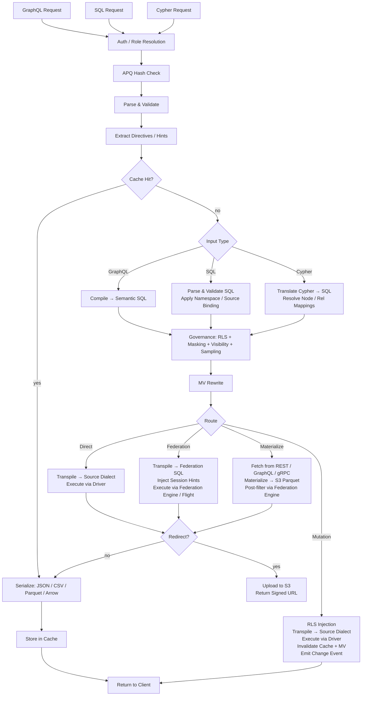

# Provisa-Architektur

## Überblick

Provisa ist eine konfigurationsgetriebene Data-Virtualization-Plattform, speziell dafür entworfen, eine semantische Schicht von kleinen Teams bis zu großen Unternehmen zu betreiben. Sie bietet eine einheitliche API über heterogene Datenquellen mit Governance, Sicherheit und Performance-Optimierung. Clients fragen über SQL, GraphQL oder Cypher ab; alle drei sind vollwertige Schnittstellen mit identisch angewendeter Governance. (REQ-002, REQ-038)

Die Unterscheidung der semantischen Schicht ist wichtig. Um die semantische Schicht zu erweitern, müssen neue Datenquellen oder Aggregate innerhalb der Data-Virtualization-Schicht angelegt werden. Das schafft eine saubere Trennung — keine Erweiterungen der Semantik können außerhalb der Plattform vorgenommen werden, was echte Data Governance ermöglicht. (REQ-136) Die Durchsetzung erfolgt auf Compiler-Ebene: Der genehmigte Beziehungskatalog ist die Source of Truth, unabhängig davon, welche Abfragesprache verwendet wird. (REQ-002)

Provisa ist darauf ausgelegt, für operative Anforderungen hochperformant und für analytische Enterprise-Anforderungen hochskalierbar zu sein. Eine einzige Plattform bedient beides, ohne Geschwindigkeit oder Skalierbarkeit zu opfern.

```text
Config YAML → PG Metadata → Federation Catalogs
                               ↓
         Federation engine metadata → Schema Generator → SDL / SQL catalog / Cypher labels / gRPC proto (per role)
                                     ↓
                     Query → Parser → SQL Compiler → Transpiler
                                     ↓
                             Router (Smart Dispatch)
                         /           |            \
                    Federation  Direct PG      Direct MySQL/etc.
                         \           |            /
                              Executor Pool
                                     ↓
                         ┌───── Inline ─────┐     ┌──── Redirect ────┐
                         │  JSON (HTTP)     │     │  CTAS → S3       │
                         │  Arrow (Flight)  │     │  (Parquet, ORC)  │
                         │  Protobuf (gRPC) │     │  Provisa → S3    │
                         └─────────────────-┘     │  (JSON, CSV, …)  │
                                                  └─────────────────-┘
```

## Abfrageschnittstellen

Jede Schnittstelle ist ein eigener Transport. Alle vier wenden dieselbe Sicherheits-Pipeline an (RLS, Masking, Sampling, Rollenprüfungen). (REQ-002, REQ-038) Clients sprechen nie direkt mit der Föderations-Engine. (REQ-266) Die „Abfragesprache" (SQL / GraphQL / Cypher) ist orthogonal zum Transport — mehrere Sprachen können über denselben Transport ankommen.

| Port | Transport | Akzeptierte Abfragesprachen | Anwendungsfall |
| ------ | ----------- | -------------------------- | ---------- |
| 8001 | HTTP | GraphQL, SQL, Cypher | Web-Clients, BI-Tools, curl, REST-Konsumenten |
| 8815 | Arrow Flight (gRPC) | SQL (via Arrow Flight SQL) | Datentools (Pandas, DuckDB, Spark, ADBC) |
| 50051 | Protobuf gRPC | Pro Rolle generierte Proto-RPCs | Service-zu-Service mit typisierten Contracts |
| konfigurierbar¹ | PostgreSQL-Wire-Protokoll (pgwire) | SQL | psql, DBeaver, SQLAlchemy, jeder PG-kompatible Client |

¹ `PROVISA_PGWIRE_PORT` setzen (z. B. 5433). Deaktiviert, wenn nicht gesetzt oder `0`.

### HTTP (Port 8001)

Mehrere Endpunkte unter demselben Port, unterschieden nach Pfad:

| Pfad | Sprache | Anmerkungen |
| ------ | ---------- | ------- |
| `POST /data/graphql` | GraphQL | Lese- und Mutationsoperationen; APQ-Hash wird via `extensions.persistedQuery` akzeptiert |
| `POST /data/sql` | SQL | Nur lesend; kein Capability-Gate — geregelt durch Objektsichtbarkeit + RLS + Masking (REQ-001, REQ-267) |
| `POST /data/query` | Cypher | Nur lesend; Standardrolle |
| `GET /data/nl` | Natürliche Sprache | Übersetzt basierend auf dem Quelltyp in SQL/GraphQL/Cypher |
| `GET /data/subscribe/{table}` | GraphQL | SSE-Subscription-Stream |
| `GET /neo4j/...` | Cypher (Neo4j-Kompatibilität) | Neo4j-HTTP-API-Kompatibilitäts-Shim |
| `POST /admin/graphql` | GraphQL | Admin-API (Superuser-/Admin-Rolle erforderlich) |

Alle Pfade liefern standardmäßig JSON zurück. `Accept: text/csv`, `application/vnd.apache.parquet`, `application/vnd.apache.arrow.stream` und `application/octet-stream` (rohe Binärdaten) werden über Content Negotiation unterstützt. Ergebnisse, die den konfigurierten Größenschwellenwert überschreiten, werden automatisch zu einer signierten S3-URL umgeleitet. (REQ-029, REQ-137)

### Arrow Flight (Port 8815)

Nativer Arrow-Columnar-Transport über gRPC. (REQ-045, REQ-143) Clients senden ein JSON-Ticket:

```json
{"query": "SELECT name, email FROM customers", "role": "analyst"}
```

und erhalten Arrow-RecordBatches lazy gestreamt. Wenn der Zaychik-Flight-SQL-Proxy verfügbar ist, fließen die Daten Ende-zu-Ende als Stream von Arrow-Record-Batches: (REQ-144)

```text
Client ←(Arrow batches)← Provisa Flight Server ←(Arrow batches)← Zaychik ←(JDBC)← Federation Engine
```

Das vollständige Ergebnis wird niemals im Provisa-Speicher materialisiert — Batches werden weitergeleitet, sobald sie eintreffen. (REQ-145) Das macht Arrow Flight zu einem unbegrenzten Pfad, geeignet für beliebig große Ergebnisse.

### Protobuf gRPC (Port 50051)

Automatisch generiertes `.proto`, pro Rolle erzeugt aus dem Datenschema. (REQ-525) Streaming-Abfragen (eine Nachricht pro Zeile), unäre Mutationen. Server Reflection aktiviert. (REQ-526) Rolle via `x-provisa-role`-Metadaten-Schlüssel.

### PostgreSQL-Wire-Protokoll / pgwire (konfigurierbarer Port)

Implementiert das PostgreSQL-Frontend-/Backend-Wire-Protokoll mittels der `buenavista`-Bibliothek. (REQ-527) Jeder PostgreSQL-kompatible Client — `psql`, DBeaver, SQLAlchemy mit `psycopg2`, JDBC — kann sich ohne Anpassung verbinden. Akzeptiert nur SQL. Die vollständige Governance-Pipeline (RLS, Masking, Domänenberechtigungen) gilt identisch für pgwire-Verbindungen. (REQ-266, REQ-002) Aktiviert, indem `PROVISA_PGWIRE_PORT` auf einen Port ungleich null gesetzt wird.

## Anfrage-Pipeline

Drei Abfragesprachen werden akzeptiert. Alle laufen nach ihren jeweiligen Parse-/Compile-Schritten bei der Governance zusammen. (REQ-262, REQ-263) Nur GraphQL unterstützt Schreiboperationen. (REQ-037) Es gibt kein Capability-Gate auf das Abfragen selbst — jede authentifizierte Identität darf in jeder Sprache abfragen, und Daten werden ausschließlich durch Objektsichtbarkeit, RLS und Masking geregelt. (REQ-001)

| Schnittstelle | Lesen | Schreiben | Abfrage-Gate |
| --- | --- | --- | --- |
| GraphQL (`/data/graphql`) | Ja | Ja (Mutationen) | Keines — nur Governance auf Datenebene |
| SQL (`/data/sql`) | Ja | Nein | Keines — nur Governance auf Datenebene (REQ-267) |
| Cypher (`/data/query`) | Ja | Nein | Keines — nur Governance auf Datenebene |



**Routing-Entscheidungen:**

| Route | Wann |
| --- | --- |
| **Cache** | Cache-Treffer beim Ergebnis — wird zuerst geprüft, liefert das gespeicherte Ergebnis ohne Ausführung (REQ-865) |
| **Cheap-Count** | Abfrage der Form `count(*)` über eine nicht materialisierte Quelle, die einen exakten nativen Count exponiert — wird zum nativen Count-Aufruf statt zur Materialisierung geroutet (REQ-875) |
| **Direct** | Einzelquelle + hat nativen Treiber + hat Föderations-Connector |
| **Federation** | Mehrquellen-Föderation, oder Quelle hat Connector, aber keinen Treiber |
| **Materialize** | Quelle hat keinen Föderations-Connector — zunächst abrufen und in S3/PG cachen |
| **Mutation** | GraphQL-Mutation — immer direkt, nie föderiert |

Das Routing verwendet die Ausgabe der Post-Governance-Optimierungsstufe, niemals das ungeprüfte, governance-vorbearbeitete SQL vor der Optimierung. Governance kann Quellen HINZUFÜGEN (RLS-Subquery-Prädikate); die Optimierungsstufe kann sie ENTFERNEN (Hot-Table-VALUES-CTE-Inlining, API-Cache-Rewrites, Union-Branch-Pruning). Eine föderierte Abfrage, die nach dem Inlining auf eine einzige Live-Quelle zusammenfällt, wird daher als direkt neu geroutet. (REQ-863)

### Multi-Root-Abfragen

GraphQL-Abfragen mit mehreren Root-Feldern (z. B. `{ orders { id } customers { name } }`) werden in separate SQL-Abfragen kompiliert und unabhängig ausgeführt. (REQ-534) SQL- und Cypher-Anfragen sind per Definition Single-Root. Ergebnisse werden zu einer einzigen Antwort zusammengeführt:

- Felder unterhalb des Redirect-Schwellenwerts werden inline in `data` zurückgegeben
- Felder oberhalb des Schwellenwerts werden umgeleitet, mit Pro-Feld-Einträgen in `redirects`
- Binärformate (Parquet, Arrow) werden nur für Single-Root-Abfragen unterstützt

## Föderations-Ausführungspfade

| Pfad | Transport | Über | Wann verwendet |
| ------ | ----------- | ----- | ----------- |
| REST | Föderations-Engine-Client (HTTP :8080) | Direkte Abfrage | Standard, immer verfügbar |
| Flight SQL | `adbc-driver-flightsql` (gRPC :8480) | Zaychik-Proxy → JDBC | Wenn Zaychik läuft |
| CTAS | Föderations-Engine-Client (HTTP :8080) | Direktes Schreiben, Iceberg nach S3 | Parquet-/ORC-Redirect |

### Zaychik-Arrow-Flight-SQL-Proxy

Die Föderations-Engine unterstützt das Arrow-Flight-SQL-Protokoll nicht nativ. [Zaychik](https://github.com/Raiffeisen-DGTL/zaychik-trino-proxy) ist ein Java-Proxy, der die Arrow-Flight-SQL-gRPC-Schnittstelle implementiert, Anfragen in JDBC-Abfragen übersetzt und Ergebnisse als Arrow-Record-Batches zurückstreamt. (REQ-144)

```text
ADBC client → gRPC :8480 → Zaychik → JDBC :8080 → Federation Engine → results → Arrow batches → client
```

Der Provisa-Flight-Server (Port 8815) verbindet sich als ADBC-Client mit Zaychik, was Ende-zu-Ende-Arrow-Streaming ohne Materialisierung der Ergebnisse ermöglicht. (REQ-145)

### Iceberg-Ergebniskatalog

CTAS-Redirect nutzt einen Iceberg-Connector (`results`-Katalog), gestützt von einem JDBC-Katalog auf der bestehenden PostgreSQL-Instanz. (REQ-169) Iceberg schreibt Parquet-/ORC-Dateien direkt nach MinIO/S3 über das native S3-Dateisystem (`fs.native-s3.enabled=true`).

## Föderations-Engines

Provisa wählt beim Start eine Föderations-Engine über die Umgebungsvariable `PROVISA_ENGINE`, die persistierte Admin-UI-Konfiguration oder den Standard aus. Wenn nichts gesetzt ist, ist DuckDB der Standard — vollständig in-process, kein externer Dienst (REQ-989). Siehe [Konfiguration](configuration.md#foderations-engine) für Details zur Auswahl.

Jede Engine ist eine `FederationEngine`-Instanz, definiert in `provisa/federation/engine.py`. Die Instanz besitzt eine Connector-Sammlung, die bestimmt, welche Quelltypen die Engine live lesen kann (ATTACH) versus welche zuerst im Materialisierungsspeicher der Engine landen müssen. [tool-verified: `engine.py` `_ENGINE_BUILDERS`, `ENGINE_REGISTRY`]

### Treiberklassen (REQ-840) [tool-verified: `engine.py` `DriverClass`]

| Klasse | Bedeutung | Beispiele |
| ------- | --------- | --------- |
| `BROAD` | Erreicht viele externe Quelltypen über native Connectors | Trino |
| `PARTIAL` | Erreicht eine Teilmenge (relational, Dateien, Cloud-Objekt/Lake) und landet alles Übrige | DuckDB, PostgreSQL, ClickHouse, Databricks, Snowflake, BigQuery, Fabric, Synapse |
| `SELF_ONLY` | Erreicht nur den eigenen Speicher; jede andere Quelle landet ein | SQLAlchemy |

### Verfügbare Engines [tool-verified: `engine.py` `_ENGINE_BUILDERS`]

| Engine-Key | Dialekt | MPP | Externer-Link-Mechanismus | Auth |
| ----------- | --------- | ----- | ------------------------ | ------ |
| `trino` / `trino-byo` | Trino SQL | Ja | Trino-Kataloge (breite Connector-Menge) | JDBC-Anmeldedaten |
| `pg` | PostgreSQL | Nein | FDW / pg_duckdb | PostgreSQL-Anmeldedaten |
| `duckdb` | DuckDB | Nein | Extension-natives ATTACH | Keine (in-process) |
| `clickhouse` / `clickhouse-server` | ClickHouse | Ja (Shards) | S3-/IcebergS3-/DeltaLake-Table-Engines (REQ-986) | ClickHouse-Anmeldedaten |
| `snowflake` | Snowflake | Ja | External Stage + External Table (REQ-988) | `PROVISA_ENGINE_URL` |
| `databricks` | Databricks SQL | Ja | Unity-Catalog-External-Tables via REST (REQ-987) | Bearer-Token (`http_path` in `federation_hints`) |
| `bigquery` | BigQuery | Ja (Dremel) | BigQuery External/BigLake-Tables | `GOOGLE_APPLICATION_CREDENTIALS` Service-Account-Schlüssel |
| `fabric` | T-SQL | Ja | OneLake-Shortcuts → OPENROWSET | Azure AD (`az login` / Managed Identity) |
| `synapse` | T-SQL | Ja | ADLS OPENROWSET / External Tables | Azure AD |
| `sqlalchemy` | Beliebiger SQLAlchemy-Dialekt | Nein | Keine (nur Landung) | Pro-Dialekt-Anmeldedaten |

### Zero-Config-Standard: DuckDB (REQ-989) [tool-verified: `engine.py` `build_duckdb_engine`, `_embedded_duckdb_materialize_default`]

Wenn `PROVISA_ENGINE` nicht gesetzt ist, verwendet Provisa die vollständig eingebettete In-Process-DuckDB-Engine. Der Materialisierungsspeicher von DuckDB ist eine eingebettete DuckDB-Datei unter `$PROVISA_DATA_DIR/materialize.duckdb` (standardmäßig `~/.provisa/materialize.duckdb`). Keine externe Datenbank oder Dienst wird benötigt.

Da DuckDB nur einen Writer pro Datei erzwingt, schreibt `store_connection.py` in den eingebetteten Speicher über die eigene Verbindung der Engine — niemals eine zweite unabhängige Verbindung. Dies ist der einzige Fall, in dem sich Engine und Materialisierungsspeicher bewusst ein Datei-Handle teilen. [tool-verified: `store_connection.py` Modul-Docstring]

### Arrow-nativer Lese-Transport (REQ-986, REQ-987, REQ-988) [tool-verified: `engine.py` `build_*_engine` `capabilities=`]

ClickHouse, DuckDB, Snowflake, Databricks, BigQuery, Fabric und Synapse werben alle mit `EngineCapability.ARROW` und `EngineCapability.ARROW_STREAM`. Abfragen gegen diese Engines geben Arrow-RecordBatches direkt zurück — der Zeilen-Serialisierungspfad wird vollständig umgangen. Der Flight-Server streamt diese Batches an Clients, ohne das vollständige Ergebnis im Prozessspeicher von Provisa zu materialisieren. Für Trino beruht das Arrow-Streaming auf dem Zaychik-Proxy; für die Warehouse-Engines speist die eigene Arrow-native API der jeweiligen Engine den Flight-Stream (Cloud Fetch für Databricks, Storage Read API für BigQuery, `fetch_arrow_table` für DuckDB und Snowflake).

### Externe Datenverknüpfungen (ATTACH) [tool-verified: `engine.py` `_warehouse_connectors`]

Jede Warehouse-Engine kann Cloud-Objekt-/Lake-Daten in place scannen, ohne eine Kopie zu landen. Parquet-, CSV-, Iceberg- und Delta-Lake-Dateien auf S3, GCS oder OneLake hängen direkt an die Engine an, als wären sie native Tabellen. Die Strategie — ATTACH (in place scannen) oder LAND (in den Speicher kopieren) — wird durch den deklarierten `Mechanism` des Connectors bestimmt; es gibt kein engine-spezifisches Branching im Planer. Ein `Mechanism.ATTACH_R`-Connector löst einen Zero-Copy-Scan aus; ein `Mechanism.DIRECT`- oder fehlender Connector löst eine Landung aus. [tool-verified: `connector_base.py` `Mechanism`, `engine.py` `_warehouse_connectors`]

Attach stellt zur Attach-Zeit automatisch alle Voraussetzungen bereit:

| Engine | Objekt-/Lake-Formate | Mechanismus | Auto-Provisioning [tool-verified] |
| -------- | ------------------- | ---------- | ---------------------------------- |
| Databricks | parquet, csv, iceberg, delta_lake | UC External Table (`ATTACH_R`) | REST installiert Unity-Catalog-Storage-Credential + External Location, dann `CREATE TABLE … USING <format> LOCATION …` — live-verifiziert über Cloudflare R2 |
| BigQuery | parquet, csv, json, iceberg, delta_lake | BigQuery External/BigLake-Table (`ATTACH_R`) | `CREATE OR REPLACE EXTERNAL TABLE … OPTIONS(format=…, uris=[…])` — live-verifiziert |
| ClickHouse | csv, parquet, iceberg, delta_lake | S3-/IcebergS3-/DeltaLake-Table-Engine (`ATTACH_R`) | Validierungsprobe zur Attach-Zeit ausgeführt — live-verifiziert über Cloudflare R2 |
| Fabric | parquet, csv, iceberg, delta_lake | OneLake-Shortcut → OPENROWSET (`ATTACH_R`) | REST erstellt eine `AmazonS3Compatible`-Verbindung + Lakehouse + Shortcut; liefert den OneLake-`BULK`-Pfad zurück — live-verifiziert beim Lesen von R2 durch Fabric |
| Snowflake | parquet, csv, json, iceberg, delta_lake | External Stage + External Table (`ATTACH_R`) | `CREATE STAGE … URL=… CREDENTIALS=…`, dann `CREATE OR REPLACE EXTERNAL TABLE … LOCATION=@stage FILE_FORMAT=(TYPE=…)` — implementiert; nicht live getestet (kein Account verfügbar) |

Anmeldedaten für Cloud-Storage reisen in `federation_hints` der Quelle (siehe [Quellen](sources.md#warehouses-als-benannte-quellen)). Jeder Quelltyp, der nicht ATTACHen kann, landet zunächst im Materialisierungsspeicher der Engine.

### Columnar-Materialisierungs-Schreibvorgänge (REQ-990) [tool-verified: `core/database.py:436`, `store_connection.py:99`]

`Connection.bulk_copy` in `provisa/core/database.py` wählt den schnellsten Bulk-Ingest-Pfad pro Speicherdialekt: binäres `COPY` (asyncpg `copy_records_to_table`) für PostgreSQL-Speicher, und ein einzelnes vorbereitetes `executemany`-Statement für alle anderen relationalen Speicher. Der eingebettete DuckDB-Speicher landet über `land_duckdb_native` in `store_connection.py` — ein einziger `executemany`-Aufruf für den gesamten Batch, niemals eine Pro-Zeile-Schleife.

## Große-Ergebnisse-Redirect

Ergebnisse, die einen Zeilen-Schwellenwert überschreiten, werden statt inline zurückgegeben an S3-kompatiblen Speicher (MinIO) umgeleitet. (REQ-029)

### Redirect-Modi

| Modus | Funktionsweise | Daten berühren Provisa? |
| ------ | ------------- | ---------------------- |
| **CTAS** (Parquet, ORC) | Föderations-Engine schreibt direkt nach S3 via `CREATE TABLE AS SELECT` | Nein |
| **Provisa-Upload** (JSON, NDJSON, CSV, Arrow IPC) | Provisa serialisiert und lädt via boto3 hoch | Ja |

Für CTAS-native Formate verarbeitet Provisa die Daten nie selbst — die Föderations-Engine schreibt Dateien direkt nach MinIO/S3. (REQ-138) Dies ist der bevorzugte Pfad für große analytische Exporte.

### Redirect-Header

| Header | Wirkung |
| -------- | -------- |
| `X-Provisa-Redirect-Format: <mime>` | In diesem Format umleiten (impliziert Erzwingung, sofern kein Schwellenwert gesetzt ist) |
| `X-Provisa-Redirect-Threshold: N` | Nur umleiten, wenn das Ergebnis N Zeilen überschreitet |
| `X-Provisa-Redirect: true` | Umleitung mit Standardformat erzwingen |

Diese Header implementieren client-gesteuerte Umleitung. (REQ-137)

**Antwort:**

```json
{
  "data": {"orders": null},
  "redirect": {
    "redirect_url": "https://minio:9000/provisa-results/results/abc.parquet?...",
    "row_count": 50000,
    "expires_in": 3600,
    "content_type": "application/vnd.apache.parquet"
  }
}
```

### Serverkonfiguration

| Umgebungsvariable | Standard | Zweck |
| --------- | --------- | --------- |
| `PROVISA_REDIRECT_ENABLED` | `false` | Server-seitige Schwellenwert-Umleitung aktivieren |
| `PROVISA_REDIRECT_THRESHOLD` | `1000` | Standard-Zeilenanzahl-Schwellenwert |
| `PROVISA_REDIRECT_FORMAT` | `parquet` | Standard-Redirect-Format |
| `PROVISA_REDIRECT_BUCKET` | `provisa-results` | S3-Bucket-Name |
| `PROVISA_REDIRECT_ENDPOINT` | | S3-kompatible Endpunkt-URL |
| `PROVISA_REDIRECT_TTL` | `3600` | TTL für die vorsignierte URL (Sekunden) |

## Routing-Entscheidungsbaum

```text
Multi-source query? → Federation engine
NoSQL source (MongoDB, Cassandra)? → Federation engine
Uses path columns on non-PG source? → Federation engine
Single RDBMS with driver? → Direct (sub-100ms target)
Single RDBMS without driver? → Federation engine
Steward hint "federated"? → Federation engine (override)
Steward hint "direct"? → Direct (if possible)
Redirect to Parquet/ORC? → Federation engine (CTAS, regardless of source count)
```

(REQ-027, REQ-028, REQ-030, REQ-279)

## Föderations-Abfrageoptimierung

Provisa grundiert den kostenbasierten Optimizer der Föderations-Engine automatisch, sodass quellübergreifende Abfragepläne auf realer Datenverteilung basieren, nicht auf fest codierten Standardwerten.

### Automatische Statistiken (`ANALYZE`)

Bei der Quellregistrierung führt Provisa `ANALYZE catalog.schema.table` für jede veröffentlichte Tabelle aus. (REQ-275) Dabei werden erfasst:

- Zeilenanzahl
- Pro Spalte: Null-Anteil, Anzahl distinkter Werte, Min/Max, Histogramme (connector-abhängig)

Der Optimizer nutzt diese, um die Selektivität für gefilterte Abfragen zu schätzen. Ohne Statistiken greift er auf feste Standardwerte zurück (z. B. 10 % Selektivität für Gleichheitsprädikate), was zu schlechten Join-Plänen bei verzerrten oder hochkardinalen Daten führt. Mit Statistiken sind die Schätzungen für die meisten Workloads präzise genug, um korrekte Broadcast- versus partitionierte Join-Entscheidungen zu treffen.

**Abdeckung**: Die Statistik-Unterstützung variiert je Connector. PostgreSQL, MySQL, Hive, Iceberg und Delta Lake unterstützen `ANALYZE` vollständig. Die MongoDB- und Cassandra-Connectors haben teilweise oder keine Unterstützung. Provisa schluckt `ANALYZE`-Fehler stillschweigend — die Registrierung wird nie blockiert. (REQ-275)

**Selektivitätsgrenzen**: Statistiken liefern Pro-Spalte-Schätzungen. Bei korrelierten Prädikaten (`WHERE region = 'US' AND city = 'Seattle'`) geht der Optimizer von Spaltenunabhängigkeit aus, was die Zeilenanzahl unterschätzen kann. Dies ist eine bekannte Einschränkung spaltenbasierter Statistiken in allen kostenbasierten Optimizern.

**API-Quellen**: `api_cache_{table_name}`-Tabellen in PostgreSQL werden nach jedem Cache-Refresh-Zyklus automatisch analysiert, sodass der Optimizer aktuelle Zeilenschätzungen hat, wenn API-gestützte Quellen mit relationalen Quellen gejoint werden. (REQ-280)

### Admin: Statistiken aktualisieren

Statistikerfassung bei Bedarf erneut ausführen, über die Admin-API: (REQ-276)

```graphql
mutation {
  refreshSourceStatistics(sourceId: "sales-pg") {
    tablesAnalyzed
    failures { table message }
  }
}
```

Nützlich, wenn eine Quelle seit der Registrierung erheblich neue Daten erhalten hat.

## Materialisierte Sichten

MVs optimieren teure Abfragen transparent, indem sie Ergebnisse vorberechnen und cachen.

### Beziehungen als MV-Hinweise

Eine Beziehungsdeklaration ist nicht nur ein Governance-Artefakt — sie ist auch die strukturelle Beschreibung einer Join-Form. Genau diese Form benötigt der MV-Optimizer: zwei Tabellen, zwei Spalten, ein Join-Typ. Das bedeutet, eine Beziehung kann direkt die Materialisierung steuern.

Für **quellübergreifende Beziehungen** geschieht dies automatisch beim Start: Jede Beziehung mit `materialize: true`, deren Beine in mehr als einer Quelle landen, erzeugt eine `JoinPattern`-MV (`auto-mv-<rel_id>`). (REQ-158) Keine separate MV-Konfiguration ist erforderlich. Wenn der Compiler diesen Join in einer Abfrage erkennt, ersetzt der Rewriter das vormaterialisierte Ergebnis transparent. Beziehungen innerhalb einer Quelle erzeugen nichts — diese JOINs sind über direkte Ausführung bereits schnell. (REQ-159) [tool-verified: `provisa/api/app_loaders.py`]

Eine **Junction-gestützte Beziehung** materialisiert ihre Traversierung statt eines direkten Joins: Die Zuordnungstabelle ist ein drittes Bein, die Musterbeschreibung trägt also den Quellsprung, den Junction-Sprung und den Diskriminator, der die Zeilenmenge auf einen Kantentyp festnagelt, wobei die eigenen Spalten der Junction neben denen des Ziels in der View landen. (REQ-1586) Weil die Junction als Bein zählt, ist eine Kante, deren Junction in einer anderen Quelle liegt als die beiden verbundenen Tabellen, quellübergreifend, selbst wenn diese beiden übereinstimmen. Der Rewriter erkennt die zwei Sprünge als Kette — der zweite muss vom Alias ausgehen, den der erste eingeführt hat — sodass eine Abfrage, die dieselben zwei Tabellen ohne den Weg über die Junction erreicht, die Basistabellen liest, und eine für einen Diskriminatorwert gebaute View niemals eine auf einen anderen gefilterte Traversierung beantwortet.

Die praktische Konsequenz: Data Stewards, die eine Beziehung genehmigen, entscheiden implizit auch, ob der Join ein guter Kandidat für Materialisierung ist. Der Governance-Akt und der Optimierungshinweis sind dieselbe Deklaration.

### Modi

| Modus | Konfiguration | Verhalten |
| ------ | -------- | ---------- |
| **Join-Pattern** | `join_pattern` in der MV-Konfiguration | Schreibt passende JOINs so um, dass sie aus der MV-Tabelle lesen |
| **Custom SQL** | `sql` in der MV-Konfiguration | Beliebiges SELECT, optional in der SDL exponiert |
| **Auto-materialisierte Beziehung** | quellübergreifende Beziehung (automatisch) | Erzeugt automatisch eine Join-Pattern-MV; keine Konfiguration erforderlich |
| **Steward-materialisierte Beziehung** | `materialize: true` auf quellinterner Beziehung | Explizites Opt-in für heiße quellinterne Join-Pfade |

### Auto-Materialisierung

Quellübergreifende JOINs sind die teuersten Abfragen (immer föderiert). Quellübergreifende Beziehungen erzeugen beim Start automatisch MV-Definitionen: (REQ-158)

```yaml
relationships:
  - id: orders-to-reviews
    source_table_id: orders        # sales-pg
    target_table_id: product_reviews  # reviews-mongo
    source_column: product_id
    target_column: product_id
    cardinality: one-to-many
    materialize: true              # auto-create MV
    refresh_interval: 600          # refresh every 10 minutes
```

Nur quellübergreifende Beziehungen erzeugen MVs (quellinterne JOINs sind über direkte Ausführung bereits schnell). (REQ-159) Die MV startet im Status `STALE` und wird von der Hintergrund-Refresh-Schleife aktualisiert, bevor sie vom Query-Optimizer verwendet wird. (REQ-160)

### Refresh-Lebenszyklus

```text
STALE → (refresh loop picks up) → REFRESHING → FRESH
  ↑                                                |
  └──── mutation hits source table ────────────────┘
```

Die Refresh-Schleife läuft alle 30 Sekunden, prüft `get_due_for_refresh()` und führt `CREATE TABLE AS SELECT` (erster Lauf) oder `DELETE + INSERT` (nachfolgende Läufe) gegen die MV-Zieltabelle über die Föderations-Engine aus. (REQ-160, REQ-234)

## Modulübersicht

| Modul | Zweck |
| -------- | --------- |
| `api/` | FastAPI-App, Router, Middleware, Lifespan-Management |
| `api/flight/` | Arrow-Flight-Server (gRPC, Port 8815) |
| `api/admin/` | Strawberry-GraphQL-Admin-API — Konfiguration, Discovery, Sichten |
| `api/rest/` | Automatisch generierte REST-Endpunkte aus registrierten Tabellen |
| `api/jsonapi/` | Automatisch generierte JSON:API-Endpunkte mit Pagination und Fehlerbehandlung |
| `api/data/subscribe.py` | SSE-Subscriptions — LISTEN/NOTIFY, Polling, Debezium CDC |
| `compiler/` | GraphQL-/SQL-Parser, semantischer SQL-Generator, RLS, Masking, Sampling, zweistufige Governance (`stage2.py`) |
| `cypher/` | Cypher-→SQL-Übersetzer, Parser, Label-Map (REQ-351), Write-Übersetzer für Cypher-Mutationen |
| `pgwire/` | PostgreSQL-Wire-Protokoll-Server; `catalog.py` fängt pg_catalog/information_schema für rollenspezifische Objektsichtbarkeit ab (REQ-527, REQ-883, REQ-891) |
| `vector/` | Vektorsuche — Modellregistry, Embedding-Provider (openai/ollama/huggingface), `cosine_similarity()`-Übersetzung, pgvector-Fallback-Cache, deklarative Embedding-Generierung (REQ-419–431) |
| `compiler/federation.py` | Apollo-Federation-v2-Subgraph-Unterstützung |
| `transpiler/` | Dialekt-Transpilation, Routing-Logik |
| `executor/` | Föderierte/direkte Ausführung, Serialisierung, Ausgabeformate |
| `executor/drivers/` | Direkte Quelltreiber (PostgreSQL, MySQL, DuckDB, Snowflake, Databricks, ClickHouse, …) |
| `executor/trino_flight.py` | ADBC-Flight-SQL-Client für die Föderations-Engine |
| `executor/ctas_write.py` | CTAS-basierter Redirect (Föderations-Engine schreibt nach S3) |
| `executor/redirect.py` | S3-Redirect-Logik, Provisa-seitiger Upload |
| `federation/engine.py` | `FederationEngine`, `DriverClass`, `_ENGINE_BUILDERS`, `ENGINE_REGISTRY`, `build_engine` |
| `federation/connector.py` | Connector-Abstraktionen — Trino, ClickHouse; `Mechanism`, `WarehouseNativeConnector` |
| `federation/connector_duckdb.py` | DuckDB- und PostgreSQL-FDW-Connector-Definitionen |
| `federation/snowflake_connectors.py` | Snowflake External-Stage- + External-Table-ATTACH-Connectors (REQ-988) |
| `federation/databricks_connectors.py` | Databricks-UC-External-Table-ATTACH-Connectors (REQ-987) |
| `federation/bigquery_connectors.py` | BigQuery-External-/BigLake-ATTACH-Connectors |
| `federation/databricks_uc.py` | Unity-Catalog-Credential- + External-Location-Auto-Provisioning |
| `federation/databricks_backend.py` | Databricks-SQL-Warehouse-Ausführungs-Backend |
| `federation/snowflake_backend.py` | Snowflake-Ausführungs-Backend |
| `federation/bigquery_backend.py` | BigQuery-Ausführungs-Backend (Storage-Read-API-Arrow-Transport) |
| `federation/mssql_warehouse_backend.py` | Fabric-Warehouse- + Synapse-Ausführungs-Backends (T-SQL über ODBC) |
| `federation/mssql_warehouse_connectors.py` | OPENROWSET-ATTACH-Connectors für Fabric / Synapse |
| `federation/fabric_shortcuts.py` | OneLake-Shortcut-Auto-Provisioning (Verbindung → Lakehouse → Shortcut) |
| `federation/clickhouse_backend.py` | ClickHouse-Ausführungs-Backend |
| `federation/duckdb_backend.py` | DuckDB-In-Process-Ausführungs-Backend |
| `federation/pg_backend.py` | PostgreSQL-Ausführungs-Backend |
| `federation/store_connection.py` | DuckDB-native Materialisierungsspeicher-Schreibfläche (REQ-989, REQ-990) |
| `registry/` | Persisted-Query-Registry, Governance |
| `security/` | Sichtbarkeit, Rechte, Spalten-Masking |
| `cache/` | Redis-gestütztes Query-Result-Caching (Hot Tier) |
| `mv/` | Registry, Refresh und SQL-Rewriter für materialisierte Sichten |
| `events/` | Dataset-Change-Events und Trigger-Dispatch |
| `webhooks/` | Ausgehende Webhook-Ausführung für Mutationen und Events |
| `scheduler/` | APScheduler-basiertes Hintergrund-Job-Management — Cron- und Interval-Trigger, die Webhooks, Mutationen oder Kafka-Sink-Publishes auslösen |
| `apq/` | Apollo-APQ-Wire-Protokoll — Redis-gestützter Query-Hash-Cache; getrennt vom Result-Caching |
| `compiler/cursor.py` | Relay-artige Cursor-Pagination — `first`/`after`/`last`/`before`-Argumente und `pageInfo`-Generierung für alle List-Queries |
| `compiler/aggregate_gen.py` | Automatisch generierte `{table}_aggregate`-Query-Typen mit `count`-, `sum`-, `avg`-, `min`-, `max`-Unterfeldern und gefiltertem `nodes`-Zugriff |
| `compiler/enum_detect.py` | Automatische Enum-Typ-Erkennung — native PostgreSQL-Enum-Typen (`pg_enum`), die als GraphQL-Enum-Typen statt als String-Skalare exponiert werden |
| `compiler/hints.py` | Föderations-Performance-Hinweise — abfrageseitige Routing-Direktiven, eingebettet als SQL-Kommentare (`/* @provisa route=federated */`), die automatisches Routing überschreiben |
| `compiler/mutation_gen.py` | Mutations-Compiler; Spalten-Presets — server-seitige statische oder Session-Variable-Werte, angewendet beim Insert/Update, nicht im Mutations-Eingabetyp exponiert |
| `auth/approval_hook.py` | ABAC-Genehmigungs-Hook — pluggable externe Autorisierung, vor der Abfrageausführung aufgerufen; Webhook-, gRPC- und Unix-Socket-Transporte; Pro-Tabelle-/Quelle-/global-Scope; konfigurierbare Fallback-Policy |
| `subscriptions/` | SSE-Subscription-Zustand und Zustellung |
| `discovery/` | LLM-Beziehungserkennung (Claude API) |
| `grpc/` | Proto-Generierung, gRPC-Server, Reflection |
| `api_source/` | REST-/GraphQL-/gRPC-API-Quellen mit PG-Cache |
| `kafka/` | Kafka-Topic-Quellen, Sink, Schema Registry |
| `auth/` | Pluggable Auth-Provider, Middleware, Rollenzuordnung |
| `core/` | Konfiguration, Modelle, DB, Repositories, Secrets; Rollenmodell unterstützt `parent_role_id` und `flatten_roles()` für rekursive Rollenvererbung |
| `hasura_v2/` | Hasura-v2-Metadaten-→-Provisa-Konfigurationskonverter |
| `ddn/` | Hasura-DDN-Supergraph-→-Provisa-Konfigurationskonverter |
| `mongodb/` | MongoDB-Quell-Connector |
| `elasticsearch/` | Elasticsearch-Quell-Connector |
| `cassandra/` | Cassandra-Quell-Connector |
| `prometheus/` | Prometheus-Metriken-Quell-Connector |
| `source_adapters/` | Generische Adapterschicht für Quellverbindungen |

## Admin-API

Die Admin-Strawberry-GraphQL-API ist unter `/admin/graphql` (HTTP-Port 8001) eingebunden. Sie ist vom Daten-GraphQL-Endpunkt getrennt und erfordert die Superuser- oder Admin-Rolle.

| Fähigkeit | Beschreibung |
| ----------- | ------------- |
| Konfiguration herunterladen/hochladen | Vollständige Provisa-YAML-Konfiguration exportieren oder ersetzen |
| Beziehungs-Editor | Beziehungsdefinitionen erstellen, aktualisieren, löschen |
| KI-FK-Erkennung | Claude-gestützte FK-Kandidatenanalyse auslösen |
| Schema-Introspektion | Veröffentlichte Tabellen, Spalten und Rollen durchsuchen |
| Sichten-Management | Definitionen materialisierter Sichten registrieren und verwalten |

(REQ-164, REQ-165, REQ-166, REQ-167)

## KI-Modell-Konfiguration

`GET /admin/ai-models` und `PUT /admin/ai-models` konfigurieren die LLM-Pipeline für jede Organisation. (REQ-464, REQ-419, REQ-500, REQ-370, REQ-1349)

Einstellungen sind **org-spezifisch**: Die Auswahl jeder Organisation legt sich über die Deployment-Konfiguration und wirkt beim nächsten Request — kein Neustart erforderlich. (REQ-1349) [tool-verified: `provisa/api/admin/ai_models_router.py:38-39`]

**Pro-Operation-Modellzuweisungen.** Fünf NL-Operationen haben jeweils einen konfigurierbaren Vendor und Modell-String:

| Operation | Was sie steuert |
| --------- | -------------- |
| `table_description` | LLM-generierte Tabellenbeschreibungen |
| `column_description` | LLM-generierte Spaltenbeschreibungen |
| `relationship_inference` | FK-Kandidaten-Erkennung |
| `sql_generation` | NL-→-SQL-Generierung |
| `table_selection` | Auswahl, welche Tabellen in den NL-Prompt aufgenommen werden |

Das Vendor-Feld akzeptiert jeden `aisuite`-kompatiblen Vendor (`anthropic`, `openai`, `groq`, `mistral`, `cohere` und weitere) oder einen lokalen Endpunkt (`ollama`, `lmstudio`). Ein leerer Modell-String entfernt den Org-Override und stellt den Deployment-Standard wieder her. [tool-verified: `provisa/api/admin/ai_models_router.py:29-35`, `provisa-ui/src/components/admin/AiModelsTab.tsx:43-60`]

**NL-Rate-Limit.** Eine optionale, pro Rolle angewendete Obergrenze für Anfragen pro Zeitraum. Überschüssige Anfragen liefern `429` mit `Retry-After`. [tool-verified: `provisa-ui/src/components/admin/AiModelsTab.tsx:306-313`]

**Vektor-Modell-Registry.** Eine Liste von Embedding-Modellen (Felder: `id`, `provider`, `dimensions`, optional `api_key_env` und `base_url`, `enabled`-Flag). Vollständiger Listenersatz: Jeder Eintrag muss `id`, `provider` und `dimensions` haben, sonst wird der Schreibvorgang mit `400` abgelehnt. [tool-verified: `provisa/api/admin/ai_models_router.py:122-131`]

**API-Schlüssel.** Pro-Vendor-LLM-API-Schlüssel werden verschlüsselt über `provisa.core.org_secrets` gespeichert (siehe unten). Die `GET`-Antwort meldet nur, ob für jeden Vendor ein Schlüssel gesetzt ist — der Wert wird nie zurückgegeben. Das Senden eines leeren Strings für einen Vendor löscht diesen Schlüssel und stellt für LLM-Aufrufe dieses Vendors die Umgebungsvariable-Anmeldedaten des Deployments wieder her. (REQ-1395, REQ-1398) [tool-verified: `provisa/api/admin/ai_models_router.py:76-78`, `provisa/api/admin/ai_models_router.py:149-165`]

## Pro-Organisation Verschlüsselte Secrets

`provisa/core/org_secrets.py` speichert Anmeldedaten, die niemals als Klartext in der Datenbank erscheinen dürfen. Derzeit beschränkt auf LLM-Vendor-API-Schlüssel (`{vendor}_api_key`). (REQ-1395, REQ-1398) [tool-verified: `provisa/core/org_secrets.py`]

Werte werden über den prozessweiten `encryption_service` aus `provisa.encryption.runtime` verschlüsselt — derselbe Mechanismus wie `api_sources.auth`. [tool-verified: `provisa/core/org_secrets.py:16-17`]

Zwölf `aisuite`-kompatible Vendors werden unterstützt: `anthropic`, `openai`, `cohere`, `groq`, `mistral`, `xai`, `deepseek`, `together`, `fireworks`, `nebius`, `sambanova` und `inception`. Google, AWS und Azure sind ausgeschlossen, weil sie Konfiguration über einen einfachen API-Schlüssel hinaus benötigen (Projekt-IDs, IAM-Rollen, Region). Vendors mit lokalem Endpunkt (`ollama`, `lmstudio`) haben keinen Schlüssel und sind aus demselben Grund ausgeschlossen. [tool-verified: `provisa/core/org_secrets.py:33-53`]

Die Übergabe von `value=None` an `write_org_secret` löscht die Zeile. Aufrufer, die ein Secret lesen, verbrauchen es sofort (z. B. um einen LLM-Client zu konstruieren) und dürfen es in keiner API-Antwort widerspiegeln. [tool-verified: `provisa/core/org_secrets.py:97-117`]

## Automatisch generierte REST- & JSON:API-Endpunkte

Registrierte Tabellen werden neben der GraphQL-Schnittstelle als REST- und JSON:API-Endpunkte exponiert. (REQ-256, REQ-257)

| Schnittstelle | Mount-Pfad | Spezifikation |
| ----------- | ----------- | ------ |
| REST | `/rest/<table-id>` | Einfaches GET/POST mit Query-Parametern |
| JSON:API | `/jsonapi/<table-id>` | [jsonapi.org](https://jsonapi.org)-konform — Pagination, Beziehungen, Fehlerobjekte |

Diese Endpunkte wenden dieselbe Sicherheits-Pipeline (RLS, Masking, Rollenprüfungen) an wie der GraphQL-Endpunkt. (REQ-002, REQ-038)

## Subscriptions

SSE-Subscriptions werden unter `GET /data/subscribe/{table}` bedient. Drei Zustellmodi: (REQ-258)

| Modus | Mechanismus | Wann verwendet |
| ------ | ----------- | ----------- |
| **LISTEN/NOTIFY** | PostgreSQL-`LISTEN` auf einem Kanal | PG-Quellen mit Mutationsaktivität |
| **Polling** | Abfrage im Intervall erneut ausführen | Nicht-PG-Quellen, oder wenn CDC nicht verfügbar ist |
| **Debezium CDC** | Kafka-Topic von einem Debezium-Connector | Hochfrequente Change-Streams |

(REQ-258, REQ-260, REQ-261)

Der Client erhält `text/event-stream` mit einem JSON-Event pro geänderter Zeile oder Diff.

## Event- & Webhook-System

Datenbankmutationen (INSERT/UPDATE/DELETE) können ausgehende Events über die Module `events/` und `webhooks/` auslösen. (REQ-172, REQ-173, REQ-220)

```text
Mutation executed → EventDispatcher → match event trigger rules
                                          ↓
                               WebhookExecutor → HTTP POST to configured URL
```

Event-Trigger werden in der Konfiguration definiert und anhand von Tabelle, Operationstyp und optionalem Zeilenfilter abgeglichen. Webhook-Payloads enthalten den Operationstyp, die geänderte Zeile und den Rollenkontext.

## Hintergrunddienste

Vier Hintergrundschleifen starten während des App-Lifespans (`api/app.py`):

| Dienst | Intervall | Zweck |
| --------- | ---------- | --------- |
| MV-Refresh-Schleife | 30 s | Prüft `get_due_for_refresh()`, führt CTAS oder DELETE+INSERT auf veralteten MVs aus |
| Warm-Table-Manager | Konfigurierbar | Befördert häufig abgefragte Tabellen in den Iceberg-Local-SSD-Cache |
| Hot-Table-Loader | Konfigurierbar | Lädt kleine Referenztabellen in den In-Memory-Cache für Sub-Millisekunden-Zugriff |
| API-Source-Poller | Pro-Quelle-Intervall | Ruft entfernte REST-/GraphQL-/gRPC-Quellen erneut ab und cacht sie |

(REQ-160, REQ-238, REQ-239, REQ-236)

### Hot-/Warm-Tabellen-Caching-Ebenen

| Ebene | Speicherung | Beförderungskriterium | Zugriffslatenz |
| ------ | --------- | ------------------- | ---------------- |
| Hot | In-Process-Speicher | Zeilenanzahl < Schwellenwert, oder ist ein Beziehungsziel | <1 ms |
| Warm | Iceberg auf lokaler SSD | Abfragehäufigkeit-Schwellenwert überschritten | ~5–20 ms |
| Cold | Entfernte Quelle | Standard | 50–500 ms |

(REQ-230, REQ-236, REQ-238, REQ-241)

## Metadaten-Import (Hasura v2 / DDN)

Bestehende Hasura-Deployments können ohne manuelles Umschreiben in Provisa-Konfiguration konvertiert werden. (REQ-182, REQ-183)

| Modul | Eingabe | Ausgabe |
| -------- | ------- | -------- |
| `hasura_v2/` | Hasura-v2-`metadata.yaml` | Provisa-`config.yaml` |
| `ddn/` | Hasura-DDN-Supergraph-JSON | Provisa-`config.yaml` |

Beide Konverter bilden getrackte Tabellen, Beziehungen, Berechtigungen und Remote-Schemas ab. Das Ergebnis ist eine vollständige Provisa-Konfiguration, bereit für das Deployment. (REQ-182, REQ-183)

## Apollo Federation

`compiler/federation.py` exponiert Provisa als Apollo-Federation-v2-Subgraph. (REQ-259) Die Subgraph-SDL wird automatisch aus dem veröffentlichten Schema generiert, mit `@key`-Direktiven auf Primärschlüsselspalten und `@external`-/`@provides`-Annotationen auf subgraph-übergreifenden Beziehungen. Provisa beantwortet `_entities`- und `_service`-Abfragen, die vom Federation-Gateway benötigt werden. (REQ-259)

## Cursor-basierte Pagination

Alle List-Queries unterstützen Relay-artige Cursor-Pagination über `compiler/cursor.py`. (REQ-218) Clients übergeben `first`/`after` (vorwärts) oder `last`/`before` (rückwärts). Der Compiler kodiert die Zeilenposition als opaken Base64-Cursor und fügt die passenden `WHERE`-/`LIMIT`-Klauseln ein. Jede List-Query liefert ein `pageInfo`-Objekt:

| Feld | Typ | Beschreibung |
| ------- | ------ | ------------- |
| `hasNextPage` | Boolean | True, wenn nach dieser Seite weitere Ergebnisse existieren |
| `hasPreviousPage` | Boolean | True, wenn vor dieser Seite Ergebnisse existieren |
| `startCursor` | String | Cursor des ersten Knotens auf dieser Seite |
| `endCursor` | String | Cursor des letzten Knotens auf dieser Seite |

## Aggregat-Abfragen

Jede registrierte Tabelle erhält ein automatisch generiertes `{table}_aggregate`-Root-Feld (`compiler/aggregate_gen.py`). (REQ-196) Der Aggregat-Typ exponiert `count`, `sum`, `avg`, `min`, `max` pro numerischer Spalte sowie `nodes` für gefilterten Zeilenzugriff mit vollständiger Feldauswahl (gleiches RLS/Masking wie die Basisabfrage). (REQ-196, REQ-198) Aggregat-Abfragen sind für Aggregat-MV-Routing berechtigt — siehe `mv/aggregate_catalog.py`. (REQ-198)

## Automatisch persistierte Abfragen (APQ)

`apq/cache.py` implementiert das Apollo-APQ-Wire-Protokoll. (REQ-288) Wenn ein Client nur einen Query-Hash sendet (`extensions.persistedQuery`), schlägt Provisa ihn in Redis nach. (REQ-289) Bei einem Miss liefert es einen `PersistedQueryNotFound`-Fehler zurück; der Client wiederholt mit dem vollständigen Query-Body, den Provisa speichert. (REQ-288) Dies ist getrennt vom Result-Caching (`cache/`).

## Vererbte Rollen

Rollen in `core/models.py` können auf eine `parent_role_id` verweisen. (REQ-215) `flatten_roles()` löst die Vererbungskette rekursiv auf und mischt RLS-WHERE-Klauseln (UND-verknüpft), Spaltensichtbarkeit (Vereinigung, restriktivste gewinnt) und Masking-Policies (Kind überschreibt Elternteil pro Spalte). Dies vermeidet die Duplizierung von Berechtigungssätzen über ähnliche Rollen hinweg (z. B. `analyst`, die von `reader` erbt). (REQ-215)

## ABAC-Genehmigungs-Hook

`auth/approval_hook.py` ist ein pluggable Autorisierungs-Hook, der vor der Abfrageausführung aufgerufen wird, nach RLS und Masking. (REQ-203) Er integriert sich mit externen Policy-Engines (OPA, benutzerdefinierte ABAC-Dienste).

| Einstellung | Beschreibung |
| --------- | ------------- |
| Transport | `webhook` (HTTP POST), `grpc`, oder `unix_socket` |
| Scope | Pro Tabelle, pro Quelle, oder global |
| Fallback-Policy | `allow` oder `deny`, wenn der Hook-Endpunkt unerreichbar ist |

(REQ-246, REQ-247, REQ-204)

## Automatische Enum-Typ-Erkennung

`compiler/enum_detect.py` introspiziert native PostgreSQL-Enum-Typen (`pg_enum`) zur Schema-Generierungszeit. (REQ-221) Spalten, die einen benutzerdefinierten PostgreSQL-Enum-Typ verwenden, werden zu GraphQL-Enum-Typen befördert — ihre Werte werden zu Enum-Mitgliedern statt zu String-Skalaren.

## Geplante Trigger

`scheduler/jobs.py` verwendet APScheduler, um als Cron- oder Interval-Trigger definierte Hintergrundjobs auszuführen. (REQ-216) Jeder Job kann an eine Webhook-URL POSTen, eine Mutation gegen den Daten-Endpunkt ausführen, oder Abfrageergebnisse an ein Kafka-Topic publizieren. Trigger werden über die Admin-API (`scheduledTrigger`-Mutationen) oder den Schlüssel `scheduled_triggers` in der YAML-Konfiguration konfiguriert. (REQ-216)

## Föderations-Performance-Hinweise

`compiler/hints.py` parst Steward-Hinweise, die in Abfragen als Kommentare mit Provisas Kommentarsyntax eingebettet sind. (REQ-279) Das Hinweisformat variiert je nach Abfragesprache:

```graphql
# @provisa route=federated
{ orders { id amount } }
```

```sql
/* @provisa route=federated */
SELECT id, amount FROM orders
```

```cypher
// @provisa route=federated
MATCH (o:Order) RETURN o.id, o.amount
```

| Hinweis | Wirkung |
| ------ | -------- |
| `route=federated` | Erzwingt Föderation über die Föderations-Engine, umgeht direktes Treiber-Routing |
| `route=direct` | Erzwingt direkte Treiberausführung |

(REQ-279, REQ-277, REQ-278)

## Spalten-Presets bei Mutationen

`compiler/mutation_gen.py` unterstützt Pro-Spalte-server-seitige Presets, angewendet bei `INSERT` oder `UPDATE`. (REQ-214) Presets werden nicht im generierten GraphQL-Mutations-Eingabetyp aufgeführt — sie werden vom Compiler transparent eingefügt. Preset-Typen: `static` (Literalwert) oder `session` (Wert aus Request-Session/-Header, z. B. `x-hasura-user-id`). (REQ-214)

## GraphQL-Voyager-Schema-Explorer

Die Admin-UI (`provisa-ui/src/pages/SchemaExplorer.tsx`) bettet GraphQL Voyager als interaktives Schema-Visualisierungstool ein. (REQ-248) Es rendert das rollenspezifische Schema als navigierbares Entity-Relationship-Diagramm — Tabellen als Knoten, Beziehungen als Kanten. Das angezeigte Schema ist immer auf die aktuell gewählte Rolle gefiltert.

## Sicherheits-Durchsetzungsreihenfolge

Es gibt kein Capability-Gate für Abfragen — Governance wird vollständig über Kontrollen auf Datenebene ausgedrückt. (REQ-001) Eine Raw-SQL-Anfrage lehnt jede Tabelle außerhalb des Objekt-Scopes der Rolle ab (HTTP 403), bevor Governance ausgeführt wird. (REQ-267)

1. **Objektsichtbarkeit**: Pro-Rolle-Schema verbirgt nicht autorisierte Tabellen/Spalten; Tabellen außerhalb des Scopes in Raw-SQL werden abgelehnt (REQ-039, REQ-267)
2. **Beziehungsdurchsetzung**: Traversierungen müssen im genehmigten Beziehungskatalog existieren, es sei denn, die Rolle besitzt `ignore_relationships` — unter den vorinstallierten Systemrollen nur `modeler` (REQ-001, REQ-1297). Im High-Security-Modus wird die Capability ignoriert, und keine Traversierung entkommt dem Katalog (REQ-693)
3. **RLS**: Pro-Tabelle-pro-Rolle-WHERE-Klausel-Injektion (REQ-040, REQ-041, REQ-263)
4. **Spalten-Masking**: Pro-Spalte-pro-Rolle-Datentransformation (REQ-263)
5. **Zeilenobergrenze (LIMIT)**: Zeilenanzahl-Obergrenze für Rollen ohne `full_results`; zufälliges statistisches Sampling ist eine separate Benutzerabfrage-Funktion (REQ-263, REQ-478)

Alle vier Abfrageschnittstellen (HTTP, Flight, gRPC, pgwire) setzen dieselbe Stage-2-Governance-Pipeline durch; kein Client-Pfad kann sie umgehen, ohne den Server zu umgehen. (REQ-002, REQ-038, REQ-266)

## Skalierbarkeitsgrenzen

Provisa ist eine schlanke Kompilierungs- und Routing-Schicht — sie fügt der Abfragelatenz einstellige Millisekunden hinzu. Pfade jedoch, auf denen Provisa Ergebnisdaten serialisiert, sind durch den Prozessspeicher begrenzt. Zwei Pfade sind wirklich unbegrenzt:

| Pfad | Speichergrenze? | Geeignet für |
| ------ | -------------- | ------------- |
| JSON inline (HTTP) | Ja | Kleine bis mittlere Ergebnisse |
| **Arrow-Flight-Streaming (gRPC :8815)** | **Nein** | **Unbegrenzt — Streaming via Zaychik oder Warehouse-Arrow-API** |
| Protobuf gRPC inline (:50051) | Ja | Mittlere Ergebnisse, Service-zu-Service |
| Redirect: Provisa-Upload (JSON, CSV, NDJSON, Arrow IPC) | Ja | Mittlere Ergebnisse, Datei-Download |
| **Redirect: CTAS (Parquet, ORC)** | **Nein** | **Unbegrenzt — Föderations-Engine schreibt nach S3** |

(REQ-145, REQ-138)

### Schwellenwert-Probing

Für schwellenwertbasiertes Redirect fügt Provisa `LIMIT threshold + 1` als Probe in die Abfrage ein. (REQ-140) Hat das Ergebnis weniger Zeilen, wird es inline zurückgegeben (vollständiges Ergebnis, keine verschwendete Arbeit). Erreicht das Ergebnis das Limit, wird die Probe verworfen und die vollständige Abfrage erneut via CTAS oder Provisa-Upload ausgeführt. Das vermeidet `SELECT COUNT(*)` (das manche Quellen nicht optimieren) und funktioniert bei jeder Quelle.

Für große analytische Workloads verwenden Sie entweder:

- **Arrow Flight** (Port 8815) für Streaming zu Datentools — Batches fließen durch Provisa, ohne materialisiert zu werden (REQ-145)
- **Parquet-/ORC-Redirect** für dateibasierte Exporte — die Föderations-Engine schreibt direkt nach S3, Provisa liefert eine vorsignierte URL zurück (REQ-138, REQ-044)

## Infrastruktur

| Dienst | Image | Port | Zweck |
| --------- | ------- | ------ | --------- |
| Provisa API | (Host-Prozess) | 8001 | HTTP-/REST-Endpunkt |
| Provisa Flight | (Host-Prozess) | 8815 | Arrow-Flight-gRPC-Server |
| Provisa gRPC | (Host-Prozess) | 50051 | Protobuf-gRPC-Server |
| Federation Engine | `trinodb/trino` (Standard) oder externes Warehouse | 8080 / variiert | Abfrage-Föderations-Engine — Trino für den eingebetteten Stack; Snowflake/Databricks/BigQuery/Fabric/Synapse/DuckDB für Warehouse-Ziele |
| Zaychik | `provisa-zaychik` (aus Quellcode gebaut) | 8480 | Arrow-Flight-SQL-Proxy für Trino; für Warehouse-Engines nicht erforderlich |
| PostgreSQL | `postgres:16` | 5432 | Konfigurationsmetadaten + Iceberg-Katalog |
| MongoDB | `mongo:7` | 27017 | Demo-NoSQL-Datenquelle |
| MinIO | `minio/minio` | 9000/9001 | S3-kompatibler Objektspeicher |
| Redis | `redis:7-alpine` | 6379 | Query-Result-Cache |
| PgBouncer | `edoburu/pgbouncer` | 6432 | Connection-Pooling für PG |
| Kafka | `confluentinc/cp-kafka:7.6.0` | 9092 | Streaming-Datenquellen |
| Schema Registry | `confluentinc/cp-schema-registry:7.6.0` | 8081 | Avro-/Protobuf-Schema-Management |

(REQ-055, REQ-169)
