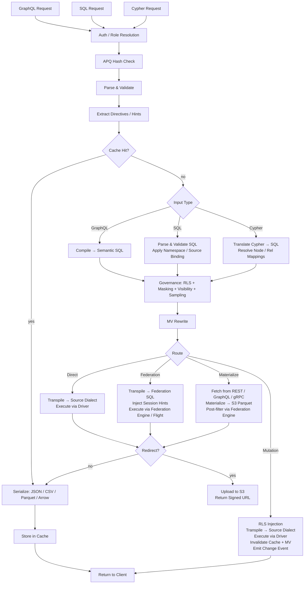

# Arquitectura de Provisa

## Visión general

Provisa es una plataforma de virtualización de datos controlada por configuración, diseñada específicamente para impulsar una capa semántica desde equipos pequeños hasta grandes empresas. Proporciona una API unificada sobre orígenes de datos heterogéneos con gobierno, seguridad y optimización de rendimiento. Los clientes consultan mediante SQL, GraphQL o Cypher; las tres son interfaces de primera clase con el mismo gobierno aplicado. (REQ-002, REQ-038)

La distinción de la capa semántica es importante. Para agregar contenido a la capa semántica, se deben crear nuevos orígenes de datos o agregados dentro de la capa de virtualización de datos. Esto crea una separación limpia: no se pueden hacer adiciones nuevas a la semántica fuera de la plataforma, lo que permite un verdadero gobierno de datos. (REQ-136) La aplicación se realiza a nivel del compilador: el catálogo de relaciones aprobado es la fuente de verdad sin importar qué lenguaje de consulta se utilice. (REQ-002)

Provisa está diseñado para ser altamente eficiente en necesidades operativas y altamente escalable para necesidades analíticas empresariales. Una única plataforma atiende ambos casos sin sacrificar velocidad ni escalabilidad.

```text
Config YAML → PG Metadata → Federation Catalogs
                               ↓
         Federation engine metadata → Schema Generator → SDL / SQL catalog / Cypher labels / gRPC proto (per role)
                                     ↓
                     Query → Parser → SQL Compiler → Transpiler
                                     ↓
                             Router (Smart Dispatch)
                         /           |            \
                    Federation  Direct PG      Direct MySQL/etc.
                         \           |            /
                              Executor Pool
                                     ↓
                         ┌───── Inline ─────┐     ┌──── Redirect ────┐
                         │  JSON (HTTP)     │     │  CTAS → S3       │
                         │  Arrow (Flight)  │     │  (Parquet, ORC)  │
                         │  Protobuf (gRPC) │     │  Provisa → S3    │
                         └─────────────────-┘     │  (JSON, CSV, …)  │
                                                  └─────────────────-┘
```

## Interfaces de consulta

Cada interfaz es un transporte distinto. Las cuatro aplican el mismo pipeline de seguridad (RLS, enmascaramiento, muestreo, verificaciones de rol). (REQ-002, REQ-038) Los clientes nunca se comunican directamente con el motor de federación. (REQ-266) El "lenguaje de consulta" (SQL / GraphQL / Cypher) es ortogonal al transporte: varios lenguajes pueden llegar por el mismo transporte.

| Port | Transport | Accepted query languages | Use case |
| ------ | ----------- | -------------------------- | ---------- |
| 8001 | HTTP | GraphQL, SQL, Cypher | Web clients, BI tools, curl, REST consumers |
| 8815 | Arrow Flight (gRPC) | SQL (via Arrow Flight SQL) | Data tools (Pandas, DuckDB, Spark, ADBC) |
| 50051 | Protobuf gRPC | Per-role generated proto RPCs | Service-to-service with typed contracts |
| configurable¹ | PostgreSQL wire protocol (pgwire) | SQL | psql, DBeaver, SQLAlchemy, any PG-compatible client |

¹ Defina `PROVISA_PGWIRE_PORT` (p. ej., 5433). Deshabilitado si no está definido o es `0`.

### HTTP (puerto 8001)

Múltiples endpoints bajo el mismo puerto, distinguidos por ruta:

| Path | Language | Notes |
| ------ | ---------- | ------- |
| `POST /data/graphql` | GraphQL | Reads and mutations; APQ hash accepted via `extensions.persistedQuery` |
| `POST /data/sql` | SQL | Read-only; no capability gate — governed by object visibility + RLS + masking (REQ-001, REQ-267) |
| `POST /data/query` | Cypher | Read-only; standard role |
| `GET /data/nl` | Natural language | Translates to SQL/GraphQL/Cypher based on source type |
| `GET /data/subscribe/{table}` | GraphQL | SSE subscription stream |
| `GET /neo4j/...` | Cypher (Neo4j compat) | Neo4j HTTP API compatibility shim |
| `POST /admin/graphql` | GraphQL | Admin API (superuser/admin role required) |

Todas las rutas devuelven JSON por defecto. `Accept: text/csv`, `application/vnd.apache.parquet`, `application/vnd.apache.arrow.stream` y `application/octet-stream` (binario sin procesar) se admiten mediante negociación de contenido. Los resultados que superan el umbral de tamaño configurado se redirigen automáticamente a una URL firmada de S3. (REQ-029, REQ-137)

### Arrow Flight (puerto 8815)

Transporte columnar nativo de Arrow sobre gRPC. (REQ-045, REQ-143) Los clientes envían un ticket JSON:

```json
{"query": "SELECT name, email FROM customers", "role": "analyst"}
```

y reciben RecordBatches de Arrow transmitidos de forma diferida. Cuando el proxy Zaychik de Arrow Flight SQL está disponible, los datos fluyen como un flujo de lotes de registros de Arrow de extremo a extremo: (REQ-144)

```text
Client ←(Arrow batches)← Provisa Flight Server ←(Arrow batches)← Zaychik ←(JDBC)← Federation Engine
```

El resultado completo nunca se materializa en la memoria de Provisa: los lotes se reenvían a medida que llegan. (REQ-145) Esto hace de Arrow Flight una ruta sin límite, adecuada para resultados arbitrariamente grandes.

### Protobuf gRPC (puerto 50051)

`.proto` autogenerado a partir del esquema de datos, generado por rol. (REQ-525) Consultas en flujo (streaming) (un mensaje por fila), mutaciones unarias. Reflexión del servidor habilitada. (REQ-526) El rol se transmite mediante la clave de metadatos `x-provisa-role`.

### Protocolo de cable de PostgreSQL / pgwire (puerto configurable)

Implementa el protocolo de cable frontend/backend de PostgreSQL usando la biblioteca `buenavista`. (REQ-527) Cualquier cliente compatible con PostgreSQL (`psql`, DBeaver, SQLAlchemy con `psycopg2`, JDBC) puede conectarse sin modificaciones. Solo acepta SQL. El pipeline de gobierno completo (RLS, enmascaramiento, permisos de dominio) se aplica de manera idéntica a las conexiones pgwire. (REQ-266, REQ-002) Se habilita configurando `PROVISA_PGWIRE_PORT` en un puerto distinto de cero.

## Pipeline de solicitudes

Se aceptan tres lenguajes de consulta. Todos convergen en el gobierno después de sus respectivos pasos de análisis/compilación. (REQ-262, REQ-263) Solo GraphQL admite escrituras. (REQ-037) No hay una compuerta de capacidad sobre la consulta en sí: cualquier identidad autenticada puede consultar en cualquier lenguaje, y los datos se gobiernan únicamente mediante visibilidad de objetos, RLS y enmascaramiento. (REQ-001)

| Interface | Reads | Writes | Query gate |
| --- | --- | --- | --- |
| GraphQL (`/data/graphql`) | Yes | Yes (mutations) | None — data-layer governance only |
| SQL (`/data/sql`) | Yes | No | None — data-layer governance only (REQ-267) |
| Cypher (`/data/query`) | Yes | No | None — data-layer governance only |



**Decisiones de enrutamiento:**

| Route | When |
| --- | --- |
| **Cache** | Result cache hit — evaluated first, serves the stored result with no execution (REQ-865) |
| **Cheap-count** | `count(*)`-shaped query over an unmaterialized source that exposes an exact native count — routed to the native count call instead of materializing to count (REQ-875) |
| **Direct** | Single source + has native driver + has federation connector |
| **Federation** | Multi-source federation, or source has connector but no driver |
| **Materialize** | Source has no federation connector — fetch and cache to S3/PG first |
| **Mutation** | GraphQL mutation — always direct, never federated |

El enrutamiento consume la salida de la etapa de optimización posterior al gobierno, nunca el SQL gobernado previo a la optimización. El gobierno puede AGREGAR orígenes (predicados de subconsulta RLS); la etapa de optimización puede ELIMINARLOS (incorporación de VALUES-CTE para tablas activas, reescrituras de caché de API, poda de ramas de unión). Por lo tanto, una consulta federada que se reduce a un único origen activo tras la incorporación se vuelve a enrutar como directa. (REQ-863)

### Consultas de raíz múltiple

Las consultas GraphQL con varios campos raíz (p. ej., `{ orders { id } customers { name } }`) se compilan en consultas SQL independientes y se ejecutan por separado. (REQ-534) Las solicitudes SQL y Cypher son de raíz única por definición. Los resultados se combinan en una sola respuesta:

- Los campos por debajo del umbral de redirección se devuelven en línea en `data`
- Los campos por encima del umbral se redirigen, con entradas por campo en `redirects`
- Los formatos binarios (Parquet, Arrow) solo se admiten para consultas de raíz única

## Rutas de ejecución de federación

| Path | Transport | Via | When used |
| ------ | ----------- | ----- | ----------- |
| REST | federation engine client (HTTP :8080) | Direct query | Default, always available |
| Flight SQL | `adbc-driver-flightsql` (gRPC :8480) | Zaychik proxy → JDBC | When Zaychik is running |
| CTAS | federation engine client (HTTP :8080) | Direct write, Iceberg to S3 | Parquet/ORC redirect |

### Proxy Zaychik de Arrow Flight SQL

El motor de federación no admite de forma nativa el protocolo Arrow Flight SQL. [Zaychik](https://github.com/Raiffeisen-DGTL/zaychik-trino-proxy) es un proxy Java que implementa la interfaz gRPC de Arrow Flight SQL, traduce las solicitudes a consultas JDBC y transmite los resultados de vuelta como lotes de registros de Arrow. (REQ-144)

```text
ADBC client → gRPC :8480 → Zaychik → JDBC :8080 → Federation Engine → results → Arrow batches → client
```

El servidor Flight de Provisa (puerto 8815) se conecta a Zaychik como cliente ADBC, lo que permite la transmisión de Arrow de extremo a extremo sin materializar los resultados. (REQ-145)

### Catálogo de resultados Iceberg

La redirección CTAS usa un conector Iceberg (catálogo `results`) respaldado por un catálogo JDBC en la instancia de PostgreSQL existente. (REQ-169) Iceberg escribe archivos Parquet/ORC directamente en MinIO/S3 mediante el sistema de archivos nativo de S3 (`fs.native-s3.enabled=true`).

## Motores de federación

Provisa selecciona un motor de federación en el arranque mediante la variable de entorno `PROVISA_ENGINE`, la configuración persistida de la UI de administración, o el valor predeterminado. Cuando no se configura nada, DuckDB es el predeterminado: totalmente en proceso, sin servicio externo (REQ-989). Consulte [Configuración](configuration.md#motor-de-federacion) para conocer los detalles de selección.

Cada motor es una instancia de `FederationEngine` definida en `provisa/federation/engine.py`. La instancia posee una colección de conectores que determina qué tipos de origen puede leer el motor en vivo (ATTACH) frente a cuáles deben aterrizar primero en el almacén de materialización del motor. [tool-verified: `engine.py` `_ENGINE_BUILDERS`, `ENGINE_REGISTRY`]

### Clases de driver (REQ-840) [tool-verified: `engine.py` `DriverClass`]

| Class | Meaning | Examples |
| ------- | --------- | --------- |
| `BROAD` | Reaches many external source types via native connectors | Trino |
| `PARTIAL` | Reaches a subset (relational, files, cloud object/lake) plus lands everything else | DuckDB, PostgreSQL, ClickHouse, Databricks, Snowflake, BigQuery, Fabric, Synapse |
| `SELF_ONLY` | Reaches only its own store; every other source lands in | SQLAlchemy |

### Motores disponibles [tool-verified: `engine.py` `_ENGINE_BUILDERS`]

| Engine key | Dialect | MPP | External-link mechanism | Auth |
| ----------- | --------- | ----- | ------------------------ | ------ |
| `trino` / `trino-byo` | Trino SQL | Yes | Trino catalogs (broad connector set) | JDBC credentials |
| `pg` | PostgreSQL | No | FDW / pg_duckdb | PostgreSQL credentials |
| `duckdb` | DuckDB | No | Extension-native ATTACH | None (in-process) |
| `clickhouse` / `clickhouse-server` | ClickHouse | Yes (shards) | S3 / IcebergS3 / DeltaLake table engines (REQ-986) | ClickHouse credentials |
| `snowflake` | Snowflake | Yes | External stage + external table (REQ-988) | `PROVISA_ENGINE_URL` |
| `databricks` | Databricks SQL | Yes | Unity Catalog external tables via REST (REQ-987) | Bearer token (`http_path` in `federation_hints`) |
| `bigquery` | BigQuery | Yes (Dremel) | BigQuery external / BigLake tables | `GOOGLE_APPLICATION_CREDENTIALS` service-account key |
| `fabric` | T-SQL | Yes | OneLake shortcuts → OPENROWSET | Azure AD (`az login` / managed identity) |
| `synapse` | T-SQL | Yes | ADLS OPENROWSET / external tables | Azure AD |
| `sqlalchemy` | Any SQLAlchemy dialect | No | None (land-only) | Per-dialect credentials |

### Predeterminado sin configuración: DuckDB (REQ-989) [tool-verified: `engine.py` `build_duckdb_engine`, `_embedded_duckdb_materialize_default`]

Cuando `PROVISA_ENGINE` no está definido, Provisa usa el motor DuckDB totalmente embebido en proceso. El almacén de materialización de DuckDB es un archivo DuckDB embebido en `$PROVISA_DATA_DIR/materialize.duckdb` (por defecto, `~/.provisa/materialize.duckdb`). No se requiere ninguna base de datos ni servicio externo.

Debido a que DuckDB obliga a un único escritor por archivo, `store_connection.py` escribe en el almacén embebido a través de la propia conexión del motor, nunca mediante una segunda conexión independiente. Este es el único caso en que el motor y el almacén de materialización comparten un descriptor de archivo por diseño. [tool-verified: `store_connection.py` module docstring]

### Transporte de lectura nativo de Arrow (REQ-986, REQ-987, REQ-988) [tool-verified: `engine.py` `build_*_engine` `capabilities=`]

ClickHouse, DuckDB, Snowflake, Databricks, BigQuery, Fabric y Synapse anuncian todos `EngineCapability.ARROW` y `EngineCapability.ARROW_STREAM`. Las consultas contra estos motores devuelven RecordBatches de Arrow directamente: la ruta de serialización por fila se omite por completo. El servidor Flight transmite esos lotes a los clientes sin materializar el resultado completo en la memoria de proceso de Provisa. Para Trino, la transmisión de Arrow depende del proxy Zaychik; para los motores de almacén de datos, la API nativa de Arrow del propio motor (Cloud Fetch para Databricks, Storage Read API para BigQuery, `fetch_arrow_table` para DuckDB y Snowflake) alimenta el flujo Flight.

### Enlaces de datos externos (ATTACH) [tool-verified: `engine.py` `_warehouse_connectors`]

Cada motor de almacén de datos puede escanear datos de objetos/lagos en la nube in situ sin aterrizar una copia. Los archivos Parquet, CSV, Iceberg y Delta Lake en S3, GCS o OneLake se adjuntan directamente al motor como si fueran tablas nativas. La estrategia (ATTACH para escanear in situ, o LAND para copiar en el almacén) la determina el `Mechanism` declarado del conector; no existe ramificación específica por motor en el planificador. Un conector `Mechanism.ATTACH_R` activa un escaneo sin copia; un conector `Mechanism.DIRECT` o la ausencia de conector activa un aterrizaje. [tool-verified: `connector_base.py` `Mechanism`, `engine.py` `_warehouse_connectors`]

Attach aprovisiona automáticamente todos los prerrequisitos en el momento de adjuntar:

| Engine | Object/lake formats | Mechanism | Auto-provisioning [tool-verified] |
| -------- | ------------------- | ---------- | ---------------------------------- |
| Databricks | parquet, csv, iceberg, delta_lake | UC external table (`ATTACH_R`) | REST installs Unity Catalog storage credential + external location, then `CREATE TABLE … USING <format> LOCATION …` — live-verified over Cloudflare R2 |
| BigQuery | parquet, csv, json, iceberg, delta_lake | BigQuery external / BigLake table (`ATTACH_R`) | `CREATE OR REPLACE EXTERNAL TABLE … OPTIONS(format=…, uris=[…])` — live-verified |
| ClickHouse | csv, parquet, iceberg, delta_lake | S3 / IcebergS3 / DeltaLake table engine (`ATTACH_R`) | Validation probe executed at attach time — live-verified over Cloudflare R2 |
| Fabric | parquet, csv, iceberg, delta_lake | OneLake shortcut → OPENROWSET (`ATTACH_R`) | REST creates an `AmazonS3Compatible` connection + lakehouse + shortcut; returns the OneLake `BULK` path — live-verified reading R2 through Fabric |
| Snowflake | parquet, csv, json, iceberg, delta_lake | External stage + external table (`ATTACH_R`) | `CREATE STAGE … URL=… CREDENTIALS=…`, then `CREATE OR REPLACE EXTERNAL TABLE … LOCATION=@stage FILE_FORMAT=(TYPE=…)` — implemented; not live-tested (no account available) |

Las credenciales para el almacenamiento en la nube viajan en el `federation_hints` del origen (consulte [Sources](sources.md#almacenes-de-datos-como-origenes-con-nombre)). Cualquier tipo de origen que no pueda hacer ATTACH aterriza primero en el almacén de materialización del motor.

### Escrituras de materialización columnar (REQ-990) [tool-verified: `core/database.py:436`, `store_connection.py:99`]

`Connection.bulk_copy` en `provisa/core/database.py` elige la ruta de ingesta masiva más rápida según el dialecto del almacén: `COPY` binario (`copy_records_to_table` de asyncpg) para almacenes PostgreSQL, y una única sentencia preparada `executemany` para el resto de almacenes relacionales. El almacén embebido de DuckDB aterriza a través de `land_duckdb_native` en `store_connection.py`: una única llamada `executemany` para todo el lote, nunca un bucle por fila.

## Redirección de resultados grandes

Los resultados que superan un umbral de filas se redirigen a almacenamiento compatible con S3 (MinIO) en lugar de devolverse en línea. (REQ-029)

### Modos de redirección

| Mode | How it works | Data touches Provisa? |
| ------ | ------------- | ---------------------- |
| **CTAS** (Parquet, ORC) | Federation engine writes directly to S3 via `CREATE TABLE AS SELECT` | No |
| **Provisa upload** (JSON, NDJSON, CSV, Arrow IPC) | Provisa serializes and uploads via boto3 | Yes |

Para los formatos nativos de CTAS, Provisa nunca maneja los datos: el motor de federación escribe los archivos directamente en MinIO/S3. (REQ-138) Esta es la ruta preferida para exportaciones analíticas grandes.

### Encabezados de redirección

| Header | Effect |
| -------- | -------- |
| `X-Provisa-Redirect-Format: <mime>` | Redirect in this format (implies force unless threshold set) |
| `X-Provisa-Redirect-Threshold: N` | Only redirect if result exceeds N rows |
| `X-Provisa-Redirect: true` | Force redirect using default format |

Estos encabezados implementan la redirección controlada por el cliente. (REQ-137)

**Respuesta:**

```json
{
  "data": {"orders": null},
  "redirect": {
    "redirect_url": "https://minio:9000/provisa-results/results/abc.parquet?...",
    "row_count": 50000,
    "expires_in": 3600,
    "content_type": "application/vnd.apache.parquet"
  }
}
```

### Configuración del servidor

| Env var | Default | Purpose |
| --------- | --------- | --------- |
| `PROVISA_REDIRECT_ENABLED` | `false` | Enable server-side threshold redirect |
| `PROVISA_REDIRECT_THRESHOLD` | `1000` | Default row count threshold |
| `PROVISA_REDIRECT_FORMAT` | `parquet` | Default redirect format |
| `PROVISA_REDIRECT_BUCKET` | `provisa-results` | S3 bucket name |
| `PROVISA_REDIRECT_ENDPOINT` | | S3-compatible endpoint URL |
| `PROVISA_REDIRECT_TTL` | `3600` | Presigned URL TTL (seconds) |

## Árbol de decisión de enrutamiento

```text
Multi-source query? → Federation engine
NoSQL source (MongoDB, Cassandra)? → Federation engine
Uses path columns on non-PG source? → Federation engine
Single RDBMS with driver? → Direct (sub-100ms target)
Single RDBMS without driver? → Federation engine
Steward hint "federated"? → Federation engine (override)
Steward hint "direct"? → Direct (if possible)
Redirect to Parquet/ORC? → Federation engine (CTAS, regardless of source count)
```

(REQ-027, REQ-028, REQ-030, REQ-279)

## Optimización de consultas de federación

Provisa prepara automáticamente el optimizador basado en costos del motor de federación para que los planes de consulta entre orígenes se basen en la distribución real de los datos, no en valores predeterminados fijos.

### Estadísticas automáticas (`ANALYZE`)

Al registrar un origen, Provisa ejecuta `ANALYZE catalog.schema.table` para cada tabla publicada. (REQ-275) Esto recopila:

- Recuento de filas
- Por columna: fracción de nulos, recuento de valores distintos, mín/máx, histogramas (según el conector)

El optimizador usa estos datos para estimar la selectividad de las consultas filtradas. Sin estadísticas, recurre a valores predeterminados fijos (p. ej., 10 % de selectividad para predicados de igualdad), que producen planes de unión deficientes en datos sesgados o de alta cardinalidad. Con estadísticas, las estimaciones son lo suficientemente precisas para tomar decisiones correctas de unión por difusión (broadcast) frente a particionada en la mayoría de las cargas de trabajo.

**Cobertura**: el soporte de estadísticas varía según el conector. PostgreSQL, MySQL, Hive, Iceberg y Delta Lake admiten `ANALYZE` completamente. Los conectores de MongoDB y Cassandra tienen soporte parcial o nulo. Provisa absorbe los fallos de `ANALYZE` de forma silenciosa: el registro nunca se bloquea. (REQ-275)

**Límites de selectividad**: las estadísticas proporcionan estimaciones por columna. Para predicados correlacionados (`WHERE region = 'US' AND city = 'Seattle'`), el optimizador asume independencia entre columnas, lo que puede subestimar el recuento de filas. Esta es una limitación conocida de las estadísticas a nivel de columna en todos los optimizadores basados en costos.

**Orígenes API**: las tablas `api_cache_{table_name}` en PostgreSQL se analizan automáticamente después de cada ciclo de actualización de caché, de modo que el optimizador dispone de estimaciones de filas actuales al unir orígenes respaldados por API con orígenes relacionales. (REQ-280)

### Administración: actualizar estadísticas

Vuelva a ejecutar la recopilación de estadísticas bajo demanda mediante la API de administración: (REQ-276)

```graphql
mutation {
  refreshSourceStatistics(sourceId: "sales-pg") {
    tablesAnalyzed
    failures { table message }
  }
}
```

Útil cuando un origen ha recibido datos nuevos significativos desde su registro.

## Vistas materializadas

Las MV optimizan de manera transparente las consultas costosas precalculando y almacenando en caché los resultados.

### Relaciones como sugerencias de MV

Una declaración de relación no es solo un artefacto de gobierno: también es la descripción estructural de una forma de unión (join). Esa forma es exactamente lo que necesita el optimizador de MV: dos tablas, dos columnas, un tipo de unión. Esto significa que una relación puede impulsar directamente la materialización.

Para **relaciones entre orígenes**, esto sucede automáticamente en el arranque: cada relación con `materialize: true` cuyas patas caen en más de un origen genera una MV `JoinPattern` (`auto-mv-<rel_id>`). (REQ-158) No se requiere configuración de MV independiente. Cuando el compilador detecta esa unión en una consulta, el reescritor sustituye el resultado premateializado de forma transparente. Las relaciones dentro de un mismo origen no generan nada — esos JOIN ya son rápidos mediante ejecución directa. (REQ-159) [tool-verified: `provisa/api/app_loaders.py`]

Una **relación respaldada por una tabla de unión (junction)** materializa su recorrido en lugar de una unión directa: la tabla asociativa es una tercera pata, de modo que el patrón lleva el salto de origen, el salto de la tabla de unión y el discriminador que fija el conjunto de filas a un único tipo de arista, con las columnas propias de la tabla de unión aterrizando en la vista junto a las del destino. (REQ-1586) Como la tabla de unión cuenta como pata, una arista cuya tabla de unión reside en un origen distinto al de las dos tablas que enlaza es entre orígenes aunque esas dos coincidan. El reescritor empareja los dos saltos como una cadena — el segundo debe partir del alias que introdujo el primero — así que una consulta que llega a esas mismas dos tablas sin pasar por la tabla de unión lee las tablas base, y una vista construida para un valor de discriminador nunca responde a un recorrido filtrado por otro.

La consecuencia práctica: los stewards que aprueban una relación están decidiendo implícitamente si la unión es una buena candidata para materialización. El acto de gobierno y la sugerencia de optimización son la misma declaración.

### Modos

| Mode | Config | Behavior |
| ------ | -------- | ---------- |
| **Join-pattern** | `join_pattern` in MV config | Rewrites matching JOINs to read from MV table |
| **Custom SQL** | `sql` in MV config | Arbitrary SELECT, optionally exposed in SDL |
| **Auto-materialized relationship** | cross-source relationship (automatic) | Auto-generates a join-pattern MV; no config required |
| **Steward-materialized relationship** | `materialize: true` on same-source relationship | Explicit opt-in for hot same-source join paths |

### Materialización automática

Los JOIN entre orígenes son las consultas más costosas (siempre federadas). Las relaciones entre orígenes generan automáticamente definiciones de MV en el arranque: (REQ-158)

```yaml
relationships:
  - id: orders-to-reviews
    source_table_id: orders        # sales-pg
    target_table_id: product_reviews  # reviews-mongo
    source_column: product_id
    target_column: product_id
    cardinality: one-to-many
    materialize: true              # auto-create MV
    refresh_interval: 600          # refresh every 10 minutes
```

Solo las relaciones entre orígenes generan MV (los JOIN del mismo origen ya son rápidos mediante ejecución directa). (REQ-159) La MV comienza en estado `STALE` y el bucle de actualización en segundo plano la actualiza antes de que el optimizador de consultas la utilice. (REQ-160)

### Ciclo de vida de actualización

```text
STALE → (refresh loop picks up) → REFRESHING → FRESH
  ↑                                                |
  └──── mutation hits source table ────────────────┘
```

El bucle de actualización se ejecuta cada 30 segundos, verifica `get_due_for_refresh()` y ejecuta `CREATE TABLE AS SELECT` (primera ejecución) o `DELETE + INSERT` (ejecuciones posteriores) contra la tabla de destino de la MV a través del motor de federación. (REQ-160, REQ-234)

## Mapa de módulos

| Module | Purpose |
| -------- | --------- |
| `api/` | FastAPI app, routers, middleware, lifespan management |
| `api/flight/` | Arrow Flight server (gRPC, port 8815) |
| `api/admin/` | Strawberry GraphQL admin API — config, discovery, views |
| `api/rest/` | Auto-generated REST endpoints from registered tables |
| `api/jsonapi/` | Auto-generated JSON:API endpoints with pagination and error handling |
| `api/data/subscribe.py` | SSE subscriptions — LISTEN/NOTIFY, polling, Debezium CDC |
| `compiler/` | GraphQL/SQL parsers, semantic SQL generator, RLS, masking, sampling, two-stage governance (`stage2.py`) |
| `cypher/` | Cypher → SQL translator, parser, label map (REQ-351), write translator for Cypher mutations |
| `pgwire/` | PostgreSQL wire-protocol server; `catalog.py` intercepts pg_catalog/information_schema for per-role object visibility (REQ-527, REQ-883, REQ-891) |
| `vector/` | Vector search — model registry, embedding providers (openai/ollama/huggingface), `cosine_similarity()` translation, pgvector fallback cache, declarative embedding generation (REQ-419–431) |
| `compiler/federation.py` | Apollo Federation v2 subgraph support |
| `transpiler/` | Dialect transpilation, routing logic |
| `executor/` | Federated/direct execution, serialization, output formats |
| `executor/drivers/` | Direct source drivers (PostgreSQL, MySQL, DuckDB, Snowflake, Databricks, ClickHouse, …) |
| `executor/trino_flight.py` | ADBC Flight SQL client for the federation engine |
| `executor/ctas_write.py` | CTAS-based redirect (federation engine writes to S3) |
| `executor/redirect.py` | S3 redirect logic, Provisa-side upload |
| `federation/engine.py` | `FederationEngine`, `DriverClass`, `_ENGINE_BUILDERS`, `ENGINE_REGISTRY`, `build_engine` |
| `federation/connector.py` | Connector abstractions — Trino, ClickHouse; `Mechanism`, `WarehouseNativeConnector` |
| `federation/connector_duckdb.py` | DuckDB and PostgreSQL FDW connector definitions |
| `federation/snowflake_connectors.py` | Snowflake external stage + external table ATTACH connectors (REQ-988) |
| `federation/databricks_connectors.py` | Databricks UC external table ATTACH connectors (REQ-987) |
| `federation/bigquery_connectors.py` | BigQuery external / BigLake ATTACH connectors |
| `federation/databricks_uc.py` | Unity Catalog credential + external location auto-provisioning |
| `federation/databricks_backend.py` | Databricks SQL warehouse execution backend |
| `federation/snowflake_backend.py` | Snowflake execution backend |
| `federation/bigquery_backend.py` | BigQuery execution backend (Storage Read API Arrow transport) |
| `federation/mssql_warehouse_backend.py` | Fabric Warehouse + Synapse execution backends (T-SQL over ODBC) |
| `federation/mssql_warehouse_connectors.py` | OPENROWSET ATTACH connectors for Fabric / Synapse |
| `federation/fabric_shortcuts.py` | OneLake shortcut auto-provisioning (connection → lakehouse → shortcut) |
| `federation/clickhouse_backend.py` | ClickHouse execution backend |
| `federation/duckdb_backend.py` | DuckDB in-process execution backend |
| `federation/pg_backend.py` | PostgreSQL execution backend |
| `federation/store_connection.py` | DuckDB-native materialization store write face (REQ-989, REQ-990) |
| `registry/` | Persisted query registry, governance |
| `security/` | Visibility, rights, column masking |
| `cache/` | Redis-backed query result caching (hot tier) |
| `mv/` | Materialized view registry, refresh, SQL rewriter |
| `events/` | Dataset change events and trigger dispatch |
| `webhooks/` | Outbound webhook execution for mutations and events |
| `scheduler/` | APScheduler-based background job management — cron and interval triggers that fire webhooks, mutations, or Kafka sink publishes |
| `apq/` | Apollo APQ wire protocol — Redis-backed query hash cache; separate from result caching |
| `compiler/cursor.py` | Relay-style cursor pagination — `first`/`after`/`last`/`before` arguments and `pageInfo` generation on all list queries |
| `compiler/aggregate_gen.py` | Auto-generated `{table}_aggregate` query types with `count`, `sum`, `avg`, `min`, `max` sub-fields and filtered `nodes` access |
| `compiler/enum_detect.py` | Enum type auto-detection — PostgreSQL native enum types (`pg_enum`) exposed as GraphQL enum types rather than string scalars |
| `compiler/hints.py` | Federation performance hints — query-level routing directives embedded as SQL comments (`/* @provisa route=federated */`) that override automatic routing |
| `compiler/mutation_gen.py` | Mutation compiler; column presets — server-side static or session-variable values applied on insert/update, not exposed in the mutation input type |
| `auth/approval_hook.py` | ABAC approval hook — pluggable external authorization called before query execution; webhook, gRPC, and unix_socket transports; per-table/source/global scope; configurable fallback policy |
| `subscriptions/` | SSE subscription state and delivery |
| `discovery/` | LLM relationship discovery (Claude API) |
| `grpc/` | Proto generation, gRPC server, reflection |
| `api_source/` | REST/GraphQL/gRPC API sources with PG cache |
| `kafka/` | Kafka topic sources, sink, Schema Registry |
| `auth/` | Pluggable auth providers, middleware, role mapping |
| `core/` | Config, models, DB, repositories, secrets; role model supports `parent_role_id` and `flatten_roles()` for recursive role inheritance |
| `hasura_v2/` | Hasura v2 metadata → Provisa config converter |
| `ddn/` | Hasura DDN supergraph → Provisa config converter |
| `mongodb/` | MongoDB source connector |
| `elasticsearch/` | Elasticsearch source connector |
| `cassandra/` | Cassandra source connector |
| `prometheus/` | Prometheus metrics source connector |
| `source_adapters/` | Generic adapter layer for source connections |

## API de administración

La API GraphQL de administración de Strawberry está montada en `/admin/graphql` (puerto HTTP 8001). Es independiente del endpoint GraphQL de datos y requiere rol de superusuario o administrador.

| Capability | Description |
| ----------- | ------------- |
| Config download/upload | Export or replace the full Provisa YAML config |
| Relationship editor | Create, update, delete relationship definitions |
| AI FK discovery | Trigger Claude-powered FK candidate analysis |
| Schema introspection | Browse published tables, columns, and roles |
| View management | Register and manage materialized view definitions |

(REQ-164, REQ-165, REQ-166, REQ-167)

## Configuración de modelos de IA

`GET /admin/ai-models` y `PUT /admin/ai-models` configuran el pipeline de LLM para cada organización. (REQ-464, REQ-419, REQ-500, REQ-370, REQ-1349)

La configuración tiene **alcance de organización**: las elecciones de cada organización se superponen a la configuración del despliegue y surten efecto en la siguiente solicitud, sin necesidad de reiniciar. (REQ-1349) [tool-verified: `provisa/api/admin/ai_models_router.py:38-39`]

**Asignaciones de modelo por operación.** Cinco operaciones de lenguaje natural (NL) tienen cada una un proveedor y una cadena de modelo configurables:

| Operation | What it drives |
| --------- | -------------- |
| `table_description` | Descripciones de tabla generadas por LLM |
| `column_description` | Descripciones de columna generadas por LLM |
| `relationship_inference` | Descubrimiento de candidatos de clave foránea |
| `sql_generation` | Generación de NL → SQL |
| `table_selection` | Elección de qué tablas incluir en el prompt de NL |

El campo de proveedor acepta cualquier proveedor compatible con `aisuite` (`anthropic`, `openai`, `groq`, `mistral`, `cohere`, entre otros) o un endpoint local (`ollama`, `lmstudio`). Una cadena de modelo en blanco elimina la anulación de la organización y revierte al valor predeterminado del despliegue. [tool-verified: `provisa/api/admin/ai_models_router.py:29-35`, `provisa-ui/src/components/admin/AiModelsTab.tsx:43-60`]

**Límite de tasa de NL.** Un tope opcional de solicitudes por período aplicado por rol. Las solicitudes que exceden el límite devuelven `429` con `Retry-After`. [tool-verified: `provisa-ui/src/components/admin/AiModelsTab.tsx:306-313`]

**Registro de modelos vectoriales.** Una lista de modelos de embedding (campos: `id`, `provider`, `dimensions`, opcionalmente `api_key_env` y `base_url`, indicador `enabled`). Reemplazo de lista completa: cada entrada debe tener `id`, `provider` y `dimensions`, o la escritura se rechaza con `400`. [tool-verified: `provisa/api/admin/ai_models_router.py:122-131`]

**Claves de API.** Las claves de API de LLM por proveedor se almacenan cifradas mediante `provisa.core.org_secrets` (véase más abajo). La respuesta de `GET` solo informa si hay una clave configurada para cada proveedor; el valor nunca se devuelve. Enviar una cadena en blanco para un proveedor borra esa clave, revirtiendo las llamadas LLM de ese proveedor a la credencial de variable de entorno del despliegue. (REQ-1395, REQ-1398) [tool-verified: `provisa/api/admin/ai_models_router.py:76-78`, `provisa/api/admin/ai_models_router.py:149-165`]

## Secretos cifrados por organización

`provisa/core/org_secrets.py` almacena credenciales que nunca deben aparecer en texto plano en la base de datos. Actualmente restringido a las claves de API de proveedores de LLM (`{vendor}_api_key`). (REQ-1395, REQ-1398) [tool-verified: `provisa/core/org_secrets.py`]

Los valores se cifran mediante el `encryption_service` a nivel de proceso de `provisa.encryption.runtime`, el mismo mecanismo que `api_sources.auth`. [tool-verified: `provisa/core/org_secrets.py:16-17`]

Se admiten doce proveedores compatibles con `aisuite`: `anthropic`, `openai`, `cohere`, `groq`, `mistral`, `xai`, `deepseek`, `together`, `fireworks`, `nebius`, `sambanova` e `inception`. Google, AWS y Azure quedan excluidos porque requieren configuración más allá de una simple clave de API (IDs de proyecto, roles de IAM, región). Los proveedores de endpoint local (`ollama`, `lmstudio`) no tienen clave y quedan excluidos por la misma razón. [tool-verified: `provisa/core/org_secrets.py:33-53`]

Pasar `value=None` a `write_org_secret` elimina la fila. Los llamadores que leen un secreto lo consumen de inmediato (p. ej., para construir un cliente LLM) y no deben reflejarlo en ninguna respuesta de la API. [tool-verified: `provisa/core/org_secrets.py:97-117`]

## Endpoints REST y JSON:API autogenerados

Las tablas registradas se exponen como endpoints REST y JSON:API junto con la interfaz GraphQL. (REQ-256, REQ-257)

| Interface | Mount path | Spec |
| ----------- | ----------- | ------ |
| REST | `/rest/<table-id>` | Simple GET/POST with query parameters |
| JSON:API | `/jsonapi/<table-id>` | [jsonapi.org](https://jsonapi.org) compliant — pagination, relationships, error objects |

Estos endpoints aplican el mismo pipeline de seguridad (RLS, enmascaramiento, verificaciones de rol) que el endpoint GraphQL. (REQ-002, REQ-038)

## Suscripciones

Las suscripciones SSE se sirven en `GET /data/subscribe/{table}`. Tres modos de entrega: (REQ-258)

| Mode | Mechanism | When used |
| ------ | ----------- | ----------- |
| **LISTEN/NOTIFY** | PostgreSQL `LISTEN` on a channel | PG sources with mutation activity |
| **Polling** | Re-execute query on interval | Non-PG sources, or when CDC unavailable |
| **Debezium CDC** | Kafka topic from Debezium connector | High-frequency change streams |

(REQ-258, REQ-260, REQ-261)

El cliente recibe `text/event-stream` con un evento JSON por cada fila modificada o diferencia.

## Sistema de eventos y webhooks

Las mutaciones de base de datos (INSERT/UPDATE/DELETE) pueden desencadenar eventos salientes mediante los módulos `events/` y `webhooks/`. (REQ-172, REQ-173, REQ-220)

```text
Mutation executed → EventDispatcher → match event trigger rules
                                          ↓
                               WebhookExecutor → HTTP POST to configured URL
```

Los disparadores de eventos se definen en la configuración y se emparejan por tabla, tipo de operación y filtro de fila opcional. Las cargas útiles de webhook incluyen el tipo de operación, la fila modificada y el contexto de rol.

## Servicios en segundo plano

Cuatro bucles en segundo plano se inician durante el ciclo de vida de la aplicación (`api/app.py`):

| Service | Interval | Purpose |
| --------- | ---------- | --------- |
| MV refresh loop | 30 s | Polls `get_due_for_refresh()`, executes CTAS or DELETE+INSERT on stale MVs |
| Warm table manager | Configurable | Promotes frequently-queried tables to Iceberg local SSD cache |
| Hot table loader | Configurable | Loads small reference tables into in-memory cache for sub-millisecond access |
| API source poller | Per-source interval | Re-fetches and re-caches remote REST/GraphQL/gRPC sources |

(REQ-160, REQ-238, REQ-239, REQ-236)

### Niveles de caché de tablas activas/templadas

| Tier | Storage | Promotion criteria | Access latency |
| ------ | --------- | ------------------- | ---------------- |
| Hot | In-process memory | Row count < threshold, or is a relationship target | <1 ms |
| Warm | Iceberg on local SSD | Query frequency threshold exceeded | ~5–20 ms |
| Cold | Remote source | Default | 50–500 ms |

(REQ-230, REQ-236, REQ-238, REQ-241)

## Importación de metadatos (Hasura v2 / DDN)

Los despliegues existentes de Hasura pueden convertirse a configuración de Provisa sin reescritura manual. (REQ-182, REQ-183)

| Module | Input | Output |
| -------- | ------- | -------- |
| `hasura_v2/` | Hasura v2 `metadata.yaml` | Provisa `config.yaml` |
| `ddn/` | Hasura DDN supergraph JSON | Provisa `config.yaml` |

Ambos convertidores mapean tablas rastreadas, relaciones, permisos y esquemas remotos. El resultado es una configuración de Provisa completa lista para su despliegue. (REQ-182, REQ-183)

## Apollo Federation

`compiler/federation.py` expone Provisa como un subgrafo de Apollo Federation v2. (REQ-259) El SDL del subgrafo se autogenera a partir del esquema publicado con directivas `@key` en las columnas de clave primaria y anotaciones `@external`/`@provides` en las relaciones entre subgrafos. Provisa responde a las consultas `_entities` y `_service` requeridas por el gateway de federación. (REQ-259)

## Paginación basada en cursor

Todas las consultas de lista admiten paginación por cursor de estilo Relay mediante `compiler/cursor.py`. (REQ-218) Los clientes pasan argumentos `first`/`after` (hacia adelante) o `last`/`before` (hacia atrás). El compilador codifica la posición de la fila como un cursor opaco en base64 e inyecta las cláusulas `WHERE`/`LIMIT` apropiadas. Cada consulta de lista devuelve un objeto `pageInfo`:

| Field | Type | Description |
| ------- | ------ | ------------- |
| `hasNextPage` | Boolean | True if more results exist after this page |
| `hasPreviousPage` | Boolean | True if results exist before this page |
| `startCursor` | String | Cursor of the first node in this page |
| `endCursor` | String | Cursor of the last node in this page |

## Consultas de agregación

Cada tabla registrada obtiene un campo raíz `{table}_aggregate` autogenerado (`compiler/aggregate_gen.py`). (REQ-196) El tipo de agregación expone `count`, `sum`, `avg`, `min`, `max` por columna numérica, y `nodes` para acceso filtrado a filas con selección de campos completa (mismo RLS/enmascaramiento que la consulta base). (REQ-196, REQ-198) Las consultas de agregación son elegibles para enrutamiento por MV de agregación; consulte `mv/aggregate_catalog.py`. (REQ-198)

## Consultas persistidas automáticas (APQ)

`apq/cache.py` implementa el protocolo de cable APQ de Apollo. (REQ-288) Cuando un cliente envía solo un hash de consulta (`extensions.persistedQuery`), Provisa lo busca en Redis. (REQ-289) Si no lo encuentra, devuelve un error `PersistedQueryNotFound`; el cliente reintenta con el cuerpo completo de la consulta, que Provisa almacena. (REQ-288) Esto es independiente de la caché de resultados (`cache/`).

## Roles heredados

Los roles en `core/models.py` pueden referenciar un `parent_role_id`. (REQ-215) `flatten_roles()` resuelve de forma recursiva la cadena de herencia y combina las cláusulas WHERE de RLS (con AND), la visibilidad de columnas (unión, prevalece la más restrictiva) y las políticas de enmascaramiento (el hijo sobrescribe al padre por columna). Esto evita duplicar conjuntos de permisos entre roles similares (p. ej., `analyst` heredando de `reader`). (REQ-215)

## Gancho de aprobación ABAC

`auth/approval_hook.py` es un gancho de autorización enchufable invocado antes de la ejecución de la consulta, después de RLS y enmascaramiento. (REQ-203) Se integra con motores de políticas externos (OPA, servicios ABAC personalizados).

| Setting | Description |
| --------- | ------------- |
| Transport | `webhook` (HTTP POST), `grpc`, or `unix_socket` |
| Scope | Per-table, per-source, or global |
| Fallback policy | `allow` or `deny` when the hook endpoint is unreachable |

(REQ-246, REQ-247, REQ-204)

## Detección automática de tipos enumerados

`compiler/enum_detect.py` introspecciona los tipos enumerados nativos de PostgreSQL (`pg_enum`) en el momento de la generación del esquema. (REQ-221) Las columnas que usan un tipo enumerado definido por el usuario en PostgreSQL se promueven a tipos enumerados de GraphQL: sus valores se convierten en miembros del enum en lugar de escalares de cadena.

## Disparadores programados

`scheduler/jobs.py` usa APScheduler para ejecutar trabajos en segundo plano definidos como disparadores cron o de intervalo. (REQ-216) Cada trabajo puede hacer POST a una URL de webhook, ejecutar una mutación contra el endpoint de datos, o publicar resultados de consulta en un topic de Kafka. Los disparadores se configuran mediante la API de administración (mutaciones `scheduledTrigger`) o la clave `scheduled_triggers` en la configuración YAML. (REQ-216)

## Sugerencias de rendimiento de federación

`compiler/hints.py` analiza las sugerencias de steward incorporadas en las consultas como comentarios, usando la sintaxis de comentarios de Provisa. (REQ-279) El formato de la sugerencia varía según el lenguaje de consulta:

```graphql
# @provisa route=federated
{ orders { id amount } }
```

```sql
/* @provisa route=federated */
SELECT id, amount FROM orders
```

```cypher
// @provisa route=federated
MATCH (o:Order) RETURN o.id, o.amount
```

| Hint | Effect |
| ------ | -------- |
| `route=federated` | Force federation through the federation engine, bypassing direct-driver routing |
| `route=direct` | Force direct-driver execution |

(REQ-279, REQ-277, REQ-278)

## Presets de columnas en mutaciones

`compiler/mutation_gen.py` admite presets por columna del lado del servidor aplicados en `INSERT` o `UPDATE`. (REQ-214) Los presets no se incluyen en el tipo de entrada de mutación GraphQL generado: el compilador los inyecta de forma transparente. Tipos de preset: `static` (valor literal) o `session` (valor tomado de la sesión/encabezado de la solicitud, p. ej. `x-hasura-user-id`). (REQ-214)

## Explorador de esquemas GraphQL Voyager

La UI de administración (`provisa-ui/src/pages/SchemaExplorer.tsx`) incorpora GraphQL Voyager como herramienta interactiva de visualización de esquemas. (REQ-248) Renderiza el esquema con alcance de rol como un diagrama de entidad-relación navegable: tablas como nodos, relaciones como aristas. El esquema mostrado siempre está filtrado según el rol seleccionado actualmente.

## Orden de aplicación de la seguridad

No hay una compuerta de capacidad sobre la consulta: el gobierno se expresa enteramente mediante controles de la capa de datos. (REQ-001) Una solicitud de SQL sin procesar rechaza (HTTP 403) cualquier tabla fuera del alcance de objetos del rol antes de que se ejecute el gobierno. (REQ-267)

1. **Visibilidad de objetos**: el esquema por rol oculta las tablas/columnas no autorizadas; las tablas fuera de alcance en SQL sin procesar se rechazan (REQ-039, REQ-267)
2. **Aplicación de relaciones**: los recorridos deben existir en el catálogo de relaciones aprobado, a menos que el rol tenga `ignore_relationships`: entre los roles de sistema precargados, solo `modeler` lo tiene (REQ-001, REQ-1297). En el modo de alta seguridad la capacidad se ignora y ningún recorrido escapa del catálogo (REQ-693)
3. **RLS**: inyección de cláusula WHERE por tabla y por rol (REQ-040, REQ-041, REQ-263)
4. **Enmascaramiento de columnas**: transformación de datos por columna y por rol (REQ-263)
5. **Límite de filas (LIMIT)**: tope de recuento de filas para roles sin `full_results`; el muestreo estadístico aleatorio es una función de consulta de usuario independiente (REQ-263, REQ-478)

Las cuatro interfaces de consulta (HTTP, Flight, gRPC, pgwire) aplican el mismo pipeline de gobierno de Etapa 2; ninguna ruta de cliente puede evitarlo sin evitar el servidor. (REQ-002, REQ-038, REQ-266)

## Límites de escalabilidad

Provisa es una capa delgada de compilación y enrutamiento: añade una latencia de un solo dígito en milisegundos a la consulta. Sin embargo, las rutas donde Provisa serializa los datos del resultado están limitadas por la memoria del proceso. Dos rutas son verdaderamente sin límite:

| Path | Memory bound? | Suitable for |
| ------ | -------------- | ------------- |
| JSON inline (HTTP) | Yes | Small-medium results |
| **Arrow Flight streaming (gRPC :8815)** | **No** | **Unbounded — streaming via Zaychik or warehouse Arrow API** |
| Protobuf gRPC inline (:50051) | Yes | Medium results, service-to-service |
| Redirect: Provisa upload (JSON, CSV, NDJSON, Arrow IPC) | Yes | Medium results, file download |
| **Redirect: CTAS (Parquet, ORC)** | **No** | **Unbounded — federation engine writes to S3** |

(REQ-145, REQ-138)

### Sondeo de umbral

Para la redirección basada en umbral, Provisa inyecta `LIMIT threshold + 1` en la consulta como sonda. (REQ-140) Si el resultado tiene menos filas, se devuelve en línea (resultado completo, sin trabajo desperdiciado). Si el resultado alcanza el límite, la sonda se descarta y la consulta completa se vuelve a ejecutar mediante CTAS o carga de Provisa. Esto evita `SELECT COUNT(*)` (que algunos orígenes no optimizan) y funciona en cualquier origen.

Para cargas de trabajo analíticas grandes, use una de las siguientes opciones:

- **Arrow Flight** (puerto 8815) para transmisión a herramientas de datos: los lotes fluyen a través de Provisa sin materializarse (REQ-145)
- **Redirección a Parquet/ORC** para exportaciones basadas en archivos: el motor de federación escribe directamente en S3, Provisa devuelve una URL prefirmada (REQ-138, REQ-044)

## Infraestructura

| Service | Image | Port | Purpose |
| --------- | ------- | ------ | --------- |
| Provisa API | (host process) | 8001 | HTTP/REST endpoint |
| Provisa Flight | (host process) | 8815 | Arrow Flight gRPC server |
| Provisa gRPC | (host process) | 50051 | Protobuf gRPC server |
| Federation Engine | `trinodb/trino` (default) or external warehouse | 8080 / varies | Query federation engine — Trino for the embedded stack; Snowflake/Databricks/BigQuery/Fabric/Synapse/DuckDB for warehouse targets |
| Zaychik | `provisa-zaychik` (built from source) | 8480 | Arrow Flight SQL proxy for Trino; not required for warehouse engines |
| PostgreSQL | `postgres:16` | 5432 | Config metadata + Iceberg catalog |
| MongoDB | `mongo:7` | 27017 | Demo NoSQL data source |
| MinIO | `minio/minio` | 9000/9001 | S3-compatible object storage |
| Redis | `redis:7-alpine` | 6379 | Query result cache |
| PgBouncer | `edoburu/pgbouncer` | 6432 | Connection pooling for PG |
| Kafka | `confluentinc/cp-kafka:7.6.0` | 9092 | Streaming data sources |
| Schema Registry | `confluentinc/cp-schema-registry:7.6.0` | 8081 | Avro/Protobuf schema management |

(REQ-055, REQ-169)
