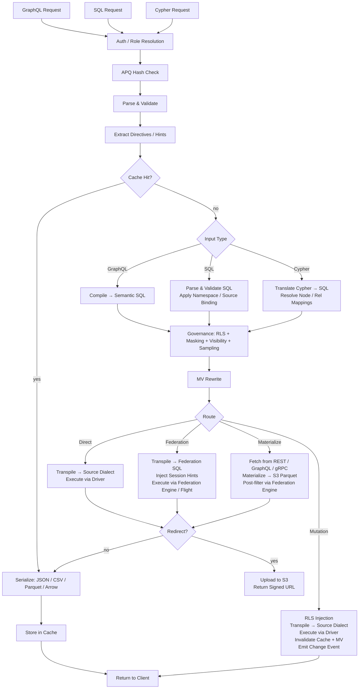

# Architecture de Provisa

## Vue d'ensemble

Provisa est une plateforme de virtualisation de données pilotée par configuration, spécifiquement conçue pour alimenter une couche sémantique, des petites équipes aux grandes entreprises. Elle fournit une API unifiée sur des sources de données hétérogènes avec gouvernance, sécurité, et optimisation de performance. Les clients interrogent via SQL, GraphQL, ou Cypher ; les trois sont des interfaces de premier ordre avec une gouvernance identique appliquée. (REQ-002, REQ-038)

La distinction de couche sémantique est importante. Pour ajouter à la couche sémantique, vous devez créer de nouvelles sources de données ou agrégats au sein de la couche de virtualisation de données. Cela crée une séparation nette — aucun ajout à la sémantique ne peut être fait en dehors de la plateforme, permettant une véritable gouvernance des données. (REQ-136) L'application est au niveau du compilateur : le catalogue de relations approuvées est la source de vérité quel que soit le langage de requête utilisé. (REQ-002)

Provisa est conçu pour être hautement performant pour les besoins opérationnels et hautement scalable pour les besoins analytiques d'entreprise. Une plateforme unique sert les deux sans sacrifier la vitesse ou la scalabilité.

```text
Config YAML → PG Metadata → Federation Catalogs
                               ↓
         Federation engine metadata → Schema Generator → SDL / SQL catalog / Cypher labels / gRPC proto (per role)
                                     ↓
                     Query → Parser → SQL Compiler → Transpiler
                                     ↓
                             Router (Smart Dispatch)
                         /           |            \
                    Federation  Direct PG      Direct MySQL/etc.
                         \           |            /
                              Executor Pool
                                     ↓
                         ┌───── Inline ─────┐     ┌──── Redirect ────┐
                         │  JSON (HTTP)     │     │  CTAS → S3       │
                         │  Arrow (Flight)  │     │  (Parquet, ORC)  │
                         │  Protobuf (gRPC) │     │  Provisa → S3    │
                         └─────────────────-┘     │  (JSON, CSV, …)  │
                                                  └─────────────────-┘
```

## Interfaces de requête

Chaque interface est un transport distinct. Les quatre appliquent le même pipeline de sécurité (RLS, masquage, échantillonnage, vérifications de rôle). (REQ-002, REQ-038) Les clients ne parlent jamais directement au moteur de fédération. (REQ-266) Le « langage de requête » (SQL / GraphQL / Cypher) est orthogonal au transport — plusieurs langages peuvent arriver sur le même transport.

| Port | Transport | Langages de requête acceptés | Cas d'usage |
| ------ | ----------- | -------------------------- | ---------- |
| 8001 | HTTP | GraphQL, SQL, Cypher | Clients web, outils BI, curl, consommateurs REST |
| 8815 | Arrow Flight (gRPC) | SQL (via Arrow Flight SQL) | Outils de données (Pandas, DuckDB, Spark, ADBC) |
| 50051 | Protobuf gRPC | RPC proto générés par rôle | Service-à-service avec contrats typés |
| configurable¹ | Protocole de fil PostgreSQL (pgwire) | SQL | psql, DBeaver, SQLAlchemy, tout client compatible PG |

¹ Définissez `PROVISA_PGWIRE_PORT` (ex. 5433). Désactivé quand non défini ou `0`.

### HTTP (port 8001)

Plusieurs endpoints sous le même port, distingués par chemin :

| Chemin | Langage | Notes |
| ------ | ---------- | ------- |
| `POST /data/graphql` | GraphQL | Lectures et mutations ; hash APQ accepté via `extensions.persistedQuery` |
| `POST /data/sql` | SQL | Lecture seule ; aucune porte de capacité — gouverné par visibilité d'objet + RLS + masquage (REQ-001, REQ-267) |
| `POST /data/query` | Cypher | Lecture seule ; rôle standard |
| `GET /data/nl` | Langage naturel | Traduit vers SQL/GraphQL/Cypher selon le type de source |
| `GET /data/subscribe/{table}` | GraphQL | Flux d'abonnement SSE |
| `GET /neo4j/...` | Cypher (compat Neo4j) | Cale de compatibilité API HTTP Neo4j |
| `POST /admin/graphql` | GraphQL | API admin (rôle superuser/admin requis) |

Tous les chemins retournent du JSON par défaut. `Accept: text/csv`, `application/vnd.apache.parquet`, `application/vnd.apache.arrow.stream`, et `application/octet-stream` (binaire brut) sont pris en charge via la négociation de contenu. Les résultats dépassant le seuil de taille configuré sont automatiquement redirigés vers une URL S3 signée. (REQ-029, REQ-137)

### Arrow Flight (port 8815)

Transport columnaire Arrow natif sur gRPC. (REQ-045, REQ-143) Les clients envoient un ticket JSON :

```json
{"query": "SELECT name, email FROM customers", "role": "analyst"}
```

et reçoivent des RecordBatches Arrow streamés paresseusement. Quand le proxy Flight SQL Zaychik est disponible, les données circulent comme un flux de lots d'enregistrements Arrow de bout en bout : (REQ-144)

```text
Client ←(Arrow batches)← Provisa Flight Server ←(Arrow batches)← Zaychik ←(JDBC)← Federation Engine
```

Le résultat complet n'est jamais matérialisé en mémoire Provisa — les lots sont transférés à mesure qu'ils arrivent. (REQ-145) Cela fait d'Arrow Flight un chemin non borné adapté aux résultats arbitrairement volumineux.

### Protobuf gRPC (port 50051)

`.proto` auto-généré depuis le schéma de données, généré par rôle. (REQ-525) Requêtes en streaming (un message par ligne), mutations unaires. Réflexion serveur activée. (REQ-526) Rôle via la clé de métadonnées `x-provisa-role`.

### Protocole de fil PostgreSQL / pgwire (port configurable)

Implémente le protocole de fil frontend/backend PostgreSQL en utilisant la bibliothèque `buenavista`. (REQ-527) Tout client compatible PostgreSQL — `psql`, DBeaver, SQLAlchemy avec `psycopg2`, JDBC — peut se connecter sans modification. Accepte uniquement SQL. Le pipeline de gouvernance complet (RLS, masquage, permissions de domaine) s'applique identiquement aux connexions pgwire. (REQ-266, REQ-002) Activé en définissant `PROVISA_PGWIRE_PORT` à un port non nul.

## Pipeline de requête

Trois langages de requête sont acceptés. Tous convergent vers la gouvernance après leurs étapes respectives de parsing/compilation. (REQ-262, REQ-263) Seul GraphQL prend en charge les écritures. (REQ-037) Il n'y a aucune porte de capacité sur la requête elle-même — toute identité authentifiée peut interroger dans n'importe quel langage, et les données sont gouvernées uniquement par la visibilité d'objet, RLS, et le masquage. (REQ-001)

| Interface | Lectures | Écritures | Porte de requête |
| --- | --- | --- | --- |
| GraphQL (`/data/graphql`) | Oui | Oui (mutations) | Aucune — gouvernance de couche de données uniquement |
| SQL (`/data/sql`) | Oui | Non | Aucune — gouvernance de couche de données uniquement (REQ-267) |
| Cypher (`/data/query`) | Oui | Non | Aucune — gouvernance de couche de données uniquement |



**Décisions de routage :**

| Route | Quand |
| --- | --- |
| **Cache** | Succès du cache de résultat — évalué en premier, sert le résultat stocké sans exécution (REQ-865) |
| **Cheap-count** | Requête en forme de `count(*)` sur une source non matérialisée qui expose un compte natif exact — routée vers l'appel de compte natif au lieu de matérialiser pour compter (REQ-875) |
| **Direct** | Source unique + a un pilote natif + a un connecteur de fédération |
| **Fédération** | Fédération multi-source, ou la source a un connecteur mais pas de pilote |
| **Matérialiser** | La source n'a pas de connecteur de fédération — récupérer et mettre en cache vers S3/PG d'abord |
| **Mutation** | Mutation GraphQL — toujours directe, jamais fédérée |

Le routage consomme la sortie de l'étape d'optimisation post-gouvernance, jamais le SQL gouverné pré-optimisation. La gouvernance peut AJOUTER des sources (prédicats de sous-requête RLS) ; l'étape d'optimisation peut les RETIRER (inlining VALUES-CTE de table chaude, réécritures de cache API, élagage de branche union). Une requête fédérée qui s'effondre en une seule source live après inlining est donc re-routée comme directe. (REQ-863)

### Requêtes multi-racine

Les requêtes GraphQL avec plusieurs champs racine (ex. `{ orders { id } customers { name } }`) sont compilées en requêtes SQL séparées et exécutées indépendamment. (REQ-534) Les requêtes SQL et Cypher sont mono-racine par définition. Les résultats sont fusionnés dans une seule réponse :

- Les champs sous le seuil de redirection sont retournés en ligne dans `data`
- Les champs au-dessus du seuil sont redirigés, avec des entrées par champ dans `redirects`
- Les formats binaires (Parquet, Arrow) ne sont pris en charge que pour les requêtes mono-racine

## Chemins d'exécution de fédération

| Chemin | Transport | Via | Quand utilisé |
| ------ | ----------- | ----- | ----------- |
| REST | client du moteur de fédération (HTTP :8080) | Requête directe | Par défaut, toujours disponible |
| Flight SQL | `adbc-driver-flightsql` (gRPC :8480) | Proxy Zaychik → JDBC | Quand Zaychik tourne |
| CTAS | client du moteur de fédération (HTTP :8080) | Écriture directe, Iceberg vers S3 | Redirection Parquet/ORC |

### Proxy Arrow Flight SQL Zaychik

Le moteur de fédération ne prend pas nativement en charge le protocole Arrow Flight SQL. [Zaychik](https://github.com/Raiffeisen-DGTL/zaychik-trino-proxy) est un proxy Java qui implémente l'interface gRPC Arrow Flight SQL, traduit les requêtes en requêtes JDBC, et streame les résultats en retour comme lots d'enregistrements Arrow. (REQ-144)

```text
ADBC client → gRPC :8480 → Zaychik → JDBC :8080 → Federation Engine → results → Arrow batches → client
```

Le serveur Flight de Provisa (port 8815) se connecte à Zaychik comme client ADBC, permettant le streaming Arrow de bout en bout sans matérialiser les résultats. (REQ-145)

### Catalogue de résultats Iceberg

La redirection CTAS utilise un connecteur Iceberg (catalogue `results`) adossé à un catalogue JDBC sur l'instance PostgreSQL existante. (REQ-169) Iceberg écrit les fichiers Parquet/ORC directement vers MinIO/S3 via le système de fichiers S3 natif (`fs.native-s3.enabled=true`).

## Moteurs de fédération

Provisa sélectionne un moteur de fédération au démarrage via la variable d'environnement `PROVISA_ENGINE`, la config admin-UI persistée, ou le défaut. Quand rien n'est défini, DuckDB est le défaut — entièrement en processus, aucun service externe (REQ-989). Voir [Configuration](configuration.md#moteur-de-federation) pour les détails de sélection.

Chaque moteur est une instance `FederationEngine` définie dans `provisa/federation/engine.py`. L'instance possède une collection de connecteurs qui détermine quels types de source le moteur peut lire en direct (ATTACH) versus lesquels doivent d'abord atterrir dans le magasin de matérialisation du moteur. [tool-verified: `engine.py` `_ENGINE_BUILDERS`, `ENGINE_REGISTRY`]

### Classes de pilote (REQ-840) [tool-verified: `engine.py` `DriverClass`]

| Classe | Signification | Exemples |
| ------- | --------- | --------- |
| `BROAD` | Atteint de nombreux types de source externe via des connecteurs natifs | Trino |
| `PARTIAL` | Atteint un sous-ensemble (relationnel, fichiers, objet cloud/lac) plus fait atterrir tout le reste | DuckDB, PostgreSQL, ClickHouse, Databricks, Snowflake, BigQuery, Fabric, Synapse |
| `SELF_ONLY` | Atteint uniquement son propre magasin ; toute autre source atterrit | SQLAlchemy |

### Moteurs disponibles [tool-verified: `engine.py` `_ENGINE_BUILDERS`]

| Clé moteur | Dialecte | MPP | Mécanisme de lien externe | Auth |
| ----------- | --------- | ----- | ------------------------ | ------ |
| `trino` / `trino-byo` | Trino SQL | Oui | Catalogues Trino (jeu de connecteurs large) | Identifiants JDBC |
| `pg` | PostgreSQL | Non | FDW / pg_duckdb | Identifiants PostgreSQL |
| `duckdb` | DuckDB | Non | ATTACH natif d'extension | Aucune (en processus) |
| `clickhouse` / `clickhouse-server` | ClickHouse | Oui (fragments) | Moteurs de table S3 / IcebergS3 / DeltaLake (REQ-986) | Identifiants ClickHouse |
| `snowflake` | Snowflake | Oui | Stage externe + table externe (REQ-988) | `PROVISA_ENGINE_URL` |
| `databricks` | Databricks SQL | Oui | Tables externes Unity Catalog via REST (REQ-987) | Jeton bearer (`http_path` dans `federation_hints`) |
| `bigquery` | BigQuery | Oui (Dremel) | Tables externes BigQuery / BigLake | Clé de compte de service `GOOGLE_APPLICATION_CREDENTIALS` |
| `fabric` | T-SQL | Oui | Raccourcis OneLake → OPENROWSET | Azure AD (`az login` / identité managée) |
| `synapse` | T-SQL | Oui | ADLS OPENROWSET / tables externes | Azure AD |
| `sqlalchemy` | Tout dialecte SQLAlchemy | Non | Aucun (atterrissage uniquement) | Identifiants par dialecte |

### Défaut zéro-config : DuckDB (REQ-989) [tool-verified: `engine.py` `build_duckdb_engine`, `_embedded_duckdb_materialize_default`]

Quand `PROVISA_ENGINE` n'est pas défini, Provisa utilise le moteur DuckDB entièrement embarqué en processus. Le magasin de matérialisation de DuckDB est un fichier DuckDB embarqué à `$PROVISA_DATA_DIR/materialize.duckdb` (par défaut `~/.provisa/materialize.duckdb`). Aucune base de données ou service externe n'est requis.

Parce que DuckDB impose un seul écrivain par fichier, `store_connection.py` écrit dans le magasin embarqué à travers la propre connexion du moteur — jamais une seconde connexion indépendante. C'est le seul cas où le moteur et le magasin de matérialisation partagent un descripteur de fichier par conception. [tool-verified: `store_connection.py` module docstring]

### Transport de lecture Arrow-natif (REQ-986, REQ-987, REQ-988) [tool-verified: `engine.py` `build_*_engine` `capabilities=`]

ClickHouse, DuckDB, Snowflake, Databricks, BigQuery, Fabric, et Synapse annoncent tous `EngineCapability.ARROW` et `EngineCapability.ARROW_STREAM`. Les requêtes contre ces moteurs retournent directement des RecordBatches Arrow — le chemin de sérialisation en lignes est entièrement contourné. Le serveur Flight streame ces lots vers les clients sans matérialiser le résultat complet dans la mémoire processus de Provisa. Pour Trino, le streaming Arrow s'appuie sur le proxy Zaychik ; pour les moteurs d'entrepôt, la propre API Arrow-native du moteur (Cloud Fetch pour Databricks, Storage Read API pour BigQuery, `fetch_arrow_table` pour DuckDB et Snowflake) alimente le flux Flight.

### Liens de données externes (ATTACH) [tool-verified: `engine.py` `_warehouse_connectors`]

Chaque moteur d'entrepôt peut scanner les données objet cloud/lac en place sans faire atterrir une copie. Les fichiers Parquet, CSV, Iceberg, et Delta Lake sur S3, GCS, ou OneLake s'attachent directement au moteur comme s'ils étaient des tables natives. La stratégie — ATTACH (scanner en place) ou LAND (copier dans le magasin) — est déterminée par le `Mechanism` déclaré du connecteur ; aucune ramification spécifique au moteur n'existe dans le planificateur. Un connecteur `Mechanism.ATTACH_R` déclenche un scan zéro-copie ; un connecteur `Mechanism.DIRECT` ou absent déclenche un atterrissage. [tool-verified: `connector_base.py` `Mechanism`, `engine.py` `_warehouse_connectors`]

Attach auto-provisionne tous les prérequis au moment de l'attachement :

| Moteur | Formats objet/lac | Mécanisme | Auto-provisionnement [tool-verified] |
| -------- | ------------------- | ---------- | ---------------------------------- |
| Databricks | parquet, csv, iceberg, delta_lake | Table externe UC (`ATTACH_R`) | REST installe un identifiant de stockage Unity Catalog + un emplacement externe, puis `CREATE TABLE … USING <format> LOCATION …` — vérifié en direct sur Cloudflare R2 |
| BigQuery | parquet, csv, json, iceberg, delta_lake | Table externe BigQuery / BigLake (`ATTACH_R`) | `CREATE OR REPLACE EXTERNAL TABLE … OPTIONS(format=…, uris=[…])` — vérifié en direct |
| ClickHouse | csv, parquet, iceberg, delta_lake | Moteur de table S3 / IcebergS3 / DeltaLake (`ATTACH_R`) | Sonde de validation exécutée au moment de l'attachement — vérifié en direct sur Cloudflare R2 |
| Fabric | parquet, csv, iceberg, delta_lake | Raccourci OneLake → OPENROWSET (`ATTACH_R`) | REST crée une connexion `AmazonS3Compatible` + un lakehouse + un raccourci ; retourne le chemin OneLake `BULK` — vérifié en direct en lisant R2 à travers Fabric |
| Snowflake | parquet, csv, json, iceberg, delta_lake | Stage externe + table externe (`ATTACH_R`) | `CREATE STAGE … URL=… CREDENTIALS=…`, puis `CREATE OR REPLACE EXTERNAL TABLE … LOCATION=@stage FILE_FORMAT=(TYPE=…)` — implémenté ; non testé en direct (aucun compte disponible) |

Les identifiants pour le stockage cloud voyagent dans le `federation_hints` de la source (voir [Sources](sources.md#entrepots-de-donnees-comme-sources-nommees)). Tout type de source qui ne peut pas s'ATTACH atterrit d'abord dans le magasin de matérialisation du moteur.

### Écritures de matérialisation columnaire (REQ-990) [tool-verified: `core/database.py:436`, `store_connection.py:99`]

`Connection.bulk_copy` dans `provisa/core/database.py` choisit le chemin d'ingestion en masse le plus rapide par dialecte de magasin : `COPY` binaire (`copy_records_to_table` d'asyncpg) pour les magasins PostgreSQL, et une seule instruction préparée `executemany` pour tous les autres magasins relationnels. Le magasin embarqué DuckDB atterrit via `land_duckdb_native` dans `store_connection.py` — un seul appel `executemany` pour tout le lot, jamais une boucle ligne par ligne.

## Redirection de résultat volumineux

Les résultats dépassant un seuil de lignes sont redirigés vers un stockage compatible S3 (MinIO) au lieu d'être retournés en ligne. (REQ-029)

### Modes de redirection

| Mode | Fonctionnement | Les données touchent-elles Provisa ? |
| ------ | ------------- | ---------------------- |
| **CTAS** (Parquet, ORC) | Le moteur de fédération écrit directement vers S3 via `CREATE TABLE AS SELECT` | Non |
| **Téléversement Provisa** (JSON, NDJSON, CSV, Arrow IPC) | Provisa sérialise et téléverse via boto3 | Oui |

Pour les formats CTAS-natifs, Provisa ne manipule jamais les données — le moteur de fédération écrit les fichiers directement vers MinIO/S3. (REQ-138) C'est le chemin préféré pour les exports analytiques volumineux.

### En-têtes de redirection

| En-tête | Effet |
| -------- | -------- |
| `X-Provisa-Redirect-Format: <mime>` | Redirige dans ce format (implique force sauf si seuil défini) |
| `X-Provisa-Redirect-Threshold: N` | Redirige seulement si le résultat dépasse N lignes |
| `X-Provisa-Redirect: true` | Force la redirection en utilisant le format par défaut |

Ces en-têtes implémentent la redirection contrôlée par le client. (REQ-137)

**Réponse :**

```json
{
  "data": {"orders": null},
  "redirect": {
    "redirect_url": "https://minio:9000/provisa-results/results/abc.parquet?...",
    "row_count": 50000,
    "expires_in": 3600,
    "content_type": "application/vnd.apache.parquet"
  }
}
```

### Configuration serveur

| Variable d'env | Défaut | Objectif |
| --------- | --------- | --------- |
| `PROVISA_REDIRECT_ENABLED` | `false` | Active la redirection par seuil côté serveur |
| `PROVISA_REDIRECT_THRESHOLD` | `1000` | Seuil de nombre de lignes par défaut |
| `PROVISA_REDIRECT_FORMAT` | `parquet` | Format de redirection par défaut |
| `PROVISA_REDIRECT_BUCKET` | `provisa-results` | Nom de bucket S3 |
| `PROVISA_REDIRECT_ENDPOINT` | | URL d'endpoint compatible S3 |
| `PROVISA_REDIRECT_TTL` | `3600` | TTL de l'URL présignée (secondes) |

## Arbre de décision de routage

```text
Multi-source query? → Federation engine
NoSQL source (MongoDB, Cassandra)? → Federation engine
Uses path columns on non-PG source? → Federation engine
Single RDBMS with driver? → Direct (sub-100ms target)
Single RDBMS without driver? → Federation engine
Steward hint "federated"? → Federation engine (override)
Steward hint "direct"? → Direct (if possible)
Redirect to Parquet/ORC? → Federation engine (CTAS, regardless of source count)
```

(REQ-027, REQ-028, REQ-030, REQ-279)

## Optimisation de requête de fédération

Provisa amorce automatiquement l'optimiseur basé sur les coûts du moteur de fédération afin que les plans de requête inter-sources soient basés sur la distribution réelle des données, pas des défauts codés en dur.

### Statistiques automatiques (`ANALYZE`)

À l'enregistrement de source, Provisa exécute `ANALYZE catalog.schema.table` pour chaque table publiée. (REQ-275) Cela collecte :

- Nombre de lignes
- Par colonne : fraction de null, nombre de valeurs distinctes, min/max, histogrammes (selon le connecteur)

L'optimiseur utilise ceci pour estimer la sélectivité des requêtes filtrées. Sans statistiques, il se replie sur des défauts fixes (ex. 10% de sélectivité pour les prédicats d'égalité) qui produisent de mauvais plans de jointure sur des données asymétriques ou à cardinalité élevée. Avec les statistiques, les estimations sont assez précises pour prendre les bonnes décisions de jointure broadcast vs. partitionnée pour la plupart des charges de travail.

**Couverture** : le support des statistiques varie selon le connecteur. PostgreSQL, MySQL, Hive, Iceberg, et Delta Lake prennent entièrement en charge `ANALYZE`. Les connecteurs MongoDB et Cassandra ont un support partiel ou nul. Provisa avale silencieusement les échecs `ANALYZE` — l'enregistrement n'est jamais bloqué. (REQ-275)

**Limites de sélectivité** : les statistiques fournissent des estimations par colonne. Pour les prédicats corrélés (`WHERE region = 'US' AND city = 'Seattle'`), l'optimiseur suppose l'indépendance des colonnes, ce qui peut sous-estimer le nombre de lignes. C'est une limitation connue des statistiques au niveau colonne dans tous les optimiseurs basés sur les coûts.

**Sources API** : les tables `api_cache_{table_name}` en PostgreSQL sont analysées automatiquement après chaque cycle de rafraîchissement de cache, de sorte que l'optimiseur ait des estimations de lignes à jour lors de la jointure de sources adossées à API avec des sources relationnelles. (REQ-280)

### Admin : rafraîchir les statistiques

Relancez la collecte de statistiques à la demande via l'API admin : (REQ-276)

```graphql
mutation {
  refreshSourceStatistics(sourceId: "sales-pg") {
    tablesAnalyzed
    failures { table message }
  }
}
```

Utile quand une source a reçu des données nouvelles significatives depuis son enregistrement.

## Vues matérialisées

Les MV optimisent de manière transparente les requêtes coûteuses en pré-calculant et mettant en cache les résultats.

### Relations comme indices de MV

Une déclaration de relation n'est pas seulement un artefact de gouvernance — c'est aussi la description structurelle d'une forme de jointure. Cette forme est exactement ce dont l'optimiseur de MV a besoin : deux tables, deux colonnes, un type de jointure. Cela signifie qu'une relation peut directement piloter la matérialisation.

Pour les **relations inter-sources**, cela se produit automatiquement au démarrage : chaque relation inter-sources approuvée génère une MV `JoinPattern` (`auto-mv-<rel_id>`). (REQ-158) Aucune config de MV séparée n'est requise. Quand le compilateur voit cette jointure dans une requête, le réécrivain substitue le résultat pré-matérialisé de manière transparente.

Pour les **relations même-source**, les stewards peuvent opter explicitement via `materialize: true`. Les JOIN même-source sont déjà rapides via l'exécution directe, donc la matérialisation ne vaut le coup que pour des chemins de jointure très chauds. (REQ-159)

La conséquence pratique : les stewards qui approuvent une relation décident implicitement si la jointure est un bon candidat pour la matérialisation. L'acte de gouvernance et l'indice d'optimisation sont la même déclaration.

### Modes

| Mode | Config | Comportement |
| ------ | -------- | ---------- |
| **Join-pattern** | `join_pattern` dans la config MV | Réécrit les JOIN correspondants pour lire depuis la table MV |
| **SQL personnalisé** | `sql` dans la config MV | SELECT arbitraire, optionnellement exposé en SDL |
| **Relation auto-matérialisée** | relation inter-sources (automatique) | Auto-génère une MV join-pattern ; aucune config requise |
| **Relation matérialisée par le steward** | `materialize: true` sur relation même-source | Opt-in explicite pour les chemins de jointure même-source chauds |

### Auto-matérialisation

Les JOIN inter-sources sont les requêtes les plus coûteuses (toujours fédérées). Les relations inter-sources génèrent automatiquement des définitions de MV au démarrage : (REQ-158)

```yaml
relationships:
  - id: orders-to-reviews
    source_table_id: orders        # sales-pg
    target_table_id: product_reviews  # reviews-mongo
    source_column: product_id
    target_column: product_id
    cardinality: one-to-many
    materialize: true              # auto-create MV
    refresh_interval: 600          # refresh every 10 minutes
```

Seules les relations inter-sources génèrent des MV (les JOIN même-source sont déjà rapides via l'exécution directe). (REQ-159) La MV démarre en statut `STALE` et est rafraîchie par la boucle de rafraîchissement en arrière-plan avant d'être utilisée par l'optimiseur de requête. (REQ-160)

### Cycle de vie du rafraîchissement

```text
STALE → (refresh loop picks up) → REFRESHING → FRESH
  ↑                                                |
  └──── mutation hits source table ────────────────┘
```

La boucle de rafraîchissement s'exécute toutes les 30 secondes, vérifie `get_due_for_refresh()`, et exécute `CREATE TABLE AS SELECT` (première exécution) ou `DELETE + INSERT` (suivantes) contre la table cible de MV via le moteur de fédération. (REQ-160, REQ-234)

## Carte des modules

| Module | Objectif |
| -------- | --------- |
| `api/` | App FastAPI, routeurs, middleware, gestion du cycle de vie |
| `api/flight/` | Serveur Arrow Flight (gRPC, port 8815) |
| `api/admin/` | API GraphQL admin Strawberry — config, découverte, vues |
| `api/rest/` | Endpoints REST auto-générés depuis les tables enregistrées |
| `api/jsonapi/` | Endpoints JSON:API auto-générés avec pagination et gestion d'erreurs |
| `api/data/subscribe.py` | Abonnements SSE — LISTEN/NOTIFY, polling, Debezium CDC |
| `compiler/` | Parsers GraphQL/SQL, générateur SQL sémantique, RLS, masquage, échantillonnage, gouvernance en deux étapes (`stage2.py`) |
| `cypher/` | Traducteur Cypher → SQL, parser, carte de label (REQ-351), traducteur d'écriture pour les mutations Cypher |
| `pgwire/` | Serveur protocole de fil PostgreSQL ; `catalog.py` intercepte pg_catalog/information_schema pour la visibilité d'objet par rôle (REQ-527, REQ-883, REQ-891) |
| `vector/` | Recherche vectorielle — registre de modèles, fournisseurs d'embedding (openai/ollama/huggingface), traduction `cosine_similarity()`, cache de repli pgvector, génération d'embedding déclarative (REQ-419–431) |
| `compiler/federation.py` | Support de sous-graphe Apollo Federation v2 |
| `transpiler/` | Transpilation de dialecte, logique de routage |
| `executor/` | Exécution fédérée/directe, sérialisation, formats de sortie |
| `executor/drivers/` | Pilotes de source directs (PostgreSQL, MySQL, DuckDB, Snowflake, Databricks, ClickHouse, …) |
| `executor/trino_flight.py` | Client Flight SQL ADBC pour le moteur de fédération |
| `executor/ctas_write.py` | Redirection basée sur CTAS (le moteur de fédération écrit vers S3) |
| `executor/redirect.py` | Logique de redirection S3, téléversement côté Provisa |
| `federation/engine.py` | `FederationEngine`, `DriverClass`, `_ENGINE_BUILDERS`, `ENGINE_REGISTRY`, `build_engine` |
| `federation/connector.py` | Abstractions de connecteur — Trino, ClickHouse ; `Mechanism`, `WarehouseNativeConnector` |
| `federation/connector_duckdb.py` | Définitions de connecteur DuckDB et FDW PostgreSQL |
| `federation/snowflake_connectors.py` | Connecteurs ATTACH stage externe + table externe Snowflake (REQ-988) |
| `federation/databricks_connectors.py` | Connecteurs ATTACH table externe UC Databricks (REQ-987) |
| `federation/bigquery_connectors.py` | Connecteurs ATTACH BigQuery externe / BigLake |
| `federation/databricks_uc.py` | Auto-provisionnement d'identifiant Unity Catalog + emplacement externe |
| `federation/databricks_backend.py` | Backend d'exécution Databricks SQL warehouse |
| `federation/snowflake_backend.py` | Backend d'exécution Snowflake |
| `federation/bigquery_backend.py` | Backend d'exécution BigQuery (transport Arrow Storage Read API) |
| `federation/mssql_warehouse_backend.py` | Backends d'exécution Fabric Warehouse + Synapse (T-SQL sur ODBC) |
| `federation/mssql_warehouse_connectors.py` | Connecteurs ATTACH OPENROWSET pour Fabric / Synapse |
| `federation/fabric_shortcuts.py` | Auto-provisionnement de raccourci OneLake (connexion → lakehouse → raccourci) |
| `federation/clickhouse_backend.py` | Backend d'exécution ClickHouse |
| `federation/duckdb_backend.py` | Backend d'exécution DuckDB en processus |
| `federation/pg_backend.py` | Backend d'exécution PostgreSQL |
| `federation/store_connection.py` | Face d'écriture du magasin de matérialisation DuckDB-natif (REQ-989, REQ-990) |
| `registry/` | Registre de requêtes persistées, gouvernance |
| `security/` | Visibilité, droits, masquage de colonne |
| `cache/` | Cache de résultat de requête adossé à Redis (palier chaud) |
| `mv/` | Registre de vues matérialisées, rafraîchissement, réécrivain SQL |
| `events/` | Événements de changement de jeu de données et dispatch de déclencheur |
| `webhooks/` | Exécution de webhook sortant pour mutations et événements |
| `scheduler/` | Gestion de tâche en arrière-plan basée sur APScheduler — déclencheurs cron et intervalle qui déclenchent des webhooks, mutations, ou publications vers sink Kafka |
| `apq/` | Protocole de fil Apollo APQ — cache de hash de requête adossé à Redis ; séparé de la mise en cache de résultat |
| `compiler/cursor.py` | Pagination par curseur de style Relay — arguments `first`/`after`/`last`/`before` et génération de `pageInfo` sur toutes les requêtes de liste |
| `compiler/aggregate_gen.py` | Types de requête `{table}_aggregate` auto-générés avec sous-champs `count`, `sum`, `avg`, `min`, `max` et accès `nodes` filtré |
| `compiler/enum_detect.py` | Auto-détection de type enum — types enum natifs PostgreSQL (`pg_enum`) exposés comme types enum GraphQL plutôt que scalaires chaîne |
| `compiler/hints.py` | Indices de performance de fédération — directives de routage au niveau requête embarquées comme commentaires SQL (`/* @provisa route=federated */`) qui surchargent le routage automatique |
| `compiler/mutation_gen.py` | Compilateur de mutation ; préréglages de colonne — valeurs statiques côté serveur ou de variable de session appliquées à l'insertion/mise à jour, non exposées dans le type d'entrée de mutation |
| `auth/approval_hook.py` | Hook d'approbation ABAC — autorisation externe enfichable appelée avant l'exécution de requête ; transports webhook, gRPC, et unix_socket ; scope par table/source/global ; politique de repli configurable |
| `subscriptions/` | État et livraison d'abonnement SSE |
| `discovery/` | Découverte de relation par LLM (API Claude) |
| `grpc/` | Génération proto, serveur gRPC, réflexion |
| `api_source/` | Sources API REST/GraphQL/gRPC avec cache PG |
| `kafka/` | Sources de sujet Kafka, sink, Schema Registry |
| `auth/` | Fournisseurs d'auth enfichables, middleware, mappage de rôle |
| `core/` | Config, modèles, DB, dépôts, secrets ; le modèle de rôle prend en charge `parent_role_id` et `flatten_roles()` pour l'héritage de rôle récursif |
| `hasura_v2/` | Convertisseur métadonnées Hasura v2 → config Provisa |
| `ddn/` | Convertisseur supergraph Hasura DDN → config Provisa |
| `mongodb/` | Connecteur de source MongoDB |
| `elasticsearch/` | Connecteur de source Elasticsearch |
| `cassandra/` | Connecteur de source Cassandra |
| `prometheus/` | Connecteur de source de métriques Prometheus |
| `source_adapters/` | Couche d'adaptateur générique pour les connexions de source |

## API Admin

L'API GraphQL admin Strawberry est montée sur `/admin/graphql` (port HTTP 8001). Elle est séparée de l'endpoint GraphQL de données et nécessite le rôle superuser ou admin.

| Capacité | Description |
| ----------- | ------------- |
| Téléchargement/téléversement de config | Exporte ou remplace la config YAML complète de Provisa |
| Éditeur de relation | Crée, met à jour, supprime des définitions de relation |
| Découverte FK par IA | Déclenche une analyse de candidat FK propulsée par Claude |
| Introspection de schéma | Parcourt les tables, colonnes, et rôles publiés |
| Gestion de vue | Enregistre et gère les définitions de vue matérialisée |

(REQ-164, REQ-165, REQ-166, REQ-167)

## Configuration des modèles IA

`GET /admin/ai-models` et `PUT /admin/ai-models` configurent le pipeline LLM pour chaque org. (REQ-464, REQ-419, REQ-500, REQ-370, REQ-1349)

Les paramètres sont **scopés par org** : les choix de chaque org se superposent à la config de déploiement et prennent effet à la prochaine requête — aucun redémarrage requis. (REQ-1349) [tool-verified: `provisa/api/admin/ai_models_router.py:38-39`]

**Affectations de modèle par opération.** Cinq opérations NL ont chacune un vendeur et une chaîne de modèle configurables :

| Opération | Ce qu'elle pilote |
| --------- | -------------- |
| `table_description` | Descriptions de table générées par LLM |
| `column_description` | Descriptions de colonne générées par LLM |
| `relationship_inference` | Découverte de candidat FK |
| `sql_generation` | Génération NL → SQL |
| `table_selection` | Choix des tables à inclure dans le prompt NL |

Le champ vendeur accepte tout vendeur compatible `aisuite` (`anthropic`, `openai`, `groq`, `mistral`, `cohere`, et d'autres) ou un endpoint local (`ollama`, `lmstudio`). Une chaîne de modèle vide retire la surcharge de l'org et revient au défaut de déploiement. [tool-verified: `provisa/api/admin/ai_models_router.py:29-35`, `provisa-ui/src/components/admin/AiModelsTab.tsx:43-60`]

**Limite de débit NL.** Un plafond optionnel de requêtes par période appliqué par rôle. Les requêtes excédentaires retournent `429` avec `Retry-After`. [tool-verified: `provisa-ui/src/components/admin/AiModelsTab.tsx:306-313`]

**Registre de modèle vectoriel.** Une liste de modèles d'embedding (champs : `id`, `provider`, `dimensions`, `api_key_env` et `base_url` optionnels, drapeau `enabled`). Remplacement de liste complète : chaque entrée doit avoir `id`, `provider`, et `dimensions` sinon l'écriture est rejetée `400`. [tool-verified: `provisa/api/admin/ai_models_router.py:122-131`]

**Clés API.** Les clés API LLM par vendeur sont stockées chiffrées via `provisa.core.org_secrets` (voir ci-dessous). La réponse `GET` ne rapporte que si une clé est définie pour chaque vendeur — la valeur n'est jamais retournée. Envoyer une chaîne vide pour un vendeur efface cette clé, faisant revenir les appels LLM pour ce vendeur vers l'identifiant de variable d'environnement du déploiement. (REQ-1395, REQ-1398) [tool-verified: `provisa/api/admin/ai_models_router.py:76-78`, `provisa/api/admin/ai_models_router.py:149-165`]

## Secrets chiffrés par org

`provisa/core/org_secrets.py` stocke les identifiants qui ne doivent jamais apparaître en clair dans la base de données. Actuellement restreint aux clés API de vendeur LLM (`{vendor}_api_key`). (REQ-1395, REQ-1398) [tool-verified: `provisa/core/org_secrets.py`]

Les valeurs sont chiffrées via l'`encryption_service` global au processus de `provisa.encryption.runtime` — le même mécanisme que `api_sources.auth`. [tool-verified: `provisa/core/org_secrets.py:16-17`]

Douze vendeurs compatibles `aisuite` sont pris en charge : `anthropic`, `openai`, `cohere`, `groq`, `mistral`, `xai`, `deepseek`, `together`, `fireworks`, `nebius`, `sambanova`, et `inception`. Google, AWS, et Azure sont exclus car ils nécessitent une configuration au-delà d'une simple clé API (ID de projet, rôles IAM, région). Les vendeurs à endpoint local (`ollama`, `lmstudio`) n'ont pas de clé et sont exclus pour la même raison. [tool-verified: `provisa/core/org_secrets.py:33-53`]

Passer `value=None` à `write_org_secret` supprime la ligne. Les appelants qui lisent un secret le consomment immédiatement (ex. pour construire un client LLM) et ne doivent l'échoer dans aucune réponse d'API. [tool-verified: `provisa/core/org_secrets.py:97-117`]

## Endpoints REST et JSON:API auto-générés

Les tables enregistrées sont exposées comme endpoints REST et JSON:API aux côtés de l'interface GraphQL. (REQ-256, REQ-257)

| Interface | Chemin de montage | Spec |
| ----------- | ----------- | ------ |
| REST | `/rest/<table-id>` | GET/POST simple avec paramètres de requête |
| JSON:API | `/jsonapi/<table-id>` | conforme [jsonapi.org](https://jsonapi.org) — pagination, relations, objets d'erreur |

Ces endpoints appliquent le même pipeline de sécurité (RLS, masquage, vérifications de rôle) que l'endpoint GraphQL. (REQ-002, REQ-038)

## Abonnements

Les abonnements SSE sont servis à `GET /data/subscribe/{table}`. Trois modes de livraison : (REQ-258)

| Mode | Mécanisme | Quand utilisé |
| ------ | ----------- | ----------- |
| **LISTEN/NOTIFY** | `LISTEN` PostgreSQL sur un canal | Sources PG avec activité de mutation |
| **Polling** | Réexécute la requête à intervalle | Sources non-PG, ou quand CDC indisponible |
| **Debezium CDC** | Sujet Kafka depuis un connecteur Debezium | Flux de changement à haute fréquence |

(REQ-258, REQ-260, REQ-261)

Le client reçoit `text/event-stream` avec un événement JSON par ligne modifiée ou diff.

## Système d'événements et de webhooks

Les mutations de base de données (INSERT/UPDATE/DELETE) peuvent déclencher des événements sortants via les modules `events/` et `webhooks/`. (REQ-172, REQ-173, REQ-220)

```text
Mutation executed → EventDispatcher → match event trigger rules
                                          ↓
                               WebhookExecutor → HTTP POST to configured URL
```

Les déclencheurs d'événement sont définis en config et appariés sur la table, le type d'opération, et un filtre de ligne optionnel. Les payloads de webhook incluent le type d'opération, la ligne modifiée, et le contexte de rôle.

## Services en arrière-plan

Quatre boucles en arrière-plan démarrent pendant le cycle de vie de l'app (`api/app.py`) :

| Service | Intervalle | Objectif |
| --------- | ---------- | --------- |
| Boucle de rafraîchissement MV | 30 s | Interroge `get_due_for_refresh()`, exécute CTAS ou DELETE+INSERT sur les MV obsolètes |
| Gestionnaire de table chaude | Configurable | Promeut les tables fréquemment interrogées vers un cache SSD local Iceberg |
| Chargeur de table chaude | Configurable | Charge les petites tables de référence en cache mémoire pour un accès sub-milliseconde |
| Poller de source API | Intervalle par source | Récupère et remet en cache les sources REST/GraphQL/gRPC distantes |

(REQ-160, REQ-238, REQ-239, REQ-236)

### Paliers de mise en cache de table chaude/tiède

| Palier | Stockage | Critères de promotion | Latence d'accès |
| ------ | --------- | ------------------- | ---------------- |
| Chaud | Mémoire en processus | Nombre de lignes < seuil, ou est une cible de relation | <1 ms |
| Tiède | Iceberg sur SSD local | Seuil de fréquence de requête dépassé | ~5–20 ms |
| Froid | Source distante | Défaut | 50–500 ms |

(REQ-230, REQ-236, REQ-238, REQ-241)

## Import de métadonnées (Hasura v2 / DDN)

Les déploiements Hasura existants peuvent être convertis en config Provisa sans réécriture manuelle. (REQ-182, REQ-183)

| Module | Entrée | Sortie |
| -------- | ------- | -------- |
| `hasura_v2/` | `metadata.yaml` Hasura v2 | `config.yaml` Provisa |
| `ddn/` | JSON supergraph Hasura DDN | `config.yaml` Provisa |

Les deux convertisseurs mappent les tables suivies, relations, permissions, et schémas distants. Le résultat est une config Provisa complète prête au déploiement. (REQ-182, REQ-183)

## Apollo Federation

`compiler/federation.py` expose Provisa comme sous-graphe Apollo Federation v2. (REQ-259) Le SDL de sous-graphe est auto-généré depuis le schéma publié avec des directives `@key` sur les colonnes de clé primaire et des annotations `@external`/`@provides` sur les relations inter-sous-graphes. Provisa répond aux requêtes `_entities` et `_service` requises par la passerelle de fédération. (REQ-259)

## Pagination par curseur

Toutes les requêtes de liste prennent en charge la pagination par curseur de style Relay via `compiler/cursor.py`. (REQ-218) Les clients passent les arguments `first`/`after` (avant) ou `last`/`before` (arrière). Le compilateur encode la position de ligne comme curseur base64 opaque et injecte les clauses `WHERE`/`LIMIT` appropriées. Chaque requête de liste retourne un objet `pageInfo` :

| Champ | Type | Description |
| ------- | ------ | ------------- |
| `hasNextPage` | Boolean | Vrai si plus de résultats existent après cette page |
| `hasPreviousPage` | Boolean | Vrai si des résultats existent avant cette page |
| `startCursor` | String | Curseur du premier nœud dans cette page |
| `endCursor` | String | Curseur du dernier nœud dans cette page |

## Requêtes d'agrégation

Chaque table enregistrée obtient un champ racine `{table}_aggregate` auto-généré (`compiler/aggregate_gen.py`). (REQ-196) Le type d'agrégation expose `count`, `sum`, `avg`, `min`, `max` par colonne numérique, et `nodes` pour un accès aux lignes filtré avec sélection de champ complète (même RLS/masquage que la requête de base). (REQ-196, REQ-198) Les requêtes d'agrégation sont éligibles au routage MV d'agrégation — voir `mv/aggregate_catalog.py`. (REQ-198)

## Requêtes persistées automatiques (APQ)

`apq/cache.py` implémente le protocole de fil Apollo APQ. (REQ-288) Quand un client envoie seulement un hash de requête (`extensions.persistedQuery`), Provisa le recherche dans Redis. (REQ-289) En cas d'échec, il retourne une erreur `PersistedQueryNotFound` ; le client réessaie avec le corps complet de la requête, que Provisa stocke. (REQ-288) C'est séparé de la mise en cache de résultat (`cache/`).

## Rôles hérités

Les rôles dans `core/models.py` peuvent référencer un `parent_role_id`. (REQ-215) `flatten_roles()` résout récursivement la chaîne d'héritage et fusionne les clauses WHERE RLS (ET logique), la visibilité de colonne (union, le plus restrictif gagne), et les politiques de masquage (l'enfant surcharge le parent par colonne). Cela évite de dupliquer les jeux de permissions à travers des rôles similaires (ex. `analyst` héritant de `reader`). (REQ-215)

## Hook d'approbation ABAC

`auth/approval_hook.py` est un hook d'autorisation enfichable invoqué avant l'exécution de requête, après RLS et masquage. (REQ-203) Il s'intègre avec des moteurs de politique externes (OPA, services ABAC personnalisés).

| Paramètre | Description |
| --------- | ------------- |
| Transport | `webhook` (HTTP POST), `grpc`, ou `unix_socket` |
| Scope | Par table, par source, ou global |
| Politique de repli | `allow` ou `deny` quand l'endpoint du hook est injoignable |

(REQ-246, REQ-247, REQ-204)

## Auto-détection de type enum

`compiler/enum_detect.py` introspecte les types enum natifs PostgreSQL (`pg_enum`) au moment de la génération de schéma. (REQ-221) Les colonnes utilisant un type enum défini par l'utilisateur PostgreSQL sont promues en types enum GraphQL — leurs valeurs deviennent des membres d'enum plutôt que des scalaires chaîne.

## Déclencheurs planifiés

`scheduler/jobs.py` utilise APScheduler pour exécuter des jobs en arrière-plan définis comme déclencheurs cron ou intervalle. (REQ-216) Chaque job peut faire un POST vers une URL de webhook, exécuter une mutation contre l'endpoint de données, ou publier des résultats de requête vers un sujet Kafka. Les déclencheurs sont configurés via l'API admin (mutations `scheduledTrigger`) ou la clé `scheduled_triggers` dans la config YAML. (REQ-216)

## Indices de performance de fédération

`compiler/hints.py` parse les indices de steward embarqués dans les requêtes comme commentaires en utilisant la syntaxe de commentaire de Provisa. (REQ-279) Le format d'indice varie selon le langage de requête :

```graphql
# @provisa route=federated
{ orders { id amount } }
```

```sql
/* @provisa route=federated */
SELECT id, amount FROM orders
```

```cypher
// @provisa route=federated
MATCH (o:Order) RETURN o.id, o.amount
```

| Indice | Effet |
| ------ | -------- |
| `route=federated` | Force la fédération à travers le moteur de fédération, en contournant le routage par pilote direct |
| `route=direct` | Force l'exécution par pilote direct |

(REQ-279, REQ-277, REQ-278)

## Préréglages de colonne dans les mutations

`compiler/mutation_gen.py` prend en charge les préréglages côté serveur par colonne appliqués à `INSERT` ou `UPDATE`. (REQ-214) Les préréglages ne sont pas inclus dans le type d'entrée de mutation GraphQL généré — ils sont injectés par le compilateur de manière transparente. Types de préréglage : `static` (valeur littérale) ou `session` (valeur depuis la session/en-tête de requête, ex. `x-hasura-user-id`). (REQ-214)

## Explorateur de schéma GraphQL Voyager

L'UI admin (`provisa-ui/src/pages/SchemaExplorer.tsx`) embarque GraphQL Voyager comme outil de visualisation de schéma interactif. (REQ-248) Il rend le schéma scopé par rôle comme diagramme entité-relation navigable — les tables comme nœuds, les relations comme arêtes. Le schéma affiché est toujours filtré selon le rôle actuellement sélectionné.

## Ordre d'application de la sécurité

Il n'y a aucune porte de capacité sur la requête — la gouvernance est exprimée entièrement à travers des contrôles de couche de données. (REQ-001) Une requête SQL brut rejette (HTTP 403) toute table en dehors du scope d'objet du rôle avant que la gouvernance ne s'exécute. (REQ-267)

1. **Visibilité d'objet** : le schéma par rôle cache les tables/colonnes non autorisées ; les tables hors scope en SQL brut sont rejetées (REQ-039, REQ-267)
2. **Application de relation** : les traversées doivent exister dans le catalogue de relations approuvées, sauf si le rôle possède `ignore_relationships` — parmi les rôles système amorcés, seul `modeler` l'a (REQ-001, REQ-1297). En mode haute sécurité, la capacité est ignorée et aucune traversée n'échappe au catalogue (REQ-693)
3. **RLS** : injection de clause WHERE par table par rôle (REQ-040, REQ-041, REQ-263)
4. **Masquage de colonne** : transformation de données par colonne par rôle (REQ-263)
5. **Plafond de ligne (LIMIT)** : plafond de nombre de lignes pour les rôles sans `full_results` ; l'échantillonnage statistique aléatoire est une fonctionnalité de requête utilisateur séparée (REQ-263, REQ-478)

Les quatre interfaces de requête (HTTP, Flight, gRPC, pgwire) appliquent le même pipeline de gouvernance Stage 2 ; aucun chemin client ne peut le contourner sans contourner le serveur. (REQ-002, REQ-038, REQ-266)

## Limites de scalabilité

Provisa est une fine couche de compilation et de routage — elle ajoute une latence à un chiffre de millisecondes à la requête. Cependant, les chemins où Provisa sérialise les données de résultat sont bornés par la mémoire processus. Deux chemins sont véritablement non bornés :

| Chemin | Borné en mémoire ? | Adapté à |
| ------ | -------------- | ------------- |
| JSON en ligne (HTTP) | Oui | Résultats petits-moyens |
| **Streaming Arrow Flight (gRPC :8815)** | **Non** | **Non borné — streaming via Zaychik ou API Arrow d'entrepôt** |
| Protobuf gRPC en ligne (:50051) | Oui | Résultats moyens, service-à-service |
| Redirection : téléversement Provisa (JSON, CSV, NDJSON, Arrow IPC) | Oui | Résultats moyens, téléchargement de fichier |
| **Redirection : CTAS (Parquet, ORC)** | **Non** | **Non borné — le moteur de fédération écrit vers S3** |

(REQ-145, REQ-138)

### Sondage de seuil

Pour la redirection basée sur seuil, Provisa injecte `LIMIT threshold + 1` dans la requête comme sonde. (REQ-140) Si le résultat a moins de lignes, il est retourné en ligne (résultat complet, aucun travail gaspillé). Si le résultat atteint la limite, la sonde est écartée et la requête complète est ré-exécutée via CTAS ou téléversement Provisa. Cela évite `SELECT COUNT(*)` (que certaines sources n'optimisent pas) et fonctionne sur toute source.

Pour les charges de travail analytiques volumineuses, utilisez soit :

- **Arrow Flight** (port 8815) pour le streaming vers les outils de données — les lots circulent à travers Provisa sans matérialiser (REQ-145)
- **Redirection Parquet/ORC** pour les exports basés fichier — le moteur de fédération écrit directement vers S3, Provisa retourne une URL présignée (REQ-138, REQ-044)

## Infrastructure

| Service | Image | Port | Objectif |
| --------- | ------- | ------ | --------- |
| API Provisa | (processus hôte) | 8001 | Endpoint HTTP/REST |
| Flight Provisa | (processus hôte) | 8815 | Serveur gRPC Arrow Flight |
| gRPC Provisa | (processus hôte) | 50051 | Serveur gRPC Protobuf |
| Moteur de fédération | `trinodb/trino` (défaut) ou entrepôt externe | 8080 / variable | Moteur de fédération de requête — Trino pour la pile embarquée ; Snowflake/Databricks/BigQuery/Fabric/Synapse/DuckDB pour les cibles d'entrepôt |
| Zaychik | `provisa-zaychik` (construit depuis la source) | 8480 | Proxy Arrow Flight SQL pour Trino ; non requis pour les moteurs d'entrepôt |
| PostgreSQL | `postgres:16` | 5432 | Métadonnées de config + catalogue Iceberg |
| MongoDB | `mongo:7` | 27017 | Source de données NoSQL de démo |
| MinIO | `minio/minio` | 9000/9001 | Stockage d'objet compatible S3 |
| Redis | `redis:7-alpine` | 6379 | Cache de résultat de requête |
| PgBouncer | `edoburu/pgbouncer` | 6432 | Pooling de connexion pour PG |
| Kafka | `confluentinc/cp-kafka:7.6.0` | 9092 | Sources de données en streaming |
| Schema Registry | `confluentinc/cp-schema-registry:7.6.0` | 8081 | Gestion de schéma Avro/Protobuf |

(REQ-055, REQ-169)
