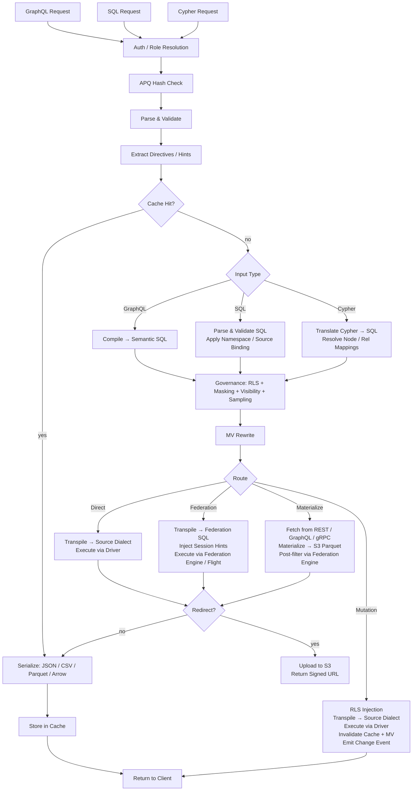

# Architecture de Provisa

## Vue d'ensemble

Provisa est une plateforme de virtualisation de données pilotée par configuration, conçue spécifiquement pour alimenter une couche sémantique, des petites équipes aux grandes entreprises. Elle fournit une API unifiée sur des sources de données hétérogènes avec gouvernance, sécurité et optimisation des performances. Les clients interrogent via SQL, GraphQL ou Cypher ; les trois sont des interfaces de premier ordre avec exactement la même gouvernance appliquée. (REQ-002, REQ-038)

La distinction de la couche sémantique est importante. Pour ajouter du contenu à la couche sémantique, il faut créer de nouvelles sources de données ou des agrégats au sein de la couche de virtualisation de données. Cela crée une séparation nette : aucun ajout à la sémantique ne peut être effectué en dehors de la plateforme, ce qui permet une véritable gouvernance des données. (REQ-136) L'application se fait au niveau du compilateur : le catalogue de relations approuvé est la source de vérité, quel que soit le langage de requête utilisé. (REQ-002)

Provisa est conçu pour être hautement performant pour les besoins opérationnels et hautement évolutif pour les besoins analytiques d'entreprise. Une seule plateforme répond aux deux besoins sans sacrifier la vitesse ni l'évolutivité.

```
Config YAML → PG Metadata → Federation Catalogs
                               ↓
         Federation engine metadata → Schema Generator → SDL / SQL catalog / Cypher labels / gRPC proto (per role)
                                     ↓
                     Query → Parser → SQL Compiler → Transpiler
                                     ↓
                             Router (Smart Dispatch)
                         /           |            \
                    Federation  Direct PG      Direct MySQL/etc.
                         \           |            /
                              Executor Pool
                                     ↓
                         ┌───── Inline ─────┐     ┌──── Redirect ────┐
                         │  JSON (HTTP)     │     │  CTAS → S3       │
                         │  Arrow (Flight)  │     │  (Parquet, ORC)  │
                         │  Protobuf (gRPC) │     │  Provisa → S3    │
                         └─────────────────-┘     │  (JSON, CSV, …)  │
                                                  └─────────────────-┘
```

## Interfaces de requête

Chaque interface est un transport distinct. Les quatre appliquent le même pipeline de sécurité (RLS, masquage, échantillonnage, vérifications de rôle). (REQ-002, REQ-038) Les clients ne communiquent jamais directement avec le moteur de fédération. (REQ-266) Le « langage de requête » (SQL / GraphQL / Cypher) est orthogonal au transport — plusieurs langages peuvent arriver via le même transport.

| Port | Transport | Accepted query languages | Use case |
|------|-----------|--------------------------|----------|
| 8001 | HTTP | GraphQL, SQL, Cypher | Web clients, BI tools, curl, REST consumers |
| 8815 | Arrow Flight (gRPC) | SQL (via Arrow Flight SQL) | Data tools (Pandas, DuckDB, Spark, ADBC) |
| 50051 | Protobuf gRPC | Per-role generated proto RPCs | Service-to-service with typed contracts |
| configurable¹ | PostgreSQL wire protocol (pgwire) | SQL | psql, DBeaver, SQLAlchemy, any PG-compatible client |

¹ Définir `PROVISA_PGWIRE_PORT` (p. ex. 5433). Désactivé si non défini ou égal à `0`.

### HTTP (port 8001)

Plusieurs endpoints sous le même port, distingués par chemin :

| Path | Language | Notes |
|------|----------|-------|
| `POST /data/graphql` | GraphQL | Reads and mutations; APQ hash accepted via `extensions.persistedQuery` |
| `POST /data/sql` | SQL | Read-only; no capability gate — governed by object visibility + RLS + masking (REQ-001, REQ-267) |
| `POST /data/query` | Cypher | Read-only; standard role |
| `GET /data/nl` | Natural language | Translates to SQL/GraphQL/Cypher based on source type |
| `GET /data/subscribe/{table}` | GraphQL | SSE subscription stream |
| `GET /neo4j/...` | Cypher (Neo4j compat) | Neo4j HTTP API compatibility shim |
| `POST /admin/graphql` | GraphQL | Admin API (superuser/admin role required) |

Tous les chemins renvoient du JSON par défaut. `Accept: text/csv`, `application/vnd.apache.parquet`, `application/vnd.apache.arrow.stream` et `application/octet-stream` (binaire brut) sont pris en charge via la négociation de contenu. Les résultats dépassant le seuil de taille configuré sont automatiquement redirigés vers une URL S3 signée. (REQ-029, REQ-137)

### Arrow Flight (port 8815)

Transport columnaire natif Arrow sur gRPC. (REQ-045, REQ-143) Les clients envoient un ticket JSON :
```json
{"query": "SELECT name, email FROM customers", "role": "analyst"}
```
et reçoivent des RecordBatches Arrow diffusés de manière différée. Lorsque le proxy Zaychik Flight SQL est disponible, les données circulent sous forme d'un flux de lots d'enregistrements Arrow de bout en bout : (REQ-144)

```
Client ←(Arrow batches)← Provisa Flight Server ←(Arrow batches)← Zaychik ←(JDBC)← Federation Engine
```

Le résultat complet n'est jamais matérialisé dans la mémoire de Provisa — les lots sont transmis au fur et à mesure de leur arrivée. (REQ-145) Cela fait d'Arrow Flight une voie sans limite, adaptée à des résultats arbitrairement volumineux.

### Protobuf gRPC (port 50051)

`.proto` généré automatiquement à partir du schéma de données, généré par rôle. (REQ-525) Requêtes en flux (un message par ligne), mutations unaires. Réflexion du serveur activée. (REQ-526) Le rôle est transmis via la clé de métadonnées `x-provisa-role`.

### Protocole filaire PostgreSQL / pgwire (port configurable)

Implémente le protocole filaire frontend/backend de PostgreSQL à l'aide de la bibliothèque `buenavista`. (REQ-527) Tout client compatible PostgreSQL — `psql`, DBeaver, SQLAlchemy avec `psycopg2`, JDBC — peut se connecter sans modification. Accepte uniquement SQL. Le pipeline de gouvernance complet (RLS, masquage, autorisations de domaine) s'applique de manière identique aux connexions pgwire. (REQ-266, REQ-002) Activé en définissant `PROVISA_PGWIRE_PORT` sur un port non nul.

## Pipeline de requêtes

Trois langages de requête sont acceptés. Tous convergent vers la gouvernance après leurs étapes respectives d'analyse/compilation. (REQ-262, REQ-263) Seul GraphQL prend en charge les écritures. (REQ-037) Il n'existe aucune porte de capacité sur la requête elle-même — toute identité authentifiée peut interroger dans n'importe quel langage, et les données sont gouvernées uniquement par la visibilité des objets, le RLS et le masquage. (REQ-001)

| Interface | Reads | Writes | Query gate |
|---|---|---|---|
| GraphQL (`/data/graphql`) | Yes | Yes (mutations) | None — data-layer governance only |
| SQL (`/data/sql`) | Yes | No | None — data-layer governance only (REQ-267) |
| Cypher (`/data/query`) | Yes | No | None — data-layer governance only |



**Décisions de routage :**

| Route | When |
|---|---|
| **Cache** | Result cache hit — evaluated first, serves the stored result with no execution (REQ-865) |
| **Cheap-count** | `count(*)`-shaped query over an unmaterialized source that exposes an exact native count — routed to the native count call instead of materializing to count (REQ-875) |
| **Direct** | Single source + has native driver + has federation connector |
| **Federation** | Multi-source federation, or source has connector but no driver |
| **Materialize** | Source has no federation connector — fetch and cache to S3/PG first |
| **Mutation** | GraphQL mutation — always direct, never federated |

Le routage consomme la sortie de l'étape d'optimisation postérieure à la gouvernance, jamais le SQL gouverné antérieur à l'optimisation. La gouvernance peut AJOUTER des sources (prédicats de sous-requête RLS) ; l'étape d'optimisation peut les SUPPRIMER (intégration VALUES-CTE des tables actives, réécritures de cache API, élagage des branches d'union). Une requête fédérée qui se réduit à une seule source active après intégration est donc réacheminée en direct. (REQ-863)

### Requêtes à racines multiples

Les requêtes GraphQL comportant plusieurs champs racines (p. ex. `{ orders { id } customers { name } }`) sont compilées en requêtes SQL distinctes et exécutées indépendamment. (REQ-534) Les requêtes SQL et Cypher sont par définition à racine unique. Les résultats sont fusionnés en une seule réponse :
- Les champs sous le seuil de redirection sont renvoyés en ligne dans `data`
- Les champs dépassant le seuil sont redirigés, avec des entrées par champ dans `redirects`
- Les formats binaires (Parquet, Arrow) ne sont pris en charge que pour les requêtes à racine unique

## Voies d'exécution de la fédération

| Path | Transport | Via | When used |
|------|-----------|-----|-----------|
| REST | federation engine client (HTTP :8080) | Direct query | Default, always available |
| Flight SQL | `adbc-driver-flightsql` (gRPC :8480) | Zaychik proxy → JDBC | When Zaychik is running |
| CTAS | federation engine client (HTTP :8080) | Direct write, Iceberg to S3 | Parquet/ORC redirect |

### Proxy Zaychik Arrow Flight SQL

Le moteur de fédération ne prend pas en charge nativement le protocole Arrow Flight SQL. [Zaychik](https://github.com/Raiffeisen-DGTL/zaychik-trino-proxy) est un proxy Java qui implémente l'interface gRPC Arrow Flight SQL, traduit les requêtes en requêtes JDBC et renvoie les résultats sous forme de lots d'enregistrements Arrow. (REQ-144)

```
ADBC client → gRPC :8480 → Zaychik → JDBC :8080 → Federation Engine → results → Arrow batches → client
```

Le serveur Flight de Provisa (port 8815) se connecte à Zaychik en tant que client ADBC, permettant une diffusion Arrow de bout en bout sans matérialiser les résultats. (REQ-145)

### Catalogue de résultats Iceberg

La redirection CTAS utilise un connecteur Iceberg (catalogue `results`) adossé à un catalogue JDBC sur l'instance PostgreSQL existante. (REQ-169) Iceberg écrit les fichiers Parquet/ORC directement sur MinIO/S3 via le système de fichiers natif S3 (`fs.native-s3.enabled=true`).

## Moteurs de fédération

Provisa sélectionne un moteur de fédération au démarrage via la variable d'environnement `PROVISA_ENGINE`, la configuration persistée de l'UI d'administration, ou la valeur par défaut. Lorsque rien n'est défini, DuckDB est le choix par défaut — entièrement in-process, sans service externe (REQ-989). Voir [Configuration](configuration.md#moteur-de-federation) pour le détail de la sélection.

Chaque moteur est une instance de `FederationEngine` définie dans `provisa/federation/engine.py`. L'instance possède une collection de connecteurs qui détermine quels types de source le moteur peut lire en direct (ATTACH), par opposition à ceux qui doivent d'abord atterrir dans le magasin de matérialisation du moteur. [tool-verified: `engine.py` `_ENGINE_BUILDERS`, `ENGINE_REGISTRY`]

### Classes de driver (REQ-840) [tool-verified: `engine.py` `DriverClass`]

| Class | Meaning | Examples |
|-------|---------|---------|
| `BROAD` | Reaches many external source types via native connectors | Trino |
| `PARTIAL` | Reaches a subset (relational, files, cloud object/lake) plus lands everything else | DuckDB, PostgreSQL, ClickHouse, Databricks, Snowflake, BigQuery, Fabric, Synapse |
| `SELF_ONLY` | Reaches only its own store; every other source lands in | SQLAlchemy |

### Moteurs disponibles [tool-verified: `engine.py` `_ENGINE_BUILDERS`]

| Engine key | Dialect | MPP | External-link mechanism | Auth |
|-----------|---------|-----|------------------------|------|
| `trino` / `trino-byo` | Trino SQL | Yes | Trino catalogs (broad connector set) | JDBC credentials |
| `pg` | PostgreSQL | No | FDW / pg_duckdb | PostgreSQL credentials |
| `duckdb` | DuckDB | No | Extension-native ATTACH | None (in-process) |
| `clickhouse` / `clickhouse-server` | ClickHouse | Yes (shards) | S3 / IcebergS3 / DeltaLake table engines (REQ-986) | ClickHouse credentials |
| `snowflake` | Snowflake | Yes | External stage + external table (REQ-988) | `PROVISA_ENGINE_URL` |
| `databricks` | Databricks SQL | Yes | Unity Catalog external tables via REST (REQ-987) | Bearer token (`http_path` in `federation_hints`) |
| `bigquery` | BigQuery | Yes (Dremel) | BigQuery external / BigLake tables | `GOOGLE_APPLICATION_CREDENTIALS` service-account key |
| `fabric` | T-SQL | Yes | OneLake shortcuts → OPENROWSET | Azure AD (`az login` / managed identity) |
| `synapse` | T-SQL | Yes | ADLS OPENROWSET / external tables | Azure AD |
| `sqlalchemy` | Any SQLAlchemy dialect | No | None (land-only) | Per-dialect credentials |

### Valeur par défaut sans configuration : DuckDB (REQ-989) [tool-verified: `engine.py` `build_duckdb_engine`, `_embedded_duckdb_materialize_default`]

Lorsque `PROVISA_ENGINE` n'est pas défini, Provisa utilise le moteur DuckDB entièrement embarqué in-process. Le magasin de matérialisation de DuckDB est un fichier DuckDB embarqué situé à `$PROVISA_DATA_DIR/materialize.duckdb` (par défaut `~/.provisa/materialize.duckdb`). Aucune base de données ni service externe n'est requis.

Comme DuckDB impose un seul rédacteur (writer) par fichier, `store_connection.py` écrit dans le magasin embarqué via la propre connexion du moteur — jamais via une seconde connexion indépendante. C'est le seul cas où le moteur et le magasin de matérialisation partagent un descripteur de fichier par conception. [tool-verified: `store_connection.py` module docstring]

### Transport de lecture natif Arrow (REQ-986, REQ-987, REQ-988) [tool-verified: `engine.py` `build_*_engine` `capabilities=`]

ClickHouse, DuckDB, Snowflake, Databricks, BigQuery, Fabric et Synapse annoncent tous `EngineCapability.ARROW` et `EngineCapability.ARROW_STREAM`. Les requêtes exécutées sur ces moteurs renvoient directement des RecordBatches Arrow — le chemin de sérialisation ligne par ligne est entièrement contourné. Le serveur Flight diffuse ces lots aux clients sans matérialiser le résultat complet dans la mémoire de processus de Provisa. Pour Trino, la diffusion Arrow repose sur le proxy Zaychik ; pour les moteurs d'entrepôt de données, l'API native Arrow propre à chaque moteur (Cloud Fetch pour Databricks, Storage Read API pour BigQuery, `fetch_arrow_table` pour DuckDB et Snowflake) alimente le flux Flight.

### Liens de données externes (ATTACH) [tool-verified: `engine.py` `_warehouse_connectors`]

Chaque moteur d'entrepôt de données peut scanner des données d'objets/lacs cloud sur place, sans en atterrir de copie. Les fichiers Parquet, CSV, Iceberg et Delta Lake sur S3, GCS ou OneLake s'attachent directement au moteur comme s'il s'agissait de tables natives. La stratégie — ATTACH (scan sur place) ou LAND (copie dans le magasin) — est déterminée par le `Mechanism` déclaré du connecteur ; aucune ramification spécifique au moteur n'existe dans le planificateur. Un connecteur `Mechanism.ATTACH_R` déclenche un scan sans copie ; un connecteur `Mechanism.DIRECT` ou l'absence de connecteur déclenche un atterrissage. [tool-verified: `connector_base.py` `Mechanism`, `engine.py` `_warehouse_connectors`]

L'attachement provisionne automatiquement tous les prérequis au moment de l'attachement :

| Engine | Object/lake formats | Mechanism | Auto-provisioning [tool-verified] |
|--------|-------------------|----------|----------------------------------|
| Databricks | parquet, csv, iceberg, delta_lake | UC external table (`ATTACH_R`) | REST installs Unity Catalog storage credential + external location, then `CREATE TABLE … USING <format> LOCATION …` — live-verified over Cloudflare R2 |
| BigQuery | parquet, csv, json, iceberg, delta_lake | BigQuery external / BigLake table (`ATTACH_R`) | `CREATE OR REPLACE EXTERNAL TABLE … OPTIONS(format=…, uris=[…])` — live-verified |
| ClickHouse | csv, parquet, iceberg, delta_lake | S3 / IcebergS3 / DeltaLake table engine (`ATTACH_R`) | Validation probe executed at attach time — live-verified over Cloudflare R2 |
| Fabric | parquet, csv, iceberg, delta_lake | OneLake shortcut → OPENROWSET (`ATTACH_R`) | REST creates an `AmazonS3Compatible` connection + lakehouse + shortcut; returns the OneLake `BULK` path — live-verified reading R2 through Fabric |
| Snowflake | parquet, csv, json, iceberg, delta_lake | External stage + external table (`ATTACH_R`) | `CREATE STAGE … URL=… CREDENTIALS=…`, then `CREATE OR REPLACE EXTERNAL TABLE … LOCATION=@stage FILE_FORMAT=(TYPE=…)` — implemented; not live-tested (no account available) |

Les identifiants pour le stockage cloud circulent dans le `federation_hints` de la source (voir [Sources](sources.md#entrepots-en-tant-que-sources-nommees)). Tout type de source ne pouvant pas faire d'ATTACH atterrit d'abord dans le magasin de matérialisation du moteur.

### Écritures de matérialisation columnaire (REQ-990) [tool-verified: `core/database.py:436`, `store_connection.py:99`]

`Connection.bulk_copy` dans `provisa/core/database.py` choisit la voie d'ingestion en masse la plus rapide selon le dialecte du magasin : `COPY` binaire (`copy_records_to_table` d'asyncpg) pour les magasins PostgreSQL, et une unique instruction préparée `executemany` pour tous les autres magasins relationnels. Le magasin embarqué DuckDB atterrit via `land_duckdb_native` dans `store_connection.py` — un seul appel `executemany` pour l'ensemble du lot, jamais une boucle ligne par ligne.

## Redirection des résultats volumineux

Les résultats dépassant un seuil de lignes sont redirigés vers un stockage compatible S3 (MinIO) au lieu d'être renvoyés en ligne. (REQ-029)

### Modes de redirection

| Mode | How it works | Data touches Provisa? |
|------|-------------|----------------------|
| **CTAS** (Parquet, ORC) | Federation engine writes directly to S3 via `CREATE TABLE AS SELECT` | No |
| **Provisa upload** (JSON, NDJSON, CSV, Arrow IPC) | Provisa serializes and uploads via boto3 | Yes |

Pour les formats natifs CTAS, Provisa ne manipule jamais les données — le moteur de fédération écrit les fichiers directement sur MinIO/S3. (REQ-138) C'est la voie privilégiée pour les exportations analytiques volumineuses.

### En-têtes de redirection

| Header | Effect |
|--------|--------|
| `X-Provisa-Redirect-Format: <mime>` | Redirect in this format (implies force unless threshold set) |
| `X-Provisa-Redirect-Threshold: N` | Only redirect if result exceeds N rows |
| `X-Provisa-Redirect: true` | Force redirect using default format |

Ces en-têtes mettent en œuvre la redirection contrôlée par le client. (REQ-137)

**Réponse :**
```json
{
  "data": {"orders": null},
  "redirect": {
    "redirect_url": "https://minio:9000/provisa-results/results/abc.parquet?...",
    "row_count": 50000,
    "expires_in": 3600,
    "content_type": "application/vnd.apache.parquet"
  }
}
```

### Configuration du serveur

| Env var | Default | Purpose |
|---------|---------|---------|
| `PROVISA_REDIRECT_ENABLED` | `false` | Enable server-side threshold redirect |
| `PROVISA_REDIRECT_THRESHOLD` | `1000` | Default row count threshold |
| `PROVISA_REDIRECT_FORMAT` | `parquet` | Default redirect format |
| `PROVISA_REDIRECT_BUCKET` | `provisa-results` | S3 bucket name |
| `PROVISA_REDIRECT_ENDPOINT` | | S3-compatible endpoint URL |
| `PROVISA_REDIRECT_TTL` | `3600` | Presigned URL TTL (seconds) |

## Arbre de décision de routage

```
Multi-source query? → Federation engine
NoSQL source (MongoDB, Cassandra)? → Federation engine
Uses path columns on non-PG source? → Federation engine
Single RDBMS with driver? → Direct (sub-100ms target)
Single RDBMS without driver? → Federation engine
Steward hint "federated"? → Federation engine (override)
Steward hint "direct"? → Direct (if possible)
Redirect to Parquet/ORC? → Federation engine (CTAS, regardless of source count)
```

(REQ-027, REQ-028, REQ-030, REQ-279)

## Optimisation des requêtes de fédération

Provisa amorce automatiquement l'optimiseur à base de coûts du moteur de fédération afin que les plans de requête inter-sources reposent sur la distribution réelle des données, et non sur des valeurs par défaut codées en dur.

### Statistiques automatiques (`ANALYZE`)

Lors de l'enregistrement d'une source, Provisa exécute `ANALYZE catalog.schema.table` pour chaque table publiée. (REQ-275) Cela recueille :

- Le nombre de lignes
- Par colonne : la fraction de valeurs nulles, le nombre de valeurs distinctes, le min/max, les histogrammes (selon le connecteur)

L'optimiseur utilise ces données pour estimer la sélectivité des requêtes filtrées. Sans statistiques, il se rabat sur des valeurs par défaut fixes (p. ex. 10 % de sélectivité pour les prédicats d'égalité), qui produisent de mauvais plans de jointure sur des données asymétriques ou à forte cardinalité. Avec des statistiques, les estimations sont suffisamment précises pour prendre les bonnes décisions entre jointure par diffusion (broadcast) et jointure partitionnée pour la plupart des charges de travail.

**Couverture** : la prise en charge des statistiques varie selon le connecteur. PostgreSQL, MySQL, Hive, Iceberg et Delta Lake prennent entièrement en charge `ANALYZE`. Les connecteurs MongoDB et Cassandra offrent une prise en charge partielle ou nulle. Provisa absorbe silencieusement les échecs d'`ANALYZE` — l'enregistrement n'est jamais bloqué. (REQ-275)

**Limites de sélectivité** : les statistiques fournissent des estimations par colonne. Pour les prédicats corrélés (`WHERE region = 'US' AND city = 'Seattle'`), l'optimiseur suppose l'indépendance des colonnes, ce qui peut sous-estimer le nombre de lignes. Il s'agit d'une limitation connue des statistiques au niveau des colonnes dans tous les optimiseurs à base de coûts.

**Sources API** : les tables `api_cache_{table_name}` dans PostgreSQL sont analysées automatiquement après chaque cycle de rafraîchissement du cache, de sorte que l'optimiseur dispose d'estimations de lignes à jour lors de la jointure de sources adossées à des API avec des sources relationnelles. (REQ-280)

### Administration : rafraîchir les statistiques

Relancez la collecte de statistiques à la demande via l'API d'administration : (REQ-276)

```graphql
mutation {
  refreshSourceStatistics(sourceId: "sales-pg") {
    tablesAnalyzed
    failures { table message }
  }
}
```

Utile lorsqu'une source a reçu de nouvelles données significatives depuis son enregistrement.

## Vues matérialisées

Les vues matérialisées (MV) optimisent de manière transparente les requêtes coûteuses en précalculant et en mettant en cache les résultats.

### Les relations comme indices pour les MV

Une déclaration de relation n'est pas seulement un artefact de gouvernance — c'est aussi la description structurelle d'une forme de jointure. Cette forme est exactement ce dont l'optimiseur de MV a besoin : deux tables, deux colonnes, un type de jointure. Cela signifie qu'une relation peut directement piloter la matérialisation.

Pour les **relations inter-sources**, cela se produit automatiquement au démarrage : chaque relation inter-sources approuvée génère une MV `JoinPattern` (`auto-mv-<rel_id>`). (REQ-158) Aucune configuration de MV distincte n'est requise. Lorsque le compilateur détecte cette jointure dans une requête, le réécrivain substitue le résultat prématérialisé de manière transparente.

Pour les **relations de même source**, les stewards peuvent opter explicitement via `materialize: true`. Les JOIN de même source sont déjà rapides via l'exécution directe, la matérialisation n'est donc intéressante que pour les chemins de jointure très sollicités. (REQ-159)

Conséquence pratique : les stewards qui approuvent une relation décident implicitement si la jointure est une bonne candidate à la matérialisation. L'acte de gouvernance et l'indice d'optimisation sont une seule et même déclaration.

### Modes

| Mode | Config | Behavior |
|------|--------|----------|
| **Join-pattern** | `join_pattern` in MV config | Rewrites matching JOINs to read from MV table |
| **Custom SQL** | `sql` in MV config | Arbitrary SELECT, optionally exposed in SDL |
| **Auto-materialized relationship** | cross-source relationship (automatic) | Auto-generates a join-pattern MV; no config required |
| **Steward-materialized relationship** | `materialize: true` on same-source relationship | Explicit opt-in for hot same-source join paths |

### Matérialisation automatique

Les JOIN inter-sources sont les requêtes les plus coûteuses (toujours fédérées). Les relations inter-sources génèrent automatiquement des définitions de MV au démarrage : (REQ-158)

```yaml
relationships:
  - id: orders-to-reviews
    source_table_id: orders        # sales-pg
    target_table_id: product_reviews  # reviews-mongo
    source_column: product_id
    target_column: product_id
    cardinality: one-to-many
    materialize: true              # auto-create MV
    refresh_interval: 600          # refresh every 10 minutes
```

Seules les relations inter-sources génèrent des MV (les JOIN de même source sont déjà rapides via l'exécution directe). (REQ-159) La MV démarre en statut `STALE` et est rafraîchie par la boucle de rafraîchissement en arrière-plan avant d'être utilisée par l'optimiseur de requêtes. (REQ-160)

### Cycle de vie du rafraîchissement

```
STALE → (refresh loop picks up) → REFRESHING → FRESH
  ↑                                                |
  └──── mutation hits source table ────────────────┘
```

La boucle de rafraîchissement s'exécute toutes les 30 secondes, vérifie `get_due_for_refresh()`, et exécute `CREATE TABLE AS SELECT` (première exécution) ou `DELETE + INSERT` (exécutions suivantes) sur la table cible de la MV via le moteur de fédération. (REQ-160, REQ-234)

## Plan des modules

| Module | Purpose |
|--------|---------|
| `api/` | FastAPI app, routers, middleware, lifespan management |
| `api/flight/` | Arrow Flight server (gRPC, port 8815) |
| `api/admin/` | Strawberry GraphQL admin API — config, discovery, views |
| `api/rest/` | Auto-generated REST endpoints from registered tables |
| `api/jsonapi/` | Auto-generated JSON:API endpoints with pagination and error handling |
| `api/data/subscribe.py` | SSE subscriptions — LISTEN/NOTIFY, polling, Debezium CDC |
| `compiler/` | GraphQL/SQL parsers, semantic SQL generator, RLS, masking, sampling, two-stage governance (`stage2.py`) |
| `cypher/` | Cypher → SQL translator, parser, label map (REQ-351), write translator for Cypher mutations |
| `pgwire/` | PostgreSQL wire-protocol server; `catalog.py` intercepts pg_catalog/information_schema for per-role object visibility (REQ-527, REQ-883, REQ-891) |
| `vector/` | Vector search — model registry, embedding providers (openai/ollama/huggingface), `cosine_similarity()` translation, pgvector fallback cache, declarative embedding generation (REQ-419–431) |
| `compiler/federation.py` | Apollo Federation v2 subgraph support |
| `transpiler/` | Dialect transpilation, routing logic |
| `executor/` | Federated/direct execution, serialization, output formats |
| `executor/drivers/` | Direct source drivers (PostgreSQL, MySQL, DuckDB, Snowflake, Databricks, ClickHouse, …) |
| `executor/trino_flight.py` | ADBC Flight SQL client for the federation engine |
| `executor/ctas_write.py` | CTAS-based redirect (federation engine writes to S3) |
| `executor/redirect.py` | S3 redirect logic, Provisa-side upload |
| `federation/engine.py` | `FederationEngine`, `DriverClass`, `_ENGINE_BUILDERS`, `ENGINE_REGISTRY`, `build_engine` |
| `federation/connector.py` | Connector abstractions — Trino, ClickHouse; `Mechanism`, `WarehouseNativeConnector` |
| `federation/connector_duckdb.py` | DuckDB and PostgreSQL FDW connector definitions |
| `federation/snowflake_connectors.py` | Snowflake external stage + external table ATTACH connectors (REQ-988) |
| `federation/databricks_connectors.py` | Databricks UC external table ATTACH connectors (REQ-987) |
| `federation/bigquery_connectors.py` | BigQuery external / BigLake ATTACH connectors |
| `federation/databricks_uc.py` | Unity Catalog credential + external location auto-provisioning |
| `federation/databricks_backend.py` | Databricks SQL warehouse execution backend |
| `federation/snowflake_backend.py` | Snowflake execution backend |
| `federation/bigquery_backend.py` | BigQuery execution backend (Storage Read API Arrow transport) |
| `federation/mssql_warehouse_backend.py` | Fabric Warehouse + Synapse execution backends (T-SQL over ODBC) |
| `federation/mssql_warehouse_connectors.py` | OPENROWSET ATTACH connectors for Fabric / Synapse |
| `federation/fabric_shortcuts.py` | OneLake shortcut auto-provisioning (connection → lakehouse → shortcut) |
| `federation/clickhouse_backend.py` | ClickHouse execution backend |
| `federation/duckdb_backend.py` | DuckDB in-process execution backend |
| `federation/pg_backend.py` | PostgreSQL execution backend |
| `federation/store_connection.py` | DuckDB-native materialization store write face (REQ-989, REQ-990) |
| `registry/` | Persisted query registry, governance |
| `security/` | Visibility, rights, column masking |
| `cache/` | Redis-backed query result caching (hot tier) |
| `mv/` | Materialized view registry, refresh, SQL rewriter |
| `events/` | Dataset change events and trigger dispatch |
| `webhooks/` | Outbound webhook execution for mutations and events |
| `scheduler/` | APScheduler-based background job management — cron and interval triggers that fire webhooks, mutations, or Kafka sink publishes |
| `apq/` | Apollo APQ wire protocol — Redis-backed query hash cache; separate from result caching |
| `compiler/cursor.py` | Relay-style cursor pagination — `first`/`after`/`last`/`before` arguments and `pageInfo` generation on all list queries |
| `compiler/aggregate_gen.py` | Auto-generated `{table}_aggregate` query types with `count`, `sum`, `avg`, `min`, `max` sub-fields and filtered `nodes` access |
| `compiler/enum_detect.py` | Enum type auto-detection — PostgreSQL native enum types (`pg_enum`) exposed as GraphQL enum types rather than string scalars |
| `compiler/hints.py` | Federation performance hints — query-level routing directives embedded as SQL comments (`/* @provisa route=federated */`) that override automatic routing |
| `compiler/mutation_gen.py` | Mutation compiler; column presets — server-side static or session-variable values applied on insert/update, not exposed in the mutation input type |
| `auth/approval_hook.py` | ABAC approval hook — pluggable external authorization called before query execution; webhook, gRPC, and unix_socket transports; per-table/source/global scope; configurable fallback policy |
| `subscriptions/` | SSE subscription state and delivery |
| `discovery/` | LLM relationship discovery (Claude API) |
| `grpc/` | Proto generation, gRPC server, reflection |
| `api_source/` | REST/GraphQL/gRPC API sources with PG cache |
| `kafka/` | Kafka topic sources, sink, Schema Registry |
| `auth/` | Pluggable auth providers, middleware, role mapping |
| `core/` | Config, models, DB, repositories, secrets; role model supports `parent_role_id` and `flatten_roles()` for recursive role inheritance |
| `hasura_v2/` | Hasura v2 metadata → Provisa config converter |
| `ddn/` | Hasura DDN supergraph → Provisa config converter |
| `mongodb/` | MongoDB source connector |
| `elasticsearch/` | Elasticsearch source connector |
| `cassandra/` | Cassandra source connector |
| `prometheus/` | Prometheus metrics source connector |
| `source_adapters/` | Generic adapter layer for source connections |

## API d'administration

L'API GraphQL d'administration Strawberry est montée sur `/admin/graphql` (port HTTP 8001). Elle est distincte de l'endpoint GraphQL de données et requiert le rôle superutilisateur ou administrateur.

| Capability | Description |
|-----------|-------------|
| Config download/upload | Export or replace the full Provisa YAML config |
| Relationship editor | Create, update, delete relationship definitions |
| AI FK discovery | Trigger Claude-powered FK candidate analysis |
| Schema introspection | Browse published tables, columns, and roles |
| View management | Register and manage materialized view definitions |

(REQ-164, REQ-165, REQ-166, REQ-167)

## Endpoints REST et JSON:API générés automatiquement

Les tables enregistrées sont exposées comme endpoints REST et JSON:API en plus de l'interface GraphQL. (REQ-256, REQ-257)

| Interface | Mount path | Spec |
|-----------|-----------|------|
| REST | `/rest/<table-id>` | Simple GET/POST with query parameters |
| JSON:API | `/jsonapi/<table-id>` | [jsonapi.org](https://jsonapi.org) compliant — pagination, relationships, error objects |

Ces endpoints appliquent le même pipeline de sécurité (RLS, masquage, vérifications de rôle) que l'endpoint GraphQL. (REQ-002, REQ-038)

## Abonnements

Les abonnements SSE sont servis sur `GET /data/subscribe/{table}`. Trois modes de livraison : (REQ-258)

| Mode | Mechanism | When used |
|------|-----------|-----------|
| **LISTEN/NOTIFY** | PostgreSQL `LISTEN` on a channel | PG sources with mutation activity |
| **Polling** | Re-execute query on interval | Non-PG sources, or when CDC unavailable |
| **Debezium CDC** | Kafka topic from Debezium connector | High-frequency change streams |

(REQ-258, REQ-260, REQ-261)

Le client reçoit `text/event-stream` avec un événement JSON par ligne modifiée ou par différence.

## Système d'événements et de webhooks

Les mutations de base de données (INSERT/UPDATE/DELETE) peuvent déclencher des événements sortants via les modules `events/` et `webhooks/`. (REQ-172, REQ-173, REQ-220)

```
Mutation executed → EventDispatcher → match event trigger rules
                                          ↓
                               WebhookExecutor → HTTP POST to configured URL
```

Les déclencheurs d'événements sont définis dans la configuration et associés par table, type d'opération et filtre de ligne optionnel. Les charges utiles de webhook incluent le type d'opération, la ligne modifiée et le contexte de rôle.

## Services en arrière-plan

Quatre boucles en arrière-plan démarrent pendant le cycle de vie de l'application (`api/app.py`) :

| Service | Interval | Purpose |
|---------|----------|---------|
| MV refresh loop | 30 s | Polls `get_due_for_refresh()`, executes CTAS or DELETE+INSERT on stale MVs |
| Warm table manager | Configurable | Promotes frequently-queried tables to Iceberg local SSD cache |
| Hot table loader | Configurable | Loads small reference tables into in-memory cache for sub-millisecond access |
| API source poller | Per-source interval | Re-fetches and re-caches remote REST/GraphQL/gRPC sources |

(REQ-160, REQ-238, REQ-239, REQ-236)

### Niveaux de mise en cache des tables actives/tièdes

| Tier | Storage | Promotion criteria | Access latency |
|------|---------|-------------------|----------------|
| Hot | In-process memory | Row count < threshold, or is a relationship target | <1 ms |
| Warm | Iceberg on local SSD | Query frequency threshold exceeded | ~5–20 ms |
| Cold | Remote source | Default | 50–500 ms |

(REQ-230, REQ-236, REQ-238, REQ-241)

## Importation de métadonnées (Hasura v2 / DDN)

Les déploiements Hasura existants peuvent être convertis en configuration Provisa sans réécriture manuelle. (REQ-182, REQ-183)

| Module | Input | Output |
|--------|-------|--------|
| `hasura_v2/` | Hasura v2 `metadata.yaml` | Provisa `config.yaml` |
| `ddn/` | Hasura DDN supergraph JSON | Provisa `config.yaml` |

Les deux convertisseurs mappent les tables suivies, les relations, les autorisations et les schémas distants. Le résultat est une configuration Provisa complète, prête pour le déploiement. (REQ-182, REQ-183)

## Apollo Federation

`compiler/federation.py` expose Provisa comme un sous-graphe Apollo Federation v2. (REQ-259) Le SDL du sous-graphe est généré automatiquement à partir du schéma publié, avec des directives `@key` sur les colonnes de clé primaire et des annotations `@external`/`@provides` sur les relations inter-sous-graphes. Provisa répond aux requêtes `_entities` et `_service` requises par la passerelle de fédération. (REQ-259)

## Pagination par curseur

Toutes les requêtes de liste prennent en charge la pagination par curseur de style Relay via `compiler/cursor.py`. (REQ-218) Les clients passent des arguments `first`/`after` (vers l'avant) ou `last`/`before` (vers l'arrière). Le compilateur encode la position de la ligne sous forme de curseur opaque en base64 et injecte les clauses `WHERE`/`LIMIT` appropriées. Chaque requête de liste renvoie un objet `pageInfo` :

| Field | Type | Description |
|-------|------|-------------|
| `hasNextPage` | Boolean | True if more results exist after this page |
| `hasPreviousPage` | Boolean | True if results exist before this page |
| `startCursor` | String | Cursor of the first node in this page |
| `endCursor` | String | Cursor of the last node in this page |

## Requêtes d'agrégation

Chaque table enregistrée obtient un champ racine `{table}_aggregate` généré automatiquement (`compiler/aggregate_gen.py`). (REQ-196) Le type d'agrégation expose `count`, `sum`, `avg`, `min`, `max` par colonne numérique, ainsi que `nodes` pour un accès filtré aux lignes avec sélection complète des champs (même RLS/masquage que la requête de base). (REQ-196, REQ-198) Les requêtes d'agrégation sont éligibles au routage vers une MV d'agrégation — voir `mv/aggregate_catalog.py`. (REQ-198)

## Requêtes persistées automatiques (APQ)

`apq/cache.py` implémente le protocole filaire APQ d'Apollo. (REQ-288) Lorsqu'un client envoie uniquement un hash de requête (`extensions.persistedQuery`), Provisa le recherche dans Redis. (REQ-289) En cas d'échec, il renvoie une erreur `PersistedQueryNotFound` ; le client réessaie avec le corps complet de la requête, que Provisa stocke. (REQ-288) Ceci est indépendant de la mise en cache des résultats (`cache/`).

## Rôles hérités

Les rôles dans `core/models.py` peuvent référencer un `parent_role_id`. (REQ-215) `flatten_roles()` résout de manière récursive la chaîne d'héritage et fusionne les clauses WHERE du RLS (avec ET logique), la visibilité des colonnes (union, la plus restrictive l'emporte) et les politiques de masquage (l'enfant remplace le parent par colonne). Cela évite de dupliquer des ensembles d'autorisations entre rôles similaires (p. ex. `analyst` héritant de `reader`). (REQ-215)

## Hook d'approbation ABAC

`auth/approval_hook.py` est un hook d'autorisation enfichable invoqué avant l'exécution de la requête, après le RLS et le masquage. (REQ-203) Il s'intègre à des moteurs de politiques externes (OPA, services ABAC personnalisés).

| Setting | Description |
|---------|-------------|
| Transport | `webhook` (HTTP POST), `grpc`, or `unix_socket` |
| Scope | Per-table, per-source, or global |
| Fallback policy | `allow` or `deny` when the hook endpoint is unreachable |

(REQ-246, REQ-247, REQ-204)

## Détection automatique des types énumérés

`compiler/enum_detect.py` introspecte les types énumérés natifs de PostgreSQL (`pg_enum`) au moment de la génération du schéma. (REQ-221) Les colonnes utilisant un type énuméré défini par l'utilisateur dans PostgreSQL sont promues en types énumérés GraphQL — leurs valeurs deviennent des membres d'énumération plutôt que des scalaires de type chaîne.

## Déclencheurs planifiés

`scheduler/jobs.py` utilise APScheduler pour exécuter des tâches en arrière-plan définies comme des déclencheurs cron ou à intervalle. (REQ-216) Chaque tâche peut envoyer un POST vers une URL de webhook, exécuter une mutation contre l'endpoint de données, ou publier des résultats de requête dans un topic Kafka. Les déclencheurs sont configurés via l'API d'administration (mutations `scheduledTrigger`) ou la clé `scheduled_triggers` dans la configuration YAML. (REQ-216)

## Indices de performance de la fédération

`compiler/hints.py` analyse les indices de steward intégrés dans les requêtes sous forme de commentaires, selon la syntaxe de commentaire de Provisa. (REQ-279) Le format de l'indice varie selon le langage de requête :

```graphql
# @provisa route=federated
{ orders { id amount } }
```
```sql
/* @provisa route=federated */
SELECT id, amount FROM orders
```
```cypher
// @provisa route=federated
MATCH (o:Order) RETURN o.id, o.amount
```

| Hint | Effect |
|------|--------|
| `route=federated` | Force federation through the federation engine, bypassing direct-driver routing |
| `route=direct` | Force direct-driver execution |

(REQ-279, REQ-277, REQ-278)

## Préréglages de colonnes dans les mutations

`compiler/mutation_gen.py` prend en charge des préréglages par colonne côté serveur, appliqués sur `INSERT` ou `UPDATE`. (REQ-214) Les préréglages ne sont pas inclus dans le type d'entrée de mutation GraphQL généré — ils sont injectés par le compilateur de manière transparente. Types de préréglage : `static` (valeur littérale) ou `session` (valeur provenant de la session/de l'en-tête de la requête, p. ex. `x-hasura-user-id`). (REQ-214)

## Explorateur de schéma GraphQL Voyager

L'UI d'administration (`provisa-ui/src/pages/SchemaExplorer.tsx`) intègre GraphQL Voyager comme outil interactif de visualisation de schéma. (REQ-248) Il affiche le schéma limité par rôle sous forme de diagramme entité-relation navigable — les tables comme nœuds, les relations comme arêtes. Le schéma affiché est toujours filtré selon le rôle actuellement sélectionné.

## Ordre d'application de la sécurité

Il n'existe aucune porte de capacité sur la requête — la gouvernance s'exprime entièrement via des contrôles de la couche de données. (REQ-001) Une requête SQL brute rejette (HTTP 403) toute table hors du périmètre d'objets du rôle avant même que la gouvernance ne s'exécute. (REQ-267)

1. **Visibilité des objets** : le schéma par rôle masque les tables/colonnes non autorisées ; les tables hors périmètre en SQL brut sont rejetées (REQ-039, REQ-267)
2. **Application des relations** : les traversées doivent exister dans le catalogue de relations approuvé, sauf si le rôle possède `ignore_relationships` (REQ-001)
3. **RLS** : injection de clause WHERE par table et par rôle (REQ-040, REQ-041, REQ-263)
4. **Masquage des colonnes** : transformation de données par colonne et par rôle (REQ-263)
5. **Plafond de lignes (LIMIT)** : plafond du nombre de lignes pour les rôles sans `full_results` ; l'échantillonnage statistique aléatoire est une fonctionnalité de requête utilisateur distincte (REQ-263, REQ-478)

Les quatre interfaces de requête (HTTP, Flight, gRPC, pgwire) appliquent le même pipeline de gouvernance de l'étape 2 ; aucune voie client ne peut le contourner sans contourner le serveur. (REQ-002, REQ-038, REQ-266)

## Limites d'évolutivité

Provisa est une couche de compilation et de routage légère — elle n'ajoute qu'une latence à un seul chiffre en millisecondes à la requête. Cependant, les voies où Provisa sérialise les données de résultat sont limitées par la mémoire du processus. Deux voies sont véritablement sans limite :

| Path | Memory bound? | Suitable for |
|------|--------------|-------------|
| JSON inline (HTTP) | Yes | Small-medium results |
| **Arrow Flight streaming (gRPC :8815)** | **No** | **Unbounded — streaming via Zaychik or warehouse Arrow API** |
| Protobuf gRPC inline (:50051) | Yes | Medium results, service-to-service |
| Redirect: Provisa upload (JSON, CSV, NDJSON, Arrow IPC) | Yes | Medium results, file download |
| **Redirect: CTAS (Parquet, ORC)** | **No** | **Unbounded — federation engine writes to S3** |

(REQ-145, REQ-138)

### Sondage de seuil

Pour la redirection basée sur un seuil, Provisa injecte `LIMIT threshold + 1` dans la requête comme sonde. (REQ-140) Si le résultat comporte moins de lignes, il est renvoyé en ligne (résultat complet, sans travail gaspillé). Si le résultat atteint la limite, la sonde est écartée et la requête complète est réexécutée via CTAS ou téléversement Provisa. Cela évite `SELECT COUNT(*)` (que certaines sources n'optimisent pas) et fonctionne sur toute source.

Pour les charges de travail analytiques volumineuses, utilisez l'une des options suivantes :
- **Arrow Flight** (port 8815) pour la diffusion vers des outils de données — les lots transitent par Provisa sans être matérialisés (REQ-145)
- **Redirection Parquet/ORC** pour les exports basés sur des fichiers — le moteur de fédération écrit directement sur S3, Provisa renvoie une URL présignée (REQ-138, REQ-044)

## Infrastructure

| Service | Image | Port | Purpose |
|---------|-------|------|---------|
| Provisa API | (host process) | 8001 | HTTP/REST endpoint |
| Provisa Flight | (host process) | 8815 | Arrow Flight gRPC server |
| Provisa gRPC | (host process) | 50051 | Protobuf gRPC server |
| Federation Engine | `trinodb/trino` (default) or external warehouse | 8080 / varies | Query federation engine — Trino for the embedded stack; Snowflake/Databricks/BigQuery/Fabric/Synapse/DuckDB for warehouse targets |
| Zaychik | `provisa-zaychik` (built from source) | 8480 | Arrow Flight SQL proxy for Trino; not required for warehouse engines |
| PostgreSQL | `postgres:16` | 5432 | Config metadata + Iceberg catalog |
| MongoDB | `mongo:7` | 27017 | Demo NoSQL data source |
| MinIO | `minio/minio` | 9000/9001 | S3-compatible object storage |
| Redis | `redis:7-alpine` | 6379 | Query result cache |
| PgBouncer | `edoburu/pgbouncer` | 6432 | Connection pooling for PG |
| Kafka | `confluentinc/cp-kafka:7.6.0` | 9092 | Streaming data sources |
| Schema Registry | `confluentinc/cp-schema-registry:7.6.0` | 8081 | Avro/Protobuf schema management |

(REQ-055, REQ-169)
