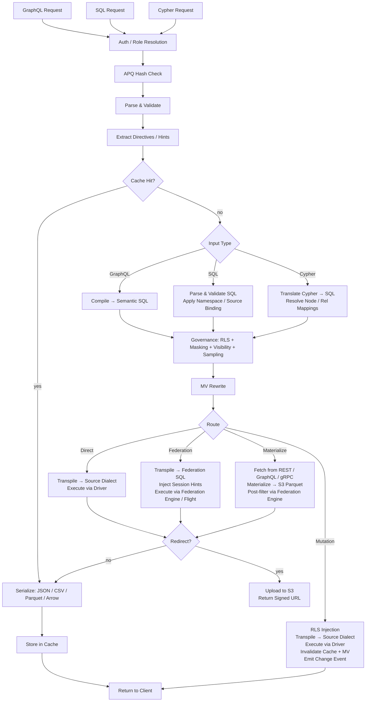

# ארכיטקטורת Provisa

## סקירה כללית

Provisa היא פלטפורמת וירטואליזציית נתונים מונעת-תצורה, שתוכננה במיוחד להניע שכבה סמנטית מצוותים קטנים ועד ארגונים גדולים. היא מספקת API מאוחד מעל מקורות נתונים הטרוגניים עם ממשל, אבטחה, ואופטימיזציית ביצועים. לקוחות שולחים שאילתות דרך SQL, GraphQL, או Cypher; שלושתם ממשקים ממדרגה ראשונה עם ממשל זהה מיושם. (REQ-002, REQ-038)

ההבחנה של השכבה הסמנטית חשובה. כדי להוסיף לשכבה הסמנטית עליכם ליצור מקורות נתונים או אגרגציות חדשים בתוך שכבת וירטואליזציית הנתונים. זה יוצר הפרדה נקייה — לא ניתן לבצע תוספות חדשות לסמנטיקה מחוץ לפלטפורמה, ומאפשר ממשל נתונים אמיתי. (REQ-136) האכיפה היא ברמת המהדר: קטלוג הקשרים המאושר הוא מקור האמת ללא קשר לשפת השאילתה הנמצאת בשימוש. (REQ-002)

Provisa מתוכננת להיות בעלת ביצועים גבוהים עבור צרכים תפעוליים ובעלת יכולת קנה-מידה גבוהה עבור צרכים אנליטיים ארגוניים. פלטפורמה יחידה משרתת את שניהם ללא ויתור על מהירות או קנה מידה.

```text
Config YAML → PG Metadata → Federation Catalogs
                               ↓
         Federation engine metadata → Schema Generator → SDL / SQL catalog / Cypher labels / gRPC proto (per role)
                                     ↓
                     Query → Parser → SQL Compiler → Transpiler
                                     ↓
                             Router (Smart Dispatch)
                         /           |            \
                    Federation  Direct PG      Direct MySQL/etc.
                         \           |            /
                              Executor Pool
                                     ↓
                         ┌───── Inline ─────┐     ┌──── Redirect ────┐
                         │  JSON (HTTP)     │     │  CTAS → S3       │
                         │  Arrow (Flight)  │     │  (Parquet, ORC)  │
                         │  Protobuf (gRPC) │     │  Provisa → S3    │
                         └─────────────────-┘     │  (JSON, CSV, …)  │
                                                  └─────────────────-┘
```

## ממשקי שאילתה

כל ממשק הוא תעבורה (transport) נבדלת. כל ארבעתם מיישמים את אותו צינור אבטחה (RLS, מיסוך, דגימה, בדיקות תפקיד). (REQ-002, REQ-038) לקוחות לעולם אינם מדברים ישירות עם מנוע הפדרציה. (REQ-266) "שפת שאילתה" (SQL / GraphQL / Cypher) אורתוגונלית לתעבורה — מספר שפות יכולות להגיע דרך אותה תעבורה.

| פורט | תעבורה | שפות שאילתה מתקבלות | מקרה שימוש |
| ------ | ----------- | -------------------------- | ---------- |
| 8001 | HTTP | GraphQL, SQL, Cypher | לקוחות web, כלי BI, curl, צרכני REST |
| 8815 | Arrow Flight (gRPC) | SQL (דרך Arrow Flight SQL) | כלי נתונים (Pandas, DuckDB, Spark, ADBC) |
| 50051 | Protobuf gRPC | RPCs מחוללים לפי-תפקיד | שירות-לשירות עם חוזים מוקלדים |
| ניתן להגדרה¹ | פרוטוקול חוט PostgreSQL (pgwire) | SQL | psql, DBeaver, SQLAlchemy, כל לקוח תואם-PG |

¹ הגדירו `PROVISA_PGWIRE_PORT` (לדוגמה 5433). מושבת כאשר לא מוגדר או `0`.

### HTTP (פורט 8001)

מספר נקודות קצה תחת אותו פורט, נבדלות לפי נתיב:

| נתיב | שפה | הערות |
| ------ | ---------- | ------- |
| `POST /data/graphql` | GraphQL | קריאות ומוטציות; hash של APQ מתקבל דרך `extensions.persistedQuery` |
| `POST /data/sql` | SQL | קריאה בלבד; ללא שער יכולת — נשלט על ידי נראות אובייקט + RLS + מיסוך (REQ-001, REQ-267) |
| `POST /data/query` | Cypher | קריאה בלבד; תפקיד סטנדרטי |
| `GET /data/nl` | שפה טבעית | מתרגם ל-SQL/GraphQL/Cypher בהתאם לסוג המקור |
| `GET /data/subscribe/{table}` | GraphQL | זרם מנוי SSE |
| `GET /neo4j/...` | Cypher (תאימות Neo4j) | שכבת תאימות ל-API של Neo4j HTTP |
| `POST /admin/graphql` | GraphQL | API ניהול (נדרש תפקיד superuser/admin) |

כל הנתיבים מחזירים JSON כברירת מחדל. `Accept: text/csv`, `application/vnd.apache.parquet`, `application/vnd.apache.arrow.stream`, ו-`application/octet-stream` (בינארי גולמי) נתמכים דרך משא ומתן תוכן. תוצאות החורגות מסף הגודל המוגדר מופנות אוטומטית ל-URL חתום של S3. (REQ-029, REQ-137)

### Arrow Flight (פורט 8815)

תעבורה עמודתית (columnar) ילידית של Arrow על גבי gRPC. (REQ-045, REQ-143) לקוחות שולחים ticket מסוג JSON:

```json
{"query": "SELECT name, email FROM customers", "role": "analyst"}
```

ומקבלים Arrow RecordBatches בזרימה עצלה (lazy). כאשר ה-proxy‏ Zaychik Flight SQL זמין, הנתונים זורמים כזרם של אצוות רשומה (record batches) של Arrow מקצה-לקצה: (REQ-144)

```text
Client ←(Arrow batches)← Provisa Flight Server ←(Arrow batches)← Zaychik ←(JDBC)← Federation Engine
```

התוצאה המלאה לעולם אינה ממומשת (materialized) בזיכרון Provisa — אצוות מועברות בעודן מגיעות. (REQ-145) זה הופך את Arrow Flight לנתיב בלתי-מוגבל המתאים לתוצאות גדולות באופן שרירותי.

### Protobuf gRPC (פורט 50051)

`.proto` מחולל אוטומטית מסכמת הנתונים, מחולל לפי-תפקיד. (REQ-525) שאילתות סטרימינג (הודעה אחת לשורה), מוטציות unary. reflection של שרת מופעל. (REQ-526) תפקיד דרך מפתח מטא-נתונים `x-provisa-role`.

### פרוטוקול חוט PostgreSQL / pgwire (פורט ניתן להגדרה)

מיישם את פרוטוקול החוט (wire protocol) frontend/backend של PostgreSQL באמצעות ספריית `buenavista`. (REQ-527) כל לקוח תואם-PostgreSQL — `psql`, DBeaver, SQLAlchemy עם `psycopg2`, JDBC — יכול להתחבר ללא שינוי. מקבל SQL בלבד. צינור הממשל המלא (RLS, מיסוך, הרשאות דומיין) חל באופן זהה על חיבורי pgwire. (REQ-266, REQ-002) מופעל על ידי הגדרת `PROVISA_PGWIRE_PORT` לפורט שאינו אפס.

## צינור הבקשה (Request Pipeline)

שלוש שפות שאילתה מתקבלות. כולן מתכנסות לממשל לאחר שלבי הניתוח/הקימפול שלהן. (REQ-262, REQ-263) רק GraphQL תומך בכתיבה. (REQ-037) אין שער יכולת על השאילתה עצמה — כל זהות מאומתת יכולה לשלוח שאילתה בכל שפה, והנתונים נשלטים אך ורק על ידי נראות אובייקט, RLS, ומיסוך. (REQ-001)

| ממשק | קריאות | כתיבות | שער שאילתה |
| --- | --- | --- | --- |
| GraphQL (`/data/graphql`) | כן | כן (מוטציות) | ללא — ממשל שכבת-נתונים בלבד |
| SQL (`/data/sql`) | כן | לא | ללא — ממשל שכבת-נתונים בלבד (REQ-267) |
| Cypher (`/data/query`) | כן | לא | ללא — ממשל שכבת-נתונים בלבד |



**החלטות ניתוב:**

| ניתוב | מתי |
| --- | --- |
| **מטמון (Cache)** | פגיעה במטמון תוצאות — מוערך ראשון, מגיש את התוצאה השמורה ללא הרצה (REQ-865) |
| **ספירה זולה (Cheap-count)** | שאילתה בצורת `count(*)` מעל מקור לא-ממומש שחושף ספירה ילידית מדויקת — מנותב לקריאת הספירה הילידית במקום מימוש לצורך ספירה (REQ-875) |
| **ישיר (Direct)** | מקור יחיד + דרייבר ילידי קיים + מחבר פדרציה קיים |
| **פדרציה** | פדרציה רב-מקורית, או שלמקור יש מחבר אך אין דרייבר |
| **מימוש (Materialize)** | למקור אין מחבר פדרציה — שליפה ומיטמון ל-S3/PG תחילה |
| **מוטציה** | מוטציית GraphQL — תמיד ישיר, לעולם לא פדרטיבי |

הניתוב צורך את הפלט של שלב האופטימיזציה שלאחר-הממשל, לעולם לא את ה-SQL הממושל טרם-האופטימיזציה. הממשל עשוי להוסיף מקורות (predicates של subquery של RLS); שלב האופטימיזציה עשוי להסיר אותם (inlining של VALUES-CTE לטבלה חמה, שכתובי מטמון-API, גיזום ענפי union). שאילתה פדרטיבית שמתכווצת למקור חי יחיד לאחר inlining מנותבת מחדש לכן כישירה. (REQ-863)

### שאילתות Multi-Root

שאילתות GraphQL עם שדות שורש מרובים (לדוגמה, `{ orders { id } customers { name } }`) מתקמפלות לשאילתות SQL נפרדות ומתבצעות באופן עצמאי. (REQ-534) בקשות SQL ו-Cypher הן single-root מטבען. תוצאות ממוזגות לתגובה יחידה:

- שדות מתחת לסף ההפניה מוחזרים inline ב-`data`
- שדות מעל הסף מופנים, עם רשומות לפי-שדה ב-`redirects`
- פורמטים בינאריים (Parquet, Arrow) נתמכים רק עבור שאילתות single-root

## נתיבי ביצוע פדרציה

| נתיב | תעבורה | דרך | מתי בשימוש |
| ------ | ----------- | ----- | ----------- |
| REST | לקוח מנוע פדרציה (HTTP :8080) | שאילתה ישירה | ברירת מחדל, תמיד זמין |
| Flight SQL | `adbc-driver-flightsql` (gRPC :8480) | proxy‏ Zaychik ← JDBC | כאשר Zaychik רץ |
| CTAS | לקוח מנוע פדרציה (HTTP :8080) | כתיבה ישירה, Iceberg ל-S3 | הפניית Parquet/ORC |

### Zaychik Arrow Flight SQL Proxy

מנוע הפדרציה אינו תומך באופן ילידי בפרוטוקול Arrow Flight SQL. [Zaychik](https://github.com/Raiffeisen-DGTL/zaychik-trino-proxy) הוא proxy‏ Java שמיישם את ממשק ה-gRPC של Arrow Flight SQL, מתרגם בקשות לשאילתות JDBC, וזורם תוצאות בחזרה כאצוות רשומה (record batches) של Arrow. (REQ-144)

```text
ADBC client → gRPC :8480 → Zaychik → JDBC :8080 → Federation Engine → results → Arrow batches → client
```

שרת ה-Flight של Provisa (פורט 8815) מתחבר ל-Zaychik כלקוח ADBC, ומאפשר סטרימינג של Arrow מקצה-לקצה ללא מימוש (materialization) של תוצאות. (REQ-145)

### קטלוג תוצאות Iceberg

הפניית CTAS משתמשת במחבר Iceberg (קטלוג `results`) הנתמך על ידי קטלוג JDBC על מופע PostgreSQL הקיים. (REQ-169) Iceberg כותב קבצי Parquet/ORC ישירות ל-MinIO/S3 דרך מערכת הקבצים הילידית של S3 (`fs.native-s3.enabled=true`).

## מנועי פדרציה

Provisa בוחרת מנוע פדרציה בעת ההפעלה דרך משתנה הסביבה `PROVISA_ENGINE`, תצורת ממשק הניהול השמורה, או ברירת המחדל. כאשר דבר אינו מוגדר, DuckDB היא ברירת המחדל — לגמרי בתוך-התהליך, ללא שירות חיצוני (REQ-989). ראו [Configuration](configuration.md#_15) לפרטי בחירה.

כל מנוע הוא מופע `FederationEngine` המוגדר ב-`provisa/federation/engine.py`. המופע מחזיק אוסף מחברים שקובע אילו סוגי מקורות המנוע יכול לקרוא חי (ATTACH) לעומת אילו חייבים לנחות (land) לתוך מאגר המימוש של המנוע תחילה. [tool-verified: `engine.py` `_ENGINE_BUILDERS`, `ENGINE_REGISTRY`]

### מחלקות דרייבר (REQ-840) [tool-verified: `engine.py` `DriverClass`]

| מחלקה | משמעות | דוגמאות |
| ------- | --------- | --------- |
| `BROAD` | מגיע לסוגי מקור חיצוניים רבים דרך מחברים ילידיים | Trino |
| `PARTIAL` | מגיע לתת-קבוצה (רלציוני, קבצים, אחסון אובייקטים/lake בענן) בנוסף לנחיתה של כל השאר | DuckDB, PostgreSQL, ClickHouse, Databricks, Snowflake, BigQuery, Fabric, Synapse |
| `SELF_ONLY` | מגיע רק למאגר שלו; כל מקור אחר נוחת | SQLAlchemy |

### מנועים זמינים [tool-verified: `engine.py` `_ENGINE_BUILDERS`]

| מפתח מנוע | דיאלקט | MPP | מנגנון קישור חיצוני | אימות |
| ----------- | --------- | ----- | ------------------------ | ------ |
| `trino` / `trino-byo` | Trino SQL | כן | קטלוגי Trino (קבוצת מחברים רחבה) | אישורי JDBC |
| `pg` | PostgreSQL | לא | FDW / pg_duckdb | אישורי PostgreSQL |
| `duckdb` | DuckDB | לא | ATTACH ילידי-הרחבה | ללא (בתוך-התהליך) |
| `clickhouse` / `clickhouse-server` | ClickHouse | כן (shards) | מנועי טבלה S3 / IcebergS3 / DeltaLake (REQ-986) | אישורי ClickHouse |
| `snowflake` | Snowflake | כן | stage חיצוני + טבלה חיצונית (REQ-988) | `PROVISA_ENGINE_URL` |
| `databricks` | Databricks SQL | כן | טבלאות חיצוניות Unity Catalog דרך REST (REQ-987) | Bearer token (`http_path` ב-`federation_hints`) |
| `bigquery` | BigQuery | כן (Dremel) | טבלאות חיצוניות / BigLake של BigQuery | מפתח service-account‏ `GOOGLE_APPLICATION_CREDENTIALS` |
| `fabric` | T-SQL | כן | OneLake shortcuts ← OPENROWSET | Azure AD (`az login` / זהות מנוהלת) |
| `synapse` | T-SQL | כן | ADLS OPENROWSET / טבלאות חיצוניות | Azure AD |
| `sqlalchemy` | כל דיאלקט SQLAlchemy | לא | אין (land-only) | אישורים לפי-דיאלקט |

### ברירת מחדל ללא-תצורה: DuckDB (REQ-989) [tool-verified: `engine.py` `build_duckdb_engine`, `_embedded_duckdb_materialize_default`]

כאשר `PROVISA_ENGINE` אינו מוגדר, Provisa משתמשת במנוע DuckDB המוטמע לגמרי בתוך-התהליך. מאגר המימוש של DuckDB הוא קובץ DuckDB מוטמע בכתובת `$PROVISA_DATA_DIR/materialize.duckdb` (ברירת מחדל `~/.provisa/materialize.duckdb`). אין צורך במסד נתונים או שירות חיצוני.

מכיוון ש-DuckDB אוכפת כותב יחיד לקובץ, `store_connection.py` כותב לתוך המאגר המוטמע דרך החיבור של המנוע עצמו — לעולם לא חיבור עצמאי שני. זהו המקרה היחיד שבו המנוע ומאגר המימוש חולקים handle קובץ בכוונה תחילה. [tool-verified: `store_connection.py` module docstring]

### תעבורת קריאה ילידית-Arrow (REQ-986, REQ-987, REQ-988) [tool-verified: `engine.py` `build_*_engine` `capabilities=`]

ClickHouse, DuckDB, Snowflake, Databricks, BigQuery, Fabric, ו-Synapse כולם מכריזים על `EngineCapability.ARROW` ו-`EngineCapability.ARROW_STREAM`. שאילתות מול מנועים אלה מחזירות Arrow RecordBatches ישירות — נתיב הסריאליזציה לפי-שורה עוקף לחלוטין. שרת ה-Flight זורם את האצוות הללו ללקוחות ללא מימוש התוצאה המלאה בזיכרון תהליך Provisa. עבור Trino, סטרימינג Arrow נשען על ה-proxy‏ Zaychik; עבור מנועי ה-warehouse, ה-API הילידי-Arrow של המנוע עצמו (Cloud Fetch עבור Databricks, Storage Read API עבור BigQuery, `fetch_arrow_table` עבור DuckDB ו-Snowflake) מזין את זרם ה-Flight.

### קישורי נתונים חיצוניים (ATTACH) [tool-verified: `engine.py` `_warehouse_connectors`]

כל מנוע warehouse יכול לסרוק נתוני אחסון אובייקטים/lake בענן במקומם ללא נחיתת עותק. קבצי Parquet, CSV, Iceberg, ו-Delta Lake ב-S3, GCS, או OneLake מתחברים (attach) ישירות למנוע כאילו היו טבלאות ילידיות. האסטרטגיה — ATTACH (סריקה במקום) או LAND (העתקה למאגר) — נקבעת על ידי ה-`Mechanism` המוצהר של המחבר; אין הסתעפות ספציפית-למנוע במתכנן. מחבר `Mechanism.ATTACH_R` מפעיל סריקת zero-copy; מחבר `Mechanism.DIRECT` או מחבר נעדר מפעיל נחיתה. [tool-verified: `connector_base.py` `Mechanism`, `engine.py` `_warehouse_connectors`]

Attach מקצה אוטומטית את כל הדרישות המוקדמות בעת ה-attach:

| מנוע | פורמטי אחסון אובייקטים/lake | מנגנון | הקצאה אוטומטית [tool-verified] |
| -------- | ------------------- | ---------- | ---------------------------------- |
| Databricks | parquet, csv, iceberg, delta_lake | טבלה חיצונית UC (`ATTACH_R`) | REST מתקין storage credential + external location של Unity Catalog, ואז `CREATE TABLE … USING <format> LOCATION …` — מאומת-חי מעל Cloudflare R2 |
| BigQuery | parquet, csv, json, iceberg, delta_lake | טבלה חיצונית / BigLake של BigQuery (`ATTACH_R`) | `CREATE OR REPLACE EXTERNAL TABLE … OPTIONS(format=…, uris=[…])` — מאומת-חי |
| ClickHouse | csv, parquet, iceberg, delta_lake | מנוע טבלה S3 / IcebergS3 / DeltaLake (`ATTACH_R`) | בדיקת אימות מבוצעת בעת ה-attach — מאומת-חי מעל Cloudflare R2 |
| Fabric | parquet, csv, iceberg, delta_lake | OneLake shortcut ← OPENROWSET (`ATTACH_R`) | REST יוצר חיבור `AmazonS3Compatible` + lakehouse + shortcut; מחזיר את נתיב ה-`BULK` של OneLake — מאומת-חי בקריאת R2 דרך Fabric |
| Snowflake | parquet, csv, json, iceberg, delta_lake | stage חיצוני + טבלה חיצונית (`ATTACH_R`) | `CREATE STAGE … URL=… CREDENTIALS=…`, ואז `CREATE OR REPLACE EXTERNAL TABLE … LOCATION=@stage FILE_FORMAT=(TYPE=…)` — ממומש; לא נבדק חי (אין חשבון זמין) |

אישורים לאחסון בענן נוסעים ב-`federation_hints` של המקור (ראו [Sources](sources.md#warehouses-)). כל סוג מקור שאינו יכול לבצע ATTACH נוחת לתוך מאגר המימוש של המנוע תחילה.

### כתיבות מימוש עמודתי (REQ-990) [tool-verified: `core/database.py:436`, `store_connection.py:99`]

`Connection.bulk_copy` ב-`provisa/core/database.py` בוחר את נתיב ה-bulk-ingest המהיר ביותר לפי דיאלקט מאגר: `COPY` בינארי (`copy_records_to_table` של asyncpg) עבור מאגרי PostgreSQL, ו-statement‏ `executemany` מוכן יחיד עבור כל שאר המאגרים הרלציוניים. מאגר ה-DuckDB המוטמע נוחת דרך `land_duckdb_native` ב-`store_connection.py` — קריאת `executemany` יחידה עבור כל האצווה, לעולם לא לולאה לפי-שורה.

## הפניית תוצאה גדולה (Large Result Redirect)

תוצאות החורגות מסף שורות מופנות לאחסון תואם-S3 (MinIO) במקום להיות מוחזרות inline. (REQ-029)

### מצבי הפניה

| מצב | איך זה עובד | הנתונים נוגעים ב-Provisa? |
| ------ | ------------- | ---------------------- |
| **CTAS** (Parquet, ORC) | מנוע הפדרציה כותב ישירות ל-S3 דרך `CREATE TABLE AS SELECT` | לא |
| **העלאת Provisa** (JSON, NDJSON, CSV, Arrow IPC) | Provisa מסריאל ומעלה דרך boto3 | כן |

עבור פורמטים ילידיי-CTAS, Provisa לעולם לא מטפלת בנתונים — מנוע הפדרציה כותב קבצים ישירות ל-MinIO/S3. (REQ-138) זהו הנתיב המועדף לייצוא אנליטי גדול.

### כותרות הפניה

| כותרת | אפקט |
| -------- | ------ |
| `X-Provisa-Redirect-Format: <mime>` | הפניה בפורמט זה (מרמז על כפייה אלא אם סף מוגדר) |
| `X-Provisa-Redirect-Threshold: N` | הפנייה רק אם התוצאה חורגת מ-N שורות |
| `X-Provisa-Redirect: true` | כפיית הפניה בפורמט ברירת המחדל |

כותרות אלה מיישמות הפניה נשלטת-לקוח. (REQ-137)

**תגובה:**

```json
{
  "data": {"orders": null},
  "redirect": {
    "redirect_url": "https://minio:9000/provisa-results/results/abc.parquet?...",
    "row_count": 50000,
    "expires_in": 3600,
    "content_type": "application/vnd.apache.parquet"
  }
}
```

### תצורת שרת

| משתנה סביבה | ברירת מחדל | מטרה |
| --------- | --------- | ------------- |
| `PROVISA_REDIRECT_ENABLED` | `false` | הפעלת הפניית סף בצד השרת |
| `PROVISA_REDIRECT_THRESHOLD` | `1000` | סף ספירת שורות ברירת מחדל |
| `PROVISA_REDIRECT_FORMAT` | `parquet` | פורמט הפניה ברירת מחדל |
| `PROVISA_REDIRECT_BUCKET` | `provisa-results` | שם S3 bucket |
| `PROVISA_REDIRECT_ENDPOINT` | | כתובת URL של נקודת קצה תואמת-S3 |
| `PROVISA_REDIRECT_TTL` | `3600` | TTL של Presigned URL (שניות) |

## עץ החלטת ניתוב

```text
Multi-source query? → Federation engine
NoSQL source (MongoDB, Cassandra)? → Federation engine
Uses path columns on non-PG source? → Federation engine
Single RDBMS with driver? → Direct (sub-100ms target)
Single RDBMS without driver? → Federation engine
Steward hint "federated"? → Federation engine (override)
Steward hint "direct"? → Direct (if possible)
Redirect to Parquet/ORC? → Federation engine (CTAS, regardless of source count)
```

(REQ-027, REQ-028, REQ-030, REQ-279)

## אופטימיזציית שאילתת פדרציה

Provisa מכינה (primes) את האופטימייזר מבוסס-העלות של מנוע הפדרציה אוטומטית כך שתוכניות שאילתה חוצות-מקורות מבוססות על התפלגות נתונים אמיתית, לא ברירות מחדל קשיחות.

### סטטיסטיקה אוטומטית (`ANALYZE`)

ברישום מקור, Provisa מריצה `ANALYZE catalog.schema.table` עבור כל טבלה מפורסמת. (REQ-275) זה אוסף:

- ספירת שורות
- לפי-עמודה: שבר null, ספירת ערכים נבדלים, מינימום/מקסימום, היסטוגרמות (תלוי-מחבר)

האופטימייזר משתמש בהם כדי להעריך סלקטיביות עבור שאילתות מסוננות. ללא סטטיסטיקה, הוא נופל חזרה לברירות מחדל קבועות (לדוגמה, סלקטיביות 10% עבור predicates של שוויון) המפיקות תוכניות join גרועות על נתונים מוטים או בעלי-קרדינליות גבוהה. עם סטטיסטיקה, ההערכות מדויקות מספיק כדי לקבל החלטות נכונות של broadcast מול partitioned join עבור רוב העומסים.

**כיסוי**: תמיכת סטטיסטיקה משתנה לפי מחבר. PostgreSQL, MySQL, Hive, Iceberg, ו-Delta Lake תומכים באופן מלא ב-`ANALYZE`. למחברי MongoDB ו-Cassandra יש תמיכה חלקית או ללא תמיכה. Provisa בולעת כשלי `ANALYZE` בשקט — הרישום לעולם אינו נחסם. (REQ-275)

**מגבלות סלקטיביות**: סטטיסטיקה מספקת הערכות לפי-עמודה. עבור predicates מתואמים (`WHERE region = 'US' AND city = 'Seattle'`), האופטימייזר מניח עצמאות עמודות, מה שעלול להעריך בחסר את ספירת השורות. זו מגבלה ידועה של סטטיסטיקה ברמת-עמודה בכל האופטימייזרים מבוססי-עלות.

**מקורות API**: טבלאות `api_cache_{table_name}` ב-PostgreSQL מנותחות אוטומטית לאחר כל מחזור רענון מטמון, כך שלאופטימייזר יש הערכות שורות עדכניות בעת JOIN של מקורות מבוססי-API עם מקורות רלציוניים. (REQ-280)

### ניהול: רענון סטטיסטיקה

הרצה מחדש של איסוף סטטיסטיקה על פי דרישה דרך ה-API של הניהול: (REQ-276)

```graphql
mutation {
  refreshSourceStatistics(sourceId: "sales-pg") {
    tablesAnalyzed
    failures { table message }
  }
}
```

שימושי כאשר מקור קיבל נתונים חדשים משמעותיים מאז הרישום.

## Materialized Views

MV-ים מייעלים באופן שקוף שאילתות יקרות על ידי חישוב מראש ומיטמון תוצאות.

### קשרים כרמזי MV

הצהרת קשר אינה רק ארטיפקט ממשל — היא גם התיאור המבני של צורת join. אותה צורה היא בדיוק מה שאופטימייזר ה-MV צריך: שתי טבלאות, שתי עמודות, סוג join. משמעות הדבר היא שקשר יכול להניע ישירות מימוש.

עבור **קשרים חוצי-מקורות**, זה קורה אוטומטית בעת ההפעלה: כל קשר חוצה-מקורות מאושר מחולל MV מסוג `JoinPattern` (‏`auto-mv-<rel_id>`). (REQ-158) אין צורך בתצורת MV נפרדת. כאשר המהדר רואה את אותו join בשאילתה, השכתוב מחליף את התוצאה הממומשת מראש באופן שקוף.

עבור **קשרים באותו מקור**, סטיוארדים יכולים להצטרף במפורש דרך `materialize: true`. JOIN-ים באותו מקור כבר מהירים דרך ביצוע ישיר, כך שהמימוש כדאי רק עבור נתיבי join חמים מאוד. (REQ-159)

ההשלכה המעשית: סטיוארדים שמאשרים קשר מחליטים במרומז אם ה-join הוא מועמד טוב למימוש. פעולת הממשל ורמז האופטימיזציה הם אותה הצהרה.

### מצבים

| מצב | תצורה | התנהגות |
| ------ | -------- | ---------- |
| **Join-pattern** | `join_pattern` בתצורת MV | שכתוב JOIN-ים תואמים לקריאה מטבלת ה-MV |
| **SQL מותאם אישית** | `sql` בתצורת MV | SELECT שרירותי, חשוף אופציונלית ב-SDL |
| **קשר ממומש-אוטומטית** | קשר חוצה-מקורות (אוטומטי) | מחולל אוטומטית MV מסוג join-pattern; אין צורך בתצורה |
| **קשר ממומש-על-ידי-סטיוארד** | `materialize: true` על קשר באותו מקור | הצטרפות מפורשת עבור נתיבי join חמים באותו מקור |

### מימוש אוטומטי

JOIN-ים חוצי-מקורות הם השאילתות היקרות ביותר (תמיד פדרטיביים). קשרים חוצי-מקורות מחוללים אוטומטית הגדרות MV בעת ההפעלה: (REQ-158)

```yaml
relationships:
  - id: orders-to-reviews
    source_table_id: orders        # sales-pg
    target_table_id: product_reviews  # reviews-mongo
    source_column: product_id
    target_column: product_id
    cardinality: one-to-many
    materialize: true              # auto-create MV
    refresh_interval: 600          # refresh every 10 minutes
```

רק קשרים חוצי-מקורות מחוללים MV-ים (JOIN-ים באותו מקור כבר מהירים דרך ביצוע ישיר). (REQ-159) ה-MV מתחיל במצב `STALE` ומתרענן על ידי לולאת הרענון ברקע לפני שנעשה בו שימוש על ידי האופטימייזר של השאילתה. (REQ-160)

### מחזור חיי רענון

```text
STALE → (refresh loop picks up) → REFRESHING → FRESH
  ↑                                                |
  └──── mutation hits source table ────────────────┘
```

לולאת הרענון רצה כל 30 שניות, בודקת `get_due_for_refresh()`, ומריצה `CREATE TABLE AS SELECT` (הרצה ראשונה) או `DELETE + INSERT` (הרצות עוקבות) מול טבלת יעד ה-MV דרך מנוע הפדרציה. (REQ-160, REQ-234)

## מפת מודולים

| מודול | מטרה |
| -------- | ------- |
| `api/` | אפליקציית FastAPI, routers, middleware, ניהול lifespan |
| `api/flight/` | שרת Arrow Flight (gRPC, פורט 8815) |
| `api/admin/` | API ניהול Strawberry GraphQL — תצורה, גילוי, views |
| `api/rest/` | נקודות קצה REST מחוללות אוטומטית מטבלאות רשומות |
| `api/jsonapi/` | נקודות קצה JSON:API מחוללות אוטומטית עם עימוד וטיפול שגיאות |
| `api/data/subscribe.py` | מנויי SSE — LISTEN/NOTIFY, polling, Debezium CDC |
| `compiler/` | פרסרים של GraphQL/SQL, מחולל SQL סמנטי, RLS, מיסוך, דגימה, ממשל דו-שלבי (`stage2.py`) |
| `cypher/` | מתרגם Cypher ← SQL, פרסר, מפת תוויות (REQ-351), מתרגם כתיבה עבור מוטציות Cypher |
| `pgwire/` | שרת פרוטוקול חוט PostgreSQL; `catalog.py` מיירט pg_catalog/information_schema עבור נראות אובייקט לפי-תפקיד (REQ-527, REQ-883, REQ-891) |
| `vector/` | חיפוש וקטורי — רישום מודל, ספקי embedding (openai/ollama/huggingface), תרגום `cosine_similarity()`, מטמון נפילה-חוזרת pgvector, חילול embedding דקלרטיבי (REQ-419–431) |
| `compiler/federation.py` | תמיכת subgraph של Apollo Federation v2 |
| `transpiler/` | תרגום דיאלקטים, לוגיקת ניתוב |
| `executor/` | ביצוע פדרטיבי/ישיר, סריאליזציה, פורמטי פלט |
| `executor/drivers/` | דרייברי מקור ישירים (PostgreSQL, MySQL, DuckDB, Snowflake, Databricks, ClickHouse, …) |
| `executor/trino_flight.py` | לקוח ADBC Flight SQL עבור מנוע הפדרציה |
| `executor/ctas_write.py` | הפניה מבוססת-CTAS (מנוע הפדרציה כותב ל-S3) |
| `executor/redirect.py` | לוגיקת הפניית S3, העלאה בצד-Provisa |
| `federation/engine.py` | `FederationEngine`, `DriverClass`, `_ENGINE_BUILDERS`, `ENGINE_REGISTRY`, `build_engine` |
| `federation/connector.py` | הפשטות מחבר — Trino, ClickHouse; `Mechanism`, `WarehouseNativeConnector` |
| `federation/connector_duckdb.py` | הגדרות מחבר DuckDB ו-PostgreSQL FDW |
| `federation/snowflake_connectors.py` | מחברי ATTACH מסוג stage חיצוני + טבלה חיצונית של Snowflake (REQ-988) |
| `federation/databricks_connectors.py` | מחברי ATTACH מסוג טבלה חיצונית UC של Databricks (REQ-987) |
| `federation/bigquery_connectors.py` | מחברי ATTACH מסוג טבלה חיצונית / BigLake של BigQuery |
| `federation/databricks_uc.py` | הקצאה אוטומטית של credential + external location של Unity Catalog |
| `federation/databricks_backend.py` | backend ביצוע warehouse SQL של Databricks |
| `federation/snowflake_backend.py` | backend ביצוע של Snowflake |
| `federation/bigquery_backend.py` | backend ביצוע של BigQuery (תעבורת Arrow דרך Storage Read API) |
| `federation/mssql_warehouse_backend.py` | backends ביצוע של Fabric Warehouse + Synapse (T-SQL על גבי ODBC) |
| `federation/mssql_warehouse_connectors.py` | מחברי ATTACH מסוג OPENROWSET עבור Fabric / Synapse |
| `federation/fabric_shortcuts.py` | הקצאה אוטומטית של OneLake shortcut (חיבור ← lakehouse ← shortcut) |
| `federation/clickhouse_backend.py` | backend ביצוע של ClickHouse |
| `federation/duckdb_backend.py` | backend ביצוע בתוך-התהליך של DuckDB |
| `federation/pg_backend.py` | backend ביצוע של PostgreSQL |
| `federation/store_connection.py` | פני כתיבה של מאגר מימוש ילידי-DuckDB (REQ-989, REQ-990) |
| `registry/` | רישום שאילתות persisted, ממשל |
| `security/` | נראות, הרשאות, מיסוך עמודות |
| `cache/` | מיטמון תוצאות שאילתה מבוסס-Redis (שכבה חמה) |
| `mv/` | רישום Materialized View, רענון, שכתוב SQL |
| `events/` | אירועי שינוי ערכת נתונים ושליחת טריגר |
| `webhooks/` | ביצוע webhook יוצא עבור מוטציות ואירועים |
| `scheduler/` | ניהול משימות רקע מבוסס-APScheduler — טריגרים מסוג cron ומרווח המפעילים webhooks, מוטציות, או פרסומי Kafka sink |
| `apq/` | פרוטוקול חוט Apollo APQ — מטמון hash שאילתה מבוסס-Redis; נפרד ממיטמון תוצאות |
| `compiler/cursor.py` | עימוד cursor בסגנון Relay — ארגומנטים `first`/`after`/`last`/`before` וחילול `pageInfo` על כל שאילתות הרשימה |
| `compiler/aggregate_gen.py` | טיפוסי שאילתה `{table}_aggregate` מחוללים אוטומטית עם תת-שדות `count`, `sum`, `avg`, `min`, `max` וגישת `nodes` מסוננת |
| `compiler/enum_detect.py` | גילוי אוטומטי של טיפוס enum — טיפוסי enum ילידיים של PostgreSQL (`pg_enum`) חשופים כטיפוסי enum של GraphQL במקום סקלרי מחרוזת |
| `compiler/hints.py` | רמזי ביצועי פדרציה — הנחיות ניתוב ברמת-שאילתה מוטבעות כהערות SQL (`/* @provisa route=federated */`) הדורסות ניתוב אוטומטי |
| `compiler/mutation_gen.py` | מהדר מוטציה; פריסטים לעמודות — ערכים סטטיים בצד-שרת או ערכי משתנה-הפעלה מיושמים בהוספה/עדכון, לא חשופים בטיפוס קלט המוטציה |
| `auth/approval_hook.py` | hook אישור ABAC — הרשאה חיצונית ניתנת-להחלפה נקראת לפני ביצוע שאילתה; תעבורות webhook, gRPC, ו-unix_socket; היקף לפי-טבלה/מקור/גלובלי; מדיניות נפילה-חוזרת ניתנת להגדרה |
| `subscriptions/` | מצב ומסירת מנוי SSE |
| `discovery/` | גילוי קשרים מבוסס-LLM (Claude API) |
| `grpc/` | חילול proto, שרת gRPC, reflection |
| `api_source/` | מקורות API‏ REST/GraphQL/gRPC עם מטמון PG |
| `kafka/` | מקורות topic של Kafka, sink, Schema Registry |
| `auth/` | ספקי אימות ניתנים-להחלפה, middleware, מיפוי תפקיד |
| `core/` | תצורה, מודלים, DB, מאגרים, סודות; מודל התפקיד תומך ב-`parent_role_id` ו-`flatten_roles()` לירושת תפקיד רקורסיבית |
| `hasura_v2/` | ממיר מטא-נתוני Hasura v2 ← תצורת Provisa |
| `ddn/` | ממיר supergraph של Hasura DDN ← תצורת Provisa |
| `mongodb/` | מחבר מקור MongoDB |
| `elasticsearch/` | מחבר מקור Elasticsearch |
| `cassandra/` | מחבר מקור Cassandra |
| `prometheus/` | מחבר מקור מדדי Prometheus |
| `source_adapters/` | שכבת מתאם גנרית לחיבורי מקור |

## API ניהול

ה-API של Strawberry GraphQL לניהול מותקן בכתובת `/admin/graphql` (פורט HTTP 8001). הוא נפרד מנקודת הקצה GraphQL של הנתונים ודורש תפקיד superuser או admin.

| יכולת | תיאור |
| ----------- | ------------- |
| הורדת/העלאת תצורה | ייצוא או החלפה של תצורת YAML המלאה של Provisa |
| עורך קשרים | יצירה, עדכון, מחיקה של הגדרות קשר |
| גילוי FK מונע-AI | הפעלת ניתוח מועמדי FK מונע-Claude |
| ביקורת סכמה | עיון בטבלאות, עמודות, ותפקידים מפורסמים |
| ניהול View | רישום וניהול הגדרות materialized view |

(REQ-164, REQ-165, REQ-166, REQ-167)

## נקודות קצה REST ו-JSON:API מחוללות אוטומטית

טבלאות רשומות נחשפות כנקודות קצה REST ו-JSON:API לצד ממשק GraphQL. (REQ-256, REQ-257)

| ממשק | נתיב הרכבה | מפרט |
| ----------- | ----------- | ------ |
| REST | `/rest/<table-id>` | GET/POST פשוט עם פרמטרי שאילתה |
| JSON:API | `/jsonapi/<table-id>` | תואם [jsonapi.org](https://jsonapi.org) — עימוד, קשרים, אובייקטי שגיאה |

נקודות קצה אלה מיישמות את אותו צינור אבטחה (RLS, מיסוך, בדיקות תפקיד) כמו נקודת הקצה GraphQL. (REQ-002, REQ-038)

## מנויים (Subscriptions)

מנויי SSE מוגשים בכתובת `GET /data/subscribe/{table}`. שלושה מצבי מסירה: (REQ-258)

| מצב | מנגנון | מתי בשימוש |
| ------ | ----------- | ----------- |
| **LISTEN/NOTIFY** | `LISTEN` של PostgreSQL על ערוץ | מקורות PG עם פעילות מוטציה |
| **Polling** | הרצה מחדש של השאילתה במרווח | מקורות שאינם PG, או כאשר CDC לא זמין |
| **Debezium CDC** | topic של Kafka ממחבר Debezium | זרמי שינוי בתדירות גבוהה |

(REQ-258, REQ-260, REQ-261)

הלקוח מקבל `text/event-stream` עם אירוע JSON אחד לכל שורה או diff שהשתנו.

## מערכת אירועים ו-Webhook

מוטציות מסד נתונים (INSERT/UPDATE/DELETE) יכולות להפעיל אירועים יוצאים דרך המודולים `events/` ו-`webhooks/`. (REQ-172, REQ-173, REQ-220)

```text
Mutation executed → EventDispatcher → match event trigger rules
                                          ↓
                               WebhookExecutor → HTTP POST to configured URL
```

טריגרי אירוע מוגדרים בתצורה ומותאמים לפי טבלה, סוג פעולה, ופילטר שורה אופציונלי. מטענים (payloads) של Webhook כוללים את סוג הפעולה, השורה שהשתנתה, והקשר תפקיד.

## שירותי רקע

ארבע לולאות רקע מתחילות במהלך lifespan האפליקציה (`api/app.py`):

| שירות | מרווח | מטרה |
| --------- | ---------- | ------- |
| לולאת רענון MV | 30 שנ' | בודקת `get_due_for_refresh()`, מריצה CTAS או DELETE+INSERT על MV-ים מיושנים |
| מנהל טבלה חמה | ניתן להגדרה | מקדם טבלאות המתבצעות בהן שאילתות בתדירות גבוהה למטמון SSD מקומי של Iceberg |
| טוען טבלה חמה | ניתן להגדרה | טוען טבלאות ייחוס קטנות למטמון בזיכרון לגישה תת-מילישנייה |
| poller מקור API | מרווח לפי-מקור | שולף ומטמן מחדש מקורות REST/GraphQL/gRPC מרוחקים |

(REQ-160, REQ-238, REQ-239, REQ-236)

### שכבות מיטמון טבלה חמה/פושרת

| שכבה | אחסון | קריטריון קידום | latency גישה |
| ------ | --------- | ------------------- | ---------------- |
| חמה | זיכרון בתוך-התהליך | ספירת שורות < סף, או יעד קשר | <1 מ"ש |
| פושרת | Iceberg על SSD מקומי | סף תדירות שאילתה חרג | ~5–20 מ"ש |
| קרה | מקור מרוחק | ברירת מחדל | 50–500 מ"ש |

(REQ-230, REQ-236, REQ-238, REQ-241)

## ייבוא מטא-נתונים (Hasura v2 / DDN)

פריסות Hasura קיימות יכולות להיות מומרות לתצורת Provisa ללא כתיבה מחדש ידנית. (REQ-182, REQ-183)

| מודול | קלט | פלט |
| -------- | ------- | -------- |
| `hasura_v2/` | `metadata.yaml` של Hasura v2 | `config.yaml` של Provisa |
| `ddn/` | JSON supergraph של Hasura DDN | `config.yaml` של Provisa |

שני הממירים ממפים טבלאות במעקב, קשרים, הרשאות, וסכמות מרוחקות. התוצאה היא תצורת Provisa מלאה מוכנה לפריסה. (REQ-182, REQ-183)

## Apollo Federation

`compiler/federation.py` חושף את Provisa כ-subgraph של Apollo Federation v2. (REQ-259) ה-SDL של ה-subgraph מחולל אוטומטית מהסכמה המפורסמת עם directives‏ `@key` על עמודות מפתח-ראשי ואנוטציות `@external`/`@provides` על קשרים חוצי-subgraph. Provisa עונה לשאילתות `_entities` ו-`_service` הנדרשות על ידי ה-gateway של הפדרציה. (REQ-259)

## עימוד מבוסס-Cursor

כל שאילתות הרשימה תומכות בעימוד cursor בסגנון Relay דרך `compiler/cursor.py`. (REQ-218) לקוחות מעבירים ארגומנטים `first`/`after` (קדימה) או `last`/`before` (אחורה). המהדר מקודד מיקום שורה כ-cursor אטום base64 ומזריק את סעיפי ה-`WHERE`/`LIMIT` המתאימים. כל שאילתת רשימה מחזירה אובייקט `pageInfo`:

| שדה | טיפוס | תיאור |
| ------- | ------ | ------------- |
| `hasNextPage` | Boolean | אמת אם קיימות תוצאות נוספות לאחר עמוד זה |
| `hasPreviousPage` | Boolean | אמת אם קיימות תוצאות לפני עמוד זה |
| `startCursor` | String | cursor של ה-node הראשון בעמוד זה |
| `endCursor` | String | cursor של ה-node האחרון בעמוד זה |

## שאילתות אגרגציה

כל טבלה רשומה מקבלת שדה שורש `{table}_aggregate` מחולל אוטומטית (`compiler/aggregate_gen.py`). (REQ-196) טיפוס האגרגציה חושף `count`, `sum`, `avg`, `min`, `max` לכל עמודה מספרית, ו-`nodes` לגישת שורה מסוננת עם בחירת שדה מלאה (אותו RLS/מיסוך כמו השאילתה הבסיסית). (REQ-196, REQ-198) שאילתות אגרגציה זכאיות לניתוב Aggregate MV — ראו `mv/aggregate_catalog.py`. (REQ-198)

## Automatic Persisted Queries (APQ)

`apq/cache.py` מיישם את פרוטוקול החוט Apollo APQ. (REQ-288) כאשר לקוח שולח רק hash שאילתה (`extensions.persistedQuery`), Provisa מחפשת אותו ב-Redis. (REQ-289) בהחטאה היא מחזירה שגיאת `PersistedQueryNotFound`; הלקוח מנסה שוב עם גוף השאילתה המלא, ש-Provisa שומרת. (REQ-288) זה נפרד ממיטמון תוצאות (`cache/`).

## תפקידים בעלי ירושה

תפקידים ב-`core/models.py` יכולים להפנות ל-`parent_role_id`. (REQ-215) `flatten_roles()` פותר רקורסיבית את שרשרת הירושה וממזג סעיפי WHERE‏ RLS (עם AND), נראות עמודה (איחוד, המגביל ביותר מנצח), ומדיניות מיסוך (הבן דורס את ההורה לפי-עמודה). זה נמנע משכפול קבוצות הרשאה על פני תפקידים דומים (לדוגמה, `analyst` היורש מ-`reader`). (REQ-215)

## Hook אישור ABAC

`auth/approval_hook.py` הוא hook הרשאה ניתן-להחלפה שנקרא לפני ביצוע שאילתה, לאחר RLS ומיסוך. (REQ-203) הוא משתלב עם מנועי מדיניות חיצוניים (OPA, שירותי ABAC מותאמים אישית).

| הגדרה | תיאור |
| --------- | ------------- |
| תעבורה | `webhook` (HTTP POST), `grpc`, או `unix_socket` |
| היקף | לפי-טבלה, לפי-מקור, או גלובלי |
| מדיניות נפילה-חוזרת | `allow` או `deny` כאשר נקודת הקצה של ה-hook אינה נגישה |

(REQ-246, REQ-247, REQ-204)

## גילוי אוטומטי של טיפוס Enum

`compiler/enum_detect.py` מבצע introspection על טיפוסי enum ילידיים של PostgreSQL (`pg_enum`) בעת חילול הסכמה. (REQ-221) עמודות המשתמשות בטיפוס enum מוגדר-משתמש של PostgreSQL מקודמות לטיפוסי enum של GraphQL — הערכים שלהן הופכים לחברי enum במקום סקלרי מחרוזת.

## טריגרים מתוזמנים

`scheduler/jobs.py` משתמש ב-APScheduler להרצת משימות רקע המוגדרות כטריגרים מסוג cron או מרווח. (REQ-216) כל משימה יכולה לבצע POST ל-URL של webhook, להריץ מוטציה מול נקודת קצה הנתונים, או לפרסם תוצאות שאילתה ל-topic של Kafka. טריגרים מוגדרים דרך ה-API של הניהול (מוטציות `scheduledTrigger`) או המפתח `scheduled_triggers` בתצורת YAML. (REQ-216)

## רמזי ביצועי פדרציה

`compiler/hints.py` מנתח רמזי סטיוארד המוטבעים בשאילתות כהערות באמצעות תחביר ההערות של Provisa. (REQ-279) פורמט הרמז משתנה לפי שפת שאילתה:

```graphql
# @provisa route=federated
{ orders { id amount } }
```

```sql
/* @provisa route=federated */
SELECT id, amount FROM orders
```

```cypher
// @provisa route=federated
MATCH (o:Order) RETURN o.id, o.amount
```

| רמז | אפקט |
| ------ | -------- |
| `route=federated` | כפיית פדרציה דרך מנוע הפדרציה, עוקף ניתוב דרייבר-ישיר |
| `route=direct` | כפיית ביצוע דרייבר-ישיר |

(REQ-279, REQ-277, REQ-278)

## פריסטים לעמודות במוטציות

`compiler/mutation_gen.py` תומך בפריסטים בצד-שרת לפי-עמודה המיושמים ב-`INSERT` או `UPDATE`. (REQ-214) פריסטים אינם כלולים בטיפוס קלט המוטציה המחולל של GraphQL — הם מוזרקים על ידי המהדר באופן שקוף. סוגי פריסט: `static` (ערך מילולי) או `session` (ערך מהפעלת הבקשה/כותרת, לדוגמה `x-hasura-user-id`). (REQ-214)

## סייר סכמה GraphQL Voyager

ממשק הניהול (`provisa-ui/src/pages/SchemaExplorer.tsx`) מטמיע את GraphQL Voyager ככלי הדמיית סכמה אינטראקטיבי. (REQ-248) הוא מרנדר את הסכמה המוגבלת-לתפקיד כתרשים ישות-קשר ניתן-לניווט — טבלאות כ-nodes, קשרים כקצוות. הסכמה המוצגת תמיד מסוננת לתפקיד הנבחר הנוכחי.

## סדר אכיפת אבטחה

אין שער יכולת על השאילתה — הממשל מובע כולו דרך בקרות שכבת-נתונים. (REQ-001) בקשת SQL גולמי דוחה (HTTP 403) כל טבלה מחוץ להיקף האובייקט של התפקיד לפני שהממשל רץ. (REQ-267)

1. **נראות אובייקט**: סכמה לפי-תפקיד מסתירה טבלאות/עמודות לא-מורשות; טבלאות מחוץ-להיקף ב-SQL גולמי נדחות (REQ-039, REQ-267)
2. **אכיפת קשרים**: מעברים חייבים להתקיים בקטלוג הקשרים המאושר, אלא אם התפקיד מחזיק `ignore_relationships` — מבין תפקידי המערכת המוגדרים מראש, רק `modeler` מחזיק בה (REQ-001, REQ-1297). במצב אבטחה גבוהה היכולת מתעלמים ממנה, ואף מעבר אינו חומק מן הקטלוג (REQ-693)
3. **RLS**: הזרקת סעיף WHERE לפי-טבלה לפי-תפקיד (REQ-040, REQ-041, REQ-263)
4. **מיסוך עמודות**: טרנספורמציית נתונים לפי-עמודה לפי-תפקיד (REQ-263)
5. **תקרת שורות (LIMIT)**: תקרת ספירת-שורות עבור תפקידים ללא `full_results`; דגימה סטטיסטית אקראית היא תכונת שאילתת משתמש נפרדת (REQ-263, REQ-478)

כל ארבעת ממשקי השאילתה (HTTP, Flight, gRPC, pgwire) אוכפים את אותו צינור ממשל שלב 2; אף נתיב לקוח אינו יכול לעקוף אותו מבלי לעקוף את השרת. (REQ-002, REQ-038, REQ-266)

## מגבלות קנה מידה

Provisa היא שכבת קימפול וניתוב דקה — היא מוסיפה מילישניות בודדות לזמן תגובת השאילתה. עם זאת, נתיבים בהם Provisa מסריאלת נתוני תוצאה מוגבלים על ידי זיכרון תהליך. שני נתיבים באמת בלתי-מוגבלים:

| נתיב | מוגבל-זיכרון? | מתאים ל- |
| ------ | -------------- | ------------- |
| JSON inline (HTTP) | כן | תוצאות קטנות-בינוניות |
| **סטרימינג Arrow Flight (gRPC :8815)** | **לא** | **בלתי-מוגבל — סטרימינג דרך Zaychik או Arrow API של warehouse** |
| Protobuf gRPC inline (:50051) | כן | תוצאות בינוניות, שירות-לשירות |
| הפניה: העלאת Provisa (JSON, CSV, NDJSON, Arrow IPC) | כן | תוצאות בינוניות, הורדת קובץ |
| **הפניה: CTAS (Parquet, ORC)** | **לא** | **בלתי-מוגבל — מנוע הפדרציה כותב ל-S3** |

(REQ-145, REQ-138)

### בדיקת סף (Threshold Probing)

עבור הפניה מבוססת-סף, Provisa מזריקה `LIMIT threshold + 1` לתוך השאילתה כבדיקה (probe). (REQ-140) אם לתוצאה יש פחות שורות, היא מוחזרת inline (תוצאה שלמה, ללא עבודה מבוזבזת). אם התוצאה פוגעת בגבול, הבדיקה נזרקת והשאילתה המלאה מתבצעת מחדש דרך CTAS או העלאת Provisa. זה נמנע מ-`SELECT COUNT(*)` (שחלק מהמקורות אינם מייעלים) ועובד על כל מקור.

עבור עומסי עבודה אנליטיים גדולים, השתמשו באחד מ:

- **Arrow Flight** (פורט 8815) לסטרימינג לכלי נתונים — אצוות זורמות דרך Provisa ללא מימוש (REQ-145)
- **הפניית Parquet/ORC** לייצוא מבוסס-קובץ — מנוע הפדרציה כותב ישירות ל-S3, Provisa מחזירה URL חתום מראש (REQ-138, REQ-044)

## תשתית

| שירות | תמונה | פורט | מטרה |
| --------- | ------- | ------ | ------- |
| Provisa API | (host process) | 8001 | נקודת קצה HTTP/REST |
| Provisa Flight | (host process) | 8815 | שרת Arrow Flight gRPC |
| Provisa gRPC | (host process) | 50051 | שרת Protobuf gRPC |
| מנוע פדרציה | `trinodb/trino` (ברירת מחדל) או warehouse חיצוני | 8080 / משתנה | מנוע פדרציית שאילתה — Trino עבור המחסנית המוטמעת; Snowflake/Databricks/BigQuery/Fabric/Synapse/DuckDB עבור יעדי warehouse |
| Zaychik | `provisa-zaychik` (נבנה מהמקור) | 8480 | proxy‏ Arrow Flight SQL עבור Trino; לא נדרש עבור מנועי warehouse |
| PostgreSQL | `postgres:16` | 5432 | מטא-נתוני תצורה + קטלוג Iceberg |
| MongoDB | `mongo:7` | 27017 | מקור נתוני NoSQL להדגמה |
| MinIO | `minio/minio` | 9000/9001 | אחסון אובייקטים תואם-S3 |
| Redis | `redis:7-alpine` | 6379 | מטמון תוצאות שאילתה |
| PgBouncer | `edoburu/pgbouncer` | 6432 | pooling חיבורים עבור PG |
| Kafka | `confluentinc/cp-kafka:7.6.0` | 9092 | מקורות נתוני סטרימינג |
| Schema Registry | `confluentinc/cp-schema-registry:7.6.0` | 8081 | ניהול סכמת Avro/Protobuf |

(REQ-055, REQ-169)
</content>
