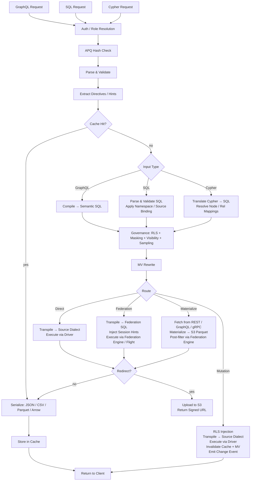

# ארכיטקטורת Provisa

## סקירה כללית

Provisa היא פלטפורמת וירטואליזציית נתונים מבוססת קונפיגורציה, המיועדת במיוחד להפעלת שכבה סמנטית עבור צוותים קטנים ועד ארגונים גדולים. היא מספקת API אחיד מעל מקורות נתונים הטרוגניים עם ממשל, אבטחה ואופטימיזציית ביצועים. לקוחות שולחים שאילתות דרך SQL, GraphQL, או Cypher; כל שלושת הממשקים הם ממשקים מדרגה ראשונה עם אותו ממשל בדיוק מיושם עליהם. (REQ-002, REQ-038)

ההבחנה של השכבה הסמנטית חשובה. כדי להוסיף לשכבה הסמנטית יש ליצור מקורות נתונים חדשים או צבירות (aggregates) חדשות בתוך שכבת וירטואליזציית הנתונים. זה יוצר הפרדה נקייה — אי אפשר להוסיף סמנטיקה חדשה מחוץ לפלטפורמה, מה שמאפשר ממשל נתונים אמיתי. (REQ-136) האכיפה מתבצעת ברמת המהדר (compiler): קטלוג הקשרים המאושר הוא מקור האמת ללא תלות בשפת השאילתה שבה נעשה שימוש. (REQ-002)

Provisa מתוכננת להיות בעלת ביצועים גבוהים עבור צרכים תפעוליים ובעלת יכולת קנה מידה גבוהה עבור צרכים אנליטיים ארגוניים. פלטפורמה יחידה משרתת את שני הצרכים מבלי להתפשר על מהירות או על קנה מידה.

```text
Config YAML → PG Metadata → Federation Catalogs
                               ↓
         Federation engine metadata → Schema Generator → SDL / SQL catalog / Cypher labels / gRPC proto (per role)
                                     ↓
                     Query → Parser → SQL Compiler → Transpiler
                                     ↓
                             Router (Smart Dispatch)
                         /           |            \
                    Federation  Direct PG      Direct MySQL/etc.
                         \           |            /
                              Executor Pool
                                     ↓
                         ┌───── Inline ─────┐     ┌──── Redirect ────┐
                         │  JSON (HTTP)     │     │  CTAS → S3       │
                         │  Arrow (Flight)  │     │  (Parquet, ORC)  │
                         │  Protobuf (gRPC) │     │  Provisa → S3    │
                         └─────────────────-┘     │  (JSON, CSV, …)  │
                                                  └─────────────────-┘
```

## ממשקי שאילתה

כל ממשק הוא הובלה (transport) נפרדת. כל ארבעת הממשקים מיישמים את אותו צינור אבטחה (RLS, מיסוך, דגימה, בדיקות תפקיד). (REQ-002, REQ-038) לקוחות אף פעם לא מתקשרים ישירות עם מנוע הפדרציה. (REQ-266) "שפת שאילתה" (SQL / GraphQL / Cypher) אורתוגונלית להובלה — אפשר שכמה שפות יגיעו דרך אותה הובלה.

| פורט | הובלה | שפות שאילתה מתקבלות | שימוש |
| ------ | ----------- | -------------------------- | ---------- |
| 8001 | HTTP | GraphQL, SQL, Cypher | לקוחות ווב, כלי BI, curl, צרכני REST |
| 8815 | Arrow Flight (gRPC) | SQL (דרך Arrow Flight SQL) | כלי נתונים (Pandas, DuckDB, Spark, ADBC) |
| 50051 | Protobuf gRPC | RPC-ים מיוצרים לפי תפקיד | תקשורת שירות-לשירות עם חוזים מוקלדים |
| ניתן להגדרה¹ | פרוטוקול חוט PostgreSQL (pgwire) | SQL | psql, DBeaver, SQLAlchemy, כל לקוח תואם PG |

¹ יש להגדיר `PROVISA_PGWIRE_PORT` (למשל 5433). מושבת כאשר לא מוגדר או `0`.

### HTTP (פורט 8001)

מספר נקודות קצה תחת אותו פורט, מובחנות לפי נתיב:

| נתיב | שפה | הערות |
| ------ | ---------- | ------- |
| `POST /data/graphql` | GraphQL | קריאות וכתיבות; hash של APQ מתקבל דרך `extensions.persistedQuery` |
| `POST /data/sql` | SQL | לקריאה בלבד; אין שער יכולת — הממשל נשען על נראות אובייקטים + RLS + מיסוך (REQ-001, REQ-267) |
| `POST /data/query` | Cypher | לקריאה בלבד; תפקיד סטנדרטי |
| `GET /data/nl` | שפה טבעית | מתורגם ל-SQL/GraphQL/Cypher בהתאם לסוג המקור |
| `GET /data/subscribe/{table}` | GraphQL | זרם מנוי SSE |
| `GET /neo4j/...` | Cypher (תאימות Neo4j) | שכבת תאימות ל-Neo4j HTTP API |
| `POST /admin/graphql` | GraphQL | API ניהול (נדרש תפקיד superuser/admin) |

כל הנתיבים מחזירים JSON כברירת מחדל. `Accept: text/csv`, `application/vnd.apache.parquet`, `application/vnd.apache.arrow.stream`, ו-`application/octet-stream` (בינארי גולמי) נתמכים דרך משא ומתן תוכן (content negotiation). תוצאות החורגות מסף הגודל המוגדר מנותבות באופן אוטומטי לכתובת S3 חתומה. (REQ-029, REQ-137)

### Arrow Flight (פורט 8815)

הובלה עמודתית (columnar) טבעית של Arrow דרך gRPC. (REQ-045, REQ-143) לקוחות שולחים כרטיס (ticket) בפורמט JSON:

```json
{"query": "SELECT name, email FROM customers", "role": "analyst"}
```

ומקבלים Arrow RecordBatches שנשלחים בזרימה עצלה (lazily). כאשר ה-proxy של Zaychik Flight SQL זמין, הנתונים זורמים כזרם של Arrow record batches מקצה לקצה: (REQ-144)

```text
Client ←(Arrow batches)← Provisa Flight Server ←(Arrow batches)← Zaychik ←(JDBC)← Federation Engine
```

התוצאה המלאה לעולם אינה ממומשת (materialized) בזיכרון של Provisa — ה-batches מועברים הלאה ככל שהם מגיעים. (REQ-145) זה הופך את Arrow Flight לנתיב בלתי מוגבל, המתאים לתוצאות בגדלים שרירותיים.

### Protobuf gRPC (פורט 50051)

`.proto` מיוצר אוטומטית מסכמת הנתונים, מיוצר לפי תפקיד. (REQ-525) שאילתות זרימה (הודעה אחת לכל שורה), מוטציות יחידניות (unary). Server reflection מופעל. (REQ-526) התפקיד מועבר דרך מפתח metadata בשם `x-provisa-role`.

### פרוטוקול חוט PostgreSQL / pgwire (פורט ניתן להגדרה)

מיישם את פרוטוקול החוט frontend/backend של PostgreSQL באמצעות הספרייה `buenavista`. (REQ-527) כל לקוח תואם PostgreSQL — `psql`, DBeaver, SQLAlchemy עם `psycopg2`, JDBC — יכול להתחבר ללא שינוי. מקבל SQL בלבד. צינור הממשל המלא (RLS, מיסוך, הרשאות תחום) חל באופן זהה על חיבורי pgwire. (REQ-266, REQ-002) מופעל על ידי הגדרת `PROVISA_PGWIRE_PORT` לפורט שאינו אפס.

## צינור הבקשות (Request Pipeline)

שלוש שפות שאילתה מתקבלות. כולן מתכנסות אל הממשל לאחר שלבי הפירוק/הידור (parse/compile) המתאימים להן. (REQ-262, REQ-263) רק GraphQL תומכת בכתיבות. (REQ-037) אין שער יכולת על השאילתה עצמה — כל זהות מאומתת רשאית לשאול בכל שפה, והנתונים מנוהלים אך ורק דרך נראות אובייקטים, RLS ומיסוך. (REQ-001)

| ממשק | קריאות | כתיבות | שער שאילתה |
| --- | --- | --- | --- |
| GraphQL (`/data/graphql`) | כן | כן (מוטציות) | אין — רק ממשל ברמת הנתונים |
| SQL (`/data/sql`) | כן | לא | אין — רק ממשל ברמת הנתונים (REQ-267) |
| Cypher (`/data/query`) | כן | לא | אין — רק ממשל ברמת הנתונים |



**החלטות ניתוב:**

| נתיב | מתי |
| --- | --- |
| **Cache** | פגיעה במטמון תוצאות — נבדק ראשון, מגיש את התוצאה השמורה ללא ביצוע (REQ-865) |
| **Cheap-count** | שאילתה בצורת `count(*)` מעל מקור שאינו ממומש (unmaterialized) שחושף ספירה טבעית מדויקת — מנותבת לקריאת הספירה הטבעית במקום מימוש לשם ספירה (REQ-875) |
| **Direct** | מקור יחיד + יש דרייבר טבעי + יש קונקטור פדרציה |
| **Federation** | פדרציה מרובת מקורות, או שלמקור יש קונקטור אך אין דרייבר |
| **Materialize** | למקור אין קונקטור פדרציה — יש להביא (fetch) ולשמור במטמון ל-S3/PG תחילה |
| **Mutation** | מוטציית GraphQL — תמיד ישירה, לעולם לא פדרטיבית |

הניתוב צורך את הפלט של שלב האופטימיזציה שלאחר הממשל, לעולם לא את ה-SQL המנוהל שלפני האופטימיזציה. הממשל עשוי להוסיף מקורות (תת-שאילתות תנאי RLS); שלב האופטימיזציה עשוי להסיר אותם (שילוב VALUES-CTE לטבלה חמה, שכתוב מטמון API, גיזום ענפי union). שאילתה פדרטיבית שמצטמצמת למקור חי יחיד לאחר השילוב מנותבת מחדש כישירה. (REQ-863)

### שאילתות מרובות-שורש (Multi-Root)

שאילתות GraphQL עם מספר שדות שורש (למשל `{ orders { id } customers { name } }`) מהודרות לשאילתות SQL נפרדות ומבוצעות באופן עצמאי. (REQ-534) בקשות SQL ו-Cypher הן שורש-יחיד מטבען. התוצאות ממוזגות לתגובה אחת:

- שדות מתחת לסף ההפניה מוחזרים inline תחת `data`
- שדות מעל הסף מופנים (redirected), עם ערכים לכל שדה תחת `redirects`
- פורמטים בינאריים (Parquet, Arrow) נתמכים רק עבור שאילתות שורש-יחיד

## נתיבי ביצוע פדרציה

| נתיב | הובלה | דרך | מתי בשימוש |
| ------ | ----------- | ----- | ----------- |
| REST | לקוח מנוע פדרציה (HTTP :8080) | שאילתה ישירה | ברירת מחדל, תמיד זמין |
| Flight SQL | `adbc-driver-flightsql` (gRPC :8480) | proxy של Zaychik ← JDBC | כאשר Zaychik פועל |
| CTAS | לקוח מנוע פדרציה (HTTP :8080) | כתיבה ישירה, Iceberg ל-S3 | הפניית Parquet/ORC |

### ה-proxy של Zaychik ל-Arrow Flight SQL

מנוע הפדרציה אינו תומך באופן טבעי בפרוטוקול Arrow Flight SQL. [Zaychik](https://github.com/Raiffeisen-DGTL/zaychik-trino-proxy) הוא proxy בשפת Java שמיישם את ממשק ה-gRPC של Arrow Flight SQL, מתרגם בקשות לשאילתות JDBC, ומזרים תוצאות בחזרה כ-Arrow record batches. (REQ-144)

```text
ADBC client → gRPC :8480 → Zaychik → JDBC :8080 → Federation Engine → results → Arrow batches → client
```

שרת ה-Flight של Provisa (פורט 8815) מתחבר ל-Zaychik כלקוח ADBC, ומאפשר זרימת Arrow מקצה לקצה ללא מימוש התוצאות. (REQ-145)

### קטלוג תוצאות Iceberg

הפניית CTAS משתמשת בקונקטור Iceberg (קטלוג `results`) הנתמך על ידי קטלוג JDBC על גבי מופע PostgreSQL הקיים. (REQ-169) Iceberg כותב קבצי Parquet/ORC ישירות ל-MinIO/S3 דרך מערכת הקבצים הטבעית של S3 (`fs.native-s3.enabled=true`).

## מנועי פדרציה

Provisa בוחרת מנוע פדרציה באתחול דרך משתנה הסביבה `PROVISA_ENGINE`, קונפיגורציית ה-admin-UI השמורה, או ברירת המחדל. כאשר דבר אינו מוגדר, DuckDB היא ברירת המחדל — לחלוטין תוך-תהליכית (in-process), ללא שירות חיצוני (REQ-989). ראו [Configuration](configuration.md#_16) לפרטי בחירה.

כל מנוע הוא מופע `FederationEngine` המוגדר ב-`provisa/federation/engine.py`. המופע מחזיק אוסף קונקטורים שקובע אילו סוגי מקורות המנוע יכול לקרוא באופן חי (ATTACH) לעומת אילו חייבים תחילה לנחות (land) במאגר המימוש (materialization store) של המנוע. [tool-verified: `engine.py` `_ENGINE_BUILDERS`, `ENGINE_REGISTRY`]

### מחלקות דרייבר (REQ-840) [tool-verified: `engine.py` `DriverClass`]

| מחלקה | משמעות | דוגמאות |
| ------- | --------- | --------- |
| `BROAD` | מגיעה לסוגי מקורות חיצוניים רבים דרך קונקטורים טבעיים | Trino |
| `PARTIAL` | מגיעה לקבוצת משנה (יחסיים, קבצים, אחסון ענן/lake) בנוסף לנחיתה של כל השאר | DuckDB, PostgreSQL, ClickHouse, Databricks, Snowflake, BigQuery, Fabric, Synapse |
| `SELF_ONLY` | מגיעה רק למאגר שלה עצמה; כל מקור אחר נוחת פנימה | SQLAlchemy |

### מנועים זמינים [tool-verified: `engine.py` `_ENGINE_BUILDERS`]

| מפתח מנוע | דיאלקט | MPP | מנגנון קישור חיצוני | אימות |
| ----------- | --------- | ----- | ------------------------ | ------ |
| `trino` / `trino-byo` | Trino SQL | כן | קטלוגי Trino (מערך קונקטורים רחב) | פרטי גישה JDBC |
| `pg` | PostgreSQL | לא | FDW / pg_duckdb | פרטי גישה PostgreSQL |
| `duckdb` | DuckDB | לא | ATTACH טבעי לתוסף | אין (תוך-תהליכי) |
| `clickhouse` / `clickhouse-server` | ClickHouse | כן (shards) | מנועי טבלה S3 / IcebergS3 / DeltaLake (REQ-986) | פרטי גישה ClickHouse |
| `snowflake` | Snowflake | כן | external stage + external table (REQ-988) | `PROVISA_ENGINE_URL` |
| `databricks` | Databricks SQL | כן | טבלאות חיצוניות של Unity Catalog דרך REST (REQ-987) | Bearer token (`http_path` תחת `federation_hints`) |
| `bigquery` | BigQuery | כן (Dremel) | טבלאות BigQuery external / BigLake | מפתח חשבון שירות `GOOGLE_APPLICATION_CREDENTIALS` |
| `fabric` | T-SQL | כן | OneLake shortcuts ← OPENROWSET | Azure AD (`az login` / זהות מנוהלת) |
| `synapse` | T-SQL | כן | ADLS OPENROWSET / טבלאות חיצוניות | Azure AD |
| `sqlalchemy` | כל דיאלקט SQLAlchemy | לא | אין (נחיתה בלבד) | פרטי גישה לפי דיאלקט |

### ברירת מחדל ללא קונפיגורציה: DuckDB (REQ-989) [tool-verified: `engine.py` `build_duckdb_engine`, `_embedded_duckdb_materialize_default`]

כאשר `PROVISA_ENGINE` אינו מוגדר, Provisa משתמשת במנוע DuckDB המוטמע (embedded) תוך-תהליכי במלואו. מאגר המימוש של DuckDB הוא קובץ DuckDB מוטמע ב-`$PROVISA_DATA_DIR/materialize.duckdb` (ברירת מחדל `~/.provisa/materialize.duckdb`). אין צורך במסד נתונים או שירות חיצוני.

מכיוון ש-DuckDB אוכפת כותב יחיד לכל קובץ, `store_connection.py` כותב אל המאגר המוטמע דרך החיבור של המנוע עצמו — לעולם לא דרך חיבור עצמאי שני. זהו המקרה היחיד שבו המנוע ומאגר המימוש חולקים handle קובץ אחד במכוון. [tool-verified: `store_connection.py` module docstring]

### הובלת קריאה טבעית ל-Arrow (REQ-986, REQ-987, REQ-988) [tool-verified: `engine.py` `build_*_engine` `capabilities=`]

ClickHouse, DuckDB, Snowflake, Databricks, BigQuery, Fabric ו-Synapse כולם מכריזים על `EngineCapability.ARROW` ו-`EngineCapability.ARROW_STREAM`. שאילתות מול מנועים אלו מחזירות Arrow RecordBatches ישירות — נתיב הסדרת השורות (row-serialization) עוקף לחלוטין. שרת ה-Flight מזרים את ה-batches הללו ללקוחות מבלי לממש את התוצאה המלאה בזיכרון התהליך של Provisa. עבור Trino, זרימת Arrow נשענת על ה-proxy של Zaychik; עבור מנועי מחסן הנתונים, ה-API הטבעי של Arrow של המנוע עצמו (Cloud Fetch עבור Databricks, Storage Read API עבור BigQuery, `fetch_arrow_table` עבור DuckDB ו-Snowflake) מזין את זרם ה-Flight.

### קישורי נתונים חיצוניים (ATTACH) [tool-verified: `engine.py` `_warehouse_connectors`]

כל מנוע מחסן נתונים יכול לסרוק נתוני ענן/lake במקום, מבלי לנחות עותק. קבצי Parquet, CSV, Iceberg ו-Delta Lake על S3, GCS או OneLake מתחברים (attach) ישירות למנוע כאילו היו טבלאות טבעיות. האסטרטגיה — ATTACH (סריקה במקום) או LAND (העתקה למאגר) — נקבעת על ידי ה-`Mechanism` המוצהר של הקונקטור; אין הסתעפות ספציפית-למנוע בתכנן (planner). קונקטור מסוג `Mechanism.ATTACH_R` מפעיל סריקת zero-copy; קונקטור מסוג `Mechanism.DIRECT` או קונקטור שאינו קיים מפעיל נחיתה (land). [tool-verified: `connector_base.py` `Mechanism`, `engine.py` `_warehouse_connectors`]

ה-Attach מקצה אוטומטית מראש את כל התנאים ההכרחיים בזמן ה-attach:

| מנוע | פורמטי אובייקט/lake | מנגנון | הקצאה אוטומטית [tool-verified] |
| -------- | ------------------- | ---------- | ---------------------------------- |
| Databricks | parquet, csv, iceberg, delta_lake | טבלה חיצונית UC (`ATTACH_R`) | REST מתקין storage credential + external location של Unity Catalog, ואז `CREATE TABLE … USING <format> LOCATION …` — אומת בפועל מול Cloudflare R2 |
| BigQuery | parquet, csv, json, iceberg, delta_lake | טבלה חיצונית BigQuery / BigLake (`ATTACH_R`) | `CREATE OR REPLACE EXTERNAL TABLE … OPTIONS(format=…, uris=[…])` — אומת בפועל |
| ClickHouse | csv, parquet, iceberg, delta_lake | מנוע טבלה S3 / IcebergS3 / DeltaLake (`ATTACH_R`) | בדיקת אימות מתבצעת בזמן ה-attach — אומת בפועל מול Cloudflare R2 |
| Fabric | parquet, csv, iceberg, delta_lake | OneLake shortcut ← OPENROWSET (`ATTACH_R`) | REST יוצר חיבור `AmazonS3Compatible` + lakehouse + shortcut; מחזיר את נתיב ה-`BULK` של OneLake — אומת בפועל בקריאת R2 דרך Fabric |
| Snowflake | parquet, csv, json, iceberg, delta_lake | external stage + טבלה חיצונית (`ATTACH_R`) | `CREATE STAGE … URL=… CREDENTIALS=…`, ואז `CREATE OR REPLACE EXTERNAL TABLE … LOCATION=@stage FILE_FORMAT=(TYPE=…)` — ממומש; לא נבדק בפועל (אין חשבון זמין) |

פרטי גישה לאחסון ענן עוברים בתוך `federation_hints` של המקור (ראו [Sources](sources.md#_10)). כל סוג מקור שאינו יכול לבצע ATTACH נוחת תחילה במאגר המימוש של המנוע.

### כתיבות מימוש עמודתי (REQ-990) [tool-verified: `core/database.py:436`, `store_connection.py:99`]

`Connection.bulk_copy` ב-`provisa/core/database.py` בוחר את נתיב ההזנה הכמותית (bulk-ingest) המהיר ביותר לפי דיאלקט המאגר: `COPY` בינארי (asyncpg `copy_records_to_table`) עבור מאגרי PostgreSQL, ופקודת `executemany` מוכנה (prepared) יחידה עבור כל שאר המאגרים היחסיים. המאגר המוטמע של DuckDB נוחת דרך `land_duckdb_native` ב-`store_connection.py` — קריאת `executemany` אחת עבור כל האצווה, לעולם לא לולאה לכל שורה.

## הפניית תוצאות גדולות

תוצאות החורגות מסף שורות מופנות לאחסון תואם S3 (MinIO) במקום להיות מוחזרות inline. (REQ-029)

### מצבי הפניה

| מצב | איך זה עובד | הנתונים נוגעים ב-Provisa? |
| ------ | ------------- | ---------------------- |
| **CTAS** (Parquet, ORC) | מנוע הפדרציה כותב ישירות ל-S3 דרך `CREATE TABLE AS SELECT` | לא |
| **העלאת Provisa** (JSON, NDJSON, CSV, Arrow IPC) | Provisa מסדרת (serializes) ומעלה דרך boto3 | כן |

עבור פורמטים טבעיים ל-CTAS, Provisa לעולם אינה מטפלת בנתונים — מנוע הפדרציה כותב קבצים ישירות ל-MinIO/S3. (REQ-138) זהו הנתיב המועדף עבור ייצוא אנליטי בהיקף גדול.

### כותרות הפניה

| כותרת | אפקט |
| -------- | -------- |
| `X-Provisa-Redirect-Format: <mime>` | הפניה בפורמט זה (מרמז על כפייה אלא אם נקבע סף) |
| `X-Provisa-Redirect-Threshold: N` | להפנות רק אם התוצאה חורגת מ-N שורות |
| `X-Provisa-Redirect: true` | לכפות הפניה בפורמט ברירת המחדל |

כותרות אלו מיישמות הפניה הנשלטת על ידי הלקוח. (REQ-137)

**תגובה:**

```json
{
  "data": {"orders": null},
  "redirect": {
    "redirect_url": "https://minio:9000/provisa-results/results/abc.parquet?...",
    "row_count": 50000,
    "expires_in": 3600,
    "content_type": "application/vnd.apache.parquet"
  }
}
```

### קונפיגורציית שרת

| משתנה סביבה | ברירת מחדל | מטרה |
| --------- | --------- | --------- |
| `PROVISA_REDIRECT_ENABLED` | `false` | הפעלת הפניית סף בצד השרת |
| `PROVISA_REDIRECT_THRESHOLD` | `1000` | סף ספירת שורות ברירת מחדל |
| `PROVISA_REDIRECT_FORMAT` | `parquet` | פורמט הפניה ברירת מחדל |
| `PROVISA_REDIRECT_BUCKET` | `provisa-results` | שם bucket ב-S3 |
| `PROVISA_REDIRECT_ENDPOINT` | | כתובת נקודת קצה תואמת S3 |
| `PROVISA_REDIRECT_TTL` | `3600` | TTL של כתובת חתומה מראש (בשניות) |

## עץ החלטת ניתוב

```text
Multi-source query? → Federation engine
NoSQL source (MongoDB, Cassandra)? → Federation engine
Uses path columns on non-PG source? → Federation engine
Single RDBMS with driver? → Direct (sub-100ms target)
Single RDBMS without driver? → Federation engine
Steward hint "federated"? → Federation engine (override)
Steward hint "direct"? → Direct (if possible)
Redirect to Parquet/ORC? → Federation engine (CTAS, regardless of source count)
```

(REQ-027, REQ-028, REQ-030, REQ-279)

## אופטימיזציית שאילתות פדרציה

Provisa מכינה מראש (primes) את האופטימיזטור מבוסס-העלות (cost-based optimizer) של מנוע הפדרציה באופן אוטומטי כך שתוכניות שאילתה חוצות-מקורות מבוססות על התפלגות נתונים אמיתית, לא על ברירות מחדל קשיחות.

### סטטיסטיקות אוטומטיות (`ANALYZE`)

בעת רישום מקור, Provisa מריצה `ANALYZE catalog.schema.table` עבור כל טבלה שפורסמה. (REQ-275) זה אוסף:

- ספירת שורות
- לכל עמודה: שיעור ערכי null, ספירת ערכים ייחודיים, מינימום/מקסימום, היסטוגרמות (תלוי קונקטור)

האופטימיזטור משתמש בנתונים אלו כדי להעריך סלקטיביות עבור שאילתות מסוננות. ללא סטטיסטיקות, הוא נופל חזרה לברירות מחדל קבועות (למשל, 10% סלקטיביות עבור תנאי שוויון) שמייצרות תוכניות join גרועות על נתונים מוטים או עתירי-קרדינליות. עם סטטיסטיקות, ההערכות מדויקות מספיק כדי לקבל החלטות נכונות בין broadcast join לבין partitioned join עבור רוב העומסים.

**כיסוי**: תמיכת הסטטיסטיקות משתנה לפי קונקטור. PostgreSQL, MySQL, Hive, Iceberg ו-Delta Lake תומכים באופן מלא ב-`ANALYZE`. לקונקטורי MongoDB ו-Cassandra יש תמיכה חלקית או אין תמיכה כלל. Provisa בולעת (swallows) כשלי `ANALYZE` בשקט — הרישום לעולם אינו נחסם. (REQ-275)

**מגבלות סלקטיביות**: הסטטיסטיקות מספקות הערכות לכל עמודה. עבור תנאים מתואמים (`WHERE region = 'US' AND city = 'Seattle'`), האופטימיזטור מניח אי-תלות בין עמודות, מה שעלול לגרום להערכת חסר בספירת השורות. זוהי מגבלה ידועה של סטטיסטיקות ברמת עמודה בכל האופטימיזטורים מבוססי-עלות.

**מקורות API**: טבלאות `api_cache_{table_name}` ב-PostgreSQL מנותחות אוטומטית לאחר כל מחזור רענון מטמון, כך שלאופטימיזטור יש הערכות שורות עדכניות בעת חיבור מקורות מבוססי-API עם מקורות יחסיים. (REQ-280)

### ניהול: רענון סטטיסטיקות

הרצה חוזרת של איסוף סטטיסטיקות לפי דרישה דרך ה-API הניהולי: (REQ-276)

```graphql
mutation {
  refreshSourceStatistics(sourceId: "sales-pg") {
    tablesAnalyzed
    failures { table message }
  }
}
```

שימושי כאשר מקור קיבל נתונים חדשים משמעותיים מאז הרישום.

## Materialized Views

Materialized Views מייעלות בשקיפות שאילתות יקרות על ידי חישוב מראש ושמירה במטמון של תוצאות.

### קשרים כרמזים ל-MV

הצהרת קשר (relationship) אינה רק ארטיפקט ממשל — היא גם התיאור המבני של צורת join. צורה זו היא בדיוק מה שאופטימיזטור ה-MV צריך: שתי טבלאות, שתי עמודות, סוג join. משמעות הדבר היא שקשר יכול להניע ישירות מימוש (materialization).

עבור **קשרים חוצי-מקור**, זה קורה אוטומטית באתחול: כל קשר חוצה-מקור שאושר מייצר `JoinPattern` MV (`auto-mv-<rel_id>`). (REQ-158) אין צורך בקונפיגורציית MV נפרדת. כאשר המהדר רואה join זה בשאילתה, השכתוב (rewriter) מחליף את התוצאה הממומשת מראש באופן שקוף.

עבור **קשרים בתוך אותו מקור**, ה-stewards יכולים לבחור להצטרף (opt in) במפורש דרך `materialize: true`. JOINs בתוך אותו מקור כבר מהירים דרך ביצוע ישיר, כך שמימוש כדאי רק עבור נתיבי join חמים מאוד. (REQ-159)

המשמעות המעשית: stewards שמאשרים קשר, למעשה מחליטים אם ה-join הוא מועמד טוב למימוש. פעולת הממשל ורמז האופטימיזציה הם אותה הצהרה בדיוק.

### מצבים

| מצב | קונפיגורציה | התנהגות |
| ------ | -------- | ---------- |
| **Join-pattern** | `join_pattern` בקונפיגורציית MV | שוכתב JOINs תואמים לקרוא מטבלת ה-MV |
| **SQL מותאם אישית** | `sql` בקונפיגורציית MV | SELECT שרירותי, נחשף אופציונלית ב-SDL |
| **קשר ממומש אוטומטית** | קשר חוצה-מקור (אוטומטי) | מייצר אוטומטית MV מסוג join-pattern; אין צורך בקונפיגורציה |
| **קשר ממומש על ידי steward** | `materialize: true` על קשר בתוך אותו מקור | הצטרפות מפורשת עבור נתיבי join חמים בתוך אותו מקור |

### מימוש אוטומטי

JOINs חוצי-מקור הם השאילתות היקרות ביותר (תמיד פדרטיביות). קשרים חוצי-מקור מייצרים אוטומטית הגדרות MV באתחול: (REQ-158)

```yaml
relationships:
  - id: orders-to-reviews
    source_table_id: orders        # sales-pg
    target_table_id: product_reviews  # reviews-mongo
    source_column: product_id
    target_column: product_id
    cardinality: one-to-many
    materialize: true              # auto-create MV
    refresh_interval: 600          # refresh every 10 minutes
```

רק קשרים חוצי-מקור מייצרים MVs (JOINs בתוך אותו מקור כבר מהירים דרך ביצוע ישיר). (REQ-159) ה-MV מתחיל במצב `STALE` ומתרענן על ידי לולאת הרענון ברקע לפני שהוא משמש את אופטימיזטור השאילתות. (REQ-160)

### מחזור חיים של רענון

```text
STALE → (refresh loop picks up) → REFRESHING → FRESH
  ↑                                                |
  └──── mutation hits source table ────────────────┘
```

לולאת הרענון פועלת כל 30 שניות, בודקת `get_due_for_refresh()`, ומבצעת `CREATE TABLE AS SELECT` (בהרצה ראשונה) או `DELETE + INSERT` (בהרצות הבאות) מול טבלת היעד של ה-MV דרך מנוע הפדרציה. (REQ-160, REQ-234)

## מפת מודולים

| מודול | מטרה |
| -------- | --------- |
| `api/` | אפליקציית FastAPI, נתבים (routers), middleware, ניהול מחזור חיים (lifespan) |
| `api/flight/` | שרת Arrow Flight (gRPC, פורט 8815) |
| `api/admin/` | API ניהול GraphQL מבוסס Strawberry — קונפיגורציה, גילוי, תצוגות |
| `api/rest/` | נקודות קצה REST מיוצרות אוטומטית מטבלאות רשומות |
| `api/jsonapi/` | נקודות קצה JSON:API מיוצרות אוטומטית עם pagination וטיפול בשגיאות |
| `api/data/subscribe.py` | מנויי SSE — LISTEN/NOTIFY, polling, Debezium CDC |
| `compiler/` | פרסרים ל-GraphQL/SQL, מחולל SQL סמנטי, RLS, מיסוך, דגימה, ממשל דו-שלבי (`stage2.py`) |
| `cypher/` | מתרגם Cypher ← SQL, פרסר, מפת תוויות (REQ-351), מתרגם כתיבה עבור מוטציות Cypher |
| `pgwire/` | שרת פרוטוקול חוט PostgreSQL; `catalog.py` מיירט את pg_catalog/information_schema עבור נראות אובייקטים לפי תפקיד (REQ-527, REQ-883, REQ-891) |
| `vector/` | חיפוש וקטורי — רישום מודלים, ספקי הטמעה (openai/ollama/huggingface), תרגום `cosine_similarity()`, מטמון גיבוי pgvector, יצירת הטמעות דקלרטיבית (REQ-419–431) |
| `compiler/federation.py` | תמיכת subgraph ב-Apollo Federation v2 |
| `transpiler/` | תרגום דיאלקט, לוגיקת ניתוב |
| `executor/` | ביצוע פדרטיבי/ישיר, סדרות, פורמטי פלט |
| `executor/drivers/` | דרייברים ישירים למקורות (PostgreSQL, MySQL, DuckDB, Snowflake, Databricks, ClickHouse, …) |
| `executor/trino_flight.py` | לקוח ADBC Flight SQL עבור מנוע הפדרציה |
| `executor/ctas_write.py` | הפניה מבוססת CTAS (מנוע הפדרציה כותב ל-S3) |
| `executor/redirect.py` | לוגיקת הפניית S3, העלאה בצד Provisa |
| `federation/engine.py` | `FederationEngine`, `DriverClass`, `_ENGINE_BUILDERS`, `ENGINE_REGISTRY`, `build_engine` |
| `federation/connector.py` | הפשטות קונקטור — Trino, ClickHouse; `Mechanism`, `WarehouseNativeConnector` |
| `federation/connector_duckdb.py` | הגדרות קונקטור DuckDB ו-PostgreSQL FDW |
| `federation/snowflake_connectors.py` | קונקטורי ATTACH ל-external stage + external table של Snowflake (REQ-988) |
| `federation/databricks_connectors.py` | קונקטורי ATTACH לטבלה חיצונית של Databricks UC (REQ-987) |
| `federation/bigquery_connectors.py` | קונקטורי ATTACH ל-BigQuery external / BigLake |
| `federation/databricks_uc.py` | הקצאה אוטומטית של credential + external location של Unity Catalog |
| `federation/databricks_backend.py` | backend ביצוע Databricks SQL warehouse |
| `federation/snowflake_backend.py` | backend ביצוע Snowflake |
| `federation/bigquery_backend.py` | backend ביצוע BigQuery (הובלת Arrow דרך Storage Read API) |
| `federation/mssql_warehouse_backend.py` | backend-ים לביצוע Fabric Warehouse + Synapse (T-SQL דרך ODBC) |
| `federation/mssql_warehouse_connectors.py` | קונקטורי ATTACH ל-OPENROWSET עבור Fabric / Synapse |
| `federation/fabric_shortcuts.py` | הקצאה אוטומטית של OneLake shortcut (חיבור ← lakehouse ← shortcut) |
| `federation/clickhouse_backend.py` | backend ביצוע ClickHouse |
| `federation/duckdb_backend.py` | backend ביצוע DuckDB תוך-תהליכי |
| `federation/pg_backend.py` | backend ביצוע PostgreSQL |
| `federation/store_connection.py` | פני כתיבה של מאגר המימוש הטבעי ל-DuckDB (REQ-989, REQ-990) |
| `registry/` | רישום שאילתות מתמידות (persisted), ממשל |
| `security/` | נראות, הרשאות, מיסוך עמודות |
| `cache/` | מטמון תוצאות שאילתה מבוסס Redis (שכבה חמה) |
| `mv/` | רישום Materialized Views, רענון, שכתוב SQL |
| `events/` | אירועי שינוי ערכת נתונים ושליחת טריגרים |
| `webhooks/` | ביצוע webhook יוצא עבור מוטציות ואירועים |
| `scheduler/` | ניהול משימות רקע מבוסס APScheduler — טריגרי cron ומרווח שמפעילים webhooks, מוטציות, או פרסום ל-sink של Kafka |
| `apq/` | פרוטוקול חוט APQ של Apollo — מטמון hash שאילתה מבוסס Redis; נפרד ממטמון התוצאות |
| `compiler/cursor.py` | pagination בסגנון Relay מבוסס cursor — פרמטרים `first`/`after`/`last`/`before` ויצירת `pageInfo` בכל שאילתות הרשימה |
| `compiler/aggregate_gen.py` | סוגי שאילתת `{table}_aggregate` מיוצרים אוטומטית עם שדות משנה `count`, `sum`, `avg`, `min`, `max` וגישת `nodes` מסוננת |
| `compiler/enum_detect.py` | זיהוי אוטומטי של סוג enum — סוגי enum טבעיים של PostgreSQL (`pg_enum`) נחשפים כסוגי enum ב-GraphQL במקום כ-string scalars |
| `compiler/hints.py` | רמזי ביצועים לפדרציה — הנחיות ניתוב ברמת השאילתה, מוטמעות כתגובות SQL (`/* @provisa route=federated */`) שדורסות את הניתוב האוטומטי |
| `compiler/mutation_gen.py` | מהדר מוטציות; presets עמודה — ערכים סטטיים בצד השרת או ערכי משתנה-session המוחלים בהוספה/עדכון, ואינם נחשפים בסוג הקלט של המוטציה |
| `auth/approval_hook.py` | hook אישור ABAC — hook הרשאה חיצוני שניתן לחיבור, מופעל לפני ביצוע השאילתה; הובלות webhook, gRPC ו-unix_socket; היקף לכל טבלה/מקור/גלובלי; מדיניות נפילה חזרה (fallback) הניתנת להגדרה |
| `subscriptions/` | מצב ומסירה של מנויי SSE |
| `discovery/` | גילוי קשרים מבוסס LLM (Claude API) |
| `grpc/` | יצירת proto, שרת gRPC, reflection |
| `api_source/` | מקורות API של REST/GraphQL/gRPC עם מטמון PG |
| `kafka/` | מקורות topic של Kafka, sink, Schema Registry |
| `auth/` | ספקי אימות ניתנים לחיבור, middleware, מיפוי תפקידים |
| `core/` | קונפיגורציה, מודלים, DB, repositories, סודות; מודל התפקידים תומך ב-`parent_role_id` וב-`flatten_roles()` עבור ירושת תפקידים רקורסיבית |
| `hasura_v2/` | ממיר metadata של Hasura v2 ← קונפיגורציית Provisa |
| `ddn/` | ממיר supergraph של Hasura DDN ← קונפיגורציית Provisa |
| `mongodb/` | קונקטור מקור MongoDB |
| `elasticsearch/` | קונקטור מקור Elasticsearch |
| `cassandra/` | קונקטור מקור Cassandra |
| `prometheus/` | קונקטור מקור מדדי Prometheus |
| `source_adapters/` | שכבת מתאם גנרית לחיבורי מקור |

## API ניהול

ה-API הניהולי מבוסס Strawberry GraphQL מותקן תחת `/admin/graphql` (פורט HTTP 8001). הוא נפרד מנקודת הקצה של GraphQL הנתונים ודורש תפקיד superuser או admin.

| יכולת | תיאור |
| ----------- | ------------- |
| הורדה/העלאה של קונפיגורציה | ייצוא או החלפה של קובץ ה-YAML המלא של Provisa |
| עורך קשרים | יצירה, עדכון, מחיקה של הגדרות קשר |
| גילוי FK מבוסס AI | הפעלת ניתוח מועמדי FK מבוסס Claude |
| בדיקת סכמה (introspection) | עיון בטבלאות, עמודות ותפקידים שפורסמו |
| ניהול תצוגות | רישום וניהול הגדרות Materialized View |

(REQ-164, REQ-165, REQ-166, REQ-167)

## קונפיגורציית מודלי AI

`GET /admin/ai-models` ו-`PUT /admin/ai-models` מגדירים את צינור ה-LLM עבור כל ארגון. (REQ-464, REQ-419, REQ-500, REQ-370, REQ-1349)

ההגדרות הן **ברמת ארגון**: הבחירות של כל ארגון שוכבות מעל קונפיגורציית הפריסה (deployment) ונכנסות לתוקף בבקשה הבאה — אין צורך באתחול מחדש. (REQ-1349) [tool-verified: `provisa/api/admin/ai_models_router.py:38-39`]

**הקצאות מודל לפי פעולה.** לחמש פעולות NL יש כל אחת ספק ומחרוזת מודל הניתנים להגדרה:

| פעולה | מה היא מניעה |
| --------- | -------------- |
| `table_description` | תיאורי טבלה מיוצרים על ידי LLM |
| `column_description` | תיאורי עמודה מיוצרים על ידי LLM |
| `relationship_inference` | גילוי מועמדי FK |
| `sql_generation` | יצירת SQL מ-NL |
| `table_selection` | בחירת אילו טבלאות לכלול ב-prompt של NL |

שדה הספק מקבל כל ספק תואם `aisuite` (`anthropic`, `openai`, `groq`, `mistral`, `cohere`, ואחרים) או נקודת קצה מקומית (`ollama`, `lmstudio`). מחרוזת מודל ריקה מסירה את הדריסה של הארגון וחוזרת לברירת המחדל של הפריסה. [tool-verified: `provisa/api/admin/ai_models_router.py:29-35`, `provisa-ui/src/components/admin/AiModelsTab.tsx:43-60`]

**הגבלת קצב NL.** תקרה אופציונלית של בקשות-לתקופה המוחלת לפי תפקיד. בקשות עודפות מחזירות `429` עם `Retry-After`. [tool-verified: `provisa-ui/src/components/admin/AiModelsTab.tsx:306-313`]

**רישום מודלים וקטורי.** רשימה של מודלי הטמעה (שדות: `id`, `provider`, `dimensions`, אופציונלי `api_key_env` ו-`base_url`, דגל `enabled`). החלפת רשימה מלאה: לכל רשומה חייבים להיות `id`, `provider`, ו-`dimensions` אחרת הכתיבה נדחית עם `400`. [tool-verified: `provisa/api/admin/ai_models_router.py:122-131`]

**מפתחות API.** מפתחות API של LLM לכל ספק נשמרים מוצפנים דרך `provisa.core.org_secrets` (ראו למטה). תגובת ה-`GET` מדווחת רק האם מפתח מוגדר עבור כל ספק — הערך עצמו לעולם לא מוחזר. שליחת מחרוזת ריקה עבור ספק מנקה את המפתח הזה, ומחזירה קריאות LLM עבור אותו ספק לפרטי הגישה של משתנה הסביבה של הפריסה. (REQ-1395, REQ-1398) [tool-verified: `provisa/api/admin/ai_models_router.py:76-78`, `provisa/api/admin/ai_models_router.py:149-165`]

## סודות מוצפנים לפי ארגון

`provisa/core/org_secrets.py` שומר פרטי גישה שאסור שיופיעו כטקסט גלוי במסד הנתונים. כרגע מוגבל למפתחות API של ספקי LLM (`{vendor}_api_key`). (REQ-1395, REQ-1398) [tool-verified: `provisa/core/org_secrets.py`]

הערכים מוצפנים דרך `encryption_service` הכלל-תהליכי מ-`provisa.encryption.runtime` — אותו מנגנון כמו `api_sources.auth`. [tool-verified: `provisa/core/org_secrets.py:16-17`]

נתמכים שנים עשר ספקים תואמי `aisuite`: `anthropic`, `openai`, `cohere`, `groq`, `mistral`, `xai`, `deepseek`, `together`, `fireworks`, `nebius`, `sambanova`, ו-`inception`. Google, AWS ו-Azure אינם כלולים משום שהם דורשים קונפיגורציה מעבר למפתח API פשוט (מזהי פרויקט, תפקידי IAM, אזור). ספקי נקודת קצה מקומית (`ollama`, `lmstudio`) אין להם מפתח, ואינם כלולים מאותה סיבה. [tool-verified: `provisa/core/org_secrets.py:33-53`]

העברת `value=None` ל-`write_org_secret` מוחקת את השורה. קוראים שקוראים סוד צורכים אותו מיידית (לדוגמה כדי לבנות לקוח LLM) ואסור להם להדהד אותו בשום תגובת API. [tool-verified: `provisa/core/org_secrets.py:97-117`]

## נקודות קצה REST ו-JSON:API מיוצרות אוטומטית

טבלאות רשומות נחשפות כנקודות קצה REST ו-JSON:API לצד ממשק ה-GraphQL. (REQ-256, REQ-257)

| ממשק | נתיב חיבור | מפרט |
| ----------- | ----------- | ------ |
| REST | `/rest/<table-id>` | GET/POST פשוט עם פרמטרי שאילתה |
| JSON:API | `/jsonapi/<table-id>` | תואם [jsonapi.org](https://jsonapi.org) — pagination, קשרים, אובייקטי שגיאה |

נקודות קצה אלו מיישמות את אותו צינור אבטחה (RLS, מיסוך, בדיקות תפקיד) כמו נקודת הקצה של GraphQL. (REQ-002, REQ-038)

## מנויים (Subscriptions)

מנויי SSE מוגשים תחת `GET /data/subscribe/{table}`. שלושה מצבי מסירה: (REQ-258)

| מצב | מנגנון | מתי בשימוש |
| ------ | ----------- | ----------- |
| **LISTEN/NOTIFY** | `LISTEN` של PostgreSQL על ערוץ | מקורות PG עם פעילות מוטציות |
| **Polling** | הרצה חוזרת של השאילתה במרווח זמן | מקורות שאינם PG, או כאשר CDC אינו זמין |
| **Debezium CDC** | topic של Kafka מקונקטור Debezium | זרמי שינוי בתדירות גבוהה |

(REQ-258, REQ-260, REQ-261)

הלקוח מקבל `text/event-stream` עם אירוע JSON אחד לכל שורה שהשתנתה או הפרש (diff).

## מערכת אירועים ו-Webhook

מוטציות מסד נתונים (INSERT/UPDATE/DELETE) יכולות להפעיל אירועים יוצאים דרך המודולים `events/` ו-`webhooks/`. (REQ-172, REQ-173, REQ-220)

```text
Mutation executed → EventDispatcher → match event trigger rules
                                          ↓
                               WebhookExecutor → HTTP POST to configured URL
```

טריגרי אירועים מוגדרים בקונפיגורציה ומותאמים לפי טבלה, סוג פעולה, ופילטר שורה אופציונלי. עומסי (payloads) ה-webhook כוללים את סוג הפעולה, השורה שהשתנתה, והקשר התפקיד.

## שירותי רקע

ארבע לולאות רקע מופעלות במהלך מחזור החיים (lifespan) של האפליקציה (`api/app.py`):

| שירות | מרווח | מטרה |
| --------- | ---------- | --------- |
| לולאת רענון MV | 30 שניות | סורקת את `get_due_for_refresh()`, מבצעת CTAS או DELETE+INSERT על MVs לא-עדכניים |
| מנהל טבלאות חמות (Warm) | ניתן להגדרה | מקדם טבלאות שנשאלות בתדירות גבוהה למטמון Iceberg על SSD מקומי |
| טוען טבלאות חמות (Hot) | ניתן להגדרה | טוען טבלאות ייחוס קטנות למטמון בזיכרון עבור גישה תת-מילישניתית |
| poller למקור API | מרווח לפי מקור | מביא ושומר מחדש במטמון מקורות REST/GraphQL/gRPC מרוחקים |

(REQ-160, REQ-238, REQ-239, REQ-236)

### שכבות מטמון טבלאות Hot/Warm

| שכבה | אחסון | קריטריון קידום | זמן גישה |
| ------ | --------- | ------------------- | ---------------- |
| Hot | זיכרון תוך-תהליכי | ספירת שורות < סף, או שהיא יעד קשר | < 1 מ"ש |
| Warm | Iceberg על SSD מקומי | סף תדירות שאילתה חצה | כ-5–20 מ"ש |
| Cold | מקור מרוחק | ברירת מחדל | 50–500 מ"ש |

(REQ-230, REQ-236, REQ-238, REQ-241)

## ייבוא Metadata (Hasura v2 / DDN)

פריסות Hasura קיימות ניתנות להמרה לקונפיגורציית Provisa ללא שכתוב ידני. (REQ-182, REQ-183)

| מודול | קלט | פלט |
| -------- | ------- | -------- |
| `hasura_v2/` | `metadata.yaml` של Hasura v2 | `config.yaml` של Provisa |
| `ddn/` | JSON של supergraph מסוג Hasura DDN | `config.yaml` של Provisa |

שני הממירים ממפים טבלאות מנוטרות, קשרים, הרשאות, וסכמות מרוחקות. התוצאה היא קונפיגורציית Provisa מלאה המוכנה לפריסה. (REQ-182, REQ-183)

## Apollo Federation

`compiler/federation.py` חושף את Provisa כ-subgraph של Apollo Federation v2. (REQ-259) ה-SDL של ה-subgraph מיוצר אוטומטית מהסכמה שפורסמה עם הנחיות `@key` על עמודות מפתח ראשי והערות `@external`/`@provides` על קשרים חוצי-subgraph. Provisa מגיבה לשאילתות `_entities` ו-`_service` הנדרשות על ידי שער הפדרציה (federation gateway). (REQ-259)

## Pagination מבוסס Cursor

כל שאילתות הרשימה תומכות ב-pagination בסגנון Relay מבוסס cursor דרך `compiler/cursor.py`. (REQ-218) לקוחות מעבירים פרמטרים `first`/`after` (קדימה) או `last`/`before` (אחורה). המהדר מקודד את מיקום השורה כ-cursor אטום בבסיס 64 (base64) ומזריק את פסוקיות ה-`WHERE`/`LIMIT` המתאימות. כל שאילתת רשימה מחזירה אובייקט `pageInfo`:

| שדה | סוג | תיאור |
| ------- | ------ | ------------- |
| `hasNextPage` | Boolean | אמת אם קיימות עוד תוצאות אחרי עמוד זה |
| `hasPreviousPage` | Boolean | אמת אם קיימות תוצאות לפני עמוד זה |
| `startCursor` | String | cursor של הצומת הראשון בעמוד זה |
| `endCursor` | String | cursor של הצומת האחרון בעמוד זה |

## שאילתות צבירה (Aggregate)

כל טבלה רשומה מקבלת שדה שורש `{table}_aggregate` מיוצר אוטומטית (`compiler/aggregate_gen.py`). (REQ-196) סוג הצבירה חושף `count`, `sum`, `avg`, `min`, `max` לכל עמודה מספרית, ו-`nodes` לגישת שורות מסוננת עם בחירת שדות מלאה (אותו RLS/מיסוך כמו השאילתה הבסיסית). (REQ-196, REQ-198) שאילתות צבירה כשירות לניתוב Aggregate MV — ראו `mv/aggregate_catalog.py`. (REQ-198)

## שאילתות מתמידות אוטומטיות (APQ)

`apq/cache.py` מיישם את פרוטוקול החוט APQ של Apollo. (REQ-288) כאשר לקוח שולח רק hash של שאילתה (`extensions.persistedQuery`), Provisa מחפשת אותו ב-Redis. (REQ-289) בהיעדר התאמה, היא מחזירה שגיאת `PersistedQueryNotFound`; הלקוח מנסה שוב עם גוף השאילתה המלא, ש-Provisa שומרת. (REQ-288) זה נפרד ממטמון התוצאות (`cache/`).

## תפקידים בירושה

תפקידים ב-`core/models.py` יכולים להפנות ל-`parent_role_id`. (REQ-215) `flatten_roles()` פותרת רקורסיבית את שרשרת הירושה וממזגת פסוקיות WHERE של RLS (ב-AND), נראות עמודות (איחוד, המגביל ביותר מנצח), ומדיניות מיסוך (הילד דורס את ההורה לכל עמודה). זה נמנע משכפול קבוצות הרשאות בין תפקידים דומים (למשל, `analyst` היורש מ-`reader`). (REQ-215)

## Hook אישור ABAC

`auth/approval_hook.py` הוא hook הרשאה הניתן לחיבור, המופעל לפני ביצוע השאילתה, אחרי RLS ומיסוך. (REQ-203) הוא משתלב עם מנועי מדיניות חיצוניים (OPA, שירותי ABAC מותאמים אישית).

| הגדרה | תיאור |
| --------- | ------------- |
| הובלה | `webhook` (HTTP POST), `grpc`, או `unix_socket` |
| היקף | לכל טבלה, לכל מקור, או גלובלי |
| מדיניות נפילה חזרה | `allow` או `deny` כאשר נקודת הקצה של ה-hook אינה נגישה |

(REQ-246, REQ-247, REQ-204)

## זיהוי אוטומטי של סוג Enum

`compiler/enum_detect.py` בודקת (introspects) סוגי enum טבעיים של PostgreSQL (`pg_enum`) בזמן יצירת הסכמה. (REQ-221) עמודות המשתמשות בסוג enum מוגדר-משתמש של PostgreSQL מקודמות לסוגי enum ב-GraphQL — הערכים שלהן הופכים לחברי enum במקום ל-string scalars.

## טריגרים מתוזמנים

`scheduler/jobs.py` משתמש ב-APScheduler כדי להריץ משימות רקע המוגדרות כטריגרי cron או מרווח. (REQ-216) כל משימה יכולה לשלוח POST לכתובת webhook, לבצע מוטציה מול נקודת הקצה של הנתונים, או לפרסם תוצאות שאילתה ל-topic של Kafka. הטריגרים מוגדרים דרך ה-API הניהולי (מוטציות `scheduledTrigger`) או המפתח `scheduled_triggers` בקונפיגורציית ה-YAML. (REQ-216)

## רמזי ביצועים לפדרציה

`compiler/hints.py` מפרסר רמזי steward המוטמעים בשאילתות כתגובות (comments), באמצעות תחביר ההערות של Provisa. (REQ-279) פורמט הרמז משתנה לפי שפת השאילתה:

```graphql
# @provisa route=federated
{ orders { id amount } }
```

```sql
/* @provisa route=federated */
SELECT id, amount FROM orders
```

```cypher
// @provisa route=federated
MATCH (o:Order) RETURN o.id, o.amount
```

| רמז | אפקט |
| ------ | -------- |
| `route=federated` | כפייה על פדרציה דרך מנוע הפדרציה, תוך עקיפת הניתוב הישיר בדרייבר |
| `route=direct` | כפייה על ביצוע ישיר בדרייבר |

(REQ-279, REQ-277, REQ-278)

## Presets עמודה במוטציות

`compiler/mutation_gen.py` תומך ב-presets בצד השרת לכל עמודה, המוחלים על `INSERT` או `UPDATE`. (REQ-214) ה-presets אינם נכללים בסוג הקלט של מוטציית ה-GraphQL המיוצרת — הם מוזרקים על ידי המהדר באופן שקוף. סוגי preset: `static` (ערך מילולי) או `session` (ערך מ-session/header של הבקשה, למשל `x-hasura-user-id`). (REQ-214)

## סייר סכמה GraphQL Voyager

ה-UI הניהולי (`provisa-ui/src/pages/SchemaExplorer.tsx`) מטמיע את GraphQL Voyager ככלי הדמיה אינטראקטיבי לסכמה. (REQ-248) הוא מרנדר את הסכמה המוגבלת-לתפקיד כתרשים ישויות-קשרים ניתן לניווט — טבלאות כצמתים, קשרים כקשתות (edges). הסכמה המוצגת תמיד מסוננת לתפקיד הנבחר הנוכחי.

## סדר אכיפת אבטחה

אין שער יכולת על השאילתה — הממשל מובע לחלוטין דרך בקרות ברמת הנתונים. (REQ-001) בקשת SQL גולמי דוחה (HTTP 403) כל טבלה מחוץ להיקף האובייקטים של התפקיד לפני שהממשל רץ. (REQ-267)

1. **נראות אובייקטים**: הסכמה לפי תפקיד מסתירה טבלאות/עמודות לא מורשות; טבלאות מחוץ להיקף ב-SQL גולמי נדחות (REQ-039, REQ-267)
2. **אכיפת קשרים**: מעברים (traversals) חייבים להתקיים בקטלוג הקשרים המאושר, אלא אם התפקיד מחזיק ב-`ignore_relationships` — מבין תפקידי המערכת הזרועים (seeded), רק `modeler` מחזיק בכך (REQ-001, REQ-1297). במצב אבטחה גבוהה, היכולת מתעלמת ואף מעבר אינו בורח מהקטלוג (REQ-693)
3. **RLS**: הזרקת פסוקית WHERE לכל טבלה לכל תפקיד (REQ-040, REQ-041, REQ-263)
4. **מיסוך עמודות**: טרנספורמציית נתונים לכל עמודה לכל תפקיד (REQ-263)
5. **תקרת שורות (LIMIT)**: תקרת ספירת שורות עבור תפקידים ללא `full_results`; דגימה סטטיסטית אקראית היא תכונת שאילתת משתמש נפרדת (REQ-263, REQ-478)

כל ארבעת ממשקי השאילתה (HTTP, Flight, gRPC, pgwire) אוכפים את אותו צינור ממשל שלב 2; אף נתיב לקוח אינו יכול לעקוף אותו מבלי לעקוף את השרת. (REQ-002, REQ-038, REQ-266)

## מגבלות קנה מידה

Provisa היא שכבת הידור וניתוב דקה — היא מוסיפה מילישניות בודדות (single-digit) לאיחור השאילתה. עם זאת, נתיבים שבהם Provisa מסדרת (serializes) את נתוני התוצאה מוגבלים על ידי זיכרון התהליך. שני נתיבים הם באמת בלתי מוגבלים:

| נתיב | מוגבל בזיכרון? | מתאים ל |
| ------ | -------------- | ------------- |
| JSON inline (HTTP) | כן | תוצאות קטנות-בינוניות |
| **זרימת Arrow Flight (gRPC :8815)** | **לא** | **בלתי מוגבל — זרימה דרך Zaychik או Arrow API של מחסן הנתונים** |
| Protobuf gRPC inline (:50051) | כן | תוצאות בינוניות, שירות-לשירות |
| הפניה: העלאת Provisa (JSON, CSV, NDJSON, Arrow IPC) | כן | תוצאות בינוניות, הורדת קובץ |
| **הפניה: CTAS (Parquet, ORC)** | **לא** | **בלתי מוגבל — מנוע הפדרציה כותב ל-S3** |

(REQ-145, REQ-138)

### בדיקת סף (Threshold Probing)

עבור הפניה מבוססת סף, Provisa מזריקה `LIMIT threshold + 1` לתוך השאילתה כבדיקה (probe). (REQ-140) אם לתוצאה יש פחות שורות, היא מוחזרת inline (תוצאה מלאה, ללא בזבוז עבודה). אם התוצאה מגיעה לגבול, הבדיקה נזרקת והשאילתה המלאה מבוצעת מחדש דרך CTAS או העלאת Provisa. זה נמנע מ-`SELECT COUNT(*)` (שחלק מהמקורות אינם מייעלים) ופועל על כל מקור.

עבור עומסי עבודה אנליטיים גדולים, יש להשתמש באחד מהבאים:

- **Arrow Flight** (פורט 8815) עבור זרימה לכלי נתונים — batches זורמים דרך Provisa מבלי לממש (REQ-145)
- **הפניית Parquet/ORC** עבור ייצוא מבוסס קובץ — מנוע הפדרציה כותב ישירות ל-S3, Provisa מחזירה כתובת חתומה מראש (presigned URL) (REQ-138, REQ-044)

## תשתית

| שירות | תמונה (Image) | פורט | מטרה |
| --------- | ------- | ------ | --------- |
| Provisa API | (תהליך host) | 8001 | נקודת קצה HTTP/REST |
| Provisa Flight | (תהליך host) | 8815 | שרת Arrow Flight gRPC |
| Provisa gRPC | (תהליך host) | 50051 | שרת Protobuf gRPC |
| מנוע פדרציה | `trinodb/trino` (ברירת מחדל) או מחסן נתונים חיצוני | 8080 / משתנה | מנוע פדרציית שאילתות — Trino עבור המחסנית המוטמעת; Snowflake/Databricks/BigQuery/Fabric/Synapse/DuckDB עבור יעדי מחסן נתונים |
| Zaychik | `provisa-zaychik` (נבנה מקוד המקור) | 8480 | proxy של Arrow Flight SQL עבור Trino; לא נדרש עבור מנועי מחסן נתונים |
| PostgreSQL | `postgres:16` | 5432 | metadata קונפיגורציה + קטלוג Iceberg |
| MongoDB | `mongo:7` | 27017 | מקור נתונים NoSQL להדגמה |
| MinIO | `minio/minio` | 9000/9001 | אחסון אובייקטים תואם S3 |
| Redis | `redis:7-alpine` | 6379 | מטמון תוצאות שאילתה |
| PgBouncer | `edoburu/pgbouncer` | 6432 | pooling חיבורים עבור PG |
| Kafka | `confluentinc/cp-kafka:7.6.0` | 9092 | מקורות נתונים זורמים |
| Schema Registry | `confluentinc/cp-schema-registry:7.6.0` | 8081 | ניהול סכמת Avro/Protobuf |

(REQ-055, REQ-169)
