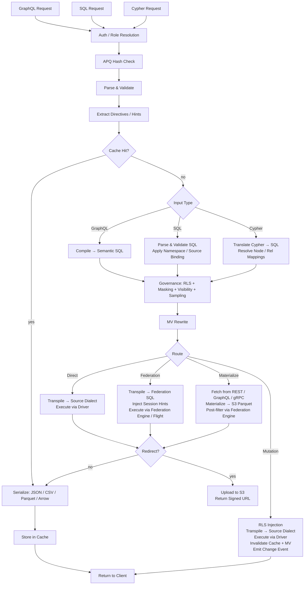

# Architettura di Provisa

## Panoramica

Provisa è una piattaforma di data virtualization guidata dalla configurazione, progettata specificamente per alimentare un layer semantico — da piccoli team fino all'azienda su larga scala. Fornisce un'API unificata su fonti dati eterogenee, con governance, sicurezza e ottimizzazione delle prestazioni integrate. I client interrogano tramite SQL, GraphQL o Cypher; tutte e tre sono interfacce di prima classe con la stessa governance applicata. (REQ-002, REQ-038)

La distinzione del layer semantico è importante. Per estendere il layer semantico, è necessario creare nuove origini dati o aggregati all'interno del layer di data virtualization. Questo crea una netta separazione: non è possibile apportare nuove aggiunte alla semantica al di fuori della piattaforma, il che rende possibile una vera governance dei dati. (REQ-136) L'applicazione avviene a livello di compilatore: il catalogo delle relazioni approvate è la fonte di verità, indipendentemente dal linguaggio di query utilizzato. (REQ-002)

Provisa è progettata per essere altamente performante per esigenze operative e altamente scalabile per esigenze analitiche a livello enterprise. Un'unica piattaforma serve entrambi gli scopi, senza sacrificare né la velocità né la scalabilità.

```text
Config YAML → PG Metadata → Federation Catalogs
                               ↓
         Federation engine metadata → Schema Generator → SDL / SQL catalog / Cypher labels / gRPC proto (per role)
                                     ↓
                     Query → Parser → SQL Compiler → Transpiler
                                     ↓
                             Router (Smart Dispatch)
                         /           |            \
                    Federation  Direct PG      Direct MySQL/etc.
                         \           |            /
                              Executor Pool
                                     ↓
                         ┌───── Inline ─────┐     ┌──── Redirect ────┐
                         │  JSON (HTTP)     │     │  CTAS → S3       │
                         │  Arrow (Flight)  │     │  (Parquet, ORC)  │
                         │  Protobuf (gRPC) │     │  Provisa → S3    │
                         └─────────────────-┘     │  (JSON, CSV, …)  │
                                                  └─────────────────-┘
```

## Interfacce di query

Ogni interfaccia è un trasporto a sé stante. Tutte e quattro applicano la stessa pipeline di sicurezza (RLS, mascheramento, sampling, controlli sui ruoli). (REQ-002, REQ-038) I client non comunicano mai direttamente con il motore di federazione. (REQ-266) Il "linguaggio di query" (SQL / GraphQL / Cypher) è ortogonale al trasporto — più linguaggi possono arrivare sullo stesso trasporto.

| Port | Transport | Accepted query languages | Use case |
| ------ | ----------- | -------------------------- | ---------- |
| 8001 | HTTP | GraphQL, SQL, Cypher | Web clients, BI tools, curl, REST consumers |
| 8815 | Arrow Flight (gRPC) | SQL (via Arrow Flight SQL) | Data tools (Pandas, DuckDB, Spark, ADBC) |
| 50051 | Protobuf gRPC | Per-role generated proto RPCs | Service-to-service with typed contracts |
| configurable¹ | PostgreSQL wire protocol (pgwire) | SQL | psql, DBeaver, SQLAlchemy, any PG-compatible client |

¹ Impostare `PROVISA_PGWIRE_PORT` (es. 5433). Disabilitato se non impostato o `0`.

### HTTP (Port 8001)

Più endpoint sotto la stessa porta, distinti per path:

| Path | Language | Notes |
| ------ | ---------- | ------- |
| `POST /data/graphql` | GraphQL | Reads and mutations; APQ hash accepted via `extensions.persistedQuery` |
| `POST /data/sql` | SQL | Read-only; no capability gate — governed by object visibility + RLS + masking (REQ-001, REQ-267) |
| `POST /data/query` | Cypher | Read-only; standard role |
| `GET /data/nl` | Natural language | Translates to SQL/GraphQL/Cypher based on source type |
| `GET /data/subscribe/{table}` | GraphQL | SSE subscription stream |
| `GET /neo4j/...` | Cypher (Neo4j compat) | Neo4j HTTP API compatibility shim |
| `POST /admin/graphql` | GraphQL | Admin API (superuser/admin role required) |

Tutti i path restituiscono JSON per impostazione predefinita. `Accept: text/csv`, `application/vnd.apache.parquet`, `application/vnd.apache.arrow.stream` e `application/octet-stream` (dati binari grezzi) sono supportati tramite content negotiation. I risultati che superano la soglia di dimensione configurata vengono reindirizzati automaticamente a un URL S3 firmato. (REQ-029, REQ-137)

### Arrow Flight (Port 8815)

Trasporto Arrow colonnare nativo su gRPC. (REQ-045, REQ-143) I client inviano un ticket JSON:

```json
{"query": "SELECT name, email FROM customers", "role": "analyst"}
```

e ricevono RecordBatch Arrow, trasmessi in streaming in modalità lazy. Quando il proxy Zaychik Arrow Flight SQL è disponibile, i dati fluiscono come un flusso continuo end-to-end di Arrow record batch: (REQ-144)

```text
Client ←(Arrow batches)← Provisa Flight Server ←(Arrow batches)← Zaychik ←(JDBC)← Federation Engine
```

Il risultato completo non viene mai materializzato nella memoria di Provisa: i batch vengono inoltrati man mano che arrivano. (REQ-145) Questo rende Arrow Flight un percorso non limitato, adatto a risultati arbitrariamente grandi.

### Protobuf gRPC (Port 50051)

File `.proto` generato automaticamente dallo schema dati, per ruolo. (REQ-525) Query in streaming (un messaggio per riga), mutazioni unarie. Server reflection abilitata. (REQ-526) Ruolo tramite la chiave dei metadati `x-provisa-role`.

### Protocollo wire PostgreSQL / pgwire (porta configurabile)

Implementa il protocollo wire frontend/backend di PostgreSQL usando la libreria `buenavista`. (REQ-527) Qualsiasi client compatibile con PostgreSQL — `psql`, DBeaver, SQLAlchemy con `psycopg2`, JDBC — può connettersi senza modifiche. Accetta solo SQL. La pipeline di governance completa (RLS, mascheramento, permessi di dominio) si applica in modo identico alle connessioni pgwire. (REQ-266, REQ-002) Abilitato impostando `PROVISA_PGWIRE_PORT` su una porta diversa da zero.

## Pipeline delle richieste

Sono accettati tre linguaggi di query. Tutti convergono nella governance dopo i rispettivi passaggi di parsing/compilazione. (REQ-262, REQ-263) Solo GraphQL supporta le scritture. (REQ-037) Non esiste un capability gate sulla query stessa — qualsiasi identità autenticata può interrogare in qualsiasi linguaggio, e i dati sono governati esclusivamente da visibilità degli oggetti, RLS e mascheramento. (REQ-001)

| Interface | Reads | Writes | Query gate |
| --- | --- | --- | --- |
| GraphQL (`/data/graphql`) | Yes | Yes (mutations) | None — data-layer governance only |
| SQL (`/data/sql`) | Yes | No | None — data-layer governance only (REQ-267) |
| Cypher (`/data/query`) | Yes | No | None — data-layer governance only |



**Decisioni di routing:**

| Route | When |
| --- | --- |
| **Cache** | Result cache hit — evaluated first, serves the stored result with no execution (REQ-865) |
| **Cheap-count** | `count(*)`-shaped query over an unmaterialized source that exposes an exact native count — routed to the native count call instead of materializing to count (REQ-875) |
| **Direct** | Single source + has native driver + has federation connector |
| **Federation** | Multi-source federation, or source has connector but no driver |
| **Materialize** | Source has no federation connector — fetch and cache to S3/PG first |
| **Mutation** | GraphQL mutation — always direct, never federated |

Il routing utilizza l'output dello stage di ottimizzazione post-governance, mai l'SQL governato pre-ottimizzazione. La governance può AGGIUNGERE origini (predicati subquery RLS); lo stage di ottimizzazione può RIMUOVERLE (inlining di CTE VALUES per hot table, riscritture della cache API, pruning dei rami union). Una query federata che, dopo l'inlining, si riduce a un'unica origine attiva viene quindi rieseguita come diretta. (REQ-863)

### Query multi-root

Le query GraphQL con più campi root (es. `{ orders { id } customers { name } }`) vengono compilate in query SQL separate ed eseguite indipendentemente. (REQ-534) Le richieste SQL e Cypher sono per definizione single-root. I risultati vengono uniti in un'unica risposta:

- I campi sotto la soglia di redirect vengono restituiti inline in `data`
- I campi sopra la soglia vengono reindirizzati, con voci per campo in `redirects`
- I formati binari (Parquet, Arrow) sono supportati solo per query single-root

## Percorsi di esecuzione della federazione

| Path | Transport | Via | When used |
| ------ | ----------- | ----- | ----------- |
| REST | federation engine client (HTTP :8080) | Direct query | Default, always available |
| Flight SQL | `adbc-driver-flightsql` (gRPC :8480) | Zaychik proxy → JDBC | When Zaychik is running |
| CTAS | federation engine client (HTTP :8080) | Direct write, Iceberg to S3 | Parquet/ORC redirect |

### Proxy Arrow Flight SQL Zaychik

Il motore di federazione non supporta nativamente il protocollo Arrow Flight SQL. [Zaychik](https://github.com/Raiffeisen-DGTL/zaychik-trino-proxy) è un proxy Java che implementa l'interfaccia gRPC di Arrow Flight SQL, traduce le richieste in query JDBC e restituisce i risultati in streaming come Arrow record batch. (REQ-144)

```text
ADBC client → gRPC :8480 → Zaychik → JDBC :8080 → Federation Engine → results → Arrow batches → client
```

Il Provisa Flight Server (porta 8815) si connette a Zaychik come client ADBC, consentendo lo streaming Arrow end-to-end senza materializzare i risultati. (REQ-145)

### Catalogo dei risultati Iceberg

Il redirect CTAS utilizza un connettore Iceberg (catalogo `results`) basato su un catalogo JDBC sull'istanza PostgreSQL esistente. (REQ-169) Iceberg scrive file Parquet/ORC direttamente su MinIO/S3 tramite il file system S3 nativo (`fs.native-s3.enabled=true`).

## Motori di federazione

Provisa seleziona un motore di federazione all'avvio tramite la variabile d'ambiente `PROVISA_ENGINE`, la configurazione persistita dall'Admin UI, o il valore predefinito. Se non è impostato nulla, DuckDB è il predefinito — completamente in-process, senza servizio esterno (REQ-989). Per i dettagli sulla selezione, vedere [Configuration](configuration.md#motore-di-federazione).

Ogni motore è un'istanza `FederationEngine`, definita in `provisa/federation/engine.py`. L'istanza possiede una collezione di connettori che determina quali tipi di origine il motore può leggere live (ATTACH) e quali devono prima atterrare nello store di materializzazione del motore. [tool-verified: `engine.py` `_ENGINE_BUILDERS`, `ENGINE_REGISTRY`]

### Classi di driver (REQ-840) [tool-verified: `engine.py` `DriverClass`]

| Class | Meaning | Examples |
| ------- | --------- | --------- |
| `BROAD` | Reaches many external source types via native connectors | Trino |
| `PARTIAL` | Reaches a subset (relational, files, cloud object/lake) plus lands everything else | DuckDB, PostgreSQL, ClickHouse, Databricks, Snowflake, BigQuery, Fabric, Synapse |
| `SELF_ONLY` | Reaches only its own store; every other source lands in | SQLAlchemy |

### Motori disponibili [tool-verified: `engine.py` `_ENGINE_BUILDERS`]

| Engine key | Dialect | MPP | External-link mechanism | Auth |
| ----------- | --------- | ----- | ------------------------ | ------ |
| `trino` / `trino-byo` | Trino SQL | Yes | Trino catalogs (broad connector set) | JDBC credentials |
| `pg` | PostgreSQL | No | FDW / pg_duckdb | PostgreSQL credentials |
| `duckdb` | DuckDB | No | Extension-native ATTACH | None (in-process) |
| `clickhouse` / `clickhouse-server` | ClickHouse | Yes (shards) | S3 / IcebergS3 / DeltaLake table engines (REQ-986) | ClickHouse credentials |
| `snowflake` | Snowflake | Yes | External stage + external table (REQ-988) | `PROVISA_ENGINE_URL` |
| `databricks` | Databricks SQL | Yes | Unity Catalog external tables via REST (REQ-987) | Bearer token (`http_path` in `federation_hints`) |
| `bigquery` | BigQuery | Yes (Dremel) | BigQuery external / BigLake tables | `GOOGLE_APPLICATION_CREDENTIALS` service-account key |
| `fabric` | T-SQL | Yes | OneLake shortcuts → OPENROWSET | Azure AD (`az login` / managed identity) |
| `synapse` | T-SQL | Yes | ADLS OPENROWSET / external tables | Azure AD |
| `sqlalchemy` | Any SQLAlchemy dialect | No | None (land-only) | Per-dialect credentials |

### Predefinito senza configurazione: DuckDB (REQ-989) [tool-verified: `engine.py` `build_duckdb_engine`, `_embedded_duckdb_materialize_default`]

Quando `PROVISA_ENGINE` non è impostata, Provisa usa il motore DuckDB completamente embedded, in-process. Lo store di materializzazione di DuckDB è un file DuckDB embedded in `$PROVISA_DATA_DIR/materialize.duckdb` (predefinito: `~/.provisa/materialize.duckdb`). Non è richiesto alcun database o servizio esterno.

Poiché DuckDB consente un solo processo di scrittura per file, `store_connection.py` scrive nello store embedded tramite la connessione propria del motore — mai tramite una seconda connessione indipendente. Questo è l'unico caso in cui motore e store di materializzazione condividono intenzionalmente un handle di file. [tool-verified: `store_connection.py` module docstring]

### Trasporto di lettura Arrow-nativo (REQ-986, REQ-987, REQ-988) [tool-verified: `engine.py` `build_*_engine` `capabilities=`]

ClickHouse, DuckDB, Snowflake, Databricks, BigQuery, Fabric e Synapse riportano tutti `EngineCapability.ARROW` e `EngineCapability.ARROW_STREAM`. Le query verso questi motori restituiscono direttamente RecordBatch Arrow — il percorso di serializzazione riga per riga viene completamente bypassato. Il Flight Server trasmette in streaming questi batch ai client senza materializzare il risultato completo nella memoria di processo di Provisa. Per Trino, lo streaming Arrow si appoggia al proxy Zaychik; per i motori warehouse, l'API Arrow-nativa propria di ciascun motore (Cloud Fetch per Databricks, Storage Read API per BigQuery, `fetch_arrow_table` per DuckDB e Snowflake) alimenta lo stream Flight.

### Collegamenti a dati esterni (ATTACH) [tool-verified: `engine.py` `_warehouse_connectors`]

Ogni motore warehouse può scansionare dati cloud object/lake sul posto, senza atterrare una copia. File Parquet, CSV, Iceberg e Delta Lake su S3, GCS o OneLake vengono collegati direttamente al motore come se fossero tabelle native. La strategia — ATTACH (scan sul posto) o LAND (copia nello store) — è determinata dal `Mechanism` dichiarato del connettore; non esiste branching specifico per motore nel planner. Un connettore `Mechanism.ATTACH_R` innesca uno scan senza copia; un connettore `Mechanism.DIRECT` o l'assenza di connettore innesca un landing. [tool-verified: `connector_base.py` `Mechanism`, `engine.py` `_warehouse_connectors`]

Attach provisiona automaticamente tutti i prerequisiti al momento dell'attach:

| Engine | Object/lake formats | Mechanism | Auto-provisioning [tool-verified] |
| -------- | ------------------- | ---------- | ---------------------------------- |
| Databricks | parquet, csv, iceberg, delta_lake | UC external table (`ATTACH_R`) | REST installs Unity Catalog storage credential + external location, then `CREATE TABLE … USING <format> LOCATION …` — live-verified over Cloudflare R2 |
| BigQuery | parquet, csv, json, iceberg, delta_lake | BigQuery external / BigLake table (`ATTACH_R`) | `CREATE OR REPLACE EXTERNAL TABLE … OPTIONS(format=…, uris=[…])` — live-verified |
| ClickHouse | csv, parquet, iceberg, delta_lake | S3 / IcebergS3 / DeltaLake table engine (`ATTACH_R`) | Validation probe executed at attach time — live-verified over Cloudflare R2 |
| Fabric | parquet, csv, iceberg, delta_lake | OneLake shortcut → OPENROWSET (`ATTACH_R`) | REST creates an `AmazonS3Compatible` connection + lakehouse + shortcut; returns the OneLake `BULK` path — live-verified reading R2 through Fabric |
| Snowflake | parquet, csv, json, iceberg, delta_lake | External stage + external table (`ATTACH_R`) | `CREATE STAGE … URL=… CREDENTIALS=…`, then `CREATE OR REPLACE EXTERNAL TABLE … LOCATION=@stage FILE_FORMAT=(TYPE=…)` — implemented; not live-tested (no account available) |

Le credenziali per lo storage cloud vengono passate in `federation_hints` dell'origine (vedere [Sources](sources.md#warehouse-come-origini-nominate)). Qualsiasi tipo di origine che non può eseguire ATTACH atterra prima nello store di materializzazione del motore.

### Scritture di materializzazione colonnari (REQ-990) [tool-verified: `core/database.py:436`, `store_connection.py:99`]

`Connection.bulk_copy` in `provisa/core/database.py` seleziona il percorso di bulk ingest più veloce in base al dialetto dello store: `COPY` binario (`copy_records_to_table` di asyncpg) per gli store PostgreSQL, e una singola istruzione `executemany` preparata per tutti gli altri store relazionali. Lo store DuckDB embedded atterra i dati tramite `land_duckdb_native` in `store_connection.py` — una singola chiamata `executemany` per l'intero batch, mai un ciclo riga per riga.

## Redirect dei risultati di grandi dimensioni

I risultati che superano una soglia di righe vengono reindirizzati, anziché inline, a storage compatibile S3 (MinIO). (REQ-029)

### Modalità di redirect

| Mode | How it works | Data touches Provisa? |
| ------ | ------------- | ---------------------- |
| **CTAS** (Parquet, ORC) | Federation engine writes directly to S3 via `CREATE TABLE AS SELECT` | No |
| **Provisa upload** (JSON, NDJSON, CSV, Arrow IPC) | Provisa serializes and uploads via boto3 | Yes |

Per i formati CTAS-nativi, Provisa non tocca mai i dati — il motore di federazione scrive i file direttamente su MinIO/S3. (REQ-138) Questo è il percorso preferito per grandi export analitici.

### Header di redirect

| Header | Effect |
| -------- | -------- |
| `X-Provisa-Redirect-Format: <mime>` | Redirect in this format (implies force unless threshold set) |
| `X-Provisa-Redirect-Threshold: N` | Only redirect if result exceeds N rows |
| `X-Provisa-Redirect: true` | Force redirect using default format |

Questi header implementano un redirect controllato lato client. (REQ-137)

**Risposta:**

```json
{
  "data": {"orders": null},
  "redirect": {
    "redirect_url": "https://minio:9000/provisa-results/results/abc.parquet?...",
    "row_count": 50000,
    "expires_in": 3600,
    "content_type": "application/vnd.apache.parquet"
  }
}
```

### Configurazione lato server

| Env var | Default | Purpose |
| --------- | --------- | --------- |
| `PROVISA_REDIRECT_ENABLED` | `false` | Enable server-side threshold redirect |
| `PROVISA_REDIRECT_THRESHOLD` | `1000` | Default row count threshold |
| `PROVISA_REDIRECT_FORMAT` | `parquet` | Default redirect format |
| `PROVISA_REDIRECT_BUCKET` | `provisa-results` | S3 bucket name |
| `PROVISA_REDIRECT_ENDPOINT` | | S3-compatible endpoint URL |
| `PROVISA_REDIRECT_TTL` | `3600` | Presigned URL TTL (seconds) |

## Albero decisionale di routing

```text
Multi-source query? → Federation engine
NoSQL source (MongoDB, Cassandra)? → Federation engine
Uses path columns on non-PG source? → Federation engine
Single RDBMS with driver? → Direct (sub-100ms target)
Single RDBMS without driver? → Federation engine
Steward hint "federated"? → Federation engine (override)
Steward hint "direct"? → Direct (if possible)
Redirect to Parquet/ORC? → Federation engine (CTAS, regardless of source count)
```

(REQ-027, REQ-028, REQ-030, REQ-279)

## Ottimizzazione delle query di federazione

Provisa inizializza automaticamente l'ottimizzatore cost-based del motore di federazione, così i piani di query cross-source si basano sulla distribuzione reale dei dati anziché su valori predefiniti hardcoded.

### Statistiche automatiche (`ANALYZE`)

Alla registrazione di un'origine, Provisa esegue `ANALYZE catalog.schema.table` per ogni tabella pubblicata. (REQ-275) Questo cattura:

- Numero di righe
- Per colonna: frazione di NULL, conteggio distinto, min/max, istogrammi (dipendente dal connettore)

L'ottimizzatore usa questi valori per stimare la selettività delle query filtrate. Senza statistiche, ricade su valori predefiniti fissi (es. 10% di selettività per i predicati di uguaglianza), il che porta a piani di join scadenti su dati distorti o ad alta cardinalità. Con le statistiche, le stime sono sufficientemente precise da prendere decisioni corrette tra join broadcast e partizionati per la maggior parte dei workload.

**Copertura**: il supporto delle statistiche varia per connettore. PostgreSQL, MySQL, Hive, Iceberg e Delta Lake supportano pienamente `ANALYZE`. I connettori MongoDB e Cassandra offrono supporto parziale o nullo. Provisa ignora silenziosamente gli errori di `ANALYZE` — la registrazione non viene mai bloccata. (REQ-275)

**Limiti della selettività**: le statistiche forniscono stime per colonna. Con predicati correlati (`WHERE region = 'US' AND city = 'Seattle'`), l'ottimizzatore assume l'indipendenza delle colonne, il che può sottostimare il numero di righe. Questa è una limitazione nota delle statistiche per colonna in tutti gli ottimizzatori cost-based.

**Origini API**: le tabelle `api_cache_{table_name}` in PostgreSQL vengono analizzate automaticamente dopo ogni ciclo di refresh della cache, così l'ottimizzatore dispone di stime di riga aggiornate quando unisce origini basate su API con origini relazionali. (REQ-280)

### Amministrazione: aggiornamento delle statistiche

Rieseguire la raccolta delle statistiche su richiesta tramite l'Admin API: (REQ-276)

```graphql
mutation {
  refreshSourceStatistics(sourceId: "sales-pg") {
    tablesAnalyzed
    failures { table message }
  }
}
```

Utile quando un'origine ha ricevuto dati nuovi significativi dopo la registrazione.

## Viste materializzate

Le viste materializzate (MV) ottimizzano in modo trasparente le query costose precalcolando e memorizzando i risultati.

### Relazioni come hint per le MV

Una dichiarazione di relazione non è solo un artefatto di governance — è anche la descrizione strutturale di una forma di join. Ed è esattamente quella forma di cui l'ottimizzatore MV ha bisogno: due tabelle, due colonne, un tipo di join. Ciò significa che una relazione può guidare direttamente la materializzazione.

Per le **relazioni cross-source**, questo avviene automaticamente all'avvio: ogni relazione cross-source approvata genera una MV `JoinPattern` (`auto-mv-<rel_id>`). (REQ-158) Non è richiesta alcuna configurazione MV separata. Quando il compilatore rileva questo join in una query, il rewriter sostituisce trasparentemente il risultato pre-materializzato.

Per le **relazioni all'interno della stessa origine**, gli steward possono attivare esplicitamente `materialize: true`. I JOIN all'interno della stessa origine sono già veloci grazie all'esecuzione diretta, quindi la materializzazione conviene solo per percorsi di join molto frequenti. (REQ-159)

La conseguenza pratica: gli steward che approvano una relazione decidono implicitamente anche se il join è un buon candidato per la materializzazione. L'atto di governance e l'hint di ottimizzazione sono un'unica dichiarazione.

### Modalità

| Mode | Config | Behavior |
| ------ | -------- | ---------- |
| **Join-pattern** | `join_pattern` in MV config | Rewrites matching JOINs to read from MV table |
| **Custom SQL** | `sql` in MV config | Arbitrary SELECT, optionally exposed in SDL |
| **Auto-materialized relationship** | cross-source relationship (automatic) | Auto-generates a join-pattern MV; no config required |
| **Steward-materialized relationship** | `materialize: true` on same-source relationship | Explicit opt-in for hot same-source join paths |

### Materializzazione automatica

I JOIN cross-source sono le query più costose (sempre federate). Le relazioni cross-source generano automaticamente definizioni MV all'avvio: (REQ-158)

```yaml
relationships:
  - id: orders-to-reviews
    source_table_id: orders        # sales-pg
    target_table_id: product_reviews  # reviews-mongo
    source_column: product_id
    target_column: product_id
    cardinality: one-to-many
    materialize: true              # auto-create MV
    refresh_interval: 600          # refresh every 10 minutes
```

Solo le relazioni cross-source generano MV (i JOIN all'interno della stessa origine sono già veloci con l'esecuzione diretta). (REQ-159) La MV parte nello stato `STALE` e viene aggiornata dal loop di refresh in background prima di essere usata dall'ottimizzatore di query. (REQ-160)

### Ciclo di vita del refresh

```text
STALE → (refresh loop picks up) → REFRESHING → FRESH
  ↑                                                |
  └──── mutation hits source table ────────────────┘
```

Il loop di refresh gira ogni 30 secondi, controlla `get_due_for_refresh()` ed esegue `CREATE TABLE AS SELECT` (prima esecuzione) o `DELETE + INSERT` (esecuzioni successive) sulla tabella target della MV tramite il motore di federazione. (REQ-160, REQ-234)

## Mappa dei moduli

| Module | Purpose |
| -------- | --------- |
| `api/` | FastAPI app, routers, middleware, lifespan management |
| `api/flight/` | Arrow Flight server (gRPC, port 8815) |
| `api/admin/` | Strawberry GraphQL admin API — config, discovery, views |
| `api/rest/` | Auto-generated REST endpoints from registered tables |
| `api/jsonapi/` | Auto-generated JSON:API endpoints with pagination and error handling |
| `api/data/subscribe.py` | SSE subscriptions — LISTEN/NOTIFY, polling, Debezium CDC |
| `compiler/` | GraphQL/SQL parsers, semantic SQL generator, RLS, masking, sampling, two-stage governance (`stage2.py`) |
| `cypher/` | Cypher → SQL translator, parser, label map (REQ-351), write translator for Cypher mutations |
| `pgwire/` | PostgreSQL wire-protocol server; `catalog.py` intercepts pg_catalog/information_schema for per-role object visibility (REQ-527, REQ-883, REQ-891) |
| `vector/` | Vector search — model registry, embedding providers (openai/ollama/huggingface), `cosine_similarity()` translation, pgvector fallback cache, declarative embedding generation (REQ-419–431) |
| `compiler/federation.py` | Apollo Federation v2 subgraph support |
| `transpiler/` | Dialect transpilation, routing logic |
| `executor/` | Federated/direct execution, serialization, output formats |
| `executor/drivers/` | Direct source drivers (PostgreSQL, MySQL, DuckDB, Snowflake, Databricks, ClickHouse, …) |
| `executor/trino_flight.py` | ADBC Flight SQL client for the federation engine |
| `executor/ctas_write.py` | CTAS-based redirect (federation engine writes to S3) |
| `executor/redirect.py` | S3 redirect logic, Provisa-side upload |
| `federation/engine.py` | `FederationEngine`, `DriverClass`, `_ENGINE_BUILDERS`, `ENGINE_REGISTRY`, `build_engine` |
| `federation/connector.py` | Connector abstractions — Trino, ClickHouse; `Mechanism`, `WarehouseNativeConnector` |
| `federation/connector_duckdb.py` | DuckDB and PostgreSQL FDW connector definitions |
| `federation/snowflake_connectors.py` | Snowflake external stage + external table ATTACH connectors (REQ-988) |
| `federation/databricks_connectors.py` | Databricks UC external table ATTACH connectors (REQ-987) |
| `federation/bigquery_connectors.py` | BigQuery external / BigLake ATTACH connectors |
| `federation/databricks_uc.py` | Unity Catalog credential + external location auto-provisioning |
| `federation/databricks_backend.py` | Databricks SQL warehouse execution backend |
| `federation/snowflake_backend.py` | Snowflake execution backend |
| `federation/bigquery_backend.py` | BigQuery execution backend (Storage Read API Arrow transport) |
| `federation/mssql_warehouse_backend.py` | Fabric Warehouse + Synapse execution backends (T-SQL over ODBC) |
| `federation/mssql_warehouse_connectors.py` | OPENROWSET ATTACH connectors for Fabric / Synapse |
| `federation/fabric_shortcuts.py` | OneLake shortcut auto-provisioning (connection → lakehouse → shortcut) |
| `federation/clickhouse_backend.py` | ClickHouse execution backend |
| `federation/duckdb_backend.py` | DuckDB in-process execution backend |
| `federation/pg_backend.py` | PostgreSQL execution backend |
| `federation/store_connection.py` | DuckDB-native materialization store write face (REQ-989, REQ-990) |
| `registry/` | Persisted query registry, governance |
| `security/` | Visibility, rights, column masking |
| `cache/` | Redis-backed query result caching (hot tier) |
| `mv/` | Materialized view registry, refresh, SQL rewriter |
| `events/` | Dataset change events and trigger dispatch |
| `webhooks/` | Outbound webhook execution for mutations and events |
| `scheduler/` | APScheduler-based background job management — cron and interval triggers that fire webhooks, mutations, or Kafka sink publishes |
| `apq/` | Apollo APQ wire protocol — Redis-backed query hash cache; separate from result caching |
| `compiler/cursor.py` | Relay-style cursor pagination — `first`/`after`/`last`/`before` arguments and `pageInfo` generation on all list queries |
| `compiler/aggregate_gen.py` | Auto-generated `{table}_aggregate` query types with `count`, `sum`, `avg`, `min`, `max` sub-fields and filtered `nodes` access |
| `compiler/enum_detect.py` | Enum type auto-detection — PostgreSQL native enum types (`pg_enum`) exposed as GraphQL enum types rather than string scalars |
| `compiler/hints.py` | Federation performance hints — query-level routing directives embedded as SQL comments (`/* @provisa route=federated */`) that override automatic routing |
| `compiler/mutation_gen.py` | Mutation compiler; column presets — server-side static or session-variable values applied on insert/update, not exposed in the mutation input type |
| `auth/approval_hook.py` | ABAC approval hook — pluggable external authorization called before query execution; webhook, gRPC, and unix_socket transports; per-table/source/global scope; configurable fallback policy |
| `subscriptions/` | SSE subscription state and delivery |
| `discovery/` | LLM relationship discovery (Claude API) |
| `grpc/` | Proto generation, gRPC server, reflection |
| `api_source/` | REST/GraphQL/gRPC API sources with PG cache |
| `kafka/` | Kafka topic sources, sink, Schema Registry |
| `auth/` | Pluggable auth providers, middleware, role mapping |
| `core/` | Config, models, DB, repositories, secrets; role model supports `parent_role_id` and `flatten_roles()` for recursive role inheritance |
| `hasura_v2/` | Hasura v2 metadata → Provisa config converter |
| `ddn/` | Hasura DDN supergraph → Provisa config converter |
| `mongodb/` | MongoDB source connector |
| `elasticsearch/` | Elasticsearch source connector |
| `cassandra/` | Cassandra source connector |
| `prometheus/` | Prometheus metrics source connector |
| `source_adapters/` | Generic adapter layer for source connections |

## Admin API

L'Admin API GraphQL Strawberry è montata su `/admin/graphql` (porta HTTP 8001). È separata dall'endpoint dati GraphQL e richiede il ruolo superuser o admin.

| Capability | Description |
| ----------- | ------------- |
| Config download/upload | Export or replace the full Provisa YAML config |
| Relationship editor | Create, update, delete relationship definitions |
| AI FK discovery | Trigger Claude-powered FK candidate analysis |
| Schema introspection | Browse published tables, columns, and roles |
| View management | Register and manage materialized view definitions |

(REQ-164, REQ-165, REQ-166, REQ-167)

## Endpoint REST e JSON:API generati automaticamente

Le tabelle registrate vengono esposte come endpoint REST e JSON:API, in aggiunta all'interfaccia GraphQL. (REQ-256, REQ-257)

| Interface | Mount path | Spec |
| ----------- | ----------- | ------ |
| REST | `/rest/<table-id>` | Simple GET/POST with query parameters |
| JSON:API | `/jsonapi/<table-id>` | [jsonapi.org](https://jsonapi.org) compliant — pagination, relationships, error objects |

Questi endpoint applicano la stessa pipeline di sicurezza (RLS, mascheramento, controlli sui ruoli) dell'endpoint GraphQL. (REQ-002, REQ-038)

## Subscription

Le subscription SSE sono esposte su `GET /data/subscribe/{table}`. Tre modalità di delivery: (REQ-258)

| Mode | Mechanism | When used |
| ------ | ----------- | ----------- |
| **LISTEN/NOTIFY** | PostgreSQL `LISTEN` on a channel | PG sources with mutation activity |
| **Polling** | Re-execute query on interval | Non-PG sources, or when CDC unavailable |
| **Debezium CDC** | Kafka topic from Debezium connector | High-frequency change streams |

(REQ-258, REQ-260, REQ-261)

Il client riceve `text/event-stream` con un evento JSON per ogni riga o diff modificati.

## Sistema di eventi e webhook

Le mutazioni al database (INSERT/UPDATE/DELETE) possono attivare eventi in uscita tramite i moduli `events/` e `webhooks/`. (REQ-172, REQ-173, REQ-220)

```text
Mutation executed → EventDispatcher → match event trigger rules
                                          ↓
                               WebhookExecutor → HTTP POST to configured URL
```

I trigger di evento sono definiti nella configurazione e mappati per tabella, tipo di operazione e filtro riga opzionale. I payload dei webhook includono il tipo di operazione, la riga modificata e il contesto del ruolo.

## Servizi in background

Quattro loop in background si avviano durante la fase lifespan dell'applicazione (`api/app.py`):

| Service | Interval | Purpose |
| --------- | ---------- | --------- |
| MV refresh loop | 30 s | Polls `get_due_for_refresh()`, executes CTAS or DELETE+INSERT on stale MVs |
| Warm table manager | Configurable | Promotes frequently-queried tables to Iceberg local SSD cache |
| Hot table loader | Configurable | Loads small reference tables into in-memory cache for sub-millisecond access |
| API source poller | Per-source interval | Re-fetches and re-caches remote REST/GraphQL/gRPC sources |

(REQ-160, REQ-238, REQ-239, REQ-236)

### Livelli di caching hot/warm delle tabelle

| Tier | Storage | Promotion criteria | Access latency |
| ------ | --------- | ------------------- | ---------------- |
| Hot | In-process memory | Row count < threshold, or is a relationship target | <1 ms |
| Warm | Iceberg on local SSD | Query frequency threshold exceeded | ~5–20 ms |
| Cold | Remote source | Default | 50–500 ms |

(REQ-230, REQ-236, REQ-238, REQ-241)

## Importazione metadati (Hasura v2 / DDN)

I deployment Hasura esistenti possono essere convertiti in una configurazione Provisa senza riscrittura manuale. (REQ-182, REQ-183)

| Module | Input | Output |
| -------- | ------- | -------- |
| `hasura_v2/` | Hasura v2 `metadata.yaml` | Provisa `config.yaml` |
| `ddn/` | Hasura DDN supergraph JSON | Provisa `config.yaml` |

Entrambi i convertitori mappano tabelle tracciate, relazioni, permessi e remote schema. Il risultato è una configurazione Provisa completa e pronta all'uso. (REQ-182, REQ-183)

## Apollo Federation

`compiler/federation.py` espone Provisa come subgraph Apollo Federation v2. (REQ-259) L'SDL del subgraph viene generato automaticamente dallo schema pubblicato, con direttive `@key` sulle colonne di chiave primaria e annotazioni `@external`/`@provides` sulle relazioni cross-source. Provisa risponde alle query `_entities` e `_service` richieste dal Federation Gateway. (REQ-259)

## Paginazione basata su cursore

Tutte le query lista supportano la paginazione a cursore in stile Relay tramite `compiler/cursor.py`. (REQ-218) I client passano gli argomenti `first`/`after` (avanti) o `last`/`before` (indietro). Il compilatore codifica la posizione della riga come cursore Base64 opaco e inserisce le clausole `WHERE`/`LIMIT` corrispondenti. Ogni query lista restituisce un oggetto `pageInfo`:

| Field | Type | Description |
| ------- | ------ | ------------- |
| `hasNextPage` | Boolean | True if more results exist after this page |
| `hasPreviousPage` | Boolean | True if results exist before this page |
| `startCursor` | String | Cursor of the first node in this page |
| `endCursor` | String | Cursor of the last node in this page |

## Query di aggregazione

Ogni tabella registrata riceve un campo root `{table}_aggregate` generato automaticamente (`compiler/aggregate_gen.py`). (REQ-196) Il tipo aggregate espone `count`, `sum`, `avg`, `min`, `max` per ogni colonna numerica, oltre a `nodes` per l'accesso filtrato alle righe con selezione completa dei campi (stesso RLS/mascheramento della query base). (REQ-196, REQ-198) Le query di aggregazione sono idonee per il routing MV aggregate — vedere `mv/aggregate_catalog.py`. (REQ-198)

## Automatic Persisted Queries (APQ)

`apq/cache.py` implementa il protocollo wire APQ di Apollo. (REQ-288) Quando un client invia solo un hash di query (`extensions.persistedQuery`), Provisa lo cerca in Redis. (REQ-289) In caso di mancata corrispondenza, restituisce un errore `PersistedQueryNotFound`; il client ripete la richiesta con il testo completo della query, che Provisa memorizza. (REQ-288) Questo è indipendente dal caching dei risultati (`cache/`).

## Ruoli ereditati

I ruoli in `core/models.py` possono fare riferimento a un `parent_role_id`. (REQ-215) `flatten_roles()` risolve ricorsivamente la catena di ereditarietà, unendo le clausole WHERE RLS (con AND), la visibilità delle colonne (unione, vince la più restrittiva) e le policy di mascheramento (il figlio sovrascrive il genitore per colonna). Questo evita set di permessi duplicati tra ruoli simili (es. `analyst` eredita da `reader`). (REQ-215)

## Hook di approvazione ABAC

`auth/approval_hook.py` è un hook di autorizzazione collegabile, chiamato prima dell'esecuzione della query, dopo RLS e mascheramento. (REQ-203) Si integra con motori di policy esterni (OPA, servizi ABAC personalizzati).

| Setting | Description |
| --------- | ------------- |
| Transport | `webhook` (HTTP POST), `grpc`, or `unix_socket` |
| Scope | Per-table, per-source, or global |
| Fallback policy | `allow` or `deny` when the hook endpoint is unreachable |

(REQ-246, REQ-247, REQ-204)

## Rilevamento automatico dei tipi enum

`compiler/enum_detect.py` fa introspezione dei tipi enum nativi PostgreSQL (`pg_enum`) al momento della generazione dello schema. (REQ-221) Le colonne che usano un tipo enum PostgreSQL personalizzato vengono promosse a tipi enum GraphQL — i loro valori diventano membri enum anziché scalari stringa.

## Trigger pianificati

`scheduler/jobs.py` usa APScheduler per eseguire job in background definiti come trigger cron o a intervallo. (REQ-216) Ogni job può inviare una POST a un URL webhook, eseguire una mutazione contro l'endpoint dati, o pubblicare i risultati di una query su un topic Kafka. I trigger vengono configurati tramite l'Admin API (mutazioni `scheduledTrigger`) o la chiave `scheduled_triggers` nella configurazione YAML. (REQ-216)

## Hint di performance per la federazione

`compiler/hints.py` analizza gli hint degli steward incorporati nelle query come commenti con la sintassi di commento di Provisa. (REQ-279) Il formato dell'hint varia in base al linguaggio di query:

```graphql
# @provisa route=federated
{ orders { id amount } }
```

```sql
/* @provisa route=federated */
SELECT id, amount FROM orders
```

```cypher
// @provisa route=federated
MATCH (o:Order) RETURN o.id, o.amount
```

| Hint | Effect |
| ------ | -------- |
| `route=federated` | Force federation through the federation engine, bypassing direct-driver routing |
| `route=direct` | Force direct-driver execution |

(REQ-279, REQ-277, REQ-278)

## Preset di colonna nelle mutazioni

`compiler/mutation_gen.py` supporta preset lato server per colonna, applicati su `INSERT` o `UPDATE`. (REQ-214) I preset non sono inclusi nel tipo di input della mutazione GraphQL generato — il compilatore li inserisce in modo trasparente. Tipi di preset: `static` (valore letterale) o `session` (valore dalla sessione/header della richiesta, es. `x-hasura-user-id`). (REQ-214)

## Esploratore di schema GraphQL Voyager

L'Admin UI (`provisa-ui/src/pages/SchemaExplorer.tsx`) integra GraphQL Voyager come strumento interattivo di visualizzazione dello schema. (REQ-248) Presenta lo schema con ambito ruolo come diagramma entità-relazione navigabile — tabelle come nodi, relazioni come archi. Lo schema mostrato è sempre filtrato per il ruolo attualmente selezionato.

## Ordine di applicazione della sicurezza

Non esiste un capability gate sulla query — la governance è espressa esclusivamente tramite controlli a livello del data layer. (REQ-001) Una richiesta SQL grezza rifiuta (HTTP 403) qualsiasi tabella fuori dall'ambito degli oggetti del ruolo prima che venga eseguita la governance. (REQ-267)

1. **Visibilità degli oggetti**: lo schema specifico per ruolo nasconde tabelle/colonne non autorizzate; le tabelle fuori ambito in SQL grezzo vengono rifiutate (REQ-039, REQ-267)
2. **Applicazione delle relazioni**: gli attraversamenti devono esistere nel catalogo delle relazioni approvate, a meno che il ruolo non abbia `ignore_relationships` — fra i ruoli di sistema precaricati solo `modeler` la possiede (REQ-001, REQ-1297). In modalità alta sicurezza la capacità viene ignorata e nessun attraversamento sfugge al catalogo (REQ-693)
3. **RLS**: iniezione di clausole WHERE per tabella e ruolo (REQ-040, REQ-041, REQ-263)
4. **Mascheramento delle colonne**: trasformazione dei dati per colonna e ruolo (REQ-263)
5. **Limite di righe (LIMIT)**: tetto sul numero di righe per i ruoli senza `full_results`; il sampling statistico casuale è una funzione separata di query utente (REQ-263, REQ-478)

Tutte e quattro le interfacce di query (HTTP, Flight, gRPC, pgwire) applicano la stessa pipeline di governance stage-2; nessun percorso client può bypassarla senza bypassare il server. (REQ-002, REQ-038, REQ-266)

## Limiti di scalabilità

Provisa è un sottile layer di compilazione e routing — aggiunge alla latenza della query solo pochi millisecondi a una cifra. Tuttavia, i percorsi in cui Provisa serializza i dati dei risultati sono limitati dalla memoria di processo. Due percorsi sono realmente non limitati:

| Path | Memory bound? | Suitable for |
| ------ | -------------- | ------------- |
| JSON inline (HTTP) | Yes | Small-medium results |
| **Arrow Flight streaming (gRPC :8815)** | **No** | **Unbounded — streaming via Zaychik or warehouse Arrow API** |
| Protobuf gRPC inline (:50051) | Yes | Medium results, service-to-service |
| Redirect: Provisa upload (JSON, CSV, NDJSON, Arrow IPC) | Yes | Medium results, file download |
| **Redirect: CTAS (Parquet, ORC)** | **No** | **Unbounded — federation engine writes to S3** |

(REQ-145, REQ-138)

### Sondaggio di soglia (threshold probing)

Per il redirect basato su soglia, Provisa inserisce `LIMIT threshold + 1` come sonda nella query. (REQ-140) Se il risultato ha meno righe, viene restituito inline (risultato completo, nessun lavoro sprecato). Se il risultato raggiunge il limite, la sonda viene scartata e la query completa viene rieseguita tramite CTAS o upload Provisa. Questo evita `SELECT COUNT(*)` (che alcune origini non ottimizzano) e funziona con qualsiasi origine.

Per grandi workload analitici, usare una delle seguenti opzioni:

- **Arrow Flight** (porta 8815) per lo streaming verso strumenti dati — i batch attraversano Provisa senza essere materializzati (REQ-145)
- **Redirect Parquet/ORC** per gli export basati su file — il motore di federazione scrive direttamente su S3, Provisa restituisce un URL presigned (REQ-138, REQ-044)

## Infrastruttura

| Service | Image | Port | Purpose |
| --------- | ------- | ------ | --------- |
| Provisa API | (host process) | 8001 | HTTP/REST endpoint |
| Provisa Flight | (host process) | 8815 | Arrow Flight gRPC server |
| Provisa gRPC | (host process) | 50051 | Protobuf gRPC server |
| Federation Engine | `trinodb/trino` (default) or external warehouse | 8080 / varies | Query federation engine — Trino for the embedded stack; Snowflake/Databricks/BigQuery/Fabric/Synapse/DuckDB for warehouse targets |
| Zaychik | `provisa-zaychik` (built from source) | 8480 | Arrow Flight SQL proxy for Trino; not required for warehouse engines |
| PostgreSQL | `postgres:16` | 5432 | Config metadata + Iceberg catalog |
| MongoDB | `mongo:7` | 27017 | Demo NoSQL data source |
| MinIO | `minio/minio` | 9000/9001 | S3-compatible object storage |
| Redis | `redis:7-alpine` | 6379 | Query result cache |
| PgBouncer | `edoburu/pgbouncer` | 6432 | Connection pooling for PG |
| Kafka | `confluentinc/cp-kafka:7.6.0` | 9092 | Streaming data sources |
| Schema Registry | `confluentinc/cp-schema-registry:7.6.0` | 8081 | Avro/Protobuf schema management |

(REQ-055, REQ-169)
