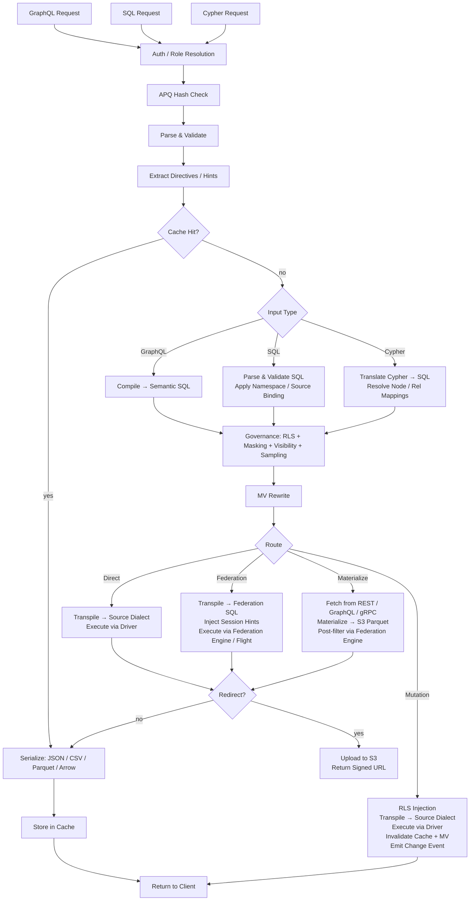

# Arquitetura do Provisa

## Visão geral

O Provisa é uma plataforma de virtualização de dados orientada por configuração, projetada especificamente para potencializar uma camada semântica desde pequenas equipes até grandes empresas. Ele fornece uma API unificada sobre fontes de dados heterogêneas com governança, segurança e otimização de desempenho. Clientes consultam via SQL, GraphQL ou Cypher; todas as três são interfaces de primeira classe com a mesma governança aplicada. (REQ-002, REQ-038)

A distinção da camada semântica é importante. Para adicionar à camada semântica, você deve criar novas fontes de dados ou agregações dentro da camada de virtualização de dados. Isso cria uma separação limpa — nenhuma nova adição à semântica pode ser feita fora da plataforma, permitindo governança de dados verdadeira. (REQ-136) A aplicação ocorre no nível do compilador: o catálogo de relacionamentos aprovado é a fonte da verdade independentemente de qual linguagem de consulta é usada. (REQ-002)

O Provisa é projetado para ser altamente performático para necessidades operacionais e altamente escalável para necessidades analíticas empresariais. Uma única plataforma atende a ambas sem sacrificar velocidade ou escalabilidade.

```
Config YAML → PG Metadata → Federation Catalogs
                               ↓
         Federation engine metadata → Schema Generator → SDL / SQL catalog / Cypher labels / gRPC proto (per role)
                                     ↓
                     Query → Parser → SQL Compiler → Transpiler
                                     ↓
                             Router (Smart Dispatch)
                         /           |            \
                    Federation  Direct PG      Direct MySQL/etc.
                         \           |            /
                              Executor Pool
                                     ↓
                         ┌───── Inline ─────┐     ┌──── Redirect ────┐
                         │  JSON (HTTP)     │     │  CTAS → S3       │
                         │  Arrow (Flight)  │     │  (Parquet, ORC)  │
                         │  Protobuf (gRPC) │     │  Provisa → S3    │
                         └─────────────────-┘     │  (JSON, CSV, …)  │
                                                  └─────────────────-┘
```

## Interfaces de Consulta

Cada interface é um transporte distinto. Todas as quatro aplicam o mesmo pipeline de segurança (RLS, mascaramento, amostragem, verificações de função). (REQ-002, REQ-038) Clientes nunca falam diretamente com o motor de federação. (REQ-266) A "linguagem de consulta" (SQL / GraphQL / Cypher) é ortogonal ao transporte — múltiplas linguagens podem chegar pelo mesmo transporte.

| Porta | Transporte | Linguagens de consulta aceitas | Caso de uso |
|------|-----------|--------------------------|----------|
| 8001 | HTTP | GraphQL, SQL, Cypher | Clientes web, ferramentas de BI, curl, consumidores REST |
| 8815 | Arrow Flight (gRPC) | SQL (via Arrow Flight SQL) | Ferramentas de dados (Pandas, DuckDB, Spark, ADBC) |
| 50051 | Protobuf gRPC | RPCs proto gerados por função | Serviço-a-serviço com contratos tipados |
| configurável¹ | Protocolo de fio PostgreSQL (pgwire) | SQL | psql, DBeaver, SQLAlchemy, qualquer cliente compatível com PG |

¹ Defina `PROVISA_PGWIRE_PORT` (ex.: 5433). Desabilitado quando não definido ou `0`.

### HTTP (porta 8001)

Múltiplos endpoints sob a mesma porta, distinguidos por caminho:

| Caminho | Linguagem | Notas |
|------|----------|-------|
| `POST /data/graphql` | GraphQL | Leituras e mutações; hash APQ aceito via `extensions.persistedQuery` |
| `POST /data/sql` | SQL | Somente leitura; sem gate de capacidade — governado por visibilidade de objeto + RLS + mascaramento (REQ-001, REQ-267) |
| `POST /data/query` | Cypher | Somente leitura; função padrão |
| `GET /data/nl` | Linguagem natural | Traduz para SQL/GraphQL/Cypher com base no tipo de fonte |
| `GET /data/subscribe/{table}` | GraphQL | Stream de subscription SSE |
| `GET /neo4j/...` | Cypher (compat Neo4j) | Shim de compatibilidade com a API HTTP do Neo4j |
| `POST /admin/graphql` | GraphQL | API de administração (função superuser/admin exigida) |

Todos os caminhos retornam JSON por padrão. `Accept: text/csv`, `application/vnd.apache.parquet`, `application/vnd.apache.arrow.stream`, e `application/octet-stream` (binário bruto) são suportados via negociação de conteúdo. Resultados que excedem o limite de tamanho configurado são automaticamente redirecionados para uma URL S3 assinada. (REQ-029, REQ-137)

### Arrow Flight (porta 8815)

Transporte colunar Arrow nativo sobre gRPC. (REQ-045, REQ-143) Clientes enviam um ticket JSON:
```json
{"query": "SELECT name, email FROM customers", "role": "analyst"}
```
e recebem RecordBatches Arrow em stream de forma preguiçosa. Quando o proxy Zaychik Flight SQL está disponível, os dados fluem como um stream de record batches Arrow de ponta a ponta: (REQ-144)

```
Client ←(Arrow batches)← Provisa Flight Server ←(Arrow batches)← Zaychik ←(JDBC)← Federation Engine
```

O resultado completo nunca é materializado na memória do Provisa — os batches são encaminhados conforme chegam. (REQ-145) Isso torna o Arrow Flight um caminho ilimitado, adequado para resultados arbitrariamente grandes.

### Protobuf gRPC (porta 50051)

`.proto` auto-gerado a partir do esquema de dados, gerado por função. (REQ-525) Consultas em streaming (uma mensagem por linha), mutações unárias. Reflexão de servidor habilitada. (REQ-526) Função via chave de metadados `x-provisa-role`.

### Protocolo de fio PostgreSQL / pgwire (porta configurável)

Implementa o protocolo de fio frontend/backend do PostgreSQL usando a biblioteca `buenavista`. (REQ-527) Qualquer cliente compatível com PostgreSQL — `psql`, DBeaver, SQLAlchemy com `psycopg2`, JDBC — pode se conectar sem modificação. Aceita apenas SQL. O pipeline de governança completo (RLS, mascaramento, permissões de domínio) se aplica identicamente às conexões pgwire. (REQ-266, REQ-002) Habilitado definindo `PROVISA_PGWIRE_PORT` para uma porta diferente de zero.

## Pipeline de Requisição

Três linguagens de consulta são aceitas. Todas convergem na governança após suas respectivas etapas de parse/compilação. (REQ-262, REQ-263) Apenas GraphQL suporta escritas. (REQ-037) Não há gate de capacidade sobre a consulta em si — qualquer identidade autenticada pode consultar em qualquer linguagem, e os dados são governados exclusivamente por visibilidade de objeto, RLS e mascaramento. (REQ-001)

| Interface | Leituras | Escritas | Gate de consulta |
|---|---|---|---|
| GraphQL (`/data/graphql`) | Sim | Sim (mutações) | Nenhum — apenas governança da camada de dados |
| SQL (`/data/sql`) | Sim | Não | Nenhum — apenas governança da camada de dados (REQ-267) |
| Cypher (`/data/query`) | Sim | Não | Nenhum — apenas governança da camada de dados |



**Decisões de rota:**

| Rota | Quando |
|---|---|
| **Cache** | Hit no cache de resultado — avaliado primeiro, serve o resultado armazenado sem execução (REQ-865) |
| **Contagem barata** | Consulta em formato `count(*)` sobre uma fonte não materializada que expõe uma contagem nativa exata — roteada para a chamada de contagem nativa em vez de materializar para contar (REQ-875) |
| **Direta** | Fonte única + tem driver nativo + tem conector de federação |
| **Federação** | Federação multi-fonte, ou a fonte tem conector mas não driver |
| **Materializar** | A fonte não tem conector de federação — busca e armazena em cache em S3/PG primeiro |
| **Mutação** | Mutação GraphQL — sempre direta, nunca federada |

O roteamento consome a saída do estágio de otimização pós-governança, nunca o SQL governado pré-otimização. A governança pode ADICIONAR fontes (predicados de subconsulta RLS); o estágio de otimização pode REMOVÊ-las (inlining de VALUES-CTE de hot-table, reescritas de cache de API, poda de ramos de union). Uma consulta federada que colapsa para uma única fonte ao vivo após o inlining é, portanto, reroteada como direta. (REQ-863)

### Consultas Multi-Raiz

Consultas GraphQL com múltiplos campos raiz (ex.: `{ orders { id } customers { name } }`) são compiladas em consultas SQL separadas e executadas independentemente. (REQ-534) Requisições SQL e Cypher são de raiz única por definição. Os resultados são mesclados em uma única resposta:
- Campos abaixo do limite de redirecionamento são retornados inline em `data`
- Campos acima do limite são redirecionados, com entradas por campo em `redirects`
- Formatos binários (Parquet, Arrow) são suportados apenas para consultas de raiz única

## Caminhos de Execução de Federação

| Caminho | Transporte | Via | Quando usado |
|------|-----------|-----|-----------|
| REST | cliente do motor de federação (HTTP :8080) | Consulta direta | Padrão, sempre disponível |
| Flight SQL | `adbc-driver-flightsql` (gRPC :8480) | Proxy Zaychik → JDBC | Quando o Zaychik está rodando |
| CTAS | cliente do motor de federação (HTTP :8080) | Escrita direta, Iceberg para S3 | Redirecionamento Parquet/ORC |

### Proxy Zaychik Arrow Flight SQL

O motor de federação não suporta nativamente o protocolo Arrow Flight SQL. O [Zaychik](https://github.com/Raiffeisen-DGTL/zaychik-trino-proxy) é um proxy Java que implementa a interface gRPC Arrow Flight SQL, traduz requisições para consultas JDBC, e faz streaming dos resultados de volta como record batches Arrow. (REQ-144)

```
ADBC client → gRPC :8480 → Zaychik → JDBC :8080 → Federation Engine → results → Arrow batches → client
```

O servidor Flight do Provisa (porta 8815) se conecta ao Zaychik como um cliente ADBC, permitindo streaming Arrow de ponta a ponta sem materializar resultados. (REQ-145)

### Catálogo de Resultados Iceberg

O redirecionamento CTAS usa um conector Iceberg (catálogo `results`) apoiado por um catálogo JDBC na instância PostgreSQL existente. (REQ-169) O Iceberg grava arquivos Parquet/ORC diretamente no MinIO/S3 via o sistema de arquivos S3 nativo (`fs.native-s3.enabled=true`).

## Motores de Federação

O Provisa seleciona um motor de federação na inicialização via a variável de ambiente `PROVISA_ENGINE`, a configuração persistida na UI de administração, ou o padrão. Quando nada está definido, o DuckDB é o padrão — totalmente em processo, sem serviço externo (REQ-989). Veja [Configuração](configuration.md#motor-de-federacao) para detalhes de seleção.

Cada motor é uma instância de `FederationEngine` definida em `provisa/federation/engine.py`. A instância possui uma coleção de conectores que determina quais tipos de fonte o motor pode ler ao vivo (ATTACH) versus quais devem pousar no armazenamento de materialização do motor primeiro. [tool-verified: `engine.py` `_ENGINE_BUILDERS`, `ENGINE_REGISTRY`]

### Classes de driver (REQ-840) [tool-verified: `engine.py` `DriverClass`]

| Classe | Significado | Exemplos |
|-------|---------|---------|
| `BROAD` | Alcança muitos tipos de fonte externa via conectores nativos | Trino |
| `PARTIAL` | Alcança um subconjunto (relacional, arquivos, objeto/lake em nuvem) além de pousar tudo o mais | DuckDB, PostgreSQL, ClickHouse, Databricks, Snowflake, BigQuery, Fabric, Synapse |
| `SELF_ONLY` | Alcança apenas seu próprio armazenamento; toda outra fonte pousa nele | SQLAlchemy |

### Motores disponíveis [tool-verified: `engine.py` `_ENGINE_BUILDERS`]

| Chave do motor | Dialeto | MPP | Mecanismo de link externo | Autenticação |
|-----------|---------|-----|------------------------|------|
| `trino` / `trino-byo` | Trino SQL | Sim | Catálogos Trino (amplo conjunto de conectores) | Credenciais JDBC |
| `pg` | PostgreSQL | Não | FDW / pg_duckdb | Credenciais PostgreSQL |
| `duckdb` | DuckDB | Não | ATTACH nativo de extensão | Nenhuma (em processo) |
| `clickhouse` / `clickhouse-server` | ClickHouse | Sim (shards) | Motores de tabela S3 / IcebergS3 / DeltaLake (REQ-986) | Credenciais ClickHouse |
| `snowflake` | Snowflake | Sim | External stage + tabela externa (REQ-988) | `PROVISA_ENGINE_URL` |
| `databricks` | Databricks SQL | Sim | Tabelas externas Unity Catalog via REST (REQ-987) | Bearer token (`http_path` em `federation_hints`) |
| `bigquery` | BigQuery | Sim (Dremel) | Tabelas externas BigQuery / BigLake | Chave de service account `GOOGLE_APPLICATION_CREDENTIALS` |
| `fabric` | T-SQL | Sim | Atalhos OneLake → OPENROWSET | Azure AD (`az login` / identidade gerenciada) |
| `synapse` | T-SQL | Sim | ADLS OPENROWSET / tabelas externas | Azure AD |
| `sqlalchemy` | Qualquer dialeto SQLAlchemy | Não | Nenhum (apenas pouso) | Credenciais por dialeto |

### Padrão zero-config: DuckDB (REQ-989) [tool-verified: `engine.py` `build_duckdb_engine`, `_embedded_duckdb_materialize_default`]

Quando `PROVISA_ENGINE` não está definido, o Provisa usa o motor DuckDB totalmente embutido, em processo. O armazenamento de materialização do DuckDB é um arquivo DuckDB embutido em `$PROVISA_DATA_DIR/materialize.duckdb` (padrão `~/.provisa/materialize.duckdb`). Nenhum banco de dados ou serviço externo é necessário.

Como o DuckDB impõe um único gravador por arquivo, `store_connection.py` grava no armazenamento embutido através da própria conexão do motor — nunca uma segunda conexão independente. Este é o único caso em que o motor e o armazenamento de materialização compartilham um handle de arquivo por design. [tool-verified: `store_connection.py` module docstring]

### Transporte de leitura nativo Arrow (REQ-986, REQ-987, REQ-988) [tool-verified: `engine.py` `build_*_engine` `capabilities=`]

ClickHouse, DuckDB, Snowflake, Databricks, BigQuery, Fabric, e Synapse todos anunciam `EngineCapability.ARROW` e `EngineCapability.ARROW_STREAM`. Consultas contra esses motores retornam RecordBatches Arrow diretamente — o caminho de serialização por linha é completamente contornado. O servidor Flight faz streaming desses batches para clientes sem materializar o resultado completo na memória do processo do Provisa. Para o Trino, o streaming Arrow depende do proxy Zaychik; para os motores de warehouse, a própria API Arrow-nativa do motor (Cloud Fetch para Databricks, Storage Read API para BigQuery, `fetch_arrow_table` para DuckDB e Snowflake) alimenta o stream Flight.

### Links de dados externos (ATTACH) [tool-verified: `engine.py` `_warehouse_connectors`]

Todo motor de warehouse pode escanear dados de objeto/lake em nuvem no lugar, sem pousar uma cópia. Arquivos Parquet, CSV, Iceberg e Delta Lake em S3, GCS, ou OneLake se conectam (attach) diretamente ao motor como se fossem tabelas nativas. A estratégia — ATTACH (escanear no lugar) ou LAND (copiar para o armazenamento) — é determinada pelo `Mechanism` declarado do conector; não existe ramificação específica de motor no planejador. Um conector `Mechanism.ATTACH_R` aciona escaneamento zero-cópia; um conector `Mechanism.DIRECT` ou ausente aciona um pouso. [tool-verified: `connector_base.py` `Mechanism`, `engine.py` `_warehouse_connectors`]

O attach auto-provisiona todos os pré-requisitos no momento do attach:

| Motor | Formatos objeto/lake | Mecanismo | Auto-provisionamento [tool-verified] |
|--------|-------------------|----------|----------------------------------|
| Databricks | parquet, csv, iceberg, delta_lake | Tabela externa UC (`ATTACH_R`) | REST instala credencial de armazenamento Unity Catalog + local externo, depois `CREATE TABLE … USING <format> LOCATION …` — verificado ao vivo sobre Cloudflare R2 |
| BigQuery | parquet, csv, json, iceberg, delta_lake | Tabela externa BigQuery / BigLake (`ATTACH_R`) | `CREATE OR REPLACE EXTERNAL TABLE … OPTIONS(format=…, uris=[…])` — verificado ao vivo |
| ClickHouse | csv, parquet, iceberg, delta_lake | Motor de tabela S3 / IcebergS3 / DeltaLake (`ATTACH_R`) | Sonda de validação executada no momento do attach — verificada ao vivo sobre Cloudflare R2 |
| Fabric | parquet, csv, iceberg, delta_lake | Atalho OneLake → OPENROWSET (`ATTACH_R`) | REST cria uma conexão `AmazonS3Compatible` + lakehouse + atalho; retorna o caminho `BULK` do OneLake — verificado ao vivo lendo R2 através do Fabric |
| Snowflake | parquet, csv, json, iceberg, delta_lake | External stage + tabela externa (`ATTACH_R`) | `CREATE STAGE … URL=… CREDENTIALS=…`, depois `CREATE OR REPLACE EXTERNAL TABLE … LOCATION=@stage FILE_FORMAT=(TYPE=…)` — implementado; não testado ao vivo (nenhuma conta disponível) |

Credenciais para armazenamento em nuvem viajam em `federation_hints` da fonte (veja [Fontes](sources.md#warehouses-como-fontes-nomeadas)). Qualquer tipo de fonte que não pode fazer ATTACH pousa primeiro no armazenamento de materialização do motor.

### Escritas de materialização colunar (REQ-990) [tool-verified: `core/database.py:436`, `store_connection.py:99`]

`Connection.bulk_copy` em `provisa/core/database.py` escolhe o caminho de ingestão em massa mais rápido por dialeto de armazenamento: `COPY` binário (`copy_records_to_table` do asyncpg) para armazenamentos PostgreSQL, e uma única declaração preparada `executemany` para todos os outros armazenamentos relacionais. O armazenamento embutido DuckDB pousa através de `land_duckdb_native` em `store_connection.py` — uma única chamada `executemany` para o lote inteiro, nunca um laço linha a linha.

## Redirecionamento de Resultado Grande

Resultados que excedem um limite de linhas são redirecionados para armazenamento compatível com S3 (MinIO) em vez de serem retornados inline. (REQ-029)

### Modos de Redirecionamento

| Modo | Como funciona | Os dados tocam o Provisa? |
|------|-------------|----------------------|
| **CTAS** (Parquet, ORC) | O motor de federação grava diretamente no S3 via `CREATE TABLE AS SELECT` | Não |
| **Upload Provisa** (JSON, NDJSON, CSV, Arrow IPC) | O Provisa serializa e envia via boto3 | Sim |

Para formatos CTAS-nativos, o Provisa nunca manipula os dados — o motor de federação grava os arquivos diretamente no MinIO/S3. (REQ-138) Este é o caminho preferido para grandes exportações analíticas.

### Cabeçalhos de Redirecionamento

| Cabeçalho | Efeito |
|--------|--------|
| `X-Provisa-Redirect-Format: <mime>` | Redireciona neste formato (implica força a menos que um limite seja definido) |
| `X-Provisa-Redirect-Threshold: N` | Redireciona apenas se o resultado exceder N linhas |
| `X-Provisa-Redirect: true` | Força o redirecionamento usando o formato padrão |

Esses cabeçalhos implementam redirecionamento controlado pelo cliente. (REQ-137)

**Resposta:**
```json
{
  "data": {"orders": null},
  "redirect": {
    "redirect_url": "https://minio:9000/provisa-results/results/abc.parquet?...",
    "row_count": 50000,
    "expires_in": 3600,
    "content_type": "application/vnd.apache.parquet"
  }
}
```

### Configuração do Servidor

| Variável de ambiente | Padrão | Propósito |
|---------|---------|---------|
| `PROVISA_REDIRECT_ENABLED` | `false` | Habilita redirecionamento por limite no lado do servidor |
| `PROVISA_REDIRECT_THRESHOLD` | `1000` | Limite padrão de contagem de linhas |
| `PROVISA_REDIRECT_FORMAT` | `parquet` | Formato de redirecionamento padrão |
| `PROVISA_REDIRECT_BUCKET` | `provisa-results` | Nome do bucket S3 |
| `PROVISA_REDIRECT_ENDPOINT` | | URL de endpoint compatível com S3 |
| `PROVISA_REDIRECT_TTL` | `3600` | TTL da URL pré-assinada (segundos) |

## Árvore de Decisão de Roteamento

```
Multi-source query? → Federation engine
NoSQL source (MongoDB, Cassandra)? → Federation engine
Uses path columns on non-PG source? → Federation engine
Single RDBMS with driver? → Direct (sub-100ms target)
Single RDBMS without driver? → Federation engine
Steward hint "federated"? → Federation engine (override)
Steward hint "direct"? → Direct (if possible)
Redirect to Parquet/ORC? → Federation engine (CTAS, regardless of source count)
```

(REQ-027, REQ-028, REQ-030, REQ-279)

## Otimização de Consulta de Federação

O Provisa alimenta automaticamente o otimizador baseado em custo do motor de federação para que os planos de consulta entre fontes se baseiem na distribuição real dos dados, não em padrões fixos.

### Estatísticas Automáticas (`ANALYZE`)

No registro de uma fonte, o Provisa executa `ANALYZE catalog.schema.table` para cada tabela publicada. (REQ-275) Isso coleta:

- Contagem de linhas
- Por coluna: fração de nulos, contagem de valores distintos, mín/máx, histogramas (dependente do conector)

O otimizador usa esses dados para estimar a seletividade de consultas filtradas. Sem estatísticas, ele recorre a padrões fixos (ex.: 10% de seletividade para predicados de igualdade), o que produz planos de join ruins em dados enviesados ou de alta cardinalidade. Com estatísticas, as estimativas são precisas o suficiente para tomar decisões corretas de join broadcast vs. particionado para a maioria das cargas de trabalho.

**Cobertura**: o suporte a estatísticas varia por conector. PostgreSQL, MySQL, Hive, Iceberg e Delta Lake suportam totalmente `ANALYZE`. Os conectores MongoDB e Cassandra têm suporte parcial ou nenhum. O Provisa engole falhas de `ANALYZE` silenciosamente — o registro nunca é bloqueado. (REQ-275)

**Limites de seletividade**: as estatísticas fornecem estimativas por coluna. Para predicados correlacionados (`WHERE region = 'US' AND city = 'Seattle'`), o otimizador assume independência entre colunas, o que pode subestimar a contagem de linhas. Esta é uma limitação conhecida das estatísticas em nível de coluna em todos os otimizadores baseados em custo.

**Fontes de API**: tabelas `api_cache_{table_name}` no PostgreSQL são analisadas automaticamente após cada ciclo de atualização de cache, para que o otimizador tenha estimativas de linha atuais ao unir fontes apoiadas em API com fontes relacionais. (REQ-280)

### Administração: Atualizar Estatísticas

Reexecute a coleta de estatísticas sob demanda via a API de administração: (REQ-276)

```graphql
mutation {
  refreshSourceStatistics(sourceId: "sales-pg") {
    tablesAnalyzed
    failures { table message }
  }
}
```

Útil quando uma fonte recebeu dados novos significativos desde o registro.

## Views Materializadas

As MVs otimizam de forma transparente consultas custosas pré-computando e armazenando resultados em cache.

### Relacionamentos como Hints de MV

Uma declaração de relacionamento não é apenas um artefato de governança — é também a descrição estrutural de um formato de join. Esse formato é exatamente o que o otimizador de MV precisa: duas tabelas, duas colunas, um tipo de join. Isso significa que um relacionamento pode diretamente conduzir a materialização.

Para **relacionamentos entre fontes**, isso acontece automaticamente na inicialização: todo relacionamento entre fontes aprovado gera uma MV `JoinPattern` (`auto-mv-<rel_id>`). (REQ-158) Nenhuma configuração de MV separada é necessária. Quando o compilador vê esse join em uma consulta, o reescritor substitui o resultado pré-materializado de forma transparente.

Para **relacionamentos na mesma fonte**, stewards podem optar explicitamente via `materialize: true`. JOINs na mesma fonte já são rápidos via execução direta, então a materialização só vale a pena para caminhos de join muito frequentes. (REQ-159)

A consequência prática: stewards que aprovam um relacionamento estão implicitamente decidindo se o join é um bom candidato para materialização. O ato de governança e o hint de otimização são a mesma declaração.

### Modos

| Modo | Config | Comportamento |
|------|--------|----------|
| **Join-pattern** | `join_pattern` na config de MV | Reescreve JOINs correspondentes para ler da tabela MV |
| **SQL personalizado** | `sql` na config de MV | SELECT arbitrário, opcionalmente exposto no SDL |
| **Relacionamento auto-materializado** | relacionamento entre fontes (automático) | Auto-gera uma MV join-pattern; nenhuma config necessária |
| **Relacionamento materializado pelo steward** | `materialize: true` em relacionamento na mesma fonte | Opt-in explícito para caminhos de join frequentes na mesma fonte |

### Auto-Materialização

JOINs entre fontes são as consultas mais custosas (sempre federadas). Relacionamentos entre fontes geram automaticamente definições de MV na inicialização: (REQ-158)

```yaml
relationships:
  - id: orders-to-reviews
    source_table_id: orders        # sales-pg
    target_table_id: product_reviews  # reviews-mongo
    source_column: product_id
    target_column: product_id
    cardinality: one-to-many
    materialize: true              # auto-create MV
    refresh_interval: 600          # refresh every 10 minutes
```

Apenas relacionamentos entre fontes geram MVs (JOINs na mesma fonte já são rápidos via execução direta). (REQ-159) A MV começa com status `STALE` e é atualizada pelo laço de atualização em segundo plano antes de ser usada pelo otimizador de consultas. (REQ-160)

### Ciclo de Vida de Atualização

```
STALE → (refresh loop picks up) → REFRESHING → FRESH
  ↑                                                |
  └──── mutation hits source table ────────────────┘
```

O laço de atualização roda a cada 30 segundos, verifica `get_due_for_refresh()`, e executa `CREATE TABLE AS SELECT` (primeira execução) ou `DELETE + INSERT` (execuções subsequentes) contra a tabela alvo da MV via o motor de federação. (REQ-160, REQ-234)

## Mapa de Módulos

| Módulo | Propósito |
|--------|-------------|
| `api/` | App FastAPI, roteadores, middleware, gerenciamento de lifespan |
| `api/flight/` | Servidor Arrow Flight (gRPC, porta 8815) |
| `api/admin/` | API GraphQL de administração Strawberry — config, descoberta, views |
| `api/rest/` | Endpoints REST auto-gerados a partir de tabelas registradas |
| `api/jsonapi/` | Endpoints JSON:API auto-gerados com paginação e tratamento de erros |
| `api/data/subscribe.py` | Subscriptions SSE — LISTEN/NOTIFY, polling, Debezium CDC |
| `compiler/` | Parsers GraphQL/SQL, gerador de SQL semântico, RLS, mascaramento, amostragem, governança em dois estágios (`stage2.py`) |
| `cypher/` | Tradutor Cypher → SQL, parser, mapa de rótulos (REQ-351), tradutor de escrita para mutações Cypher |
| `pgwire/` | Servidor de protocolo de fio PostgreSQL; `catalog.py` intercepta pg_catalog/information_schema para visibilidade de objeto por função (REQ-527, REQ-883, REQ-891) |
| `vector/` | Busca vetorial — registro de modelos, provedores de embedding (openai/ollama/huggingface), tradução de `cosine_similarity()`, cache de fallback pgvector, geração declarativa de embeddings (REQ-419–431) |
| `compiler/federation.py` | Suporte a subgraph Apollo Federation v2 |
| `transpiler/` | Transpilação de dialeto, lógica de roteamento |
| `executor/` | Execução federada/direta, serialização, formatos de saída |
| `executor/drivers/` | Drivers de fonte diretos (PostgreSQL, MySQL, DuckDB, Snowflake, Databricks, ClickHouse, …) |
| `executor/trino_flight.py` | Cliente ADBC Flight SQL para o motor de federação |
| `executor/ctas_write.py` | Redirecionamento baseado em CTAS (o motor de federação grava no S3) |
| `executor/redirect.py` | Lógica de redirecionamento S3, upload do lado do Provisa |
| `federation/engine.py` | `FederationEngine`, `DriverClass`, `_ENGINE_BUILDERS`, `ENGINE_REGISTRY`, `build_engine` |
| `federation/connector.py` | Abstrações de conector — Trino, ClickHouse; `Mechanism`, `WarehouseNativeConnector` |
| `federation/connector_duckdb.py` | Definições de conector DuckDB e PostgreSQL FDW |
| `federation/snowflake_connectors.py` | Conectores ATTACH de external stage + tabela externa Snowflake (REQ-988) |
| `federation/databricks_connectors.py` | Conectores ATTACH de tabela externa UC Databricks (REQ-987) |
| `federation/bigquery_connectors.py` | Conectores ATTACH externo BigQuery / BigLake |
| `federation/databricks_uc.py` | Auto-provisionamento de credencial + local externo Unity Catalog |
| `federation/databricks_backend.py` | Backend de execução Databricks SQL warehouse |
| `federation/snowflake_backend.py` | Backend de execução Snowflake |
| `federation/bigquery_backend.py` | Backend de execução BigQuery (transporte Arrow Storage Read API) |
| `federation/mssql_warehouse_backend.py` | Backends de execução Fabric Warehouse + Synapse (T-SQL sobre ODBC) |
| `federation/mssql_warehouse_connectors.py` | Conectores ATTACH OPENROWSET para Fabric / Synapse |
| `federation/fabric_shortcuts.py` | Auto-provisionamento de atalho OneLake (conexão → lakehouse → atalho) |
| `federation/clickhouse_backend.py` | Backend de execução ClickHouse |
| `federation/duckdb_backend.py` | Backend de execução DuckDB em processo |
| `federation/pg_backend.py` | Backend de execução PostgreSQL |
| `federation/store_connection.py` | Face de escrita do armazenamento de materialização DuckDB-nativo (REQ-989, REQ-990) |
| `registry/` | Registro de consultas persistidas, governança |
| `security/` | Visibilidade, direitos, mascaramento de coluna |
| `cache/` | Cache de resultado de consulta apoiado em Redis (camada quente) |
| `mv/` | Registro de views materializadas, atualização, reescritor SQL |
| `events/` | Eventos de mudança de dataset e despacho de gatilhos |
| `webhooks/` | Execução de webhook de saída para mutações e eventos |
| `scheduler/` | Gerenciamento de jobs em segundo plano baseado em APScheduler — gatilhos cron e de intervalo que disparam webhooks, mutações, ou publicações no sink Kafka |
| `apq/` | Protocolo de fio Apollo APQ — cache de hash de consulta apoiado em Redis; separado do cache de resultado |
| `compiler/cursor.py` | Paginação por cursor estilo Relay — argumentos `first`/`after`/`last`/`before` e geração de `pageInfo` em todas as consultas de lista |
| `compiler/aggregate_gen.py` | Tipos de consulta `{table}_aggregate` auto-gerados com subcampos `count`, `sum`, `avg`, `min`, `max` e acesso a `nodes` filtrado |
| `compiler/enum_detect.py` | Auto-detecção de tipo enum — tipos enum nativos do PostgreSQL (`pg_enum`) expostos como tipos enum GraphQL em vez de scalars de string |
| `compiler/hints.py` | Hints de desempenho de federação — diretivas de roteamento em nível de consulta embutidas como comentários SQL (`/* @provisa route=federated */`) que sobrepõem o roteamento automático |
| `compiler/mutation_gen.py` | Compilador de mutação; presets de coluna — valores estáticos do lado do servidor ou de variável de sessão aplicados em insert/update, não expostos no tipo de entrada da mutação |
| `auth/approval_hook.py` | Hook de aprovação ABAC — autorização externa plugável chamada antes da execução da consulta; transportes webhook, gRPC, e unix_socket; escopo por tabela/fonte/global; política de fallback configurável |
| `subscriptions/` | Estado e entrega de subscription SSE |
| `discovery/` | Descoberta de relacionamento por LLM (API Claude) |
| `grpc/` | Geração de proto, servidor gRPC, reflexão |
| `api_source/` | Fontes de API REST/GraphQL/gRPC com cache PG |
| `kafka/` | Fontes de tópico Kafka, sink, Schema Registry |
| `auth/` | Provedores de autenticação plugáveis, middleware, mapeamento de função |
| `core/` | Config, modelos, BD, repositórios, segredos; o modelo de função suporta `parent_role_id` e `flatten_roles()` para herança recursiva de função |
| `hasura_v2/` | Conversor de metadados Hasura v2 → config Provisa |
| `ddn/` | Conversor de supergraph Hasura DDN → config Provisa |
| `mongodb/` | Conector de fonte MongoDB |
| `elasticsearch/` | Conector de fonte Elasticsearch |
| `cassandra/` | Conector de fonte Cassandra |
| `prometheus/` | Conector de fonte de métricas Prometheus |
| `source_adapters/` | Camada de adaptador genérico para conexões de fonte |

## API de Administração

A API GraphQL Strawberry de administração é montada em `/admin/graphql` (porta HTTP 8001). É separada do endpoint GraphQL de dados e exige função superuser ou admin.

| Capacidade | Descrição |
|-----------|-------------|
| Download/upload de config | Exporta ou substitui a configuração YAML completa do Provisa |
| Editor de relacionamentos | Cria, atualiza, exclui definições de relacionamento |
| Descoberta de FK por IA | Aciona análise de candidatos a FK potencializada por Claude |
| Introspecção de esquema | Navega tabelas, colunas e funções publicadas |
| Gerenciamento de views | Registra e gerencia definições de view materializada |

(REQ-164, REQ-165, REQ-166, REQ-167)

## Endpoints REST e JSON:API Auto-Gerados

Tabelas registradas são expostas como endpoints REST e JSON:API junto com a interface GraphQL. (REQ-256, REQ-257)

| Interface | Caminho de montagem | Especificação |
|-----------|-----------|------|
| REST | `/rest/<table-id>` | GET/POST simples com parâmetros de consulta |
| JSON:API | `/jsonapi/<table-id>` | Compatível com [jsonapi.org](https://jsonapi.org) — paginação, relacionamentos, objetos de erro |

Esses endpoints aplicam o mesmo pipeline de segurança (RLS, mascaramento, verificações de função) que o endpoint GraphQL. (REQ-002, REQ-038)

## Subscriptions

Subscriptions SSE são servidas em `GET /data/subscribe/{table}`. Três modos de entrega: (REQ-258)

| Modo | Mecanismo | Quando usado |
|------|-----------|-----------|
| **LISTEN/NOTIFY** | `LISTEN` do PostgreSQL em um canal | Fontes PG com atividade de mutação |
| **Polling** | Reexecuta a consulta em intervalo | Fontes não-PG, ou quando CDC indisponível |
| **Debezium CDC** | Tópico Kafka do conector Debezium | Streams de mudança de alta frequência |

(REQ-258, REQ-260, REQ-261)

O cliente recebe `text/event-stream` com um evento JSON por linha alterada ou diff.

## Sistema de Eventos e Webhooks

Mutações de banco de dados (INSERT/UPDATE/DELETE) podem acionar eventos de saída via os módulos `events/` e `webhooks/`. (REQ-172, REQ-173, REQ-220)

```
Mutation executed → EventDispatcher → match event trigger rules
                                          ↓
                               WebhookExecutor → HTTP POST to configured URL
```

Gatilhos de evento são definidos na config e correspondidos por tabela, tipo de operação, e filtro de linha opcional. Payloads de webhook incluem o tipo de operação, linha alterada, e contexto de função.

## Serviços em Segundo Plano

Quatro laços em segundo plano iniciam durante o lifespan da app (`api/app.py`):

| Serviço | Intervalo | Propósito |
|---------|----------|---------|
| Laço de atualização de MV | 30 s | Consulta `get_due_for_refresh()`, executa CTAS ou DELETE+INSERT em MVs desatualizadas |
| Gerenciador de tabelas quentes | Configurável | Promove tabelas frequentemente consultadas para cache local SSD Iceberg |
| Carregador de tabelas quentes | Configurável | Carrega pequenas tabelas de referência em cache em memória para acesso sub-milissegundo |
| Poller de fonte API | Intervalo por fonte | Rebusca e recacheia fontes remotas REST/GraphQL/gRPC |

(REQ-160, REQ-238, REQ-239, REQ-236)

### Camadas de Cache de Tabela Quente/Morna

| Camada | Armazenamento | Critério de promoção | Latência de acesso |
|------|---------|-------------------|----------------|
| Quente | Memória em processo | Contagem de linhas < limite, ou é alvo de relacionamento | <1 ms |
| Morna | Iceberg em SSD local | Limite de frequência de consulta excedido | ~5–20 ms |
| Fria | Fonte remota | Padrão | 50–500 ms |

(REQ-230, REQ-236, REQ-238, REQ-241)

## Importação de Metadados (Hasura v2 / DDN)

Implantações Hasura existentes podem ser convertidas para config Provisa sem reescrita manual. (REQ-182, REQ-183)

| Módulo | Entrada | Saída |
|--------|-------|--------|
| `hasura_v2/` | `metadata.yaml` do Hasura v2 | `config.yaml` do Provisa |
| `ddn/` | JSON de supergraph Hasura DDN | `config.yaml` do Provisa |

Ambos os conversores mapeiam tabelas rastreadas, relacionamentos, permissões, e esquemas remotos. O resultado é uma config Provisa completa pronta para implantação. (REQ-182, REQ-183)

## Apollo Federation

`compiler/federation.py` expõe o Provisa como um subgraph Apollo Federation v2. (REQ-259) O SDL do subgraph é auto-gerado a partir do esquema publicado com diretivas `@key` em colunas de chave primária e anotações `@external`/`@provides` em relacionamentos entre subgraphs. O Provisa responde a consultas `_entities` e `_service` exigidas pelo gateway de federação. (REQ-259)

## Paginação Baseada em Cursor

Todas as consultas de lista suportam paginação por cursor estilo Relay via `compiler/cursor.py`. (REQ-218) Clientes passam argumentos `first`/`after` (para frente) ou `last`/`before` (para trás). O compilador codifica a posição da linha como um cursor base64 opaco e injeta as cláusulas `WHERE`/`LIMIT` apropriadas. Toda consulta de lista retorna um objeto `pageInfo`:

| Campo | Tipo | Descrição |
|-------|------|-------------|
| `hasNextPage` | Boolean | Verdadeiro se mais resultados existem após esta página |
| `hasPreviousPage` | Boolean | Verdadeiro se resultados existem antes desta página |
| `startCursor` | String | Cursor do primeiro nó nesta página |
| `endCursor` | String | Cursor do último nó nesta página |

## Consultas Agregadas

Toda tabela registrada recebe um campo raiz auto-gerado `{table}_aggregate` (`compiler/aggregate_gen.py`). (REQ-196) O tipo agregado expõe `count`, `sum`, `avg`, `min`, `max` por coluna numérica, e `nodes` para acesso a linha filtrado com seleção de campo completa (mesmo RLS/mascaramento que a consulta base). (REQ-196, REQ-198) Consultas agregadas são elegíveis para roteamento de MV agregada — veja `mv/aggregate_catalog.py`. (REQ-198)

## Automatic Persisted Queries (APQ)

`apq/cache.py` implementa o protocolo de fio Apollo APQ. (REQ-288) Quando um cliente envia apenas um hash de consulta (`extensions.persistedQuery`), o Provisa o busca no Redis. (REQ-289) Em caso de miss, ele retorna um erro `PersistedQueryNotFound`; o cliente tenta novamente com o corpo completo da consulta, que o Provisa armazena. (REQ-288) Isso é separado do cache de resultado (`cache/`).

## Funções Herdadas

Funções em `core/models.py` podem referenciar um `parent_role_id`. (REQ-215) `flatten_roles()` resolve recursivamente a cadeia de herança e mescla cláusulas WHERE de RLS (com AND), visibilidade de coluna (união, a mais restritiva vence), e políticas de mascaramento (filho sobrepõe pai por coluna). Isso evita duplicar conjuntos de permissão entre funções semelhantes (ex.: `analyst` herdando de `reader`). (REQ-215)

## Hook de Aprovação ABAC

`auth/approval_hook.py` é um hook de autorização plugável invocado antes da execução da consulta, após RLS e mascaramento. (REQ-203) Ele se integra com motores de política externos (OPA, serviços ABAC personalizados).

| Configuração | Descrição |
|---------|-------------|
| Transporte | `webhook` (HTTP POST), `grpc`, ou `unix_socket` |
| Escopo | Por tabela, por fonte, ou global |
| Política de fallback | `allow` ou `deny` quando o endpoint do hook está inacessível |

(REQ-246, REQ-247, REQ-204)

## Auto-Detecção de Tipo Enum

`compiler/enum_detect.py` introspecta tipos enum nativos do PostgreSQL (`pg_enum`) no momento da geração de esquema. (REQ-221) Colunas usando um tipo enum definido pelo usuário no PostgreSQL são promovidas a tipos enum GraphQL — seus valores tornam-se membros do enum em vez de scalars de string.

## Gatilhos Programados

`scheduler/jobs.py` usa o APScheduler para executar jobs em segundo plano definidos como gatilhos cron ou de intervalo. (REQ-216) Cada job pode fazer POST para uma URL de webhook, executar uma mutação contra o endpoint de dados, ou publicar resultados de consulta em um tópico Kafka. Gatilhos são configurados via a API de administração (mutações `scheduledTrigger`) ou a chave `scheduled_triggers` na config YAML. (REQ-216)

## Hints de Desempenho de Federação

`compiler/hints.py` analisa hints de steward embutidos em consultas como comentários usando a sintaxe de comentário do Provisa. (REQ-279) O formato do hint varia por linguagem de consulta:

```graphql
# @provisa route=federated
{ orders { id amount } }
```
```sql
/* @provisa route=federated */
SELECT id, amount FROM orders
```
```cypher
// @provisa route=federated
MATCH (o:Order) RETURN o.id, o.amount
```

| Hint | Efeito |
|------|--------|
| `route=federated` | Força a federação através do motor de federação, contornando o roteamento de driver direto |
| `route=direct` | Força a execução de driver direto |

(REQ-279, REQ-277, REQ-278)

## Presets de Coluna em Mutações

`compiler/mutation_gen.py` suporta presets por coluna do lado do servidor aplicados em `INSERT` ou `UPDATE`. (REQ-214) Presets não são incluídos no tipo de entrada de mutação GraphQL gerado — eles são injetados pelo compilador de forma transparente. Tipos de preset: `static` (valor literal) ou `session` (valor da sessão/cabeçalho da requisição, ex.: `x-hasura-user-id`). (REQ-214)

## Explorador de Esquema GraphQL Voyager

A UI de administração (`provisa-ui/src/pages/SchemaExplorer.tsx`) embute o GraphQL Voyager como uma ferramenta interativa de visualização de esquema. (REQ-248) Ela renderiza o esquema escopado por função como um diagrama de relacionamento de entidade navegável — tabelas como nós, relacionamentos como arestas. O esquema mostrado é sempre filtrado para a função atualmente selecionada.

## Ordem de Aplicação de Segurança

Não há gate de capacidade sobre a consulta — a governança é expressa inteiramente através de controles da camada de dados. (REQ-001) Uma requisição de SQL bruto rejeita (HTTP 403) qualquer tabela fora do escopo de objeto da função antes que a governança execute. (REQ-267)

1. **Visibilidade de Objeto**: O esquema por função oculta tabelas/colunas não autorizadas; tabelas fora de escopo em SQL bruto são rejeitadas (REQ-039, REQ-267)
2. **Aplicação de relacionamento**: Travessias devem existir no catálogo de relacionamentos aprovado, a menos que a função possua `ignore_relationships` (REQ-001)
3. **RLS**: Injeção de cláusula WHERE por tabela por função (REQ-040, REQ-041, REQ-263)
4. **Mascaramento de Coluna**: Transformação de dados por coluna por função (REQ-263)
5. **Limite de linhas (LIMIT)**: Limite de contagem de linhas para funções sem `full_results`; amostragem estatística aleatória é um recurso de consulta de usuário separado (REQ-263, REQ-478)

Todas as quatro interfaces de consulta (HTTP, Flight, gRPC, pgwire) aplicam o mesmo pipeline de governança de Estágio 2; nenhum caminho de cliente pode contorná-lo sem contornar o servidor. (REQ-002, REQ-038, REQ-266)

## Limites de Escalabilidade

O Provisa é uma camada fina de compilação e roteamento — adiciona latência de milissegundos de dígito único à consulta. No entanto, caminhos onde o Provisa serializa dados de resultado são limitados pela memória do processo. Dois caminhos são verdadeiramente ilimitados:

| Caminho | Limitado por memória? | Adequado para |
|------|--------------|-------------|
| JSON inline (HTTP) | Sim | Resultados pequenos-médios |
| **Streaming Arrow Flight (gRPC :8815)** | **Não** | **Ilimitado — streaming via Zaychik ou API Arrow do warehouse** |
| Protobuf gRPC inline (:50051) | Sim | Resultados médios, serviço-a-serviço |
| Redirecionamento: upload Provisa (JSON, CSV, NDJSON, Arrow IPC) | Sim | Resultados médios, download de arquivo |
| **Redirecionamento: CTAS (Parquet, ORC)** | **Não** | **Ilimitado — o motor de federação grava no S3** |

(REQ-145, REQ-138)

### Sondagem por Limite

Para redirecionamento baseado em limite, o Provisa injeta `LIMIT threshold + 1` na consulta como sonda. (REQ-140) Se o resultado tiver menos linhas, ele retorna inline (resultado completo, sem trabalho desperdiçado). Se o resultado atingir o limite, a sonda é descartada e a consulta completa é reexecutada via CTAS ou upload Provisa. Isso evita `SELECT COUNT(*)` (que algumas fontes não otimizam) e funciona em qualquer fonte.

Para grandes cargas de trabalho analíticas, use:
- **Arrow Flight** (porta 8815) para streaming para ferramentas de dados — os batches fluem pelo Provisa sem materializar (REQ-145)
- **Redirecionamento Parquet/ORC** para exportações baseadas em arquivo — o motor de federação grava diretamente no S3, o Provisa retorna uma URL pré-assinada (REQ-138, REQ-044)

## Infraestrutura

| Serviço | Imagem | Porta | Propósito |
|---------|-------|------|---------|
| Provisa API | (processo host) | 8001 | Endpoint HTTP/REST |
| Provisa Flight | (processo host) | 8815 | Servidor gRPC Arrow Flight |
| Provisa gRPC | (processo host) | 50051 | Servidor gRPC Protobuf |
| Motor de Federação | `trinodb/trino` (padrão) ou warehouse externo | 8080 / varia | Motor de federação de consulta — Trino para a stack embutida; Snowflake/Databricks/BigQuery/Fabric/Synapse/DuckDB para alvos de warehouse |
| Zaychik | `provisa-zaychik` (construído a partir do código-fonte) | 8480 | Proxy Arrow Flight SQL para Trino; não exigido para motores de warehouse |
| PostgreSQL | `postgres:16` | 5432 | Metadados de config + catálogo Iceberg |
| MongoDB | `mongo:7` | 27017 | Fonte de dados NoSQL de demonstração |
| MinIO | `minio/minio` | 9000/9001 | Armazenamento de objetos compatível com S3 |
| Redis | `redis:7-alpine` | 6379 | Cache de resultado de consulta |
| PgBouncer | `edoburu/pgbouncer` | 6432 | Pooling de conexão para PG |
| Kafka | `confluentinc/cp-kafka:7.6.0` | 9092 | Fontes de dados em streaming |
| Schema Registry | `confluentinc/cp-schema-registry:7.6.0` | 8081 | Gerenciamento de esquema Avro/Protobuf |

(REQ-055, REQ-169)
