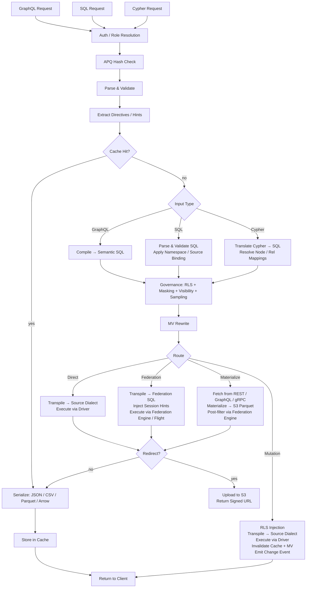

# Архитектура Provisa

## Обзор

Provisa — это платформа виртуализации данных, управляемая конфигурацией, специально разработанная для обеспечения работы семантического слоя от небольших команд до крупных предприятий. Она предоставляет единый API для гетерогенных источников данных с governance, безопасностью и оптимизацией производительности. Клиенты выполняют запросы через SQL, GraphQL или Cypher; все три — полноценные интерфейсы с идентичным применяемым governance. (REQ-002, REQ-038)

Различие семантического слоя важно. Чтобы добавить что-то в семантический слой, необходимо создать новые источники данных или агрегаты в слое виртуализации данных. Это создаёт чёткое разделение — никакие новые дополнения к семантике не могут быть сделаны вне платформы, что обеспечивает истинное governance данных. (REQ-136) Применение происходит на уровне компилятора: утверждённый каталог связей является единственным источником истины независимо от используемого языка запросов. (REQ-002)

Provisa разработана для высокой производительности при операционных нагрузках и высокой масштабируемости для аналитических потребностей предприятия. Единая платформа обслуживает и то, и другое без потери скорости или масштабируемости.

```
Config YAML → PG Metadata → Federation Catalogs
                               ↓
         Federation engine metadata → Schema Generator → SDL / SQL catalog / Cypher labels / gRPC proto (per role)
                                     ↓
                     Query → Parser → SQL Compiler → Transpiler
                                     ↓
                             Router (Smart Dispatch)
                         /           |            \
                    Federation  Direct PG      Direct MySQL/etc.
                         \           |            /
                              Executor Pool
                                     ↓
                         ┌───── Inline ─────┐     ┌──── Redirect ────┐
                         │  JSON (HTTP)     │     │  CTAS → S3       │
                         │  Arrow (Flight)  │     │  (Parquet, ORC)  │
                         │  Protobuf (gRPC) │     │  Provisa → S3    │
                         └─────────────────-┘     │  (JSON, CSV, …)  │
                                                  └─────────────────-┘
```

## Интерфейсы запросов

Каждый интерфейс — это отдельный транспорт. Все четыре применяют один и тот же конвейер безопасности (RLS, маскирование, выборка, проверки роли). (REQ-002, REQ-038) Клиенты никогда не обращаются напрямую к движку федерации. (REQ-266) «Язык запросов» (SQL / GraphQL / Cypher) ортогонален транспорту — несколько языков могут поступать через один и тот же транспорт.

| Порт | Транспорт | Принимаемые языки запросов | Сценарий использования |
|------|-----------|--------------------------|----------|
| 8001 | HTTP | GraphQL, SQL, Cypher | Веб-клиенты, BI-инструменты, curl, потребители REST |
| 8815 | Arrow Flight (gRPC) | SQL (через Arrow Flight SQL) | Инструменты работы с данными (Pandas, DuckDB, Spark, ADBC) |
| 50051 | Protobuf gRPC | Сгенерированные для каждой роли RPC proto | Взаимодействие сервисов с типизированными контрактами |
| настраиваемый¹ | Протокол передачи PostgreSQL (pgwire) | SQL | psql, DBeaver, SQLAlchemy, любой PG-совместимый клиент |

¹ Установите `PROVISA_PGWIRE_PORT` (например, 5433). Отключено, если не задано или равно `0`.

### HTTP (порт 8001)

Несколько эндпоинтов под одним портом, различаемых по пути:

| Путь | Язык | Примечания |
|------|----------|-------|
| `POST /data/graphql` | GraphQL | Чтения и мутации; хэш APQ принимается через `extensions.persistedQuery` |
| `POST /data/sql` | SQL | Только для чтения; без ограничения по возможностям — управляется видимостью объектов + RLS + маскированием (REQ-001, REQ-267) |
| `POST /data/query` | Cypher | Только для чтения; стандартная роль |
| `GET /data/nl` | Естественный язык | Транслирует в SQL/GraphQL/Cypher в зависимости от типа источника |
| `GET /data/subscribe/{table}` | GraphQL | Поток подписки SSE |
| `GET /neo4j/...` | Cypher (совместимость с Neo4j) | Прослойка совместимости с HTTP API Neo4j |
| `POST /admin/graphql` | GraphQL | Admin API (требуется роль superuser/admin) |

Все пути по умолчанию возвращают JSON. Поддерживаются `Accept: text/csv`, `application/vnd.apache.parquet`, `application/vnd.apache.arrow.stream` и `application/octet-stream` (сырые бинарные данные) через согласование содержимого. Результаты, превышающие настроенный порог размера, автоматически перенаправляются на подписанный URL S3. (REQ-029, REQ-137)

### Arrow Flight (порт 8815)

Нативный колоночный транспорт Arrow через gRPC. (REQ-045, REQ-143) Клиенты отправляют JSON-тикет:
```json
{"query": "SELECT name, email FROM customers", "role": "analyst"}
```
и получают Arrow RecordBatches, передаваемые потоком лениво. Когда доступен прокси Zaychik Flight SQL, данные передаются потоком пакетов записей Arrow от начала до конца: (REQ-144)

```
Client ←(Arrow batches)← Provisa Flight Server ←(Arrow batches)← Zaychik ←(JDBC)← Federation Engine
```

Полный результат никогда не материализуется в памяти Provisa — пакеты пересылаются по мере поступления. (REQ-145) Это делает Arrow Flight неограниченным путём, подходящим для сколь угодно больших результатов.

### Protobuf gRPC (порт 50051)

Автоматически сгенерированный `.proto` из схемы данных, генерируется для каждой роли. (REQ-525) Потоковые запросы (одно сообщение на строку), унарные мутации. Включена рефлексия сервера. (REQ-526) Роль передаётся через ключ метаданных `x-provisa-role`.

### Протокол передачи PostgreSQL / pgwire (настраиваемый порт)

Реализует протокол передачи frontend/backend PostgreSQL с использованием библиотеки `buenavista`. (REQ-527) Любой PostgreSQL-совместимый клиент — `psql`, DBeaver, SQLAlchemy с `psycopg2`, JDBC — может подключиться без модификаций. Принимает только SQL. Полный конвейер governance (RLS, маскирование, разрешения домена) применяется к соединениям pgwire идентично. (REQ-266, REQ-002) Включается установкой `PROVISA_PGWIRE_PORT` на ненулевой порт.

## Конвейер запросов

Принимаются три языка запросов. Все они сходятся на этапе governance после соответствующих шагов парсинга/компиляции. (REQ-262, REQ-263) Только GraphQL поддерживает записи. (REQ-037) Ограничения на возможности при самом запросе нет — любая аутентифицированная identity может выполнять запросы на любом языке, а данные управляются исключительно видимостью объектов, RLS и маскированием. (REQ-001)

| Интерфейс | Чтения | Записи | Ограничение запроса |
|---|---|---|---|
| GraphQL (`/data/graphql`) | Да | Да (мутации) | Нет — только governance уровня данных |
| SQL (`/data/sql`) | Да | Нет | Нет — только governance уровня данных (REQ-267) |
| Cypher (`/data/query`) | Да | Нет | Нет — только governance уровня данных |



**Решения о маршрутизации:**

| Маршрут | Когда |
|---|---|
| **Кеш** | Попадание в кеш результатов — оценивается первым, отдаёт сохранённый результат без выполнения (REQ-865) |
| **Дешёвый count** | Запрос формы `count(*)` над нематериализованным источником, предоставляющим точный нативный подсчёт — маршрутизируется на нативный вызов подсчёта вместо материализации для подсчёта (REQ-875) |
| **Прямой** | Один источник + есть нативный драйвер + есть коннектор федерации |
| **Федерация** | Федерация нескольких источников, или у источника есть коннектор, но нет драйвера |
| **Материализация** | У источника нет коннектора федерации — сначала извлечь и закешировать в S3/PG |
| **Мутация** | Мутация GraphQL — всегда прямая, никогда не федеративная |

Маршрутизация использует вывод этапа оптимизации после governance, никогда не SQL, управляемый governance до оптимизации. Governance может ДОБАВЛЯТЬ источники (предикаты подзапроса RLS); этап оптимизации может их УДАЛЯТЬ (встраивание горячих таблиц через VALUES-CTE, переписывание кеша API, отсечение ветвей union). Федеративный запрос, который после встраивания сворачивается до единственного живого источника, поэтому перемаршрутизируется как прямой. (REQ-863)

### Запросы с несколькими корнями

Запросы GraphQL с несколькими корневыми полями (например, `{ orders { id } customers { name } }`) компилируются в отдельные SQL-запросы и выполняются независимо. (REQ-534) Запросы SQL и Cypher по определению однокорневые. Результаты объединяются в единый ответ:
- Поля ниже порога перенаправления возвращаются инлайн в `data`
- Поля выше порога перенаправляются, с записями для каждого поля в `redirects`
- Бинарные форматы (Parquet, Arrow) поддерживаются только для однокорневых запросов

## Пути выполнения федерации

| Путь | Транспорт | Через | Когда используется |
|------|-----------|-----|-----------|
| REST | клиент движка федерации (HTTP :8080) | Прямой запрос | По умолчанию, всегда доступен |
| Flight SQL | `adbc-driver-flightsql` (gRPC :8480) | Прокси Zaychik → JDBC | Когда запущен Zaychik |
| CTAS | клиент движка федерации (HTTP :8080) | Прямая запись, Iceberg в S3 | Перенаправление Parquet/ORC |

### Прокси Zaychik Arrow Flight SQL

Движок федерации нативно не поддерживает протокол Arrow Flight SQL. [Zaychik](https://github.com/Raiffeisen-DGTL/zaychik-trino-proxy) — это Java-прокси, реализующий gRPC-интерфейс Arrow Flight SQL, транслирующий запросы в JDBC-запросы и передающий результаты обратно потоком пакетов записей Arrow. (REQ-144)

```
ADBC client → gRPC :8480 → Zaychik → JDBC :8080 → Federation Engine → results → Arrow batches → client
```

Flight-сервер Provisa (порт 8815) подключается к Zaychik как ADBC-клиент, обеспечивая потоковую передачу Arrow от начала до конца без материализации результатов. (REQ-145)

### Каталог результатов Iceberg

Перенаправление CTAS использует коннектор Iceberg (каталог `results`), опирающийся на JDBC-каталог на существующем экземпляре PostgreSQL. (REQ-169) Iceberg записывает файлы Parquet/ORC напрямую в MinIO/S3 через нативную файловую систему S3 (`fs.native-s3.enabled=true`).

## Движки федерации

Provisa выбирает движок федерации при запуске через переменную окружения `PROVISA_ENGINE`, сохранённую конфигурацию admin-интерфейса или значение по умолчанию. Когда ничего не задано, по умолчанию используется DuckDB — полностью в процессе, без внешнего сервиса (REQ-989). Подробности выбора см. в разделе [Конфигурация](configuration.md#_29).

Каждый движок — это экземпляр `FederationEngine`, определённый в `provisa/federation/engine.py`. Экземпляр владеет коллекцией коннекторов, которая определяет, какие типы источников движок может читать вживую (ATTACH), а какие должны сначала попасть в хранилище материализации движка. [tool-verified: `engine.py` `_ENGINE_BUILDERS`, `ENGINE_REGISTRY`]

### Классы драйверов (REQ-840) [tool-verified: `engine.py` `DriverClass`]

| Класс | Значение | Примеры |
|-------|---------|---------|
| `BROAD` | Достигает многих внешних типов источников через нативные коннекторы | Trino |
| `PARTIAL` | Достигает подмножества (реляционные, файлы, облачный объект/озеро) плюс загружает всё остальное | DuckDB, PostgreSQL, ClickHouse, Databricks, Snowflake, BigQuery, Fabric, Synapse |
| `SELF_ONLY` | Достигает только своего собственного хранилища; все остальные источники загружаются | SQLAlchemy |

### Доступные движки [tool-verified: `engine.py` `_ENGINE_BUILDERS`]

| Ключ движка | Диалект | MPP | Механизм внешней связи | Аутентификация |
|-----------|---------|-----|------------------------|------|
| `trino` / `trino-byo` | Trino SQL | Да | Каталоги Trino (широкий набор коннекторов) | Учётные данные JDBC |
| `pg` | PostgreSQL | Нет | FDW / pg_duckdb | Учётные данные PostgreSQL |
| `duckdb` | DuckDB | Нет | Нативный ATTACH расширения | Нет (в процессе) |
| `clickhouse` / `clickhouse-server` | ClickHouse | Да (шарды) | Табличные движки S3 / IcebergS3 / DeltaLake (REQ-986) | Учётные данные ClickHouse |
| `snowflake` | Snowflake | Да | Внешняя стадия + внешняя таблица (REQ-988) | `PROVISA_ENGINE_URL` |
| `databricks` | Databricks SQL | Да | Внешние таблицы Unity Catalog через REST (REQ-987) | Bearer-токен (`http_path` в `federation_hints`) |
| `bigquery` | BigQuery | Да (Dremel) | Внешние / BigLake таблицы BigQuery | Ключ сервисного аккаунта `GOOGLE_APPLICATION_CREDENTIALS` |
| `fabric` | T-SQL | Да | Ярлыки OneLake → OPENROWSET | Azure AD (`az login` / управляемая идентичность) |
| `synapse` | T-SQL | Да | ADLS OPENROWSET / внешние таблицы | Azure AD |
| `sqlalchemy` | Любой диалект SQLAlchemy | Нет | Нет (только загрузка) | Учётные данные по диалекту |

### Значение по умолчанию без настройки: DuckDB (REQ-989) [tool-verified: `engine.py` `build_duckdb_engine`, `_embedded_duckdb_materialize_default`]

Когда `PROVISA_ENGINE` не задан, Provisa использует полностью встроенный движок DuckDB в процессе. Хранилище материализации DuckDB — это встроенный файл DuckDB по пути `$PROVISA_DATA_DIR/materialize.duckdb` (по умолчанию `~/.provisa/materialize.duckdb`). Внешняя база данных или сервис не требуются.

Поскольку DuckDB обеспечивает единственного писателя на файл, `store_connection.py` пишет во встроенное хранилище через собственное соединение движка — никогда через второе независимое соединение. Это единственный случай, когда движок и хранилище материализации намеренно совместно используют дескриптор файла. [tool-verified: `store_connection.py` module docstring]

### Нативный для Arrow транспорт чтения (REQ-986, REQ-987, REQ-988) [tool-verified: `engine.py` `build_*_engine` `capabilities=`]

ClickHouse, DuckDB, Snowflake, Databricks, BigQuery, Fabric и Synapse — все объявляют `EngineCapability.ARROW` и `EngineCapability.ARROW_STREAM`. Запросы к этим движкам возвращают Arrow RecordBatches напрямую — путь сериализации строк полностью обходится. Flight-сервер передаёт эти пакеты клиентам потоком без материализации полного результата в памяти процесса Provisa. Для Trino потоковая передача Arrow опирается на прокси Zaychik; для движков хранилищ используется собственный нативный API Arrow движка (Cloud Fetch для Databricks, Storage Read API для BigQuery, `fetch_arrow_table` для DuckDB и Snowflake), питающий поток Flight.

### Внешние связи данных (ATTACH) [tool-verified: `engine.py` `_warehouse_connectors`]

Каждый движок хранилища может сканировать облачные объектные/озёрные данные на месте, без загрузки копии. Файлы Parquet, CSV, Iceberg и Delta Lake на S3, GCS или OneLake присоединяются напрямую к движку, как если бы они были нативными таблицами. Стратегия — ATTACH (сканирование на месте) или LAND (копирование в хранилище) — определяется объявленным `Mechanism` коннектора; в планировщике нет специфичного для движка ветвления. Коннектор `Mechanism.ATTACH_R` запускает сканирование с нулевым копированием; коннектор `Mechanism.DIRECT` или его отсутствие запускает загрузку. [tool-verified: `connector_base.py` `Mechanism`, `engine.py` `_warehouse_connectors`]

Присоединение автоматически подготавливает все предварительные условия в момент присоединения:

| Движок | Форматы объекта/озера | Механизм | Автоматическая подготовка [tool-verified] |
|--------|-------------------|----------|----------------------------------|
| Databricks | parquet, csv, iceberg, delta_lake | Внешняя таблица UC (`ATTACH_R`) | REST устанавливает учётные данные хранилища Unity Catalog + внешнее местоположение, затем `CREATE TABLE … USING <format> LOCATION …` — проверено вживую через Cloudflare R2 |
| BigQuery | parquet, csv, json, iceberg, delta_lake | Внешняя / BigLake таблица BigQuery (`ATTACH_R`) | `CREATE OR REPLACE EXTERNAL TABLE … OPTIONS(format=…, uris=[…])` — проверено вживую |
| ClickHouse | csv, parquet, iceberg, delta_lake | Табличный движок S3 / IcebergS3 / DeltaLake (`ATTACH_R`) | Проверочный зонд выполняется в момент присоединения — проверено вживую через Cloudflare R2 |
| Fabric | parquet, csv, iceberg, delta_lake | Ярлык OneLake → OPENROWSET (`ATTACH_R`) | REST создаёт соединение `AmazonS3Compatible` + lakehouse + ярлык; возвращает путь `BULK` OneLake — проверено вживую при чтении R2 через Fabric |
| Snowflake | parquet, csv, json, iceberg, delta_lake | Внешняя стадия + внешняя таблица (`ATTACH_R`) | `CREATE STAGE … URL=… CREDENTIALS=…`, затем `CREATE OR REPLACE EXTERNAL TABLE … LOCATION=@stage FILE_FORMAT=(TYPE=…)` — реализовано; не проверено вживую (нет доступного аккаунта) |

Учётные данные для облачного хранилища передаются в `federation_hints` источника (см. [Источники](sources.md#_13)). Любой тип источника, который не может выполнить ATTACH, сначала загружается в хранилище материализации движка.

### Колоночные записи материализации (REQ-990) [tool-verified: `core/database.py:436`, `store_connection.py:99`]

`Connection.bulk_copy` в `provisa/core/database.py` выбирает самый быстрый путь массовой загрузки для каждого диалекта хранилища: бинарный `COPY` (asyncpg `copy_records_to_table`) для хранилищ PostgreSQL и единственный подготовленный оператор `executemany` для всех остальных реляционных хранилищ. Встроенное хранилище DuckDB загружается через `land_duckdb_native` в `store_connection.py` — один вызов `executemany` на весь пакет, никогда цикл по строкам.

## Перенаправление больших результатов

Результаты, превышающие порог строк, перенаправляются в S3-совместимое хранилище (MinIO) вместо возврата инлайн. (REQ-029)

### Режимы перенаправления

| Режим | Как это работает | Данные касаются Provisa? |
|------|-------------|----------------------|
| **CTAS** (Parquet, ORC) | Движок федерации пишет напрямую в S3 через `CREATE TABLE AS SELECT` | Нет |
| **Загрузка Provisa** (JSON, NDJSON, CSV, Arrow IPC) | Provisa сериализует и загружает через boto3 | Да |

Для нативных форматов CTAS Provisa никогда не обрабатывает данные — движок федерации записывает файлы напрямую в MinIO/S3. (REQ-138) Это предпочтительный путь для крупных аналитических экспортов.

### Заголовки перенаправления

| Заголовок | Эффект |
|--------|--------|
| `X-Provisa-Redirect-Format: <mime>` | Перенаправить в этом формате (подразумевает принудительность, если не задан порог) |
| `X-Provisa-Redirect-Threshold: N` | Перенаправлять, только если результат превышает N строк |
| `X-Provisa-Redirect: true` | Принудительное перенаправление с использованием формата по умолчанию |

Эти заголовки реализуют перенаправление, управляемое клиентом. (REQ-137)

**Ответ:**
```json
{
  "data": {"orders": null},
  "redirect": {
    "redirect_url": "https://minio:9000/provisa-results/results/abc.parquet?...",
    "row_count": 50000,
    "expires_in": 3600,
    "content_type": "application/vnd.apache.parquet"
  }
}
```

### Конфигурация сервера

| Переменная окружения | По умолчанию | Назначение |
|---------|---------|---------|
| `PROVISA_REDIRECT_ENABLED` | `false` | Включить пороговое перенаправление на стороне сервера |
| `PROVISA_REDIRECT_THRESHOLD` | `1000` | Порог количества строк по умолчанию |
| `PROVISA_REDIRECT_FORMAT` | `parquet` | Формат перенаправления по умолчанию |
| `PROVISA_REDIRECT_BUCKET` | `provisa-results` | Имя бакета S3 |
| `PROVISA_REDIRECT_ENDPOINT` | | URL S3-совместимого эндпоинта |
| `PROVISA_REDIRECT_TTL` | `3600` | TTL подписанного URL (секунды) |

## Дерево решений маршрутизации

```
Multi-source query? → Federation engine
NoSQL source (MongoDB, Cassandra)? → Federation engine
Uses path columns on non-PG source? → Federation engine
Single RDBMS with driver? → Direct (sub-100ms target)
Single RDBMS without driver? → Federation engine
Steward hint "federated"? → Federation engine (override)
Steward hint "direct"? → Direct (if possible)
Redirect to Parquet/ORC? → Federation engine (CTAS, regardless of source count)
```

(REQ-027, REQ-028, REQ-030, REQ-279)

## Оптимизация федеративных запросов

Provisa автоматически подготавливает оптимизатор на основе стоимости движка федерации, чтобы планы кросс-источниковых запросов основывались на реальном распределении данных, а не на жёстко заданных значениях по умолчанию.

### Автоматическая статистика (`ANALYZE`)

При регистрации источника Provisa выполняет `ANALYZE catalog.schema.table` для каждой опубликованной таблицы. (REQ-275) Это собирает:

- Количество строк
- Для каждого столбца: доля null-значений, количество уникальных значений, min/max, гистограммы (зависит от коннектора)

Оптимизатор использует их для оценки селективности отфильтрованных запросов. Без статистики он использует фиксированные значения по умолчанию (например, 10% селективности для предикатов равенства), которые дают плохие планы соединений на перекошенных данных или данных с высокой кардинальностью. При наличии статистики оценки достаточно точны для правильных решений между broadcast- и partitioned-соединениями для большинства нагрузок.

**Покрытие**: поддержка статистики зависит от коннектора. PostgreSQL, MySQL, Hive, Iceberg и Delta Lake полностью поддерживают `ANALYZE`. Коннекторы MongoDB и Cassandra имеют частичную поддержку или не поддерживают её вовсе. Provisa бесшумно поглощает сбои `ANALYZE` — регистрация никогда не блокируется. (REQ-275)

**Ограничения селективности**: статистика предоставляет оценки для отдельных столбцов. Для коррелированных предикатов (`WHERE region = 'US' AND city = 'Seattle'`) оптимизатор предполагает независимость столбцов, что может занижать оценку количества строк. Это известное ограничение статистики уровня столбцов во всех оптимизаторах на основе стоимости.

**Источники API**: таблицы `api_cache_{table_name}` в PostgreSQL автоматически анализируются после каждого цикла обновления кеша, поэтому оптимизатор имеет актуальные оценки строк при соединении источников на основе API с реляционными источниками. (REQ-280)

### Admin: обновление статистики

Повторно запустить сбор статистики по запросу через admin API: (REQ-276)

```graphql
mutation {
  refreshSourceStatistics(sourceId: "sales-pg") {
    tablesAnalyzed
    failures { table message }
  }
}
```

Полезно, когда источник получил значительный объём новых данных с момента регистрации.

## Материализованные представления

MV прозрачно оптимизируют дорогостоящие запросы, предварительно вычисляя и кешируя результаты.

### Связи как подсказки для MV

Объявление связи — это не только артефакт governance, но и структурное описание формы соединения. Эта форма — именно то, что нужно оптимизатору MV: две таблицы, два столбца, тип соединения. Это означает, что связь может напрямую управлять материализацией.

Для **кросс-источниковых связей** это происходит автоматически при запуске: каждая утверждённая кросс-источниковая связь генерирует MV `JoinPattern` (`auto-mv-<rel_id>`). (REQ-158) Отдельная конфигурация MV не требуется. Когда компилятор видит это соединение в запросе, переписыватель прозрачно подставляет предварительно материализованный результат.

Для **связей в пределах одного источника** дата-стюарды могут явно согласиться через `materialize: true`. JOIN в пределах одного источника уже быстрые благодаря прямому выполнению, поэтому материализация оправдана только для очень горячих путей соединения. (REQ-159)

Практическое следствие: дата-стюарды, утверждающие связь, неявно решают, является ли соединение хорошим кандидатом для материализации. Акт governance и подсказка оптимизации — это одно и то же объявление.

### Режимы

| Режим | Конфигурация | Поведение |
|------|--------|----------|
| **Join-pattern** | `join_pattern` в конфигурации MV | Переписывает совпадающие JOIN для чтения из таблицы MV |
| **Пользовательский SQL** | `sql` в конфигурации MV | Произвольный SELECT, опционально выставленный в SDL |
| **Автоматически материализованная связь** | кросс-источниковая связь (автоматически) | Автоматически генерирует MV join-pattern; конфигурация не требуется |
| **Материализованная стюардом связь** | `materialize: true` на связи в пределах одного источника | Явное согласие для горячих путей соединения в пределах одного источника |

### Автоматическая материализация

Кросс-источниковые JOIN — самые дорогие запросы (всегда федеративные). Кросс-источниковые связи автоматически генерируют определения MV при запуске: (REQ-158)

```yaml
relationships:
  - id: orders-to-reviews
    source_table_id: orders        # sales-pg
    target_table_id: product_reviews  # reviews-mongo
    source_column: product_id
    target_column: product_id
    cardinality: one-to-many
    materialize: true              # auto-create MV
    refresh_interval: 600          # refresh every 10 minutes
```

Только кросс-источниковые связи генерируют MV (JOIN в пределах одного источника уже быстрые благодаря прямому выполнению). (REQ-159) MV начинается со статуса `STALE` и обновляется фоновым циклом обновления, прежде чем использоваться оптимизатором запросов. (REQ-160)

### Жизненный цикл обновления

```
STALE → (refresh loop picks up) → REFRESHING → FRESH
  ↑                                                |
  └──── mutation hits source table ────────────────┘
```

Цикл обновления запускается каждые 30 секунд, проверяет `get_due_for_refresh()` и выполняет `CREATE TABLE AS SELECT` (первый запуск) или `DELETE + INSERT` (последующие) для целевой таблицы MV через движок федерации. (REQ-160, REQ-234)

## Карта модулей

| Модуль | Назначение |
|--------|-------------|
| `api/` | Приложение FastAPI, роутеры, middleware, управление жизненным циклом |
| `api/flight/` | Сервер Arrow Flight (gRPC, порт 8815) |
| `api/admin/` | Admin API Strawberry GraphQL — конфигурация, обнаружение, представления |
| `api/rest/` | Автоматически сгенерированные REST-эндпоинты из зарегистрированных таблиц |
| `api/jsonapi/` | Автоматически сгенерированные эндпоинты JSON:API с пагинацией и обработкой ошибок |
| `api/data/subscribe.py` | Подписки SSE — LISTEN/NOTIFY, опрос, Debezium CDC |
| `compiler/` | Парсеры GraphQL/SQL, генератор семантического SQL, RLS, маскирование, выборка, двухэтапный governance (`stage2.py`) |
| `cypher/` | Транслятор Cypher → SQL, парсер, карта меток (REQ-351), транслятор записи для мутаций Cypher |
| `pgwire/` | Сервер протокола передачи PostgreSQL; `catalog.py` перехватывает pg_catalog/information_schema для видимости объектов по роли (REQ-527, REQ-883, REQ-891) |
| `vector/` | Векторный поиск — реестр моделей, провайдеры эмбеддингов (openai/ollama/huggingface), трансляция `cosine_similarity()`, запасной кеш pgvector, декларативная генерация эмбеддингов (REQ-419–431) |
| `compiler/federation.py` | Поддержка подграфа Apollo Federation v2 |
| `transpiler/` | Транспиляция диалектов, логика маршрутизации |
| `executor/` | Федеративное/прямое выполнение, сериализация, форматы вывода |
| `executor/drivers/` | Прямые драйверы источников (PostgreSQL, MySQL, DuckDB, Snowflake, Databricks, ClickHouse, …) |
| `executor/trino_flight.py` | Клиент ADBC Flight SQL для движка федерации |
| `executor/ctas_write.py` | Перенаправление на основе CTAS (движок федерации пишет в S3) |
| `executor/redirect.py` | Логика перенаправления S3, загрузка со стороны Provisa |
| `federation/engine.py` | `FederationEngine`, `DriverClass`, `_ENGINE_BUILDERS`, `ENGINE_REGISTRY`, `build_engine` |
| `federation/connector.py` | Абстракции коннекторов — Trino, ClickHouse; `Mechanism`, `WarehouseNativeConnector` |
| `federation/connector_duckdb.py` | Определения коннекторов DuckDB и FDW PostgreSQL |
| `federation/snowflake_connectors.py` | Коннекторы ATTACH внешней стадии + внешней таблицы Snowflake (REQ-988) |
| `federation/databricks_connectors.py` | Коннекторы ATTACH внешней таблицы UC Databricks (REQ-987) |
| `federation/bigquery_connectors.py` | Коннекторы ATTACH внешней / BigLake BigQuery |
| `federation/databricks_uc.py` | Автоматическая подготовка учётных данных + внешнего местоположения Unity Catalog |
| `federation/databricks_backend.py` | Бэкенд выполнения SQL-хранилища Databricks |
| `federation/snowflake_backend.py` | Бэкенд выполнения Snowflake |
| `federation/bigquery_backend.py` | Бэкенд выполнения BigQuery (транспорт Arrow Storage Read API) |
| `federation/mssql_warehouse_backend.py` | Бэкенды выполнения Fabric Warehouse + Synapse (T-SQL через ODBC) |
| `federation/mssql_warehouse_connectors.py` | Коннекторы ATTACH OPENROWSET для Fabric / Synapse |
| `federation/fabric_shortcuts.py` | Автоматическая подготовка ярлыков OneLake (соединение → lakehouse → ярлык) |
| `federation/clickhouse_backend.py` | Бэкенд выполнения ClickHouse |
| `federation/duckdb_backend.py` | Бэкенд выполнения DuckDB в процессе |
| `federation/pg_backend.py` | Бэкенд выполнения PostgreSQL |
| `federation/store_connection.py` | Нативная для DuckDB запись хранилища материализации (REQ-989, REQ-990) |
| `registry/` | Реестр сохранённых запросов, governance |
| `security/` | Видимость, права, маскирование столбцов |
| `cache/` | Кеширование результатов запросов на базе Redis (горячий уровень) |
| `mv/` | Реестр материализованных представлений, обновление, переписыватель SQL |
| `events/` | События изменения наборов данных и диспетчеризация триггеров |
| `webhooks/` | Исходящее выполнение вебхуков для мутаций и событий |
| `scheduler/` | Управление фоновыми задачами на базе APScheduler — cron- и интервальные триггеры, запускающие вебхуки, мутации или публикации в приёмник Kafka |
| `apq/` | Протокол передачи Apollo APQ — кеш хэшей запросов на базе Redis; отдельно от кеширования результатов |
| `compiler/cursor.py` | Курсорная пагинация в стиле Relay — аргументы `first`/`after`/`last`/`before` и генерация `pageInfo` для всех списковых запросов |
| `compiler/aggregate_gen.py` | Автоматически сгенерированные типы запросов `{table}_aggregate` с подполями `count`, `sum`, `avg`, `min`, `max` и отфильтрованным доступом `nodes` |
| `compiler/enum_detect.py` | Автоматическое обнаружение типов enum — нативные типы enum PostgreSQL (`pg_enum`), выставленные как типы enum GraphQL, а не строковые скаляры |
| `compiler/hints.py` | Подсказки производительности федерации — директивы маршрутизации на уровне запроса, встроенные как SQL-комментарии (`/* @provisa route=federated */`), переопределяющие автоматическую маршрутизацию |
| `compiler/mutation_gen.py` | Компилятор мутаций; пресеты столбцов — статические значения на стороне сервера или значения переменных сессии, применяемые при вставке/обновлении, не выставленные во входном типе мутации |
| `auth/approval_hook.py` | Хук утверждения ABAC — подключаемая внешняя авторизация, вызываемая перед выполнением запроса; транспорты webhook, gRPC и unix_socket; область на уровне таблицы/источника/глобальная; настраиваемая политика запасного варианта |
| `subscriptions/` | Состояние и доставка подписок SSE |
| `discovery/` | Обнаружение связей с помощью LLM (Claude API) |
| `grpc/` | Генерация proto, сервер gRPC, рефлексия |
| `api_source/` | Источники REST/GraphQL/gRPC API с кешем PG |
| `kafka/` | Источники топиков Kafka, приёмник, Schema Registry |
| `auth/` | Подключаемые провайдеры аутентификации, middleware, сопоставление ролей |
| `core/` | Конфигурация, модели, БД, репозитории, секреты; модель роли поддерживает `parent_role_id` и `flatten_roles()` для рекурсивного наследования ролей |
| `hasura_v2/` | Конвертер метаданных Hasura v2 → конфигурации Provisa |
| `ddn/` | Конвертер супергграфа Hasura DDN → конфигурации Provisa |
| `mongodb/` | Коннектор источника MongoDB |
| `elasticsearch/` | Коннектор источника Elasticsearch |
| `cassandra/` | Коннектор источника Cassandra |
| `prometheus/` | Коннектор источника метрик Prometheus |
| `source_adapters/` | Общий уровень адаптеров для соединений источников |

## Admin API

Admin API Strawberry GraphQL монтируется по адресу `/admin/graphql` (порт HTTP 8001). Он отделён от эндпоинта данных GraphQL и требует роль superuser или admin.

| Возможность | Описание |
|-----------|-------------|
| Скачивание/загрузка конфигурации | Экспорт или замена полной YAML-конфигурации Provisa |
| Редактор связей | Создание, обновление, удаление определений связей |
| Обнаружение FK с ИИ | Запуск анализа кандидатов FK на базе Claude |
| Интроспекция схемы | Просмотр опубликованных таблиц, столбцов и ролей |
| Управление представлениями | Регистрация и управление определениями материализованных представлений |

(REQ-164, REQ-165, REQ-166, REQ-167)

## Автоматически сгенерированные эндпоинты REST и JSON:API

Зарегистрированные таблицы выставляются как эндпоинты REST и JSON:API наряду с интерфейсом GraphQL. (REQ-256, REQ-257)

| Интерфейс | Путь монтирования | Спецификация |
|-----------|-----------|------|
| REST | `/rest/<table-id>` | Простые GET/POST с параметрами запроса |
| JSON:API | `/jsonapi/<table-id>` | Соответствует [jsonapi.org](https://jsonapi.org) — пагинация, связи, объекты ошибок |

Эти эндпоинты применяют тот же конвейер безопасности (RLS, маскирование, проверки роли), что и эндпоинт GraphQL. (REQ-002, REQ-038)

## Подписки

Подписки SSE обслуживаются по адресу `GET /data/subscribe/{table}`. Три режима доставки: (REQ-258)

| Режим | Механизм | Когда используется |
|------|-----------|-----------|
| **LISTEN/NOTIFY** | `LISTEN` PostgreSQL на канале | Источники PG с активностью мутаций |
| **Опрос** | Повторное выполнение запроса с интервалом | Источники, отличные от PG, или когда CDC недоступен |
| **Debezium CDC** | Топик Kafka от коннектора Debezium | Высокочастотные потоки изменений |

(REQ-258, REQ-260, REQ-261)

Клиент получает `text/event-stream` с одним JSON-событием на каждую изменённую строку или разницу.

## Система событий и вебхуков

Мутации базы данных (INSERT/UPDATE/DELETE) могут запускать исходящие события через модули `events/` и `webhooks/`. (REQ-172, REQ-173, REQ-220)

```
Mutation executed → EventDispatcher → match event trigger rules
                                          ↓
                               WebhookExecutor → HTTP POST to configured URL
```

Триггеры событий определяются в конфигурации и сопоставляются по таблице, типу операции и опциональному фильтру строк. Полезные нагрузки вебхуков включают тип операции, изменённую строку и контекст роли.

## Фоновые сервисы

Четыре фоновых цикла запускаются во время жизненного цикла приложения (`api/app.py`):

| Сервис | Интервал | Назначение |
|---------|----------|---------|
| Цикл обновления MV | 30 с | Опрашивает `get_due_for_refresh()`, выполняет CTAS или DELETE+INSERT на устаревших MV |
| Менеджер тёплых таблиц | Настраиваемый | Продвигает часто запрашиваемые таблицы в локальный SSD-кеш Iceberg |
| Загрузчик горячих таблиц | Настраиваемый | Загружает небольшие справочные таблицы в кеш в памяти для доступа с субмиллисекундной задержкой |
| Опрашиватель источников API | Интервал для каждого источника | Повторно извлекает и кеширует удалённые источники REST/GraphQL/gRPC |

(REQ-160, REQ-238, REQ-239, REQ-236)

### Уровни кеширования горячих/тёплых таблиц

| Уровень | Хранилище | Критерии продвижения | Задержка доступа |
|------|---------|-------------------|----------------|
| Горячий | Память в процессе | Количество строк < порога, или является целью связи | <1 мс |
| Тёплый | Iceberg на локальном SSD | Превышен порог частоты запросов | ~5–20 мс |
| Холодный | Удалённый источник | По умолчанию | 50–500 мс |

(REQ-230, REQ-236, REQ-238, REQ-241)

## Импорт метаданных (Hasura v2 / DDN)

Существующие развёртывания Hasura можно преобразовать в конфигурацию Provisa без ручного переписывания. (REQ-182, REQ-183)

| Модуль | Вход | Выход |
|--------|-------|--------|
| `hasura_v2/` | `metadata.yaml` Hasura v2 | `config.yaml` Provisa |
| `ddn/` | JSON супергграфа Hasura DDN | `config.yaml` Provisa |

Оба конвертера сопоставляют отслеживаемые таблицы, связи, разрешения и удалённые схемы. Результат — полная конфигурация Provisa, готовая к развёртыванию. (REQ-182, REQ-183)

## Apollo Federation

`compiler/federation.py` выставляет Provisa как подграф Apollo Federation v2. (REQ-259) SDL подграфа автоматически генерируется из опубликованной схемы с директивами `@key` на столбцах первичного ключа и аннотациями `@external`/`@provides` на кросс-подграфовых связях. Provisa отвечает на запросы `_entities` и `_service`, требуемые шлюзом федерации. (REQ-259)

## Курсорная пагинация

Все списковые запросы поддерживают курсорную пагинацию в стиле Relay через `compiler/cursor.py`. (REQ-218) Клиенты передают аргументы `first`/`after` (вперёд) или `last`/`before` (назад). Компилятор кодирует позицию строки как непрозрачный курсор base64 и внедряет соответствующие предложения `WHERE`/`LIMIT`. Каждый списковый запрос возвращает объект `pageInfo`:

| Поле | Тип | Описание |
|-------|------|-------------|
| `hasNextPage` | Boolean | Истина, если после этой страницы есть ещё результаты |
| `hasPreviousPage` | Boolean | Истина, если перед этой страницей есть результаты |
| `startCursor` | String | Курсор первого узла на этой странице |
| `endCursor` | String | Курсор последнего узла на этой странице |

## Агрегатные запросы

Каждая зарегистрированная таблица получает автоматически сгенерированное корневое поле `{table}_aggregate` (`compiler/aggregate_gen.py`). (REQ-196) Агрегатный тип выставляет `count`, `sum`, `avg`, `min`, `max` для каждого числового столбца и `nodes` для отфильтрованного доступа к строкам с полным выбором полей (те же RLS/маскирование, что и в базовом запросе). (REQ-196, REQ-198) Агрегатные запросы допустимы для маршрутизации через Aggregate MV — см. `mv/aggregate_catalog.py`. (REQ-198)

## Automatic Persisted Queries (APQ)

`apq/cache.py` реализует протокол передачи Apollo APQ. (REQ-288) Когда клиент отправляет только хэш запроса (`extensions.persistedQuery`), Provisa ищет его в Redis. (REQ-289) При промахе возвращается ошибка `PersistedQueryNotFound`; клиент повторяет попытку с полным телом запроса, которое Provisa сохраняет. (REQ-288) Это отдельно от кеширования результатов (`cache/`).

## Наследуемые роли

Роли в `core/models.py` могут ссылаться на `parent_role_id`. (REQ-215) `flatten_roles()` рекурсивно разрешает цепочку наследования и объединяет предложения RLS WHERE (через AND), видимость столбцов (объединение, побеждает наиболее ограничительное) и политики маскирования (дочерняя переопределяет родительскую для каждого столбца). Это избавляет от дублирования наборов разрешений для похожих ролей (например, `analyst`, наследующей от `reader`). (REQ-215)

## Хук утверждения ABAC

`auth/approval_hook.py` — это подключаемый хук авторизации, вызываемый перед выполнением запроса, после RLS и маскирования. (REQ-203) Он интегрируется с внешними движками политик (OPA, пользовательские сервисы ABAC).

| Настройка | Описание |
|---------|-------------|
| Транспорт | `webhook` (HTTP POST), `grpc` или `unix_socket` |
| Область | На уровне таблицы, источника или глобальная |
| Политика запасного варианта | `allow` или `deny`, когда эндпоинт хука недоступен |

(REQ-246, REQ-247, REQ-204)

## Автоматическое обнаружение типов Enum

`compiler/enum_detect.py` выполняет интроспекцию нативных типов enum PostgreSQL (`pg_enum`) во время генерации схемы. (REQ-221) Столбцы, использующие пользовательский тип enum PostgreSQL, повышаются до типов enum GraphQL — их значения становятся членами enum, а не строковыми скалярами.

## Плановые триггеры

`scheduler/jobs.py` использует APScheduler для запуска фоновых задач, определённых как cron- или интервальные триггеры. (REQ-216) Каждая задача может выполнить POST на URL вебхука, выполнить мутацию к эндпоинту данных или опубликовать результаты запроса в топик Kafka. Триггеры настраиваются через admin API (мутации `scheduledTrigger`) или ключ `scheduled_triggers` в YAML-конфигурации. (REQ-216)

## Подсказки производительности федерации

`compiler/hints.py` разбирает подсказки дата-стюарда, встроенные в запросы как комментарии, используя синтаксис комментариев Provisa. (REQ-279) Формат подсказки зависит от языка запроса:

```graphql
# @provisa route=federated
{ orders { id amount } }
```
```sql
/* @provisa route=federated */
SELECT id, amount FROM orders
```
```cypher
// @provisa route=federated
MATCH (o:Order) RETURN o.id, o.amount
```

| Подсказка | Эффект |
|------|--------|
| `route=federated` | Принудительная федерация через движок федерации, минуя прямую маршрутизацию через драйвер |
| `route=direct` | Принудительное выполнение через прямой драйвер |

(REQ-279, REQ-277, REQ-278)

## Пресеты столбцов в мутациях

`compiler/mutation_gen.py` поддерживает пресеты для отдельных столбцов на стороне сервера, применяемые при `INSERT` или `UPDATE`. (REQ-214) Пресеты не включаются во входной тип генерируемой мутации GraphQL — они внедряются компилятором прозрачно. Типы пресетов: `static` (литеральное значение) или `session` (значение из сессии запроса/заголовка, например `x-hasura-user-id`). (REQ-214)

## Проводник схемы GraphQL Voyager

Admin-интерфейс (`provisa-ui/src/pages/SchemaExplorer.tsx`) встраивает GraphQL Voyager как интерактивный инструмент визуализации схемы. (REQ-248) Он отображает схему в рамках роли как навигируемую диаграмму связей сущностей — таблицы как узлы, связи как рёбра. Отображаемая схема всегда фильтруется по текущей выбранной роли.

## Порядок применения безопасности

Ограничения на возможности при запросе нет — governance выражается полностью через элементы управления уровня данных. (REQ-001) Запрос сырого SQL отклоняет (HTTP 403) любую таблицу вне области объектов роли до запуска governance. (REQ-267)

1. **Видимость объектов**: схема для каждой роли скрывает неавторизованные таблицы/столбцы; таблицы вне области в сыром SQL отклоняются (REQ-039, REQ-267)
2. **Применение связей**: обходы должны существовать в утверждённом каталоге связей, если роль не обладает `ignore_relationships` (REQ-001)
3. **RLS**: внедрение предложения WHERE для каждой таблицы и роли (REQ-040, REQ-041, REQ-263)
4. **Маскирование столбцов**: трансформация данных для каждого столбца и роли (REQ-263)
5. **Ограничение строк (LIMIT)**: ограничение количества строк для ролей без `full_results`; случайная статистическая выборка — отдельная функция пользовательского запроса (REQ-263, REQ-478)

Все четыре интерфейса запросов (HTTP, Flight, gRPC, pgwire) применяют один и тот же конвейер governance этапа 2; ни один клиентский путь не может обойти его, не обойдя сервер. (REQ-002, REQ-038, REQ-266)

## Ограничения масштабируемости

Provisa — это тонкий слой компиляции и маршрутизации — он добавляет однозначные миллисекунды к задержке запроса. Однако пути, где Provisa сериализует данные результата, ограничены памятью процесса. Два пути действительно неограниченны:

| Путь | Ограничен памятью? | Подходит для |
|------|--------------|-------------|
| JSON инлайн (HTTP) | Да | Малые-средние результаты |
| **Потоковая передача Arrow Flight (gRPC :8815)** | **Нет** | **Неограниченно — потоковая передача через Zaychik или Arrow API хранилища** |
| Protobuf gRPC инлайн (:50051) | Да | Средние результаты, взаимодействие сервисов |
| Перенаправление: загрузка Provisa (JSON, CSV, NDJSON, Arrow IPC) | Да | Средние результаты, скачивание файлов |
| **Перенаправление: CTAS (Parquet, ORC)** | **Нет** | **Неограниченно — движок федерации пишет в S3** |

(REQ-145, REQ-138)

### Зондирование порога

Для перенаправления на основе порога Provisa внедряет `LIMIT threshold + 1` в запрос в качестве зонда. (REQ-140) Если результат содержит меньше строк, он возвращается инлайн (полный результат, без лишней работы). Если результат достигает лимита, зонд отбрасывается, и полный запрос повторно выполняется через CTAS или загрузку Provisa. Это избегает `SELECT COUNT(*)` (который некоторые источники не оптимизируют) и работает с любым источником.

Для крупных аналитических нагрузок используйте один из вариантов:
- **Arrow Flight** (порт 8815) для потоковой передачи в инструменты работы с данными — пакеты проходят через Provisa без материализации (REQ-145)
- **Перенаправление Parquet/ORC** для файловых экспортов — движок федерации пишет напрямую в S3, Provisa возвращает подписанный URL (REQ-138, REQ-044)

## Инфраструктура

| Сервис | Образ | Порт | Назначение |
|---------|-------|------|---------|
| Provisa API | (процесс на хосте) | 8001 | Эндпоинт HTTP/REST |
| Provisa Flight | (процесс на хосте) | 8815 | Сервер gRPC Arrow Flight |
| Provisa gRPC | (процесс на хосте) | 50051 | Сервер gRPC Protobuf |
| Движок федерации | `trinodb/trino` (по умолчанию) или внешнее хранилище | 8080 / зависит | Движок федерации запросов — Trino для встроенного стека; Snowflake/Databricks/BigQuery/Fabric/Synapse/DuckDB для целей хранилища |
| Zaychik | `provisa-zaychik` (собран из исходников) | 8480 | Прокси Arrow Flight SQL для Trino; не требуется для движков хранилищ |
| PostgreSQL | `postgres:16` | 5432 | Метаданные конфигурации + каталог Iceberg |
| MongoDB | `mongo:7` | 27017 | Демонстрационный источник данных NoSQL |
| MinIO | `minio/minio` | 9000/9001 | S3-совместимое объектное хранилище |
| Redis | `redis:7-alpine` | 6379 | Кеш результатов запросов |
| PgBouncer | `edoburu/pgbouncer` | 6432 | Пул соединений для PG |
| Kafka | `confluentinc/cp-kafka:7.6.0` | 9092 | Потоковые источники данных |
| Schema Registry | `confluentinc/cp-schema-registry:7.6.0` | 8081 | Управление схемами Avro/Protobuf |

(REQ-055, REQ-169)
