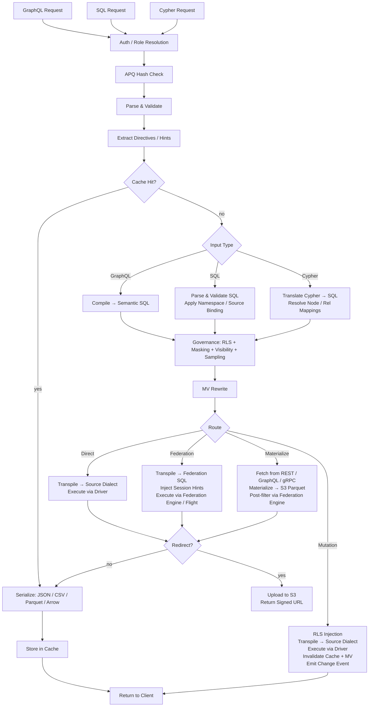

# Provisa 架構

## 概覽

Provisa 是一個由配置驅動的數據虛擬化平台，專為驅動語義層而設計——由小型團隊到企業級規模皆可使用。它為異構數據來源提供統一 API，並內建治理、安全性及效能優化。用戶端可透過 SQL、GraphQL 或 Cypher 查詢；三者均為一級介面，套用相同的治理。(REQ-002, REQ-038)

語義層的區分十分重要。要擴展語義層，必須在數據虛擬化層內建立新的數據來源或聚合。這樣便造成清晰的分隔——平台以外不能對語義作出新增，令真正的數據治理成為可能。(REQ-136) 執行是在編譯器層面進行：獲批准的關係目錄是事實的來源，與使用哪種查詢語言無關。(REQ-002)

Provisa 的設計目標，是在營運需求方面達到高效能，同時在企業級分析需求方面達到高度可擴展性。單一平台同時服務兩者，不犧牲速度或可擴展性。

```
Config YAML → PG Metadata → Federation Catalogs
                               ↓
         Federation engine metadata → Schema Generator → SDL / SQL catalog / Cypher labels / gRPC proto (per role)
                                     ↓
                     Query → Parser → SQL Compiler → Transpiler
                                     ↓
                             Router (Smart Dispatch)
                         /           |            \
                    Federation  Direct PG      Direct MySQL/etc.
                         \           |            /
                              Executor Pool
                                     ↓
                         ┌───── Inline ─────┐     ┌──── Redirect ────┐
                         │  JSON (HTTP)     │     │  CTAS → S3       │
                         │  Arrow (Flight)  │     │  (Parquet, ORC)  │
                         │  Protobuf (gRPC) │     │  Provisa → S3    │
                         └─────────────────-┘     │  (JSON, CSV, …)  │
                                                  └─────────────────-┘
```

## 查詢介面

每個介面均為獨立傳輸方式。四者皆套用相同的安全管道（行級安全、數據遮罩、抽樣、角色檢查）。(REQ-002, REQ-038) 用戶端絕不會直接與聯邦引擎通訊。(REQ-266)「查詢語言」（SQL／GraphQL／Cypher）與傳輸方式互相獨立——多種語言可透過同一傳輸方式送達。

| Port | Transport | Accepted query languages | Use case |
|------|-----------|--------------------------|----------|
| 8001 | HTTP | GraphQL, SQL, Cypher | Web clients, BI tools, curl, REST consumers |
| 8815 | Arrow Flight (gRPC) | SQL (via Arrow Flight SQL) | Data tools (Pandas, DuckDB, Spark, ADBC) |
| 50051 | Protobuf gRPC | Per-role generated proto RPCs | Service-to-service with typed contracts |
| configurable¹ | PostgreSQL wire protocol (pgwire) | SQL | psql, DBeaver, SQLAlchemy, any PG-compatible client |

¹ 設定 `PROVISA_PGWIRE_PORT`（例如 5433）。若未設定或設為 `0`，則停用。

### HTTP（Port 8001）

同一 port 下有多個端點，以路徑區分：

| Path | Language | Notes |
|------|----------|-------|
| `POST /data/graphql` | GraphQL | Reads and mutations; APQ hash accepted via `extensions.persistedQuery` |
| `POST /data/sql` | SQL | Read-only; no capability gate — governed by object visibility + RLS + masking (REQ-001, REQ-267) |
| `POST /data/query` | Cypher | Read-only; standard role |
| `GET /data/nl` | Natural language | Translates to SQL/GraphQL/Cypher based on source type |
| `GET /data/subscribe/{table}` | GraphQL | SSE subscription stream |
| `GET /neo4j/...` | Cypher (Neo4j compat) | Neo4j HTTP API compatibility shim |
| `POST /admin/graphql` | GraphQL | Admin API (superuser/admin role required) |

所有路徑預設回傳 JSON。透過內容協商，支援 `Accept: text/csv`、`application/vnd.apache.parquet`、`application/vnd.apache.arrow.stream` 及 `application/octet-stream`（原始二進位數據）。超過已設定大小門檻的結果，會自動轉向至已簽署的 S3 URL。(REQ-029, REQ-137)

### Arrow Flight（Port 8815）

透過 gRPC 提供原生欄式 Arrow 傳輸。(REQ-045, REQ-143) 用戶端傳送 JSON ticket：
```json
{"query": "SELECT name, email FROM customers", "role": "analyst"}
```
並以延遲串流方式接收 Arrow RecordBatch。當 Zaychik Arrow Flight SQL 代理可用時，數據會以端到端連續的 Arrow record batch 串流方式流動：(REQ-144)

```
Client ←(Arrow batches)← Provisa Flight Server ←(Arrow batches)← Zaychik ←(JDBC)← Federation Engine
```

完整結果絕不會在 Provisa 的記憶體中具體化——批次一到達便會轉發。(REQ-145) 這使 Arrow Flight 成為一條無限制的路徑，適合任意大小的結果。

### Protobuf gRPC（Port 50051）

從數據結構描述按角色自動生成 `.proto` 檔案。(REQ-525) 串流查詢（每列一則訊息）、單一（unary）變更。已啟用伺服器反射（server reflection）。(REQ-526) 角色透過中繼資料鍵 `x-provisa-role` 傳遞。

### PostgreSQL 線路協定／pgwire（可設定 port）

使用 `buenavista` 程式庫實作 PostgreSQL 前端／後端線路協定。(REQ-527) 任何相容 PostgreSQL 的用戶端——`psql`、DBeaver、使用 `psycopg2` 的 SQLAlchemy、JDBC——均可在不作任何修改下連線。只接受 SQL。完整治理管道（行級安全、數據遮罩、網域權限）以相同方式套用於 pgwire 連線。(REQ-266, REQ-002) 將 `PROVISA_PGWIRE_PORT` 設為非零 port 即可啟用。

## 請求管道

系統接受三種查詢語言。全部在各自的剖析／編譯步驟後於治理階段匯合。(REQ-262, REQ-263) 只有 GraphQL 支援寫入。(REQ-037) 查詢本身並無能力閘（capability gate）——任何已驗證身分均可以任何語言查詢，數據完全由物件可見性、行級安全及數據遮罩管治。(REQ-001)

| Interface | Reads | Writes | Query gate |
|---|---|---|---|
| GraphQL (`/data/graphql`) | Yes | Yes (mutations) | None — data-layer governance only |
| SQL (`/data/sql`) | Yes | No | None — data-layer governance only (REQ-267) |
| Cypher (`/data/query`) | Yes | No | None — data-layer governance only |



**路由決策：**

| Route | When |
|---|---|
| **Cache** | Result cache hit — evaluated first, serves the stored result with no execution (REQ-865) |
| **Cheap-count** | `count(*)`-shaped query over an unmaterialized source that exposes an exact native count — routed to the native count call instead of materializing to count (REQ-875) |
| **Direct** | Single source + has native driver + has federation connector |
| **Federation** | Multi-source federation, or source has connector but no driver |
| **Materialize** | Source has no federation connector — fetch and cache to S3/PG first |
| **Mutation** | GraphQL mutation — always direct, never federated |

路由使用的是治理後優化階段的輸出，而非優化前經治理的 SQL。治理可以新增數據來源（行級安全子查詢述詞）；優化階段則可以移除數據來源（為熱表內嵌 VALUES CTE、API 快取重寫、聯集分支剪除）。因此，經內嵌後只餘下單一活躍數據來源的聯邦查詢，會被重新路由為直接查詢。(REQ-863)

### 多根查詢

具有多個根欄位的 GraphQL 查詢（例如 `{ orders { id } customers { name } }`）會被編譯成獨立的 SQL 查詢，並各自獨立執行。(REQ-534) SQL 及 Cypher 請求定義上均為單根查詢。結果會合併於單一回應中：
- 低於轉向門檻的欄位會內嵌於 `data` 中回傳
- 高於門檻的欄位會被轉向，並在 `redirects` 中以每欄位一項記錄
- 二進位格式（Parquet、Arrow）僅支援單根查詢

## 聯邦執行路徑

| Path | Transport | Via | When used |
|------|-----------|-----|-----------|
| REST | federation engine client (HTTP :8080) | Direct query | Default, always available |
| Flight SQL | `adbc-driver-flightsql` (gRPC :8480) | Zaychik proxy → JDBC | When Zaychik is running |
| CTAS | federation engine client (HTTP :8080) | Direct write, Iceberg to S3 | Parquet/ORC redirect |

### Zaychik Arrow Flight SQL 代理

聯邦引擎並非原生支援 Arrow Flight SQL 協定。[Zaychik](https://github.com/Raiffeisen-DGTL/zaychik-trino-proxy) 是一個 Java 代理，實作 Arrow Flight SQL 的 gRPC 介面，將請求轉譯為 JDBC 查詢，並以 Arrow record batch 串流方式回傳結果。(REQ-144)

```
ADBC client → gRPC :8480 → Zaychik → JDBC :8080 → Federation Engine → results → Arrow batches → client
```

Provisa Flight Server（Port 8815）以 ADBC 用戶端身分連接至 Zaychik，實現端到端 Arrow 串流，而毋須具體化結果。(REQ-145)

### Iceberg 結果目錄

CTAS 轉向使用一個基於現有 PostgreSQL 執行個體上 JDBC 目錄的 Iceberg 連接器（目錄 `results`）。(REQ-169) Iceberg 透過原生 S3 檔案系統（`fs.native-s3.enabled=true`）直接將 Parquet／ORC 檔案寫入 MinIO／S3。

## 聯邦引擎

Provisa 於啟動時透過環境變數 `PROVISA_ENGINE`、已持久化的 Admin UI 設定，或預設值來選擇聯邦引擎。若未設定任何值，預設為 DuckDB——完全在進程內運作，毋須外部服務（REQ-989）。選擇的詳情請見 [Configuration](configuration.md#_31)。

每個引擎都是一個 `FederationEngine` 執行個體，定義於 `provisa/federation/engine.py`。該執行個體持有一組連接器集合，決定引擎可即時讀取（ATTACH）哪些來源類型，以及哪些必須先落地至引擎的具體化儲存區。[tool-verified: `engine.py` `_ENGINE_BUILDERS`, `ENGINE_REGISTRY`]

### 驅動程式類別（REQ-840）[tool-verified: `engine.py` `DriverClass`]

| Class | Meaning | Examples |
|-------|---------|---------|
| `BROAD` | Reaches many external source types via native connectors | Trino |
| `PARTIAL` | Reaches a subset (relational, files, cloud object/lake) plus lands everything else | DuckDB, PostgreSQL, ClickHouse, Databricks, Snowflake, BigQuery, Fabric, Synapse |
| `SELF_ONLY` | Reaches only its own store; every other source lands in | SQLAlchemy |

### 可用引擎 [tool-verified: `engine.py` `_ENGINE_BUILDERS`]

| Engine key | Dialect | MPP | External-link mechanism | Auth |
|-----------|---------|-----|------------------------|------|
| `trino` / `trino-byo` | Trino SQL | Yes | Trino catalogs (broad connector set) | JDBC credentials |
| `pg` | PostgreSQL | No | FDW / pg_duckdb | PostgreSQL credentials |
| `duckdb` | DuckDB | No | Extension-native ATTACH | None (in-process) |
| `clickhouse` / `clickhouse-server` | ClickHouse | Yes (shards) | S3 / IcebergS3 / DeltaLake table engines (REQ-986) | ClickHouse credentials |
| `snowflake` | Snowflake | Yes | External stage + external table (REQ-988) | `PROVISA_ENGINE_URL` |
| `databricks` | Databricks SQL | Yes | Unity Catalog external tables via REST (REQ-987) | Bearer token (`http_path` in `federation_hints`) |
| `bigquery` | BigQuery | Yes (Dremel) | BigQuery external / BigLake tables | `GOOGLE_APPLICATION_CREDENTIALS` service-account key |
| `fabric` | T-SQL | Yes | OneLake shortcuts → OPENROWSET | Azure AD (`az login` / managed identity) |
| `synapse` | T-SQL | Yes | ADLS OPENROWSET / external tables | Azure AD |
| `sqlalchemy` | Any SQLAlchemy dialect | No | None (land-only) | Per-dialect credentials |

### 免設定預設值：DuckDB（REQ-989）[tool-verified: `engine.py` `build_duckdb_engine`, `_embedded_duckdb_materialize_default`]

當 `PROVISA_ENGINE` 未設定時，Provisa 使用完全內嵌、於進程內運作的 DuckDB 引擎。DuckDB 的具體化儲存區是位於 `$PROVISA_DATA_DIR/materialize.duckdb`（預設：`~/.provisa/materialize.duckdb`）的內嵌 DuckDB 檔案。毋須任何外部資料庫或服務。

由於 DuckDB 每個檔案只允許單一寫入進程，`store_connection.py` 是透過引擎自身的連線寫入內嵌儲存區——絕不透過第二個獨立連線。這是引擎與具體化儲存區有意共用同一檔案控點的唯一情況。[tool-verified: `store_connection.py` module docstring]

### 原生 Arrow 讀取傳輸（REQ-986, REQ-987, REQ-988）[tool-verified: `engine.py` `build_*_engine` `capabilities=`]

ClickHouse、DuckDB、Snowflake、Databricks、BigQuery、Fabric 及 Synapse 均回報 `EngineCapability.ARROW` 及 `EngineCapability.ARROW_STREAM`。針對這些引擎的查詢會直接回傳 Arrow RecordBatch——完全繞過逐列序列化路徑。Flight Server 會將這些批次串流至用戶端，而不會在 Provisa 的進程記憶體中具體化完整結果。就 Trino 而言，Arrow 串流依賴 Zaychik 代理；就倉儲引擎而言，各引擎自身的原生 Arrow API（Databricks 的 Cloud Fetch、BigQuery 的 Storage Read API、DuckDB 及 Snowflake 的 `fetch_arrow_table`）驅動 Flight 串流。

### 外部數據連結（ATTACH）[tool-verified: `engine.py` `_warehouse_connectors`]

每個倉儲引擎均可原地掃描雲端物件／湖數據，而毋須落地複本。位於 S3、GCS 或 OneLake 上的 Parquet、CSV、Iceberg 及 Delta Lake 檔案，會直接掛接至引擎，猶如原生資料表一般。所採用的策略——ATTACH（原地掃描）或 LAND（複製至儲存區）——由連接器所宣告的 `Mechanism` 決定；規劃器中並無按引擎區分的分支邏輯。`Mechanism.ATTACH_R` 連接器會觸發免複製掃描；`Mechanism.DIRECT` 連接器或缺少連接器則會觸發落地。[tool-verified: `connector_base.py` `Mechanism`, `engine.py` `_warehouse_connectors`]

Attach 會於掛接時自動佈建所有先決條件：

| Engine | Object/lake formats | Mechanism | Auto-provisioning [tool-verified] |
|--------|-------------------|----------|----------------------------------|
| Databricks | parquet, csv, iceberg, delta_lake | UC external table (`ATTACH_R`) | REST installs Unity Catalog storage credential + external location, then `CREATE TABLE … USING <format> LOCATION …` — live-verified over Cloudflare R2 |
| BigQuery | parquet, csv, json, iceberg, delta_lake | BigQuery external / BigLake table (`ATTACH_R`) | `CREATE OR REPLACE EXTERNAL TABLE … OPTIONS(format=…, uris=[…])` — live-verified |
| ClickHouse | csv, parquet, iceberg, delta_lake | S3 / IcebergS3 / DeltaLake table engine (`ATTACH_R`) | Validation probe executed at attach time — live-verified over Cloudflare R2 |
| Fabric | parquet, csv, iceberg, delta_lake | OneLake shortcut → OPENROWSET (`ATTACH_R`) | REST creates an `AmazonS3Compatible` connection + lakehouse + shortcut; returns the OneLake `BULK` path — live-verified reading R2 through Fabric |
| Snowflake | parquet, csv, json, iceberg, delta_lake | External stage + external table (`ATTACH_R`) | `CREATE STAGE … URL=… CREDENTIALS=…`, then `CREATE OR REPLACE EXTERNAL TABLE … LOCATION=@stage FILE_FORMAT=(TYPE=…)` — implemented; not live-tested (no account available) |

雲端儲存的憑證是透過數據來源的 `federation_hints` 傳遞（見 [Sources](sources.md#_15)）。任何無法執行 ATTACH 的來源類型，都會先落地至引擎的具體化儲存區。

### 欄式具體化寫入（REQ-990）[tool-verified: `core/database.py:436`, `store_connection.py:99`]

`provisa/core/database.py` 中的 `Connection.bulk_copy` 會根據儲存區方言選擇最快的批量匯入路徑：PostgreSQL 儲存區使用二進位 `COPY`（asyncpg 的 `copy_records_to_table`），其他所有關聯式儲存區則使用單一預備 `executemany` 陳述式。內嵌的 DuckDB 儲存區則透過 `store_connection.py` 中的 `land_duckdb_native` 落地數據——整個批次僅一次 `executemany` 呼叫，絕不逐列迴圈。

## 大型結果轉向

超過列數門檻的結果，會被轉向至相容 S3 的儲存區（MinIO），而非內嵌回傳。(REQ-029)

### 轉向模式

| Mode | How it works | Data touches Provisa? |
|------|-------------|----------------------|
| **CTAS** (Parquet, ORC) | Federation engine writes directly to S3 via `CREATE TABLE AS SELECT` | No |
| **Provisa upload** (JSON, NDJSON, CSV, Arrow IPC) | Provisa serializes and uploads via boto3 | Yes |

對於 CTAS 原生格式，Provisa 完全不會接觸數據——聯邦引擎會直接將檔案寫入 MinIO／S3。(REQ-138) 這是大型分析匯出的首選路徑。

### 轉向標頭

| Header | Effect |
|--------|--------|
| `X-Provisa-Redirect-Format: <mime>` | Redirect in this format (implies force unless threshold set) |
| `X-Provisa-Redirect-Threshold: N` | Only redirect if result exceeds N rows |
| `X-Provisa-Redirect: true` | Force redirect using default format |

這些標頭實作了由用戶端主導的轉向。(REQ-137)

**回應：**
```json
{
  "data": {"orders": null},
  "redirect": {
    "redirect_url": "https://minio:9000/provisa-results/results/abc.parquet?...",
    "row_count": 50000,
    "expires_in": 3600,
    "content_type": "application/vnd.apache.parquet"
  }
}
```

### 伺服器端設定

| Env var | Default | Purpose |
|---------|---------|---------|
| `PROVISA_REDIRECT_ENABLED` | `false` | Enable server-side threshold redirect |
| `PROVISA_REDIRECT_THRESHOLD` | `1000` | Default row count threshold |
| `PROVISA_REDIRECT_FORMAT` | `parquet` | Default redirect format |
| `PROVISA_REDIRECT_BUCKET` | `provisa-results` | S3 bucket name |
| `PROVISA_REDIRECT_ENDPOINT` | | S3-compatible endpoint URL |
| `PROVISA_REDIRECT_TTL` | `3600` | Presigned URL TTL (seconds) |

## 路由決策樹

```
Multi-source query? → Federation engine
NoSQL source (MongoDB, Cassandra)? → Federation engine
Uses path columns on non-PG source? → Federation engine
Single RDBMS with driver? → Direct (sub-100ms target)
Single RDBMS without driver? → Federation engine
Steward hint "federated"? → Federation engine (override)
Steward hint "direct"? → Direct (if possible)
Redirect to Parquet/ORC? → Federation engine (CTAS, regardless of source count)
```

(REQ-027, REQ-028, REQ-030, REQ-279)

## 聯邦查詢優化

Provisa 會自動初始化聯邦引擎的基於成本的優化器，令跨來源查詢計劃基於實際數據分佈，而非硬編碼的預設值。

### 自動統計資料（`ANALYZE`）

在登記數據來源時，Provisa 會為每個已發佈的資料表執行 `ANALYZE catalog.schema.table`。(REQ-275) 此舉會擷取：

- 列數
- 每欄：空值比例、相異值數目、最小／最大值、直方圖（視乎連接器而定）

優化器會利用這些數值估算已篩選查詢的選擇性。若無統計資料，系統會回退至固定預設值（例如相等述詞的選擇性為 10%），在數據傾斜或高基數的情況下導致連接（join）計劃欠佳。有統計資料時，估算便足夠準確，能在大多數工作負載中就廣播式與分割式連接作出正確決策。

**涵蓋範圍**：統計資料支援程度因連接器而異。PostgreSQL、MySQL、Hive、Iceberg 及 Delta Lake 完全支援 `ANALYZE`。MongoDB 及 Cassandra 連接器則僅提供部分或不提供支援。Provisa 會靜默忽略 `ANALYZE` 錯誤——登記程序絕不會因此被阻擋。(REQ-275)

**選擇性的限制**：統計資料提供的是逐欄估算。若述詞相關聯（例如 `WHERE region = 'US' AND city = 'Seattle'`），優化器會假設欄與欄之間互相獨立，可能會低估列數。這是所有基於成本的優化器中，逐欄統計資料的已知限制。

**API 數據來源**：PostgreSQL 中的 `api_cache_{table_name}` 資料表，會在每次快取重新整理週期後自動分析，令優化器在將基於 API 的來源與關聯式來源連接時，可取得最新的列數估算。(REQ-280)

### 管理：重新整理統計資料

可按需要透過 Admin API 重新執行統計資料收集：(REQ-276)

```graphql
mutation {
  refreshSourceStatistics(sourceId: "sales-pg") {
    tablesAnalyzed
    failures { table message }
  }
}
```

適用於某數據來源自登記以來已收到大量新數據的情況。

## 具體化檢視

具體化檢視（MV）透過預先計算並快取結果，透明地優化昂貴的查詢。

### 以關係作為 MV 提示

一項關係聲明不只是治理產物——它同時也是連接（join）形態的結構描述。而這正正是 MV 優化器所需要的形態：兩個資料表、兩個欄、一種連接類型。這意味著一項關係可以直接指導具體化。

對於**跨來源關係**，這在啟動時會自動發生：每項獲批准的跨來源關係都會產生一個 `JoinPattern` MV（`auto-mv-<rel_id>`）。(REQ-158) 毋須額外的 MV 設定。當編譯器在查詢中偵測到此連接時，重寫器會透明地以預先具體化的結果取代之。

對於**同一數據來源內的關係**，數據管家可以透過明確設定 `materialize: true` 選用具體化。同一數據來源內的 JOIN 已因直接執行而具速度優勢，因此只有極高頻率的連接路徑才值得具體化。(REQ-159)

實際結果是：批准某項關係的數據管家，其實也隱含地決定了該連接是否適合作為具體化候選。治理行為與優化提示，其實是同一項聲明。

### 模式

| Mode | Config | Behavior |
|------|--------|----------|
| **Join-pattern** | `join_pattern` in MV config | Rewrites matching JOINs to read from MV table |
| **Custom SQL** | `sql` in MV config | Arbitrary SELECT, optionally exposed in SDL |
| **Auto-materialized relationship** | cross-source relationship (automatic) | Auto-generates a join-pattern MV; no config required |
| **Steward-materialized relationship** | `materialize: true` on same-source relationship | Explicit opt-in for hot same-source join paths |

### 自動具體化

跨來源 JOIN 是最昂貴的查詢（永遠是聯邦查詢）。跨來源關係會在啟動時自動產生 MV 定義：(REQ-158)

```yaml
relationships:
  - id: orders-to-reviews
    source_table_id: orders        # sales-pg
    target_table_id: product_reviews  # reviews-mongo
    source_column: product_id
    target_column: product_id
    cardinality: one-to-many
    materialize: true              # auto-create MV
    refresh_interval: 600          # refresh every 10 minutes
```

只有跨來源關係會產生 MV（同一數據來源內的 JOIN 已透過直接執行而具速度優勢）。(REQ-159) MV 一開始的狀態為 `STALE`，並會由背景重新整理迴圈更新，然後才會被查詢優化器使用。(REQ-160)

### 重新整理生命週期

```
STALE → (refresh loop picks up) → REFRESHING → FRESH
  ↑                                                |
  └──── mutation hits source table ────────────────┘
```

重新整理迴圈每 30 秒執行一次，檢查 `get_due_for_refresh()`，並透過聯邦引擎對 MV 目標資料表執行 `CREATE TABLE AS SELECT`（首次執行）或 `DELETE + INSERT`（其後執行）。(REQ-160, REQ-234)

## 模組地圖

| Module | Purpose |
|--------|---------|
| `api/` | FastAPI app, routers, middleware, lifespan management |
| `api/flight/` | Arrow Flight server (gRPC, port 8815) |
| `api/admin/` | Strawberry GraphQL admin API — config, discovery, views |
| `api/rest/` | Auto-generated REST endpoints from registered tables |
| `api/jsonapi/` | Auto-generated JSON:API endpoints with pagination and error handling |
| `api/data/subscribe.py` | SSE subscriptions — LISTEN/NOTIFY, polling, Debezium CDC |
| `compiler/` | GraphQL/SQL parsers, semantic SQL generator, RLS, masking, sampling, two-stage governance (`stage2.py`) |
| `cypher/` | Cypher → SQL translator, parser, label map (REQ-351), write translator for Cypher mutations |
| `pgwire/` | PostgreSQL wire-protocol server; `catalog.py` intercepts pg_catalog/information_schema for per-role object visibility (REQ-527, REQ-883, REQ-891) |
| `vector/` | Vector search — model registry, embedding providers (openai/ollama/huggingface), `cosine_similarity()` translation, pgvector fallback cache, declarative embedding generation (REQ-419–431) |
| `compiler/federation.py` | Apollo Federation v2 subgraph support |
| `transpiler/` | Dialect transpilation, routing logic |
| `executor/` | Federated/direct execution, serialization, output formats |
| `executor/drivers/` | Direct source drivers (PostgreSQL, MySQL, DuckDB, Snowflake, Databricks, ClickHouse, …) |
| `executor/trino_flight.py` | ADBC Flight SQL client for the federation engine |
| `executor/ctas_write.py` | CTAS-based redirect (federation engine writes to S3) |
| `executor/redirect.py` | S3 redirect logic, Provisa-side upload |
| `federation/engine.py` | `FederationEngine`, `DriverClass`, `_ENGINE_BUILDERS`, `ENGINE_REGISTRY`, `build_engine` |
| `federation/connector.py` | Connector abstractions — Trino, ClickHouse; `Mechanism`, `WarehouseNativeConnector` |
| `federation/connector_duckdb.py` | DuckDB and PostgreSQL FDW connector definitions |
| `federation/snowflake_connectors.py` | Snowflake external stage + external table ATTACH connectors (REQ-988) |
| `federation/databricks_connectors.py` | Databricks UC external table ATTACH connectors (REQ-987) |
| `federation/bigquery_connectors.py` | BigQuery external / BigLake ATTACH connectors |
| `federation/databricks_uc.py` | Unity Catalog credential + external location auto-provisioning |
| `federation/databricks_backend.py` | Databricks SQL warehouse execution backend |
| `federation/snowflake_backend.py` | Snowflake execution backend |
| `federation/bigquery_backend.py` | BigQuery execution backend (Storage Read API Arrow transport) |
| `federation/mssql_warehouse_backend.py` | Fabric Warehouse + Synapse execution backends (T-SQL over ODBC) |
| `federation/mssql_warehouse_connectors.py` | OPENROWSET ATTACH connectors for Fabric / Synapse |
| `federation/fabric_shortcuts.py` | OneLake shortcut auto-provisioning (connection → lakehouse → shortcut) |
| `federation/clickhouse_backend.py` | ClickHouse execution backend |
| `federation/duckdb_backend.py` | DuckDB in-process execution backend |
| `federation/pg_backend.py` | PostgreSQL execution backend |
| `federation/store_connection.py` | DuckDB-native materialization store write face (REQ-989, REQ-990) |
| `registry/` | Persisted query registry, governance |
| `security/` | Visibility, rights, column masking |
| `cache/` | Redis-backed query result caching (hot tier) |
| `mv/` | Materialized view registry, refresh, SQL rewriter |
| `events/` | Dataset change events and trigger dispatch |
| `webhooks/` | Outbound webhook execution for mutations and events |
| `scheduler/` | APScheduler-based background job management — cron and interval triggers that fire webhooks, mutations, or Kafka sink publishes |
| `apq/` | Apollo APQ wire protocol — Redis-backed query hash cache; separate from result caching |
| `compiler/cursor.py` | Relay-style cursor pagination — `first`/`after`/`last`/`before` arguments and `pageInfo` generation on all list queries |
| `compiler/aggregate_gen.py` | Auto-generated `{table}_aggregate` query types with `count`, `sum`, `avg`, `min`, `max` sub-fields and filtered `nodes` access |
| `compiler/enum_detect.py` | Enum type auto-detection — PostgreSQL native enum types (`pg_enum`) exposed as GraphQL enum types rather than string scalars |
| `compiler/hints.py` | Federation performance hints — query-level routing directives embedded as SQL comments (`/* @provisa route=federated */`) that override automatic routing |
| `compiler/mutation_gen.py` | Mutation compiler; column presets — server-side static or session-variable values applied on insert/update, not exposed in the mutation input type |
| `auth/approval_hook.py` | ABAC approval hook — pluggable external authorization called before query execution; webhook, gRPC, and unix_socket transports; per-table/source/global scope; configurable fallback policy |
| `subscriptions/` | SSE subscription state and delivery |
| `discovery/` | LLM relationship discovery (Claude API) |
| `grpc/` | Proto generation, gRPC server, reflection |
| `api_source/` | REST/GraphQL/gRPC API sources with PG cache |
| `kafka/` | Kafka topic sources, sink, Schema Registry |
| `auth/` | Pluggable auth providers, middleware, role mapping |
| `core/` | Config, models, DB, repositories, secrets; role model supports `parent_role_id` and `flatten_roles()` for recursive role inheritance |
| `hasura_v2/` | Hasura v2 metadata → Provisa config converter |
| `ddn/` | Hasura DDN supergraph → Provisa config converter |
| `mongodb/` | MongoDB source connector |
| `elasticsearch/` | Elasticsearch source connector |
| `cassandra/` | Cassandra source connector |
| `prometheus/` | Prometheus metrics source connector |
| `source_adapters/` | Generic adapter layer for source connections |

## Admin API

Strawberry GraphQL Admin API 掛載於 `/admin/graphql`（HTTP Port 8001）。它與數據 GraphQL 端點分開，並需要超級用戶或管理員角色。

| Capability | Description |
|-----------|-------------|
| Config download/upload | Export or replace the full Provisa YAML config |
| Relationship editor | Create, update, delete relationship definitions |
| AI FK discovery | Trigger Claude-powered FK candidate analysis |
| Schema introspection | Browse published tables, columns, and roles |
| View management | Register and manage materialized view definitions |

(REQ-164, REQ-165, REQ-166, REQ-167)

## 自動生成的 REST 及 JSON:API 端點

已登記的資料表除 GraphQL 介面外，亦會以 REST 及 JSON:API 端點形式公開。(REQ-256, REQ-257)

| Interface | Mount path | Spec |
|-----------|-----------|------|
| REST | `/rest/<table-id>` | Simple GET/POST with query parameters |
| JSON:API | `/jsonapi/<table-id>` | [jsonapi.org](https://jsonapi.org) compliant — pagination, relationships, error objects |

這些端點套用與 GraphQL 端點相同的安全管道（行級安全、數據遮罩、角色檢查）。(REQ-002, REQ-038)

## 訂閱

SSE 訂閱於 `GET /data/subscribe/{table}` 公開。有三種傳送模式：(REQ-258)

| Mode | Mechanism | When used |
|------|-----------|-----------|
| **LISTEN/NOTIFY** | PostgreSQL `LISTEN` on a channel | PG sources with mutation activity |
| **Polling** | Re-execute query on interval | Non-PG sources, or when CDC unavailable |
| **Debezium CDC** | Kafka topic from Debezium connector | High-frequency change streams |

(REQ-258, REQ-260, REQ-261)

用戶端會收到 `text/event-stream`，每一列變更或差異均對應一個 JSON 事件。

## 事件及 Webhook 系統

資料庫變更（INSERT／UPDATE／DELETE）可透過 `events/` 及 `webhooks/` 模組觸發外送事件。(REQ-172, REQ-173, REQ-220)

```
Mutation executed → EventDispatcher → match event trigger rules
                                          ↓
                               WebhookExecutor → HTTP POST to configured URL
```

事件觸發器於設定中定義，並按資料表、操作類型及選用的列篩選條件對應。Webhook 酬載包含操作類型、變更的一列，以及角色情境。

## 背景服務

四個背景迴圈會在應用程式的生命週期（lifespan）階段啟動（`api/app.py`）：

| Service | Interval | Purpose |
|---------|----------|---------|
| MV refresh loop | 30 s | Polls `get_due_for_refresh()`, executes CTAS or DELETE+INSERT on stale MVs |
| Warm table manager | Configurable | Promotes frequently-queried tables to Iceberg local SSD cache |
| Hot table loader | Configurable | Loads small reference tables into in-memory cache for sub-millisecond access |
| API source poller | Per-source interval | Re-fetches and re-caches remote REST/GraphQL/gRPC sources |

(REQ-160, REQ-238, REQ-239, REQ-236)

### 熱／暖資料表快取層級

| Tier | Storage | Promotion criteria | Access latency |
|------|---------|-------------------|----------------|
| Hot | In-process memory | Row count < threshold, or is a relationship target | <1 ms |
| Warm | Iceberg on local SSD | Query frequency threshold exceeded | ~5–20 ms |
| Cold | Remote source | Default | 50–500 ms |

(REQ-230, REQ-236, REQ-238, REQ-241)

## 中繼資料匯入（Hasura v2／DDN）

現有的 Hasura 部署可轉換為 Provisa 設定，而毋須手動重寫。(REQ-182, REQ-183)

| Module | Input | Output |
|--------|-------|--------|
| `hasura_v2/` | Hasura v2 `metadata.yaml` | Provisa `config.yaml` |
| `ddn/` | Hasura DDN supergraph JSON | Provisa `config.yaml` |

兩個轉換器均會對應已追蹤的資料表、關係、權限及遠端結構描述。結果是一個完整、可直接使用的 Provisa 設定。(REQ-182, REQ-183)

## Apollo Federation

`compiler/federation.py` 將 Provisa 公開為 Apollo Federation v2 子圖（subgraph）。(REQ-259) 子圖 SDL 會根據已發佈的結構描述自動生成，主索引鍵欄上附有 `@key` 指令，跨來源關係上附有 `@external`／`@provides` 註解。Provisa 會回應 Federation Gateway 所需的 `_entities` 及 `_service` 查詢。(REQ-259)

## 以游標為基礎的分頁

所有列表查詢均透過 `compiler/cursor.py` 支援 Relay 式游標分頁。(REQ-218) 用戶端傳遞 `first`／`after`（向前）或 `last`／`before`（向後）引數。編譯器會將列位置編碼為不透明的 Base64 游標，並插入相應的 `WHERE`／`LIMIT` 子句。每個列表查詢均會回傳一個 `pageInfo` 物件：

| Field | Type | Description |
|-------|------|-------------|
| `hasNextPage` | Boolean | True if more results exist after this page |
| `hasPreviousPage` | Boolean | True if results exist before this page |
| `startCursor` | String | Cursor of the first node in this page |
| `endCursor` | String | Cursor of the last node in this page |

## 聚合查詢

每個已登記的資料表都會獲得一個自動生成的 `{table}_aggregate` 根欄位（`compiler/aggregate_gen.py`）。(REQ-196) 聚合類型為每個數值欄提供 `count`、`sum`、`avg`、`min`、`max`，以及 `nodes`——具完整欄位選擇能力的已篩選列存取（與基礎查詢相同的行級安全／數據遮罩）。(REQ-196, REQ-198) 聚合查詢適用於聚合 MV 路由——見 `mv/aggregate_catalog.py`。(REQ-198)

## Automatic Persisted Queries（APQ）

`apq/cache.py` 實作 Apollo 的 APQ 線路協定。(REQ-288) 當用戶端只傳送查詢雜湊（`extensions.persistedQuery`）時，Provisa 會於 Redis 中查找。(REQ-289) 若未命中，會回傳 `PersistedQueryNotFound` 錯誤；用戶端會以完整查詢文字重試，Provisa 隨即將其儲存。(REQ-288) 這與結果快取（`cache/`）互相獨立。

## 繼承角色

`core/models.py` 中的角色可以參照一個 `parent_role_id`。(REQ-215) `flatten_roles()` 會遞迴解析繼承鏈，並合併行級安全 WHERE 子句（以 AND 連接）、欄位可見性（聯集，以最嚴格者為準），以及數據遮罩原則（子角色按欄覆寫父角色）。此舉可避免在相似角色之間重複權限集（例如 `analyst` 繼承自 `reader`）。(REQ-215)

## ABAC 批核掛鉤

`auth/approval_hook.py` 是一個可插拔的授權掛鉤，於查詢執行前、行級安全及數據遮罩之後被呼叫。(REQ-203) 它可與外部政策引擎（OPA、自訂 ABAC 服務）整合。

| Setting | Description |
|---------|-------------|
| Transport | `webhook` (HTTP POST), `grpc`, or `unix_socket` |
| Scope | Per-table, per-source, or global |
| Fallback policy | `allow` or `deny` when the hook endpoint is unreachable |

(REQ-246, REQ-247, REQ-204)

## 列舉類型自動偵測

`compiler/enum_detect.py` 於結構描述生成時，對 PostgreSQL 原生列舉類型（`pg_enum`）進行內省（introspection）。(REQ-221) 使用自訂 PostgreSQL 列舉類型的欄，會被提升為 GraphQL 列舉類型——其值成為列舉成員，而非字串純量。

## 排程觸發器

`scheduler/jobs.py` 使用 APScheduler 執行以 cron 或間隔觸發器定義的背景工作。(REQ-216) 每項工作均可向已設定的 webhook URL 發出 POST 請求、對數據端點執行變更，或將查詢結果發佈至 Kafka topic。觸發器可透過 Admin API（`scheduledTrigger` 變更）或 YAML 設定中的 `scheduled_triggers` 鍵進行設定。(REQ-216)

## 聯邦效能提示

`compiler/hints.py` 會分析以 Provisa 註解語法嵌入查詢中的數據管家提示。(REQ-279) 提示的格式因查詢語言而異：

```graphql
# @provisa route=federated
{ orders { id amount } }
```
```sql
/* @provisa route=federated */
SELECT id, amount FROM orders
```
```cypher
// @provisa route=federated
MATCH (o:Order) RETURN o.id, o.amount
```

| Hint | Effect |
|------|--------|
| `route=federated` | Force federation through the federation engine, bypassing direct-driver routing |
| `route=direct` | Force direct-driver execution |

(REQ-279, REQ-277, REQ-278)

## 變更中的欄位預設值

`compiler/mutation_gen.py` 支援按欄的伺服器端預設值，於 `INSERT` 或 `UPDATE` 時套用。(REQ-214) 預設值不會包含於自動生成的 GraphQL 變更輸入類型中——編譯器會透明地插入它們。預設值類型：`static`（字面值）或 `session`（取自請求的工作階段／標頭，例如 `x-hasura-user-id`）。(REQ-214)

## GraphQL Voyager 結構描述探索工具

Admin UI（`provisa-ui/src/pages/SchemaExplorer.tsx`）內嵌 GraphQL Voyager 作為互動式結構描述視覺化工具。(REQ-248) 它會將按角色範圍限定的結構描述，以可導覽的實體關係圖呈現——資料表作為節點，關係作為邊。所顯示的結構描述，永遠以目前所選角色作篩選。

## 安全執行順序

查詢本身並無能力閘——治理完全透過數據層的控制來表達。(REQ-001) 未經加工的 SQL 請求，會在治理執行之前，先拒絕（HTTP 403）任何超出角色物件範圍的資料表。(REQ-267)

1. **物件可見性**：按角色劃分的結構描述會隱藏未獲授權的資料表／欄；未經加工 SQL 中超出範圍的資料表會被拒絕 (REQ-039, REQ-267)
2. **關係執行**：遍歷（traversal）必須存在於獲批准的關係目錄中，除非該角色具有 `ignore_relationships` (REQ-001)
3. **行級安全**：按資料表及角色插入 WHERE 子句 (REQ-040, REQ-041, REQ-263)
4. **欄位遮罩**：按欄及角色進行數據轉換 (REQ-263)
5. **列數上限（LIMIT）**：對於沒有 `full_results` 的角色設有列數上限；隨機統計抽樣為另一項獨立的用戶查詢功能 (REQ-263, REQ-478)

四個查詢介面（HTTP、Flight、gRPC、pgwire）均執行相同的第二階段治理管道；任何用戶端路徑均無法在不繞過伺服器的情況下繞過它。(REQ-002, REQ-038, REQ-266)

## 可擴展性限制

Provisa 是一個輕薄的編譯及路由層——只為查詢延遲增加個位數毫秒。然而，Provisa 序列化結果數據的路徑，均受制於進程記憶體。有兩條路徑是真正無限制的：

| Path | Memory bound? | Suitable for |
|------|--------------|-------------|
| JSON inline (HTTP) | Yes | Small-medium results |
| **Arrow Flight streaming (gRPC :8815)** | **No** | **Unbounded — streaming via Zaychik or warehouse Arrow API** |
| Protobuf gRPC inline (:50051) | Yes | Medium results, service-to-service |
| Redirect: Provisa upload (JSON, CSV, NDJSON, Arrow IPC) | Yes | Medium results, file download |
| **Redirect: CTAS (Parquet, ORC)** | **No** | **Unbounded — federation engine writes to S3** |

(REQ-145, REQ-138)

### 門檻探測

對於基於門檻的轉向，Provisa 會在查詢中插入 `LIMIT threshold + 1` 作為探測。(REQ-140) 若結果列數較少，便會內嵌回傳（完整結果，不浪費任何工作）。若結果達到上限，探測會被捨棄，並透過 CTAS 或 Provisa 上載重新執行完整查詢。此舉可避免使用 `SELECT COUNT(*)`（部分數據來源未有優化此操作），並適用於任何數據來源。

對於大型分析工作負載，可使用以下其中一個選項：
- **Arrow Flight**（Port 8815）用於串流至數據工具——批次會流經 Provisa 而不會被具體化 (REQ-145)
- **Parquet／ORC 轉向**用於檔案式匯出——聯邦引擎直接寫入 S3，Provisa 回傳一個已預先簽署的 URL (REQ-138, REQ-044)

## 基礎架構

| Service | Image | Port | Purpose |
|---------|-------|------|---------|
| Provisa API | (host process) | 8001 | HTTP/REST endpoint |
| Provisa Flight | (host process) | 8815 | Arrow Flight gRPC server |
| Provisa gRPC | (host process) | 50051 | Protobuf gRPC server |
| Federation Engine | `trinodb/trino` (default) or external warehouse | 8080 / varies | Query federation engine — Trino for the embedded stack; Snowflake/Databricks/BigQuery/Fabric/Synapse/DuckDB for warehouse targets |
| Zaychik | `provisa-zaychik` (built from source) | 8480 | Arrow Flight SQL proxy for Trino; not required for warehouse engines |
| PostgreSQL | `postgres:16` | 5432 | Config metadata + Iceberg catalog |
| MongoDB | `mongo:7` | 27017 | Demo NoSQL data source |
| MinIO | `minio/minio` | 9000/9001 | S3-compatible object storage |
| Redis | `redis:7-alpine` | 6379 | Query result cache |
| PgBouncer | `edoburu/pgbouncer` | 6432 | Connection pooling for PG |
| Kafka | `confluentinc/cp-kafka:7.6.0` | 9092 | Streaming data sources |
| Schema Registry | `confluentinc/cp-schema-registry:7.6.0` | 8081 | Avro/Protobuf schema management |

(REQ-055, REQ-169)
