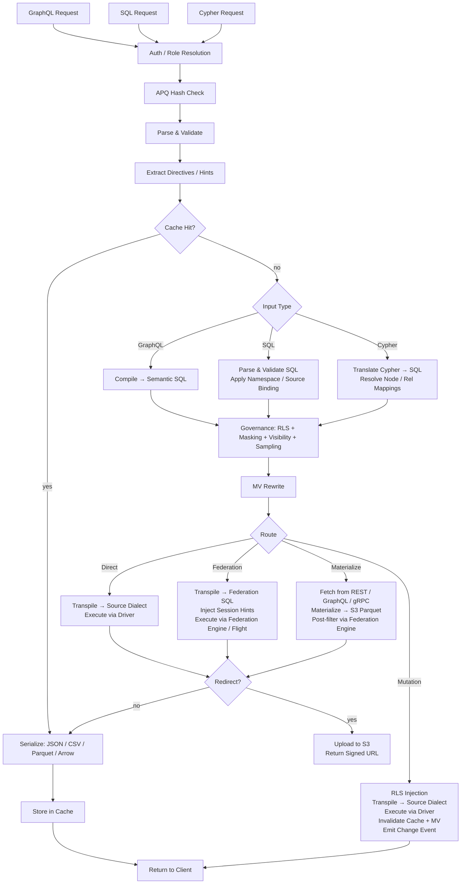

# Provisa 架構

## 概覽

Provisa 是一個以設定驅動的數據虛擬化平台，專為驅動一個由小型團隊延伸至大型企業的語義層而設計。它為異質數據來源提供統一的 API，並具備治理、安全性及效能優化。用戶端可透過 SQL、GraphQL 或 Cypher 查詢；三者均為一等介面，套用完全相同的治理規則。（REQ-002、REQ-038）

語義層的區分至關重要。要擴充語義層，你必須在數據虛擬化層之內建立新的數據來源或聚合。這造成一個乾淨的分隔——不能在平台之外對語義做任何新增，從而實現真正的數據治理。（REQ-136）強制執行是在編譯器層級進行：無論使用哪一種查詢語言，經核准的關聯目錄都是唯一真實來源。（REQ-002）

Provisa 的設計目標，是同時對營運需求具備高效能，並對企業級分析需求具備高可擴展性。單一平台可同時服務兩者，不必犧牲速度或可擴展性。

```text
Config YAML → PG Metadata → Federation Catalogs
                               ↓
         Federation engine metadata → Schema Generator → SDL / SQL catalog / Cypher labels / gRPC proto (per role)
                                     ↓
                     Query → Parser → SQL Compiler → Transpiler
                                     ↓
                             Router (Smart Dispatch)
                         /           |            \
                    Federation  Direct PG      Direct MySQL/etc.
                         \           |            /
                              Executor Pool
                                     ↓
                         ┌───── Inline ─────┐     ┌──── Redirect ────┐
                         │  JSON (HTTP)     │     │  CTAS → S3       │
                         │  Arrow (Flight)  │     │  (Parquet, ORC)  │
                         │  Protobuf (gRPC) │     │  Provisa → S3    │
                         └─────────────────-┘     │  (JSON, CSV, …)  │
                                                  └─────────────────-┘
```

## 查詢介面

每個介面都是一個獨立的傳輸方式。所有四種都套用同一套安全管線（RLS、遮罩、抽樣、角色檢查）。（REQ-002、REQ-038）用戶端永不直接與聯邦引擎對話。（REQ-266）「查詢語言」（SQL / GraphQL / Cypher）與傳輸方式互相正交——多種語言可經由同一種傳輸方式抵達。

| 連接埠 | 傳輸方式 | 所接受的查詢語言 | 使用情境 |
| ------ | ----------- | -------------------------- | ---------- |
| 8001 | HTTP | GraphQL、SQL、Cypher | 網頁用戶端、BI 工具、curl、REST 消費端 |
| 8815 | Arrow Flight (gRPC) | SQL（經由 Arrow Flight SQL） | 數據工具（Pandas、DuckDB、Spark、ADBC） |
| 50051 | Protobuf gRPC | 依角色產生的 proto RPC | 具型別合約的服務對服務通訊 |
| 可設定¹ | PostgreSQL 線路協定 (pgwire) | SQL | psql、DBeaver、SQLAlchemy，任何相容 PG 的用戶端 |

¹ 設定 `PROVISA_PGWIRE_PORT`（例如 5433）。未設定或為 `0` 時停用。

### HTTP（連接埠 8001）

同一連接埠下有多個端點，以路徑區分：

| 路徑 | 語言 | 備註 |
| ------ | ---------- | ------- |
| `POST /data/graphql` | GraphQL | 讀取及 mutation；透過 `extensions.persistedQuery` 接受 APQ 雜湊值 |
| `POST /data/sql` | SQL | 唯讀；沒有能力閘控——由物件可視性 + RLS + 遮罩治理（REQ-001、REQ-267） |
| `POST /data/query` | Cypher | 唯讀；標準角色 |
| `GET /data/nl` | 自然語言 | 依來源類型轉譯為 SQL/GraphQL/Cypher |
| `GET /data/subscribe/{table}` | GraphQL | SSE 訂閱串流 |
| `GET /neo4j/...` | Cypher（Neo4j 相容） | Neo4j HTTP API 相容墊片 |
| `POST /admin/graphql` | GraphQL | 管理 API（需要 superuser/admin 角色） |

所有路徑預設傳回 JSON。透過內容協商 (content negotiation) 支援 `Accept: text/csv`、`application/vnd.apache.parquet`、`application/vnd.apache.arrow.stream` 及 `application/octet-stream`（原始二進位）。超出所設定大小門檻的結果，會自動被重新導向至一個已簽署的 S3 網址。（REQ-029、REQ-137）

### Arrow Flight（連接埠 8815）

以 gRPC 進行原生 Arrow 欄式傳輸。（REQ-045、REQ-143）用戶端送出一張 JSON ticket：

```json
{"query": "SELECT name, email FROM customers", "role": "analyst"}
```

並以延遲串流方式收到 Arrow RecordBatches。當 Zaychik Flight SQL 代理伺服器可用時，數據會以 Arrow record batches 串流方式端對端流動：（REQ-144）

```text
Client ←(Arrow batches)← Provisa Flight Server ←(Arrow batches)← Zaychik ←(JDBC)← Federation Engine
```

完整結果永不在 Provisa 的記憶體中被具體化——批次資料一到達即被轉發。（REQ-145）這使 Arrow Flight 成為一條無邊界的路徑，適合任意大小的結果。

### Protobuf gRPC（連接埠 50051）

依角色自動由數據結構描述產生 `.proto`。（REQ-525）串流式查詢（每列一則訊息）、單向 (unary) mutation。已啟用伺服器反射 (server reflection)。（REQ-526）角色透過 `x-provisa-role` metadata 鍵傳遞。

### PostgreSQL 線路協定 / pgwire（可設定連接埠）

使用 `buenavista` 程式庫，實作 PostgreSQL 前端/後端線路協定。（REQ-527）任何相容 PostgreSQL 的用戶端——`psql`、DBeaver、搭配 `psycopg2` 的 SQLAlchemy、JDBC——都可以在不做任何修改的情況下連線。僅接受 SQL。完整的治理管線（RLS、遮罩、網域權限）同樣適用於 pgwire 連線。（REQ-266、REQ-002）將 `PROVISA_PGWIRE_PORT` 設定為非零連接埠即可啟用。

## 請求管線

系統接受三種查詢語言。三者在各自的剖析/編譯步驟之後，全部匯聚於治理階段。（REQ-262、REQ-263）只有 GraphQL 支援寫入。（REQ-037）查詢本身沒有任何能力閘控——任何已通過身分驗證的身分都可以用任何語言查詢，數據僅由物件可視性、RLS 及遮罩治理。（REQ-001）

| 介面 | 讀取 | 寫入 | 查詢閘控 |
| --- | --- | --- | --- |
| GraphQL（`/data/graphql`） | 是 | 是（mutation） | 無——僅有數據層治理 |
| SQL（`/data/sql`） | 是 | 否 | 無——僅有數據層治理（REQ-267） |
| Cypher（`/data/query`） | 是 | 否 | 無——僅有數據層治理 |



**路由決策：**

| 路由 | 適用情況 |
| --- | --- |
| **快取 (Cache)** | 結果快取命中——最先被評估，在不執行任何查詢的情況下傳回已儲存的結果（REQ-865） |
| **廉價計數 (Cheap-count)** | 對一個未具體化來源的 `count(*)` 形狀查詢，且該來源可提供精確的原生計數——路由至原生計數呼叫，而非以具體化方式計數（REQ-875） |
| **直接 (Direct)** | 單一來源 + 具備原生驅動程式 + 具備聯邦連接器 |
| **聯邦 (Federation)** | 多來源聯邦，或該來源具備連接器但沒有驅動程式 |
| **具體化 (Materialize)** | 該來源沒有聯邦連接器——先擷取並快取至 S3/PG |
| **Mutation** | GraphQL mutation——一律直接執行，永不聯邦化 |

路由所消費的是治理後優化階段的輸出，永遠不是優化前、已治理的 SQL。治理階段可能會 ADD（新增）來源（RLS 子查詢判斷式）；優化階段可能會將其 REMOVE（移除）（熱資料表的 VALUES-CTE 內嵌、API 快取重寫、union 分支剪枝）。因此，一個經過內嵌後收合為單一現用來源的聯邦查詢，會被重新路由為直接查詢。（REQ-863）

### 多根查詢 (Multi-Root Queries)

具有多個根欄位的 GraphQL 查詢（例如 `{ orders { id } customers { name } }`）會被編譯為個別的 SQL 查詢，並各自獨立執行。（REQ-534）SQL 及 Cypher 請求依定義為單根 (single-root)。多個結果會被合併為單一回應：

- 低於重新導向門檻的欄位會直接內嵌於 `data` 中傳回
- 超過門檻的欄位會被重新導向，並在 `redirects` 中提供逐欄位的項目
- 二進位格式（Parquet、Arrow）僅支援單根查詢

## 聯邦執行路徑

| 路徑 | 傳輸方式 | 途徑 | 使用時機 |
| ------ | ----------- | ----- | ----------- |
| REST | 聯邦引擎用戶端（HTTP :8080） | 直接查詢 | 預設，永遠可用 |
| Flight SQL | `adbc-driver-flightsql`（gRPC :8480） | Zaychik 代理伺服器 → JDBC | 當 Zaychik 正在執行時 |
| CTAS | 聯邦引擎用戶端（HTTP :8080） | 直接寫入，Iceberg 至 S3 | Parquet/ORC 重新導向 |

### Zaychik Arrow Flight SQL 代理伺服器

聯邦引擎並非原生支援 Arrow Flight SQL 協定。[Zaychik](https://github.com/Raiffeisen-DGTL/zaychik-trino-proxy) 是一個 Java 代理伺服器，實作了 Arrow Flight SQL gRPC 介面，將請求轉譯為 JDBC 查詢，並以 Arrow record batches 的形式將結果串流回傳。（REQ-144）

```text
ADBC client → gRPC :8480 → Zaychik → JDBC :8080 → Federation Engine → results → Arrow batches → client
```

Provisa 的 Flight 伺服器（連接埠 8815）以 ADBC 用戶端的身分連接至 Zaychik，實現端對端的 Arrow 串流，而不需具體化結果。（REQ-145）

### Iceberg 結果目錄

CTAS 重新導向使用一個 Iceberg 連接器（`results` 目錄），其後端為現有 PostgreSQL 實例上的一個 JDBC 目錄。（REQ-169）Iceberg 透過原生 S3 檔案系統（`fs.native-s3.enabled=true`），將 Parquet/ORC 檔案直接寫入 MinIO/S3。

## 聯邦引擎

Provisa 在啟動時，透過 `PROVISA_ENGINE` 環境變數、持久化的管理介面設定，或預設值來選擇一個聯邦引擎。當未設定任何值時，DuckDB 是預設引擎——完全於行程內執行，不需要外部服務（REQ-989）。選擇詳情請參閱[設定](configuration.md#_32)。

每一個引擎都是 `provisa/federation/engine.py` 中定義的一個 `FederationEngine` 實例。該實例擁有一組連接器集合，決定該引擎可以即時讀取（ATTACH）哪些來源類型，以及哪些必須先落地至該引擎的具體化儲存區。[tool-verified: `engine.py` `_ENGINE_BUILDERS`, `ENGINE_REGISTRY`]

### 驅動程式類別（REQ-840） [tool-verified: `engine.py` `DriverClass`]

| 類別 | 意義 | 範例 |
| ------- | --------- | --------- |
| `BROAD` | 透過原生連接器觸及多種外部來源類型 | Trino |
| `PARTIAL` | 觸及一個子集（關聯式、檔案、雲端物件/數據湖），並落地其餘一切 | DuckDB、PostgreSQL、ClickHouse、Databricks、Snowflake、BigQuery、Fabric、Synapse |
| `SELF_ONLY` | 僅觸及自身的儲存區；其他每一種來源皆需落地 | SQLAlchemy |

### 可用引擎 [tool-verified: `engine.py` `_ENGINE_BUILDERS`]

| 引擎鍵值 | 方言 | MPP | 外部連結機制 | 身分驗證 |
| ----------- | --------- | ----- | ------------------------ | ------ |
| `trino` / `trino-byo` | Trino SQL | 是 | Trino 目錄（廣泛的連接器集合） | JDBC 憑證 |
| `pg` | PostgreSQL | 否 | FDW / pg_duckdb | PostgreSQL 憑證 |
| `duckdb` | DuckDB | 否 | 擴充功能原生 ATTACH | 無（行程內） |
| `clickhouse` / `clickhouse-server` | ClickHouse | 是（分片） | S3 / IcebergS3 / DeltaLake 資料表引擎（REQ-986） | ClickHouse 憑證 |
| `snowflake` | Snowflake | 是 | 外部 stage + 外部資料表（REQ-988） | `PROVISA_ENGINE_URL` |
| `databricks` | Databricks SQL | 是 | 經由 REST 的 Unity Catalog 外部資料表（REQ-987） | Bearer token（`federation_hints` 中的 `http_path`） |
| `bigquery` | BigQuery | 是（Dremel） | BigQuery 外部 / BigLake 資料表 | `GOOGLE_APPLICATION_CREDENTIALS` 服務帳戶金鑰 |
| `fabric` | T-SQL | 是 | OneLake shortcut → OPENROWSET | Azure AD（`az login` / 受管理身分） |
| `synapse` | T-SQL | 是 | ADLS OPENROWSET / 外部資料表 | Azure AD |
| `sqlalchemy` | 任何 SQLAlchemy 方言 | 否 | 無（僅限落地） | 依方言而定的憑證 |

### 零設定預設值：DuckDB（REQ-989） [tool-verified: `engine.py` `build_duckdb_engine`, `_embedded_duckdb_materialize_default`]

當 `PROVISA_ENGINE` 未設定時，Provisa 使用完全內嵌、行程內執行的 DuckDB 引擎。DuckDB 的具體化儲存區是位於 `$PROVISA_DATA_DIR/materialize.duckdb` 的一個內嵌 DuckDB 檔案（預設為 `~/.provisa/materialize.duckdb`）。不需要任何外部資料庫或服務。

由於 DuckDB 對每個檔案僅允許一個寫入者，`store_connection.py` 是透過引擎自身的連線寫入內嵌儲存區——絕不會另開第二條獨立連線。這是引擎與具體化儲存區依設計共用同一個檔案控制代碼的唯一案例。[tool-verified: `store_connection.py` module docstring]

### Arrow 原生讀取傳輸（REQ-986、REQ-987、REQ-988） [tool-verified: `engine.py` `build_*_engine` `capabilities=`]

ClickHouse、DuckDB、Snowflake、Databricks、BigQuery、Fabric 及 Synapse 全部宣告支援 `EngineCapability.ARROW` 及 `EngineCapability.ARROW_STREAM`。針對這些引擎的查詢會直接傳回 Arrow RecordBatches——完全繞過資料列序列化路徑。Flight 伺服器會將這些批次串流給用戶端，而不會在 Provisa 的行程記憶體中具體化完整結果。對 Trino 而言，Arrow 串流依賴 Zaychik 代理伺服器；對數據倉庫引擎而言，則由該引擎自身原生的 Arrow API（Databricks 的 Cloud Fetch、BigQuery 的 Storage Read API、DuckDB 及 Snowflake 的 `fetch_arrow_table`）餵送 Flight 串流。

### 外部數據連結（ATTACH） [tool-verified: `engine.py` `_warehouse_connectors`]

每一個數據倉庫引擎皆可就地掃描雲端物件/數據湖數據，而不落地任何複本。位於 S3、GCS 或 OneLake 上的 Parquet、CSV、Iceberg 及 Delta Lake 檔案，可直接以原生資料表的方式附加至引擎。ATTACH（就地掃描）或 LAND（複製進儲存區）這項策略，是由連接器所宣告的 `Mechanism` 決定；規劃器 (planner) 中不存在任何依引擎而異的分支邏輯。`Mechanism.ATTACH_R` 連接器觸發零複製掃描；`Mechanism.DIRECT` 或缺席的連接器則觸發落地。[tool-verified: `connector_base.py` `Mechanism`, `engine.py` `_warehouse_connectors`]

Attach 會在附加時自動佈建所有先決條件：

| 引擎 | 物件/數據湖格式 | 機制 | 自動佈建 [tool-verified] |
| -------- | ------------------- | ---------- | ---------------------------------- |
| Databricks | parquet、csv、iceberg、delta_lake | UC 外部資料表（`ATTACH_R`） | REST 安裝 Unity Catalog 儲存體憑證 + 外部位置，再執行 `CREATE TABLE … USING <format> LOCATION …`——已於 Cloudflare R2 上實際驗證 |
| BigQuery | parquet、csv、json、iceberg、delta_lake | BigQuery 外部 / BigLake 資料表（`ATTACH_R`） | `CREATE OR REPLACE EXTERNAL TABLE … OPTIONS(format=…, uris=[…])`——已實際驗證 |
| ClickHouse | csv、parquet、iceberg、delta_lake | S3 / IcebergS3 / DeltaLake 資料表引擎（`ATTACH_R`） | 於附加時執行驗證探測——已於 Cloudflare R2 上實際驗證 |
| Fabric | parquet、csv、iceberg、delta_lake | OneLake shortcut → OPENROWSET（`ATTACH_R`） | REST 建立一個 `AmazonS3Compatible` 連線 + lakehouse + shortcut；傳回 OneLake 的 `BULK` 路徑——已實際驗證透過 Fabric 讀取 R2 |
| Snowflake | parquet、csv、json、iceberg、delta_lake | 外部 stage + 外部資料表（`ATTACH_R`） | `CREATE STAGE … URL=… CREDENTIALS=…`，再執行 `CREATE OR REPLACE EXTERNAL TABLE … LOCATION=@stage FILE_FORMAT=(TYPE=…)`——已實作；尚未實測（無可用帳戶） |

雲端儲存體的憑證放在該來源的 `federation_hints` 中傳遞（見[來源](sources.md#warehouses-as-named-sources)）。任何無法 ATTACH 的來源類型，會先落地至該引擎的具體化儲存區。

### 欄式具體化寫入（REQ-990） [tool-verified: `core/database.py:436`, `store_connection.py:99`]

`provisa/core/database.py` 中的 `Connection.bulk_copy`，會依儲存區方言選擇最快的批量匯入路徑：PostgreSQL 儲存區使用二進位 `COPY`（asyncpg 的 `copy_records_to_table`），其餘所有關聯式儲存區則使用單一個 `executemany` 預備陳述式。DuckDB 內嵌儲存區則透過 `store_connection.py` 中的 `land_duckdb_native` 落地——整批僅呼叫一次 `executemany`，絕不逐列迴圈處理。

## 大型結果重新導向

超出資料列門檻的結果，會被重新導向至相容 S3 的儲存體（MinIO），而不是直接內嵌傳回。（REQ-029）

### 重新導向模式

| 模式 | 運作方式 | 數據是否經手 Provisa？ |
| ------ | ------------- | ---------------------- |
| **CTAS**（Parquet、ORC） | 聯邦引擎透過 `CREATE TABLE AS SELECT` 直接寫入 S3 | 否 |
| **Provisa 上傳**（JSON、NDJSON、CSV、Arrow IPC） | Provisa 序列化並透過 boto3 上傳 | 是 |

對於 CTAS 原生格式，Provisa 永不經手數據——聯邦引擎直接將檔案寫入 MinIO/S3。（REQ-138）這是大型分析匯出的首選路徑。

### 重新導向標頭 (Headers)

| 標頭 | 效果 |
| -------- | -------- |
| `X-Provisa-Redirect-Format: <mime>` | 以此格式重新導向（除非設有門檻，否則隱含強制導向） |
| `X-Provisa-Redirect-Threshold: N` | 僅當結果超過 N 列時才重新導向 |
| `X-Provisa-Redirect: true` | 以預設格式強制重新導向 |

這些標頭實作了由用戶端控制的重新導向。（REQ-137）

**回應：**

```json
{
  "data": {"orders": null},
  "redirect": {
    "redirect_url": "https://minio:9000/provisa-results/results/abc.parquet?...",
    "row_count": 50000,
    "expires_in": 3600,
    "content_type": "application/vnd.apache.parquet"
  }
}
```

### 伺服器設定

| 環境變數 | 預設值 | 用途 |
| --------- | --------- | --------- |
| `PROVISA_REDIRECT_ENABLED` | `false` | 啟用伺服器端門檻式重新導向 |
| `PROVISA_REDIRECT_THRESHOLD` | `1000` | 預設資料列數門檻 |
| `PROVISA_REDIRECT_FORMAT` | `parquet` | 預設重新導向格式 |
| `PROVISA_REDIRECT_BUCKET` | `provisa-results` | S3 儲存桶名稱 |
| `PROVISA_REDIRECT_ENDPOINT` | | 相容 S3 的端點網址 |
| `PROVISA_REDIRECT_TTL` | `3600` | 預先簽署網址的 TTL（秒） |

## 路由決策樹

```text
Multi-source query? → Federation engine
NoSQL source (MongoDB, Cassandra)? → Federation engine
Uses path columns on non-PG source? → Federation engine
Single RDBMS with driver? → Direct (sub-100ms target)
Single RDBMS without driver? → Federation engine
Steward hint "federated"? → Federation engine (override)
Steward hint "direct"? → Direct (if possible)
Redirect to Parquet/ORC? → Federation engine (CTAS, regardless of source count)
```

（REQ-027、REQ-028、REQ-030、REQ-279）

## 聯邦查詢優化

Provisa 會自動預熱聯邦引擎的成本導向優化器，讓跨來源查詢計畫依據真實的數據分佈，而非硬編碼的預設值。

### 自動統計資料 (`ANALYZE`)

於來源登記時，Provisa 會針對每一個已發佈的資料表執行 `ANALYZE catalog.schema.table`。（REQ-275）此舉會蒐集：

- 資料列數
- 逐欄位：null 比例、相異值數量、最小/最大值、直方圖（視連接器而定）

優化器會利用這些資料，估算篩選查詢的選擇率 (selectivity)。若沒有統計資料，會回退至固定的預設值（例如相等判斷式的選擇率為 10%），這在資料傾斜或高基數的數據上會產生不良的 join 計畫。有了統計資料，估算便足夠準確，能為大多數工作負載作出正確的廣播式 (broadcast) 或分割式 (partitioned) join 決策。

**涵蓋範圍**：統計資料支援視連接器而異。PostgreSQL、MySQL、Hive、Iceberg 及 Delta Lake 完全支援 `ANALYZE`。MongoDB 及 Cassandra 連接器僅有部分支援或完全不支援。Provisa 會靜默吞掉 `ANALYZE` 失敗——登記程序絕不會因此被阻擋。（REQ-275）

**選擇率的限制**：統計資料提供的是逐欄位估算值。對於相關聯的判斷式（`WHERE region = 'US' AND city = 'Seattle'`），優化器假設欄位彼此獨立，這可能會低估資料列數。這是所有成本導向優化器中，欄位層級統計資料共有的已知限制。

**API 來源**：PostgreSQL 中的 `api_cache_{table_name}` 資料表，會在每一次快取重新整理週期後自動被分析，因此優化器在將以 API 為後端的來源與關聯式來源 join 時，能取得目前的資料列估算值。（REQ-280）

### 管理功能：重新整理統計資料

可透過管理 API 隨選重新執行統計資料蒐集：（REQ-276）

```graphql
mutation {
  refreshSourceStatistics(sourceId: "sales-pg") {
    tablesAnalyzed
    failures { table message }
  }
}
```

當某個來源自登記以來已收到大量新數據時，此功能十分有用。

## 具體化檢視 (Materialized Views)

MV 藉由預先運算並快取結果，透明地優化昂貴的查詢。

### 作為 MV 提示的關聯

一項關聯宣告不僅是一種治理構件——它同時也是一個 join 形狀的結構性描述。而這正是 MV 優化器所需要的：兩個資料表、兩個欄位、一種 join 類型。這代表一項關聯可以直接驅動具體化。

對於**跨來源關聯**，此舉會在啟動時自動發生：每一項帶有 `materialize: true` 且其各條腿落在一個以上來源中的關聯，都會產生一個 `JoinPattern` MV（`auto-mv-<rel_id>`）。（REQ-158）不需要另外設定 MV。當編譯器在某個查詢中偵測到該 join 時，重寫器 (rewriter) 會透明地以預先具體化的結果取而代之。同來源的關聯不會產生任何東西——那些 JOIN 透過直接執行已相當快速。（REQ-159）[tool-verified: `provisa/api/app_loaders.py`]

**由聯結資料表支撐的關聯**具體化的是它的走訪，而不是一次直接 join：關聯資料表是第三條腿，因此該模式攜帶來源端跳、聯結資料表跳，以及把資料列集釘定到單一邊類型的判別欄，而聯結資料表自身的欄位會與目標資料表的欄位一起落入檢視表。（REQ-1586）由於聯結資料表算作一條腿，若某條邊的聯結資料表位於與它所連接的兩張資料表不同的來源，即使那兩張資料表同源，這條邊仍是跨來源的。重寫器把這兩跳當作一條鏈來比對——第二跳必須從第一跳引入的別名出發——因此，一個不經過聯結資料表就觸及同樣兩張資料表的查詢讀取的是基礎資料表，而為某一個判別值建構的檢視表，永遠不會回答按另一個值過濾的走訪。

實際的結果是：核准一項關聯的數據管家，同時也隱含地決定了該 join 是否適合作為具體化的候選對象。治理行為與優化提示，是同一項宣告。

### 模式 (Modes)

| 模式 | 設定 | 行為 |
| ------ | -------- | ---------- |
| **Join-pattern** | MV 設定中的 `join_pattern` | 將相符的 JOIN 重寫為讀取 MV 資料表 |
| **自訂 SQL** | MV 設定中的 `sql` | 任意 SELECT，可選擇性地於 SDL 中公開 |
| **自動具體化關聯** | 跨來源關聯（自動） | 自動產生一個 join-pattern MV；不需設定 |
| **數據管家具體化關聯** | 同來源關聯上的 `materialize: true` | 針對熱門同來源 join 路徑的明確選擇加入 |

### 自動具體化

跨來源 JOIN 是成本最高的查詢（永遠聯邦化）。跨來源關聯會在啟動時自動產生 MV 定義：（REQ-158）

```yaml
relationships:
  - id: orders-to-reviews
    source_table_id: orders        # sales-pg
    target_table_id: product_reviews  # reviews-mongo
    source_column: product_id
    target_column: product_id
    cardinality: one-to-many
    materialize: true              # auto-create MV
    refresh_interval: 600          # refresh every 10 minutes
```

只有跨來源關聯會產生 MV（同來源 JOIN 透過直接執行已相當快速）。（REQ-159）MV 一開始處於 `STALE` 狀態，會由背景重新整理迴圈重新整理，之後才會被查詢優化器使用。（REQ-160）

### 重新整理生命週期

```text
STALE → (refresh loop picks up) → REFRESHING → FRESH
  ↑                                                |
  └──── mutation hits source table ────────────────┘
```

重新整理迴圈每 30 秒執行一次，檢查 `get_due_for_refresh()`，並透過聯邦引擎針對 MV 目標資料表執行 `CREATE TABLE AS SELECT`（首次執行）或 `DELETE + INSERT`（後續執行）。（REQ-160、REQ-234）

## 模組對照表

| 模組 | 用途 |
| -------- | --------- |
| `api/` | FastAPI 應用程式、路由器、中介軟體、生命週期管理 |
| `api/flight/` | Arrow Flight 伺服器（gRPC，連接埠 8815） |
| `api/admin/` | Strawberry GraphQL 管理 API——設定、探索、檢視 |
| `api/rest/` | 從已登記資料表自動產生的 REST 端點 |
| `api/jsonapi/` | 具分頁及錯誤處理的自動產生 JSON:API 端點 |
| `api/data/subscribe.py` | SSE 訂閱——LISTEN/NOTIFY、輪詢、Debezium CDC |
| `compiler/` | GraphQL/SQL 剖析器、語義 SQL 產生器、RLS、遮罩、抽樣、兩階段治理（`stage2.py`） |
| `cypher/` | Cypher → SQL 轉譯器、剖析器、標籤對照表（REQ-351）、Cypher mutation 寫入轉譯器 |
| `pgwire/` | PostgreSQL 線路協定伺服器；`catalog.py` 攔截 pg_catalog/information_schema 以實現逐角色物件可視性（REQ-527、REQ-883、REQ-891） |
| `vector/` | 向量搜尋——模型登記冊、嵌入供應商（openai/ollama/huggingface）、`cosine_similarity()` 轉譯、pgvector 回退快取、宣告式嵌入產生（REQ-419–431） |
| `compiler/federation.py` | Apollo Federation v2 子圖支援 |
| `transpiler/` | 方言轉譯、路由邏輯 |
| `executor/` | 聯邦式/直接執行、序列化、輸出格式 |
| `executor/drivers/` | 直接來源驅動程式（PostgreSQL、MySQL、DuckDB、Snowflake、Databricks、ClickHouse……） |
| `executor/trino_flight.py` | 聯邦引擎的 ADBC Flight SQL 用戶端 |
| `executor/ctas_write.py` | 以 CTAS 為基礎的重新導向（聯邦引擎寫入 S3） |
| `executor/redirect.py` | S3 重新導向邏輯，Provisa 端上傳 |
| `federation/engine.py` | `FederationEngine`、`DriverClass`、`_ENGINE_BUILDERS`、`ENGINE_REGISTRY`、`build_engine` |
| `federation/connector.py` | 連接器抽象——Trino、ClickHouse；`Mechanism`、`WarehouseNativeConnector` |
| `federation/connector_duckdb.py` | DuckDB 及 PostgreSQL FDW 連接器定義 |
| `federation/snowflake_connectors.py` | Snowflake 外部 stage + 外部資料表 ATTACH 連接器（REQ-988） |
| `federation/databricks_connectors.py` | Databricks UC 外部資料表 ATTACH 連接器（REQ-987） |
| `federation/bigquery_connectors.py` | BigQuery 外部 / BigLake ATTACH 連接器 |
| `federation/databricks_uc.py` | Unity Catalog 憑證 + 外部位置自動佈建 |
| `federation/databricks_backend.py` | Databricks SQL 倉庫執行後端 |
| `federation/snowflake_backend.py` | Snowflake 執行後端 |
| `federation/bigquery_backend.py` | BigQuery 執行後端（Storage Read API Arrow 傳輸） |
| `federation/mssql_warehouse_backend.py` | Fabric Warehouse + Synapse 執行後端（經 ODBC 的 T-SQL） |
| `federation/mssql_warehouse_connectors.py` | Fabric / Synapse 的 OPENROWSET ATTACH 連接器 |
| `federation/fabric_shortcuts.py` | OneLake shortcut 自動佈建（連線 → lakehouse → shortcut） |
| `federation/clickhouse_backend.py` | ClickHouse 執行後端 |
| `federation/duckdb_backend.py` | DuckDB 行程內執行後端 |
| `federation/pg_backend.py` | PostgreSQL 執行後端 |
| `federation/store_connection.py` | DuckDB 原生具體化儲存區寫入介面（REQ-989、REQ-990） |
| `registry/` | 持久化查詢登記冊、治理 |
| `security/` | 可視性、權限、欄位遮罩 |
| `cache/` | 以 Redis 為後端的查詢結果快取（熱層） |
| `mv/` | 具體化檢視登記冊、重新整理、SQL 重寫器 |
| `events/` | 數據集變更事件及觸發器派發 |
| `webhooks/` | mutation 及事件的出站 webhook 執行 |
| `scheduler/` | 以 APScheduler 為基礎的背景工作管理——觸發 webhook、mutation 或 Kafka sink 發佈的 cron 及間隔式觸發器 |
| `apq/` | Apollo APQ 線路協定——以 Redis 為後端的查詢雜湊快取；與結果快取分開 |
| `compiler/cursor.py` | Relay 風格的游標式分頁——所有清單查詢上的 `first`/`after`/`last`/`before` 引數及 `pageInfo` 產生 |
| `compiler/aggregate_gen.py` | 自動產生具 `count`、`sum`、`avg`、`min`、`max` 子欄位及已篩選 `nodes` 存取的 `{table}_aggregate` 查詢型別 |
| `compiler/enum_detect.py` | 列舉型別自動偵測——PostgreSQL 原生列舉型別（`pg_enum`）以 GraphQL 列舉型別而非字串純量的形式公開 |
| `compiler/hints.py` | 聯邦效能提示——以 SQL 註解形式內嵌的查詢層級路由指令（`/* @provisa route=federated */`），可覆寫自動路由 |
| `compiler/mutation_gen.py` | Mutation 編譯器；欄位預設集——於 insert/update 時套用的伺服器端靜態值或工作階段變數值，不會公開於 mutation 輸入型別中 |
| `auth/approval_hook.py` | ABAC 核准掛鉤——查詢執行前呼叫的可插拔外部授權；webhook、gRPC 及 unix_socket 傳輸方式；逐資料表/來源/全域範圍；可設定的回退政策 |
| `subscriptions/` | SSE 訂閱狀態及派送 |
| `discovery/` | LLM 關聯探索（Claude API） |
| `grpc/` | Proto 產生、gRPC 伺服器、反射 |
| `api_source/` | 具 PG 快取的 REST/GraphQL/gRPC API 來源 |
| `kafka/` | Kafka 主題來源、sink、Schema Registry |
| `auth/` | 可插拔身分驗證供應商、中介軟體、角色對映 |
| `core/` | 設定、模型、DB、儲存庫、機密；角色模型支援 `parent_role_id` 及用於遞迴角色繼承的 `flatten_roles()` |
| `hasura_v2/` | Hasura v2 metadata → Provisa 設定轉換器 |
| `ddn/` | Hasura DDN supergraph → Provisa 設定轉換器 |
| `mongodb/` | MongoDB 來源連接器 |
| `elasticsearch/` | Elasticsearch 來源連接器 |
| `cassandra/` | Cassandra 來源連接器 |
| `prometheus/` | Prometheus 指標來源連接器 |
| `source_adapters/` | 用於來源連線的通用轉接層 |

## 管理 API

管理用的 Strawberry GraphQL API 掛載於 `/admin/graphql`（HTTP 連接埠 8001）。它與數據 GraphQL 端點分開，且需要 superuser 或 admin 角色。

| 能力 | 說明 |
| ----------- | ------------- |
| 設定下載/上傳 | 匯出或取代完整的 Provisa YAML 設定 |
| 關聯編輯器 | 建立、更新、刪除關聯定義 |
| AI FK 探索 | 觸發由 Claude 驅動的 FK 候選分析 |
| 結構描述內省 | 瀏覽已發佈的資料表、欄位及角色 |
| 檢視管理 | 登記並管理具體化檢視定義 |

（REQ-164、REQ-165、REQ-166、REQ-167）

## AI 模型設定

`GET /admin/ai-models` 及 `PUT /admin/ai-models` 為每個組織設定 LLM 管線。（REQ-464、REQ-419、REQ-500、REQ-370、REQ-1349）

設定值是**依組織範圍界定**的：每個組織的選擇會疊加於部署層級的設定之上，並於下一次請求即時生效——不需要重新啟動。（REQ-1349） [tool-verified: `provisa/api/admin/ai_models_router.py:38-39`]

**逐操作模型指派。**五項 NL 操作各自具有可設定的供應商及模型字串：

| 操作 | 驅動的內容 |
| --------- | -------------- |
| `table_description` | 由 LLM 產生的資料表描述 |
| `column_description` | 由 LLM 產生的欄位描述 |
| `relationship_inference` | FK 候選探索 |
| `sql_generation` | 自然語言 → SQL 產生 |
| `table_selection` | 選擇要納入自然語言提示的資料表 |

供應商欄位接受任何相容 `aisuite` 的供應商（`anthropic`、`openai`、`groq`、`mistral`、`cohere` 及其他），或是一個本機端點（`ollama`、`lmstudio`）。將模型字串留空，會移除該組織的覆寫設定，回復為部署層級的預設值。[tool-verified: `provisa/api/admin/ai_models_router.py:29-35`, `provisa-ui/src/components/admin/AiModelsTab.tsx:43-60`]

**自然語言速率限制。**一個可選的、按角色套用的每期間請求數上限。超額請求會傳回帶有 `Retry-After` 的 `429`。[tool-verified: `provisa-ui/src/components/admin/AiModelsTab.tsx:306-313`]

**向量模型登記冊。**一份嵌入模型清單（欄位：`id`、`provider`、`dimensions`，可選的 `api_key_env` 及 `base_url`、`enabled` 旗標）。全清單取代：每一項都必須具備 `id`、`provider` 及 `dimensions`，否則該次寫入會被拒絕，回傳 `400`。[tool-verified: `provisa/api/admin/ai_models_router.py:122-131`]

**API 金鑰。**逐供應商的 LLM API 金鑰經由 `provisa.core.org_secrets` 加密儲存（見下文）。`GET` 回應僅回報每個供應商是否已設定金鑰——絕不會傳回該值本身。對某供應商送出空字串會清除該金鑰，使該供應商的 LLM 呼叫回復為部署層級環境變數所提供的憑證。（REQ-1395、REQ-1398） [tool-verified: `provisa/api/admin/ai_models_router.py:76-78`, `provisa/api/admin/ai_models_router.py:149-165`]

## 逐組織加密機密

`provisa/core/org_secrets.py` 儲存絕不能以明文形式出現在資料庫中的憑證。目前僅限於 LLM 供應商 API 金鑰（`{vendor}_api_key`）。（REQ-1395、REQ-1398） [tool-verified: `provisa/core/org_secrets.py`]

數值是透過 `provisa.encryption.runtime` 的行程層級 `encryption_service` 加密——與 `api_sources.auth` 相同的機制。[tool-verified: `provisa/core/org_secrets.py:16-17`]

支援十二個相容 `aisuite` 的供應商：`anthropic`、`openai`、`cohere`、`groq`、`mistral`、`xai`、`deepseek`、`together`、`fireworks`、`nebius`、`sambanova` 及 `inception`。Google、AWS 及 Azure 因需要超出單純 API 金鑰以外的設定（專案 ID、IAM 角色、地區）而被排除。本機端點供應商（`ollama`、`lmstudio`）因同樣理由——沒有金鑰——而被排除。[tool-verified: `provisa/core/org_secrets.py:33-53`]

向 `write_org_secret` 傳遞 `value=None` 會刪除該資料列。讀取某項機密的呼叫方會立即消費它（例如用以建構一個 LLM 用戶端），且不得在任何 API 回應中將其原樣回傳。[tool-verified: `provisa/core/org_secrets.py:97-117`]

## 自動產生的 REST 及 JSON:API 端點

已登記的資料表會與 GraphQL 介面並列，公開為 REST 及 JSON:API 端點。（REQ-256、REQ-257）

| 介面 | 掛載路徑 | 規格 |
| ----------- | ----------- | ------ |
| REST | `/rest/<table-id>` | 帶有查詢參數的簡單 GET/POST |
| JSON:API | `/jsonapi/<table-id>` | 符合 [jsonapi.org](https://jsonapi.org) 規範——分頁、關聯、錯誤物件 |

這些端點套用與 GraphQL 端點相同的安全管線（RLS、遮罩、角色檢查）。（REQ-002、REQ-038）

## 訂閱

SSE 訂閱服務於 `GET /data/subscribe/{table}`。三種傳送模式：（REQ-258）

| 模式 | 機制 | 使用時機 |
| ------ | ----------- | ----------- |
| **LISTEN/NOTIFY** | 針對某個頻道的 PostgreSQL `LISTEN` | 具有 mutation 活動的 PG 來源 |
| **輪詢 (Polling)** | 依間隔重新執行查詢 | 非 PG 來源，或 CDC 不可用時 |
| **Debezium CDC** | 來自 Debezium 連接器的 Kafka 主題 | 高頻率的變更串流 |

（REQ-258、REQ-260、REQ-261）

用戶端會收到 `text/event-stream`，每一個變更的資料列或差異對應一則 JSON 事件。

## 事件與 Webhook 系統

資料庫 mutation（INSERT/UPDATE/DELETE）可透過 `events/` 及 `webhooks/` 模組觸發出站事件。（REQ-172、REQ-173、REQ-220）

```text
Mutation executed → EventDispatcher → match event trigger rules
                                          ↓
                               WebhookExecutor → HTTP POST to configured URL
```

事件觸發器在設定中定義，並依資料表、操作類型及選擇性的資料列篩選條件進行比對。Webhook 承載內容 (payload) 包含操作類型、變更的資料列及角色情境。

## 背景服務

在應用程式生命週期中（`api/app.py`），有四個背景迴圈啟動：

| 服務 | 間隔 | 用途 |
| --------- | ---------- | --------- |
| MV 重新整理迴圈 | 30 秒 | 輪詢 `get_due_for_refresh()`，對過期的 MV 執行 CTAS 或 DELETE+INSERT |
| 熱資料表管理員 | 可設定 | 將常被查詢的資料表提升至 Iceberg 本機 SSD 快取 |
| 熱資料表載入器 | 可設定 | 將小型參考資料表載入記憶體內快取，以取得亞毫秒級存取 |
| API 來源輪詢器 | 逐來源間隔 | 重新擷取並重新快取遠端 REST/GraphQL/gRPC 來源 |

（REQ-160、REQ-238、REQ-239、REQ-236）

### 熱/暖資料表快取層級

| 層級 | 儲存體 | 提升條件 | 存取延遲 |
| ------ | --------- | ------------------- | ---------------- |
| 熱 (Hot) | 行程內記憶體 | 資料列數 < 門檻，或為某項關聯的目標 | < 1 毫秒 |
| 暖 (Warm) | 本機 SSD 上的 Iceberg | 超過查詢頻率門檻 | 約 5–20 毫秒 |
| 冷 (Cold) | 遠端來源 | 預設 | 50–500 毫秒 |

（REQ-230、REQ-236、REQ-238、REQ-241）

## Metadata 匯入（Hasura v2 / DDN）

既有的 Hasura 部署可以轉換為 Provisa 設定，不需人手改寫。（REQ-182、REQ-183）

| 模組 | 輸入 | 輸出 |
| -------- | ------- | -------- |
| `hasura_v2/` | Hasura v2 `metadata.yaml` | Provisa `config.yaml` |
| `ddn/` | Hasura DDN supergraph JSON | Provisa `config.yaml` |

兩個轉換器都會對映已追蹤的資料表、關聯、權限及遠端結構描述。結果是一份可直接部署的完整 Provisa 設定。（REQ-182、REQ-183）

## Apollo Federation

`compiler/federation.py` 將 Provisa 公開為一個 Apollo Federation v2 子圖。（REQ-259）子圖 SDL 是從已發佈的結構描述自動產生，主鍵欄位上帶有 `@key` 指令，跨子圖關聯上則帶有 `@external`/`@provides` 標註。Provisa 會回應聯邦閘道 (federation gateway) 所需的 `_entities` 及 `_service` 查詢。（REQ-259）

## 游標式分頁

所有清單查詢都透過 `compiler/cursor.py` 支援 Relay 風格的游標式分頁。（REQ-218）用戶端傳遞 `first`/`after`（向前）或 `last`/`before`（向後）引數。編譯器將資料列位置編碼為一個不透明的 base64 游標，並注入相應的 `WHERE`/`LIMIT` 子句。每一個清單查詢都會傳回一個 `pageInfo` 物件：

| 欄位 | 型別 | 說明 |
| ------- | ------ | ------------- |
| `hasNextPage` | Boolean | 若此頁之後仍有更多結果，則為 true |
| `hasPreviousPage` | Boolean | 若此頁之前存在結果，則為 true |
| `startCursor` | String | 此頁第一個節點的游標 |
| `endCursor` | String | 此頁最後一個節點的游標 |

## 聚合查詢

每個已登記的資料表都會取得一個自動產生的 `{table}_aggregate` 根欄位（`compiler/aggregate_gen.py`）。（REQ-196）聚合型別為每個數值欄位公開 `count`、`sum`、`avg`、`min`、`max`，並提供 `nodes` 供具完整欄位選擇的已篩選資料列存取（與基礎查詢相同的 RLS/遮罩）。（REQ-196、REQ-198）聚合查詢符合聚合 MV 路由的資格——見 `mv/aggregate_catalog.py`。（REQ-198）

## 自動持久化查詢 (APQ)

`apq/cache.py` 實作了 Apollo APQ 線路協定。（REQ-288）當用戶端僅送出一個查詢雜湊值（`extensions.persistedQuery`）時，Provisa 會在 Redis 中查找它。（REQ-289）未命中時會傳回一個 `PersistedQueryNotFound` 錯誤；用戶端隨後以完整的查詢內容重試，Provisa 會將其儲存。（REQ-288）這與結果快取（`cache/`）是分開的。

## 繼承式角色

`core/models.py` 中的角色可以參照一個 `parent_role_id`。（REQ-215）`flatten_roles()` 會遞迴地解析繼承鏈，並合併 RLS WHERE 子句（以 AND 連接）、欄位可視性（聯集，最嚴格者勝出），以及遮罩政策（子角色逐欄位覆寫父角色）。這避免了在相似角色之間重複權限集合（例如 `analyst` 繼承自 `reader`）。（REQ-215）

## ABAC 核准掛鉤

`auth/approval_hook.py` 是一個可插拔的授權掛鉤，於 RLS 及遮罩之後、查詢執行之前被呼叫。（REQ-203）它可與外部政策引擎（OPA、自訂 ABAC 服務）整合。

| 設定 | 說明 |
| --------- | ------------- |
| 傳輸方式 | `webhook`（HTTP POST）、`grpc` 或 `unix_socket` |
| 範圍 | 逐資料表、逐來源，或全域 |
| 回退政策 | 掛鉤端點無法觸及時的 `allow` 或 `deny` |

（REQ-246、REQ-247、REQ-204）

## 列舉型別自動偵測

`compiler/enum_detect.py` 在結構描述產生時，內省 PostgreSQL 原生列舉型別（`pg_enum`）。（REQ-221）使用 PostgreSQL 使用者自訂列舉型別的欄位，會被提升為 GraphQL 列舉型別——其值成為列舉成員，而非字串純量。

## 排程觸發器

`scheduler/jobs.py` 使用 APScheduler 執行以 cron 或間隔式觸發器定義的背景工作。（REQ-216）每項工作可以 POST 至一個 webhook 網址、對數據端點執行一項 mutation，或將查詢結果發佈至一個 Kafka 主題。觸發器透過管理 API（`scheduledTrigger` mutation）或 YAML 設定中的 `scheduled_triggers` 鍵進行設定。（REQ-216）

## 聯邦效能提示

`compiler/hints.py` 會以 Provisa 的註解語法，剖析內嵌於查詢中的數據管家提示。（REQ-279）提示格式因查詢語言而異：

```graphql
# @provisa route=federated
{ orders { id amount } }
```

```sql
/* @provisa route=federated */
SELECT id, amount FROM orders
```

```cypher
// @provisa route=federated
MATCH (o:Order) RETURN o.id, o.amount
```

| 提示 | 效果 |
| ------ | -------- |
| `route=federated` | 強制透過聯邦引擎聯邦化，繞過直接驅動路由 |
| `route=direct` | 強制直接驅動執行 |

（REQ-279、REQ-277、REQ-278）

## Mutation 中的欄位預設集

`compiler/mutation_gen.py` 支援於 `INSERT` 或 `UPDATE` 時套用的逐欄位伺服器端預設集。（REQ-214）預設集不會包含在所產生的 GraphQL mutation 輸入型別中——它們由編譯器透明地注入。預設集類型：`static`（字面值）或 `session`（取自請求工作階段/標頭的值，例如 `x-hasura-user-id`）。（REQ-214）

## GraphQL Voyager 結構描述瀏覽器

管理介面（`provisa-ui/src/pages/SchemaExplorer.tsx`）內嵌了 GraphQL Voyager 作為互動式結構描述視覺化工具。（REQ-248）它將角色範圍內的結構描述呈現為一個可瀏覽的實體關聯圖——資料表為節點，關聯為邊。所顯示的結構描述一律依目前所選角色進行篩選。

## 安全強制執行順序

查詢本身沒有任何能力閘控——治理完全透過數據層控制來表達。（REQ-001）一個原始 SQL 請求，會在治理程序執行之前，就拒絕（HTTP 403）任何超出該角色物件範圍的資料表。（REQ-267）

1. **物件可視性**：逐角色結構描述會隱藏未經授權的資料表/欄位；原始 SQL 中超出範圍的資料表會被拒絕（REQ-039、REQ-267）
2. **關聯強制執行**：遍歷 (traversal) 必須存在於已核准的關聯目錄中，除非該角色持有 `ignore_relationships`——在已預置的系統角色中，只有 `modeler` 具備此能力（REQ-001、REQ-1297）。在高安全性模式下，此能力會被忽略，沒有任何遍歷可逃離目錄範圍（REQ-693）
3. **RLS**：逐資料表逐角色的 WHERE 子句注入（REQ-040、REQ-041、REQ-263）
4. **欄位遮罩**：逐欄位逐角色的數據轉換（REQ-263）
5. **資料列上限 (LIMIT)**：不具備 `full_results` 的角色所受的資料列數上限；隨機統計抽樣是另一項獨立的使用者查詢功能（REQ-263、REQ-478）

所有四種查詢介面（HTTP、Flight、gRPC、pgwire）都強制執行同一套第二階段治理管線；沒有任何用戶端路徑能在不繞過伺服器的情況下繞過治理。（REQ-002、REQ-038、REQ-266）

## 可擴展性限制

Provisa 是一個輕量的編譯與路由層——它只為查詢延遲增加個位數毫秒。然而，Provisa 需要序列化結果數據的路徑，會受行程記憶體所限。有兩條路徑是真正無邊界的：

| 路徑 | 是否受記憶體限制？ | 適用情境 |
| ------ | -------------- | ------------- |
| JSON 內嵌（HTTP） | 是 | 中小型結果 |
| **Arrow Flight 串流（gRPC :8815）** | **否** | **無邊界——經 Zaychik 或數據倉庫 Arrow API 串流** |
| Protobuf gRPC 內嵌（:50051） | 是 | 中型結果，服務對服務通訊 |
| 重新導向：Provisa 上傳（JSON、CSV、NDJSON、Arrow IPC） | 是 | 中型結果，檔案下載 |
| **重新導向：CTAS（Parquet、ORC）** | **否** | **無邊界——聯邦引擎寫入 S3** |

（REQ-145、REQ-138）

### 門檻探測

對於以門檻為基礎的重新導向，Provisa 會將 `LIMIT threshold + 1` 作為一個探測注入查詢。（REQ-140）若結果的資料列數較少，便直接內嵌傳回（完整結果，不浪費任何運算）。若結果達到該上限，該探測即被捨棄，並透過 CTAS 或 Provisa 上傳重新執行完整查詢。這避免了使用 `SELECT COUNT(*)`（部分來源對此並無優化），且適用於每一種來源。

對於大型分析工作負載，可使用以下任一方式：

- **Arrow Flight**（連接埠 8815）用於串流至數據工具——批次資料流經 Provisa 而不具體化（REQ-145）
- **Parquet/ORC 重新導向**用於以檔案為基礎的匯出——聯邦引擎直接寫入 S3，Provisa 傳回一個預先簽署的網址（REQ-138、REQ-044）

## 基礎設施

| 服務 | 映像 | 連接埠 | 用途 |
| --------- | ------- | ------ | --------- |
| Provisa API | (host process) | 8001 | HTTP/REST 端點 |
| Provisa Flight | (host process) | 8815 | Arrow Flight gRPC 伺服器 |
| Provisa gRPC | (host process) | 50051 | Protobuf gRPC 伺服器 |
| Federation Engine | `trinodb/trino`（預設）或外部數據倉庫 | 8080 / 依情況而定 | 查詢聯邦引擎——內嵌堆疊使用 Trino；數據倉庫目標使用 Snowflake/Databricks/BigQuery/Fabric/Synapse/DuckDB |
| Zaychik | `provisa-zaychik`（自原始碼建置） | 8480 | Trino 的 Arrow Flight SQL 代理伺服器；數據倉庫引擎不需要 |
| PostgreSQL | `postgres:16` | 5432 | 設定 metadata + Iceberg 目錄 |
| MongoDB | `mongo:7` | 27017 | 示範用 NoSQL 數據來源 |
| MinIO | `minio/minio` | 9000/9001 | 相容 S3 的物件儲存體 |
| Redis | `redis:7-alpine` | 6379 | 查詢結果快取 |
| PgBouncer | `edoburu/pgbouncer` | 6432 | PG 的連線池 |
| Kafka | `confluentinc/cp-kafka:7.6.0` | 9092 | 串流數據來源 |
| Schema Registry | `confluentinc/cp-schema-registry:7.6.0` | 8081 | Avro/Protobuf 結構描述管理 |

（REQ-055、REQ-169）
