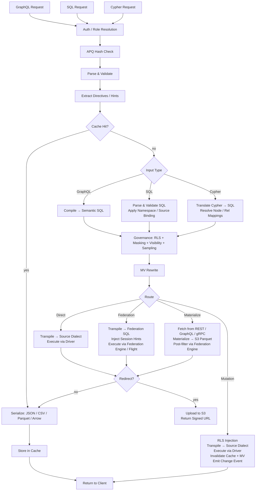

# Provisa 架构

## 概览

Provisa 是一个配置驱动的数据虚拟化平台，专为从小型团队到大型企业提供语义层而设计。它在异构数据源之上提供统一的 API，并具备治理、安全和性能优化能力。客户端可通过 SQL、GraphQL 或 Cypher 进行查询；三者都是一等接口，应用相同的治理机制。(REQ-002, REQ-038)

语义层的这一区分很重要。要向语义层添加内容，必须在数据虚拟化层内创建新的数据源或聚合。这形成了清晰的隔离——不能在平台之外对语义做任何新增，从而实现真正的数据治理。(REQ-136) 强制执行发生在编译器层：无论使用哪种查询语言，已批准的关系目录都是唯一的事实来源。(REQ-002)

Provisa 的设计目标是：在运营场景下高性能，在企业分析场景下高可扩展。单一平台可同时满足两者，不牺牲速度或可扩展性。

```text
Config YAML → PG Metadata → Federation Catalogs
                               ↓
         Federation engine metadata → Schema Generator → SDL / SQL catalog / Cypher labels / gRPC proto (per role)
                                     ↓
                     Query → Parser → SQL Compiler → Transpiler
                                     ↓
                             Router (Smart Dispatch)
                         /           |            \
                    Federation  Direct PG      Direct MySQL/etc.
                         \           |            /
                              Executor Pool
                                     ↓
                         ┌───── Inline ─────┐     ┌──── Redirect ────┐
                         │  JSON (HTTP)     │     │  CTAS → S3       │
                         │  Arrow (Flight)  │     │  (Parquet, ORC)  │
                         │  Protobuf (gRPC) │     │  Provisa → S3    │
                         └─────────────────-┘     │  (JSON, CSV, …)  │
                                                  └─────────────────-┘
```

## 查询接口

每种接口都是独立的传输方式。所有四种传输方式都应用相同的安全流水线（行级安全、脱敏、采样、角色检查）。(REQ-002, REQ-038) 客户端从不直接与联邦引擎对话。(REQ-266) "查询语言"（SQL / GraphQL / Cypher）与传输方式是正交的——多种语言可以经由同一种传输方式到达。

| 端口 | 传输方式 | 支持的查询语言 | 使用场景 |
| ------ | ----------- | -------------------------- | ---------- |
| 8001 | HTTP | GraphQL、SQL、Cypher | Web 客户端、BI 工具、curl、REST 消费者 |
| 8815 | Arrow Flight (gRPC) | SQL（经由 Arrow Flight SQL） | 数据工具（Pandas、DuckDB、Spark、ADBC） |
| 50051 | Protobuf gRPC | 按角色生成的 proto RPC | 具有类型化契约的服务间通信 |
| 可配置¹ | PostgreSQL wire protocol (pgwire) | SQL | psql、DBeaver、SQLAlchemy，任何兼容 PG 的客户端 |

¹ 设置 `PROVISA_PGWIRE_PORT`（例如 5433）。未设置或为 `0` 时禁用。

### HTTP（端口 8001）

同一端口下有多个端点，通过路径区分：

| 路径 | 语言 | 说明 |
| ------ | ---------- | ------- |
| `POST /data/graphql` | GraphQL | 读取与变更；通过 `extensions.persistedQuery` 接受 APQ 哈希 |
| `POST /data/sql` | SQL | 只读；无能力门控——由对象可见性 + 行级安全 + 脱敏治理 (REQ-001, REQ-267) |
| `POST /data/query` | Cypher | 只读；标准角色 |
| `GET /data/nl` | 自然语言 | 根据数据源类型翻译为 SQL/GraphQL/Cypher |
| `GET /data/subscribe/{table}` | GraphQL | SSE 订阅流 |
| `GET /neo4j/...` | Cypher（Neo4j 兼容） | Neo4j HTTP API 兼容垫片 |
| `POST /admin/graphql` | GraphQL | 管理 API（需要超级用户/管理员角色） |

所有路径默认返回 JSON。通过内容协商支持 `Accept: text/csv`、`application/vnd.apache.parquet`、`application/vnd.apache.arrow.stream` 以及 `application/octet-stream`（原始二进制）。超过配置阈值大小的结果会自动重定向到带签名的 S3 URL。(REQ-029, REQ-137)

### Arrow Flight（端口 8815）

基于 gRPC 的原生 Arrow 列式传输。(REQ-045, REQ-143) 客户端发送一个 JSON ticket：

```json
{"query": "SELECT name, email FROM customers", "role": "analyst"}
```

并接收惰性流式传输的 Arrow RecordBatches。当 Zaychik Flight SQL 代理可用时，数据以端到端的 Arrow record batch 流形式流动：(REQ-144)

```text
Client ←(Arrow batches)← Provisa Flight Server ←(Arrow batches)← Zaychik ←(JDBC)← Federation Engine
```

完整结果从不会在 Provisa 内存中被物化——批次到达即被转发。(REQ-145) 这使得 Arrow Flight 成为适合任意大结果集的无界路径。

### Protobuf gRPC（端口 50051）

从数据架构自动生成 `.proto`，按角色分别生成。(REQ-525) 流式查询（每行一条消息）、一元变更。已启用服务器反射。(REQ-526) 角色通过 `x-provisa-role` 元数据键传递。

### PostgreSQL wire protocol / pgwire（可配置端口）

使用 `buenavista` 库实现 PostgreSQL 前后端 wire protocol。(REQ-527) 任何兼容 PostgreSQL 的客户端——`psql`、DBeaver、使用 `psycopg2` 的 SQLAlchemy、JDBC——无需修改即可连接。仅接受 SQL。完整的治理流水线（行级安全、脱敏、域权限）对 pgwire 连接同样适用。(REQ-266, REQ-002) 通过将 `PROVISA_PGWIRE_PORT` 设置为非零端口来启用。

## 请求流水线

系统接受三种查询语言。它们在各自的解析/编译步骤之后都汇聚到治理环节。(REQ-262, REQ-263) 只有 GraphQL 支持写入。(REQ-037) 查询本身没有能力门控——任何已认证身份都可以用任意语言进行查询，数据仅由对象可见性、行级安全和脱敏来治理。(REQ-001)

| 接口 | 读取 | 写入 | 查询门控 |
| --- | --- | --- | --- |
| GraphQL (`/data/graphql`) | 是 | 是（变更） | 无——仅数据层治理 |
| SQL (`/data/sql`) | 是 | 否 | 无——仅数据层治理 (REQ-267) |
| Cypher (`/data/query`) | 是 | 否 | 无——仅数据层治理 |



**路由决策：**

| 路由 | 触发条件 |
| --- | --- |
| **Cache（缓存）** | 结果缓存命中——最先评估，直接返回已存结果，无需执行 (REQ-865) |
| **Cheap-count（低成本计数）** | 针对未物化数据源、形如 `count(*)` 的查询，且该数据源暴露了精确的原生计数——路由到原生计数调用，而非物化后计数 (REQ-875) |
| **Direct（直连）** | 单一数据源 + 具备原生驱动 + 具备联邦连接器 |
| **Federation（联邦）** | 多数据源联邦，或数据源有连接器但无驱动 |
| **Materialize（物化）** | 数据源没有联邦连接器——先抓取并缓存到 S3/PG |
| **Mutation（变更）** | GraphQL 变更——始终直连，从不走联邦 |

路由消费的是治理后优化阶段的输出，而不是优化前的已治理 SQL。治理可能会添加数据源（行级安全子查询谓词）；优化阶段可能会移除它们（热表 VALUES-CTE 内联、API 缓存重写、union 分支剪枝）。因此，若一个联邦查询在内联之后收敛为单一实时数据源，会被重新路由为直连。(REQ-863)

### 多根查询

具有多个根字段的 GraphQL 查询（例如 `{ orders { id } customers { name } }`）会被编译为独立的 SQL 查询并各自执行。(REQ-534) SQL 和 Cypher 请求按定义是单根的。结果会被合并为单一响应：

- 低于重定向阈值的字段会内联返回在 `data` 中
- 高于阈值的字段会被重定向，在 `redirects` 中给出对应的按字段条目
- 二进制格式（Parquet、Arrow）仅支持单根查询

## 联邦执行路径

| 路径 | 传输方式 | 经由 | 使用场景 |
| ------ | ----------- | ----- | ----------- |
| REST | 联邦引擎客户端 (HTTP :8080) | 直接查询 | 默认，始终可用 |
| Flight SQL | `adbc-driver-flightsql` (gRPC :8480) | Zaychik 代理 → JDBC | 当 Zaychik 正在运行时 |
| CTAS | 联邦引擎客户端 (HTTP :8080) | 直接写入，Iceberg 到 S3 | Parquet/ORC 重定向 |

### Zaychik Arrow Flight SQL 代理

联邦引擎并不原生支持 Arrow Flight SQL 协议。[Zaychik](https://github.com/Raiffeisen-DGTL/zaychik-trino-proxy) 是一个 Java 代理，它实现了 Arrow Flight SQL gRPC 接口，将请求翻译为 JDBC 查询，并将结果以 Arrow record batch 的形式流回。(REQ-144)

```text
ADBC client → gRPC :8480 → Zaychik → JDBC :8080 → Federation Engine → results → Arrow batches → client
```

Provisa Flight 服务器（端口 8815）以 ADBC 客户端身份连接到 Zaychik，实现端到端的流式 Arrow 传输，而无需物化结果。(REQ-145)

### Iceberg 结果目录

CTAS 重定向使用一个 Iceberg 连接器（`results` 目录），其后端是建立在现有 PostgreSQL 实例上的 JDBC 目录。(REQ-169) Iceberg 通过原生 S3 文件系统（`fs.native-s3.enabled=true`）将 Parquet/ORC 文件直接写入 MinIO/S3。

## 联邦引擎

Provisa 在启动时通过 `PROVISA_ENGINE` 环境变量、持久化的管理 UI 配置或默认值来选择联邦引擎。当未设置任何值时，DuckDB 为默认引擎——完全进程内运行，无需外部服务 (REQ-989)。选择细节参见[配置](configuration.md#federation-engine)。

每个引擎都是定义在 `provisa/federation/engine.py` 中的 `FederationEngine` 实例。该实例拥有一个连接器集合，决定引擎可以实时读取（ATTACH）哪些数据源类型，以及哪些必须先落地到引擎的物化存储中。[tool-verified: `engine.py` `_ENGINE_BUILDERS`, `ENGINE_REGISTRY`]

### 驱动类别 (REQ-840) [tool-verified: `engine.py` `DriverClass`]

| 类别 | 含义 | 示例 |
| ------- | --------- | --------- |
| `BROAD` | 通过原生连接器触达众多外部数据源类型 | Trino |
| `PARTIAL` | 触达一个子集（关系型、文件、云对象/湖）；其余全部落地 | DuckDB、PostgreSQL、ClickHouse、Databricks、Snowflake、BigQuery、Fabric、Synapse |
| `SELF_ONLY` | 只能触达自身存储；其他所有数据源都要落地 | SQLAlchemy |

### 可用引擎 [tool-verified: `engine.py` `_ENGINE_BUILDERS`]

| 引擎键 | 方言 | MPP | 外部链接机制 | 认证 |
| ----------- | --------- | ----- | ------------------------ | ------ |
| `trino` / `trino-byo` | Trino SQL | 是 | Trino 目录（广泛的连接器集合） | JDBC 凭据 |
| `pg` | PostgreSQL | 否 | FDW / pg_duckdb | PostgreSQL 凭据 |
| `duckdb` | DuckDB | 否 | 扩展原生 ATTACH | 无（进程内） |
| `clickhouse` / `clickhouse-server` | ClickHouse | 是（分片） | S3 / IcebergS3 / DeltaLake 表引擎 (REQ-986) | ClickHouse 凭据 |
| `snowflake` | Snowflake | 是 | 外部 stage + 外部表 (REQ-988) | `PROVISA_ENGINE_URL` |
| `databricks` | Databricks SQL | 是 | 经由 REST 的 Unity Catalog 外部表 (REQ-987) | Bearer token（`federation_hints` 中的 `http_path`） |
| `bigquery` | BigQuery | 是（Dremel） | BigQuery 外部表 / BigLake 表 | `GOOGLE_APPLICATION_CREDENTIALS` 服务账号密钥 |
| `fabric` | T-SQL | 是 | OneLake shortcut → OPENROWSET | Azure AD（`az login` / 托管身份） |
| `synapse` | T-SQL | 是 | ADLS OPENROWSET / 外部表 | Azure AD |
| `sqlalchemy` | 任意 SQLAlchemy 方言 | 否 | 无（仅落地） | 按方言的凭据 |

### 零配置默认引擎：DuckDB (REQ-989) [tool-verified: `engine.py` `build_duckdb_engine`, `_embedded_duckdb_materialize_default`]

当 `PROVISA_ENGINE` 未设置时，Provisa 使用完全内嵌的进程内 DuckDB 引擎。DuckDB 的物化存储是一个内嵌的 DuckDB 文件，路径为 `$PROVISA_DATA_DIR/materialize.duckdb`（默认 `~/.provisa/materialize.duckdb`）。不需要任何外部数据库或服务。

由于 DuckDB 对每个文件强制要求单一写入者，`store_connection.py` 通过引擎自身的连接写入内嵌存储——绝不使用第二条独立连接。这是引擎与物化存储按设计共享同一文件句柄的唯一情形。[tool-verified: `store_connection.py` module docstring]

### Arrow 原生读取传输 (REQ-986, REQ-987, REQ-988) [tool-verified: `engine.py` `build_*_engine` `capabilities=`]

ClickHouse、DuckDB、Snowflake、Databricks、BigQuery、Fabric 和 Synapse 都声明了 `EngineCapability.ARROW` 和 `EngineCapability.ARROW_STREAM`。针对这些引擎的查询会直接返回 Arrow RecordBatches——完全绕过行序列化路径。Flight 服务器将这些批次流式传输给客户端，而不会在 Provisa 进程内存中物化完整结果。对于 Trino，Arrow 流依赖 Zaychik 代理；对于各仓库引擎，则由其自身的 Arrow 原生 API（Databricks 的 Cloud Fetch、BigQuery 的 Storage Read API、DuckDB 和 Snowflake 的 `fetch_arrow_table`）为 Flight 流供数。

### 外部数据链接（ATTACH）[tool-verified: `engine.py` `_warehouse_connectors`]

每个仓库引擎都能就地扫描云对象/湖数据，而无需复制一份。S3、GCS 或 OneLake 上的 Parquet、CSV、Iceberg 和 Delta Lake 文件可直接挂载到引擎中，如同原生表一样。策略——ATTACH（就地扫描）还是 LAND（复制进存储）——由连接器所声明的 `Mechanism` 决定；规划器中不存在特定引擎的分支逻辑。`Mechanism.ATTACH_R` 连接器会触发零拷贝扫描；`Mechanism.DIRECT` 或缺省连接器会触发落地。[tool-verified: `connector_base.py` `Mechanism`, `engine.py` `_warehouse_connectors`]

Attach 会在挂载时自动预配所有前置条件：

| 引擎 | 对象/湖格式 | 机制 | 自动预配 [tool-verified] |
| -------- | ------------------- | ---------- | ---------------------------------- |
| Databricks | parquet、csv、iceberg、delta_lake | UC 外部表 (`ATTACH_R`) | REST 安装 Unity Catalog 存储凭据 + 外部位置，然后 `CREATE TABLE … USING <format> LOCATION …`——已通过 Cloudflare R2 实地验证 |
| BigQuery | parquet、csv、json、iceberg、delta_lake | BigQuery 外部表 / BigLake 表 (`ATTACH_R`) | `CREATE OR REPLACE EXTERNAL TABLE … OPTIONS(format=…, uris=[…])`——已实地验证 |
| ClickHouse | csv、parquet、iceberg、delta_lake | S3 / IcebergS3 / DeltaLake 表引擎 (`ATTACH_R`) | 在挂载时执行验证探测——已通过 Cloudflare R2 实地验证 |
| Fabric | parquet、csv、iceberg、delta_lake | OneLake shortcut → OPENROWSET (`ATTACH_R`) | REST 创建 `AmazonS3Compatible` 连接 + lakehouse + shortcut；返回 OneLake 的 `BULK` 路径——已实地验证，通过 Fabric 读取 R2 |
| Snowflake | parquet、csv、json、iceberg、delta_lake | 外部 stage + 外部表 (`ATTACH_R`) | `CREATE STAGE … URL=… CREDENTIALS=…`，然后 `CREATE OR REPLACE EXTERNAL TABLE … LOCATION=@stage FILE_FORMAT=(TYPE=…)`——已实现；未实地测试（无可用账号） |

云存储凭据通过数据源的 `federation_hints` 传递（参见[数据源](sources.md#warehouses-as-named-sources)）。任何无法 ATTACH 的数据源类型都会先落地到引擎的物化存储中。

### 列式物化写入 (REQ-990) [tool-verified: `core/database.py:436`, `store_connection.py:99`]

`provisa/core/database.py` 中的 `Connection.bulk_copy` 会为每种存储方言选择最快的批量写入路径：对 PostgreSQL 存储使用二进制 `COPY`（asyncpg 的 `copy_records_to_table`），对其他所有关系型存储使用单条 `executemany` 预编译语句。DuckDB 内嵌存储通过 `store_connection.py` 中的 `land_duckdb_native` 落地——对整个批次只调用一次 `executemany`，绝不逐行循环。

## 大结果集重定向

超过行数阈值的结果会被重定向到兼容 S3 的存储（MinIO），而不是内联返回。(REQ-029)

### 重定向模式

| 模式 | 工作方式 | 数据是否经过 Provisa？ |
| ------ | ------------- | ---------------------- |
| **CTAS**（Parquet、ORC） | 联邦引擎通过 `CREATE TABLE AS SELECT` 直接写入 S3 | 否 |
| **Provisa 上传**（JSON、NDJSON、CSV、Arrow IPC） | Provisa 序列化并通过 boto3 上传 | 是 |

对于 CTAS 原生格式，Provisa 从不接触数据——联邦引擎直接将文件写入 MinIO/S3。(REQ-138) 这是大型分析导出的首选路径。

### 重定向 Header

| Header | 效果 |
| -------- | -------- |
| `X-Provisa-Redirect-Format: <mime>` | 以该格式重定向（除非设置阈值，否则隐含强制） |
| `X-Provisa-Redirect-Threshold: N` | 仅当结果超过 N 行时才重定向 |
| `X-Provisa-Redirect: true` | 使用默认格式强制重定向 |

这些 Header 实现了客户端可控的重定向。(REQ-137)

**响应：**

```json
{
  "data": {"orders": null},
  "redirect": {
    "redirect_url": "https://minio:9000/provisa-results/results/abc.parquet?...",
    "row_count": 50000,
    "expires_in": 3600,
    "content_type": "application/vnd.apache.parquet"
  }
}
```

### 服务器配置

| 环境变量 | 默认值 | 用途 |
| --------- | --------- | --------- |
| `PROVISA_REDIRECT_ENABLED` | `false` | 启用服务端阈值重定向 |
| `PROVISA_REDIRECT_THRESHOLD` | `1000` | 默认行数阈值 |
| `PROVISA_REDIRECT_FORMAT` | `parquet` | 默认重定向格式 |
| `PROVISA_REDIRECT_BUCKET` | `provisa-results` | S3 存储桶名称 |
| `PROVISA_REDIRECT_ENDPOINT` | | 兼容 S3 的端点 URL |
| `PROVISA_REDIRECT_TTL` | `3600` | 预签名 URL 有效期（秒） |

## 路由决策树

```text
Multi-source query? → Federation engine
NoSQL source (MongoDB, Cassandra)? → Federation engine
Uses path columns on non-PG source? → Federation engine
Single RDBMS with driver? → Direct (sub-100ms target)
Single RDBMS without driver? → Federation engine
Steward hint "federated"? → Federation engine (override)
Steward hint "direct"? → Direct (if possible)
Redirect to Parquet/ORC? → Federation engine (CTAS, regardless of source count)
```

(REQ-027, REQ-028, REQ-030, REQ-279)

## 联邦查询优化

Provisa 会自动为联邦引擎的基于成本的优化器预热统计信息，使跨数据源查询计划基于真实数据分布，而不是硬编码的默认值。

### 自动统计信息 (`ANALYZE`)

在数据源注册时，Provisa 会为每张已发布的表运行 `ANALYZE catalog.schema.table`。(REQ-275) 这会收集：

- 行数
- 按列：空值比例、去重值计数、最小/最大值、直方图（视连接器而定）

优化器使用这些信息来估计过滤查询的选择率。若没有统计信息，则会回退到固定默认值（例如等值谓词的选择率假设为 10%），这会在倾斜或高基数数据上产生较差的连接计划。有了统计信息，估计就足够准确，可以为大多数工作负载做出正确的广播连接与分区连接决策。

**覆盖范围**：统计信息支持因连接器而异。PostgreSQL、MySQL、Hive、Iceberg 和 Delta Lake 完全支持 `ANALYZE`。MongoDB 和 Cassandra 连接器仅部分支持或不支持。Provisa 会静默吞掉 `ANALYZE` 失败——注册过程不会因此被阻塞。(REQ-275)

**选择率限制**：统计信息只提供按列估计。对于相关谓词（`WHERE region = 'US' AND city = 'Seattle'`），优化器假设列之间相互独立，这可能低估行数。这是所有基于成本的优化器在列级统计上的已知局限。

**API 数据源**：PostgreSQL 中的 `api_cache_{table_name}` 表会在每次缓存刷新周期后自动分析，因此在将 API 数据源与关系型数据源连接查询时，优化器能获得最新的行数估计。(REQ-280)

### 管理端：刷新统计信息

可通过管理 API 按需重新运行统计信息收集：(REQ-276)

```graphql
mutation {
  refreshSourceStatistics(sourceId: "sales-pg") {
    tablesAnalyzed
    failures { table message }
  }
}
```

当某个数据源自注册以来接收了大量新数据时，此功能很有用。

## 物化视图

物化视图（MV）通过预先计算并缓存结果，透明地优化开销较大的查询。

### 关系作为物化视图提示

一条关系声明不仅是治理层面的产物——它同时也是连接形态的结构性描述。这种形态正是物化视图优化器所需要的：表、列、连接类型。这意味着一条关系可以直接驱动物化。

对于**跨数据源关系**，这一切会在启动时自动发生：每条携带 `materialize: true`、且其两端落在多个数据源中的关系，都会生成一个 `JoinPattern` 物化视图（`auto-mv-<rel_id>`）。(REQ-158) 不需要单独的物化视图配置。当编译器在查询中识别出该连接时，重写器会透明地替换为预物化的结果。同数据源关系不会生成任何物化视图——那些 JOIN 通过直接执行本已足够快。(REQ-159) [tool-verified: `provisa/api/app_loaders.py`]

一条**以关联表为基础的关系**物化的是其遍历路径，而非一次直接连接：关联表（junction table）是第三条腿，因此该形态包含源跳、关联表跳，以及将行集固定到某一种边类型的判别式，关联表自身的列也会一并落在视图中、与目标表的列并列。(REQ-1586) 由于关联表算作一条腿，当某条边的关联表与它所连接的两张表分处不同数据源时，即便这两张表本身同源，该边依然算跨数据源。重写器把这两跳作为一条链来匹配——第二跳必须从第一跳引入的别名开始——因此，若某个查询在不经过关联表的情况下到达同样两张表，读取的是基础表；而针对某一判别值构建的视图，绝不会回答被过滤到另一判别值的遍历。

实际影响是：审批一条关系的数据管家，同时也在隐含地决定该连接是否适合作为物化候选。治理行为与优化提示是同一份声明。

### 模式

| 模式 | 配置 | 行为 |
| ------ | -------- | ---------- |
| **Join-pattern（连接形态）** | 物化视图配置中的 `join_pattern` | 将匹配的 JOIN 重写为从物化视图表读取 |
| **Custom SQL（自定义 SQL）** | 物化视图配置中的 `sql` | 任意 SELECT，可选择暴露在 SDL 中 |
| **Auto-materialized relationship（自动物化关系）** | 跨数据源关系（自动） | 自动生成 join-pattern 物化视图；无需配置 |
| **Junction-backed relationship（以关联表为基础的关系）** | 关联关系上的 `materialize: true` | 物化两跳遍历，包含判别式与边属性 |

### 自动物化

跨数据源 JOIN 是开销最大的查询（始终走联邦）。跨数据源关系会在启动时自动生成物化视图定义：(REQ-158)

```yaml
relationships:
  - id: orders-to-reviews
    source_table_id: orders        # sales-pg
    target_table_id: product_reviews  # reviews-mongo
    source_column: product_id
    target_column: product_id
    cardinality: one-to-many
    materialize: true              # auto-create MV
    refresh_interval: 600          # refresh every 10 minutes
```

只有跨数据源关系会生成物化视图（同数据源 JOIN 通过直接执行本已足够快）。(REQ-159) 物化视图以 `STALE` 状态启动，并在被查询优化器使用之前，由后台刷新循环负责刷新。(REQ-160)

### 刷新生命周期

```text
STALE → (refresh loop picks up) → REFRESHING → FRESH
  ↑                                                |
  └──── mutation hits source table ────────────────┘
```

刷新循环每 30 秒运行一次，检查 `get_due_for_refresh()`，并通过联邦引擎对物化视图的目标表执行 `CREATE TABLE AS SELECT`（首次运行）或 `DELETE + INSERT`（后续运行）。(REQ-160, REQ-234)

## 模块地图

| 模块 | 用途 |
| -------- | --------- |
| `api/` | FastAPI 应用、路由、中间件、生命周期管理 |
| `api/flight/` | Arrow Flight 服务器（gRPC，端口 8815） |
| `api/admin/` | Strawberry GraphQL 管理 API——配置、发现、视图 |
| `api/rest/` | 由已注册表自动生成的 REST 端点 |
| `api/jsonapi/` | 带分页与错误处理的自动生成 JSON:API 端点 |
| `api/data/subscribe.py` | SSE 订阅——LISTEN/NOTIFY、轮询、Debezium CDC |
| `compiler/` | GraphQL/SQL 解析器、语义 SQL 生成器、行级安全、脱敏、采样、两阶段治理（`stage2.py`） |
| `cypher/` | Cypher → SQL 翻译器、解析器、标签映射（REQ-351）、Cypher 变更的写入翻译器 |
| `pgwire/` | PostgreSQL wire-protocol 服务器；`catalog.py` 拦截 pg_catalog/information_schema，实现按角色的对象可见性 (REQ-527, REQ-883, REQ-891) |
| `vector/` | 向量搜索——模型注册表、嵌入提供方（openai/ollama/huggingface）、`cosine_similarity()` 转换、pgvector 回退缓存、声明式嵌入生成 (REQ-419–431) |
| `compiler/federation.py` | Apollo Federation v2 子图支持 |
| `transpiler/` | 方言转译、路由逻辑 |
| `executor/` | 联邦/直连执行、序列化、输出格式 |
| `executor/drivers/` | 直连数据源驱动（PostgreSQL、MySQL、DuckDB、Snowflake、Databricks、ClickHouse……） |
| `executor/trino_flight.py` | 面向联邦引擎的 ADBC Flight SQL 客户端 |
| `executor/ctas_write.py` | 基于 CTAS 的重定向（联邦引擎写入 S3） |
| `executor/redirect.py` | S3 重定向逻辑，Provisa 端上传 |
| `federation/engine.py` | `FederationEngine`、`DriverClass`、`_ENGINE_BUILDERS`、`ENGINE_REGISTRY`、`build_engine` |
| `federation/connector.py` | 连接器抽象——Trino、ClickHouse；`Mechanism`、`WarehouseNativeConnector` |
| `federation/connector_duckdb.py` | DuckDB 与 PostgreSQL FDW 连接器定义 |
| `federation/snowflake_connectors.py` | Snowflake 外部 stage + 外部表 ATTACH 连接器 (REQ-988) |
| `federation/databricks_connectors.py` | Databricks UC 外部表 ATTACH 连接器 (REQ-987) |
| `federation/bigquery_connectors.py` | BigQuery 外部表 / BigLake ATTACH 连接器 |
| `federation/databricks_uc.py` | Unity Catalog 凭据 + 外部位置自动预配 |
| `federation/databricks_backend.py` | Databricks SQL warehouse 执行后端 |
| `federation/snowflake_backend.py` | Snowflake 执行后端 |
| `federation/bigquery_backend.py` | BigQuery 执行后端（Storage Read API Arrow 传输） |
| `federation/mssql_warehouse_backend.py` | Fabric Warehouse + Synapse 执行后端（经由 ODBC 的 T-SQL） |
| `federation/mssql_warehouse_connectors.py` | Fabric / Synapse 的 OPENROWSET ATTACH 连接器 |
| `federation/fabric_shortcuts.py` | OneLake shortcut 自动预配（连接 → lakehouse → shortcut） |
| `federation/clickhouse_backend.py` | ClickHouse 执行后端 |
| `federation/duckdb_backend.py` | DuckDB 进程内执行后端 |
| `federation/pg_backend.py` | PostgreSQL 执行后端 |
| `federation/store_connection.py` | DuckDB 原生物化存储写入面 (REQ-989, REQ-990) |
| `registry/` | 持久化查询注册表、治理 |
| `security/` | 可见性、权限、列脱敏 |
| `cache/` | 基于 Redis 的查询结果缓存（热层） |
| `mv/` | 物化视图注册表、刷新、SQL 重写器 |
| `events/` | 数据集变更事件与触发调度 |
| `webhooks/` | 面向变更与事件的出站 webhook 执行 |
| `scheduler/` | 基于 APScheduler 的后台任务管理——触发 webhook、变更或 Kafka sink 发布的 cron 与间隔触发器 |
| `apq/` | Apollo APQ wire protocol——基于 Redis 的查询哈希缓存；与结果缓存相互独立 |
| `compiler/cursor.py` | Relay 风格的游标分页——所有列表查询上的 `first`/`after`/`last`/`before` 参数与 `pageInfo` 生成 |
| `compiler/aggregate_gen.py` | 自动生成 `{table}_aggregate` 查询类型，含 `count`、`sum`、`avg`、`min`、`max` 子字段与经过滤的 `nodes` 访问 |
| `compiler/enum_detect.py` | 枚举类型自动检测——PostgreSQL 原生枚举类型 (`pg_enum`) 暴露为 GraphQL 枚举类型，而非字符串标量 |
| `compiler/hints.py` | 联邦性能提示——以 SQL 注释形式嵌入的查询级路由指令（`/* @provisa route=federated */`），可覆盖自动路由 |
| `compiler/mutation_gen.py` | 变更编译器；列预设——在插入/更新时应用的服务端静态值或会话变量值，不会暴露在变更输入类型中 |
| `auth/approval_hook.py` | ABAC 审批钩子——在查询执行前调用的可插拔外部授权；支持 webhook、gRPC 与 unix_socket 传输；按表/数据源/全局作用域；可配置的回退策略 |
| `subscriptions/` | SSE 订阅状态与投递 |
| `discovery/` | LLM 关系发现（Claude API） |
| `grpc/` | Proto 生成、gRPC 服务器、反射 |
| `api_source/` | 带 PG 缓存的 REST/GraphQL/gRPC API 数据源 |
| `kafka/` | Kafka 主题数据源、sink、Schema Registry |
| `auth/` | 可插拔的认证提供方、中间件、角色映射 |
| `core/` | 配置、模型、数据库、仓储、密钥；角色模型支持 `parent_role_id` 与 `flatten_roles()` 以实现递归角色继承 |
| `hasura_v2/` | Hasura v2 元数据 → Provisa 配置转换器 |
| `ddn/` | Hasura DDN supergraph → Provisa 配置转换器 |
| `mongodb/` | MongoDB 数据源连接器 |
| `elasticsearch/` | Elasticsearch 数据源连接器 |
| `cassandra/` | Cassandra 数据源连接器 |
| `prometheus/` | Prometheus 指标数据源连接器 |
| `source_adapters/` | 数据源连接的通用适配层 |

## 管理 API

管理端 Strawberry GraphQL API 挂载在 `/admin/graphql`（HTTP 端口 8001）。它与数据 GraphQL 端点相互独立，需要超级用户或管理员角色。

| 能力 | 说明 |
| ----------- | ------------- |
| 配置下载/上传 | 导出或替换完整的 Provisa YAML 配置 |
| 关系编辑器 | 创建、更新、删除关系定义 |
| AI 外键发现 | 触发由 Claude 驱动的外键候选分析 |
| 架构内省 | 浏览已发布的表、列与角色 |
| 视图管理 | 注册并管理物化视图定义 |

(REQ-164, REQ-165, REQ-166, REQ-167)

## AI 模型配置

`GET /admin/ai-models` 与 `PUT /admin/ai-models` 用于配置每个组织的 LLM 流水线。(REQ-464, REQ-419, REQ-500, REQ-370, REQ-1349)

设置是**按组织作用域**的：每个组织的选择会叠加在部署配置之上，并在下一次请求时立即生效——无需重启。(REQ-1349) [tool-verified: `provisa/api/admin/ai_models_router.py:38-39`]

**按操作的模型分配。** 五种自然语言操作各自拥有可配置的厂商与模型字符串：

| 操作 | 驱动的内容 |
| --------- | -------------- |
| `table_description` | LLM 生成的表描述 |
| `column_description` | LLM 生成的列描述 |
| `relationship_inference` | 外键候选发现 |
| `sql_generation` | 自然语言 → SQL 生成 |
| `table_selection` | 选择哪些表纳入自然语言提示词 |

厂商字段接受任意兼容 `aisuite` 的厂商（`anthropic`、`openai`、`groq`、`mistral`、`cohere` 等）或本地端点（`ollama`、`lmstudio`）。空的模型字符串会移除组织的覆盖设置，恢复为部署默认值。[tool-verified: `provisa/api/admin/ai_models_router.py:29-35`, `provisa-ui/src/components/admin/AiModelsTab.tsx:43-60`]

**自然语言速率限制。** 一个可选的、按角色应用的请求周期上限。超出的请求会返回带 `Retry-After` 的 `429`。[tool-verified: `provisa-ui/src/components/admin/AiModelsTab.tsx:306-313`]

**向量模型注册表。** 一个嵌入模型列表（字段：`id`、`provider`、`dimensions`，可选的 `api_key_env` 与 `base_url`，以及 `enabled` 标志）。整表替换写入：每一项都必须含有 `id`、`provider` 和 `dimensions`，否则写入会被拒绝并返回 `400`。[tool-verified: `provisa/api/admin/ai_models_router.py:122-131`]

**API 密钥。** 各厂商的 LLM API 密钥通过 `provisa.core.org_secrets` 加密存储（见下文）。`GET` 响应只报告某厂商是否已设置密钥——密钥值本身从不返回。为某厂商传入空字符串会清除该密钥，使该厂商的 LLM 调用回退到部署的环境变量凭据。(REQ-1395, REQ-1398) [tool-verified: `provisa/api/admin/ai_models_router.py:76-78`, `provisa/api/admin/ai_models_router.py:149-165`]

## 按组织的加密密钥

`provisa/core/org_secrets.py` 存储绝不能以明文形式出现在数据库中的凭据。目前仅限于 LLM 厂商 API 密钥（`{vendor}_api_key`）。(REQ-1395, REQ-1398) [tool-verified: `provisa/core/org_secrets.py`]

数值通过来自 `provisa.encryption.runtime` 的进程级 `encryption_service` 加密——与 `api_sources.auth` 使用相同的机制。[tool-verified: `provisa/core/org_secrets.py:16-17`]

支持十二个兼容 `aisuite` 的厂商：`anthropic`、`openai`、`cohere`、`groq`、`mistral`、`xai`、`deepseek`、`together`、`fireworks`、`nebius`、`sambanova` 和 `inception`。Google、AWS 和 Azure 被排除在外，因为它们需要超出单纯 API 密钥的配置（项目 ID、IAM 角色、区域）。本地端点厂商（`ollama`、`lmstudio`）没有密钥，出于同样的原因被排除。[tool-verified: `provisa/core/org_secrets.py:33-53`]

向 `write_org_secret` 传入 `value=None` 会删除该行。读取密钥的调用方需立即消费它（例如用于构造 LLM 客户端），且不得在任何 API 响应中回显它。[tool-verified: `provisa/core/org_secrets.py:97-117`]

## 自动生成的 REST 与 JSON:API 端点

已注册的表会与 GraphQL 接口并列，暴露为 REST 与 JSON:API 端点。(REQ-256, REQ-257)

| 接口 | 挂载路径 | 规范 |
| ----------- | ----------- | ------ |
| REST | `/rest/<table-id>` | 带查询参数的简单 GET/POST |
| JSON:API | `/jsonapi/<table-id>` | 符合 [jsonapi.org](https://jsonapi.org) 规范——分页、关系、错误对象 |

这些端点应用与 GraphQL 端点相同的安全流水线（行级安全、脱敏、角色检查）。(REQ-002, REQ-038)

## 订阅

SSE 订阅由 `GET /data/subscribe/{table}` 提供服务。三种投递模式：(REQ-258)

| 模式 | 机制 | 使用场景 |
| ------ | ----------- | ----------- |
| **LISTEN/NOTIFY** | 在某个通道上使用 PostgreSQL 的 `LISTEN` | 有变更活动的 PG 数据源 |
| **Polling（轮询）** | 按间隔重新执行查询 | 非 PG 数据源，或 CDC 不可用时 |
| **Debezium CDC** | 来自 Debezium 连接器的 Kafka 主题 | 高频变更流 |

(REQ-258, REQ-260, REQ-261)

客户端接收 `text/event-stream`，每个变更行或差异对应一个 JSON 事件。

## 事件与 Webhook 系统

数据库变更（INSERT/UPDATE/DELETE）可以通过 `events/` 与 `webhooks/` 模块触发出站事件。(REQ-172, REQ-173, REQ-220)

```text
Mutation executed → EventDispatcher → match event trigger rules
                                          ↓
                               WebhookExecutor → HTTP POST to configured URL
```

事件触发器在配置中定义，并按表、操作类型和可选的行过滤条件进行匹配。Webhook 载荷包含操作类型、变更行以及角色上下文。

## 后台服务

应用生命周期内（`api/app.py`）启动四个后台循环：

| 服务 | 间隔 | 用途 |
| --------- | ---------- | --------- |
| 物化视图刷新循环 | 30 秒 | 轮询 `get_due_for_refresh()`，对过期的物化视图执行 CTAS 或 DELETE+INSERT |
| 热表管理器 | 可配置 | 将被频繁查询的表提升到 Iceberg 本地 SSD 缓存 |
| 热表加载器 | 可配置 | 将小型参考表加载进内存缓存，实现亚毫秒级访问 |
| API 数据源轮询器 | 按数据源的间隔 | 重新抓取并重新缓存远程 REST/GraphQL/gRPC 数据源 |

(REQ-160, REQ-238, REQ-239, REQ-236)

### 热/温表缓存分层

| 层级 | 存储 | 提升标准 | 访问延迟 |
| ------ | --------- | ------------------- | ---------------- |
| 热 | 进程内内存 | 行数低于阈值，或是某条关系的目标 | <1 毫秒 |
| 温 | 本地 SSD 上的 Iceberg | 超过查询频率阈值 | 约 5–20 毫秒 |
| 冷 | 远程数据源 | 默认 | 50–500 毫秒 |

(REQ-230, REQ-236, REQ-238, REQ-241)

## 元数据导入（Hasura v2 / DDN）

现有的 Hasura 部署可以转换为 Provisa 配置，无需手动重写。(REQ-182, REQ-183)

| 模块 | 输入 | 输出 |
| -------- | ------- | -------- |
| `hasura_v2/` | Hasura v2 `metadata.yaml` | Provisa `config.yaml` |
| `ddn/` | Hasura DDN supergraph JSON | Provisa `config.yaml` |

两种转换器都会映射被跟踪的表、关系、权限和远程架构。转换结果是一份完整的、可直接部署的 Provisa 配置。(REQ-182, REQ-183)

## Apollo Federation

`compiler/federation.py` 将 Provisa 作为 Apollo Federation v2 子图暴露出来。(REQ-259) 子图 SDL 由已发布架构自动生成，在主键列上带有 `@key` 指令，在跨子图关系上带有 `@external`/`@provides` 注解。Provisa 会响应联邦网关所要求的 `_entities` 与 `_service` 查询。(REQ-259)

## 基于游标的分页

所有列表查询都通过 `compiler/cursor.py` 支持 Relay 风格的游标分页。(REQ-218) 客户端传入 `first`/`after`（向前）或 `last`/`before`（向后）参数。编译器将行位置编码为不透明的 base64 游标，并注入相应的 `WHERE`/`LIMIT` 子句。每个列表查询都会返回一个 `pageInfo` 对象：

| 字段 | 类型 | 说明 |
| ------- | ------ | ------------- |
| `hasNextPage` | Boolean | 若此页之后还有更多结果，则为 true |
| `hasPreviousPage` | Boolean | 若此页之前还存在结果，则为 true |
| `startCursor` | String | 此页中第一个节点的游标 |
| `endCursor` | String | 此页中最后一个节点的游标 |

## 聚合查询

每张已注册的表都会获得一个自动生成的 `{table}_aggregate` 根字段（`compiler/aggregate_gen.py`）。(REQ-196) 该聚合类型对每个数值列都暴露 `count`、`sum`、`avg`、`min`、`max`，并提供 `nodes` 用于带完整字段选择的过滤行访问（与基础查询相同的行级安全/脱敏）。(REQ-196, REQ-198) 聚合查询有资格使用 Aggregate MV 路由——参见 `mv/aggregate_catalog.py`。(REQ-198)

## 自动持久化查询（APQ）

`apq/cache.py` 实现了 Apollo APQ wire protocol。(REQ-288) 当客户端只发送查询哈希（`extensions.persistedQuery`）时，Provisa 会在 Redis 中查找它。(REQ-289) 未命中时会返回 `PersistedQueryNotFound` 错误；客户端随后携带完整查询体重试，Provisa 会将其存储。(REQ-288) 这与结果缓存（`cache/`）相互独立。

## 继承角色

一个角色通过 `parent_role_id` 至多命名一个父角色。(REQ-215) 在运行时构建阶段，`security/inheritance.py` 会从子角色出发沿链向上遍历，并将其折叠进构建过程自身对已加载数据的副本中，因此后续所有查找都始终以执行角色 id 为键。(REQ-1677) 能力与域访问权限是整条链的并集。一列的 `visible_to`、`writable_by` 与 `unmasked_to`，以及一个指标、函数或 webhook 的 `visible_to`，只要其中命名了该角色本身或其祖先角色，就对该角色生效。行级安全按表解析，子角色优先：链中最近一个对该表有规则的角色——其自身的表规则优先于其域规则——提供唯一生效的那条谓词；祖先角色的规则绝不会与之合并。若某角色未设置速率限制，则继承其父角色的速率限制。父角色必须存在，不能是角色自身，也不能构成环；被其他角色继承的角色，在被重新指定父角色之前不能删除。(REQ-1677)

## ABAC 审批钩子

`auth/approval_hook.py` 是一个可插拔的授权钩子，在行级安全与脱敏之后、查询执行之前被调用。(REQ-203) 它与外部策略引擎（OPA、自定义 ABAC 服务）集成。

| 设置 | 说明 |
| --------- | ------------- |
| 传输方式 | `webhook`（HTTP POST）、`grpc` 或 `unix_socket` |
| 作用域 | 按表、按数据源，或全局 |
| 回退策略 | 当钩子端点不可达时，`allow` 或 `deny` |

(REQ-246, REQ-247, REQ-204)

## 枚举类型自动检测

`compiler/enum_detect.py` 在架构生成阶段内省 PostgreSQL 原生枚举类型（`pg_enum`）。(REQ-221) 使用 PostgreSQL 用户定义枚举类型的列会被提升为 GraphQL 枚举类型——其取值成为枚举成员，而非字符串标量。

## 定时触发器

`scheduler/jobs.py` 使用 APScheduler 运行定义为 cron 或间隔触发器的后台任务。(REQ-216) 每个任务可以向 webhook URL 发起 POST、针对数据端点执行一次变更，或将查询结果发布到某个 Kafka 主题。触发器通过管理 API（`scheduledTrigger` 变更）或 YAML 配置中的 `scheduled_triggers` 键进行配置。(REQ-216)

## 联邦性能提示

`compiler/hints.py` 使用 Provisa 的注释语法解析嵌入在查询中的数据管家提示。(REQ-279) 提示格式因查询语言而异：

```graphql
# @provisa route=federated
{ orders { id amount } }
```

```sql
/* @provisa route=federated */
SELECT id, amount FROM orders
```

```cypher
// @provisa route=federated
MATCH (o:Order) RETURN o.id, o.amount
```

| 提示 | 效果 |
| ------ | -------- |
| `route=federated` | 强制经由联邦引擎走联邦路径，绕过直连驱动路由 |
| `route=direct` | 强制走直连驱动执行 |

(REQ-279, REQ-277, REQ-278)

## 变更中的列预设

`compiler/mutation_gen.py` 支持在 `INSERT` 或 `UPDATE` 时应用的按列服务端预设。(REQ-214) 预设不会包含在生成的 GraphQL 变更输入类型中——它们由编译器透明地注入。预设类型：`static`（字面值）或 `session`（取自请求会话/header 的值，例如 `x-hasura-user-id`）。(REQ-214)

## GraphQL Voyager 架构浏览器

管理 UI（`provisa-ui/src/pages/SchemaExplorer.tsx`）内嵌了 GraphQL Voyager，作为交互式的架构可视化工具。(REQ-248) 它将按角色限定范围的架构渲染为可导航的实体关系图——表作为节点，关系作为边。所展示的架构始终以当前选中的角色为过滤条件。

## 安全强制执行顺序

查询本身没有能力门控——治理完全通过数据层控制来表达。(REQ-001) 一条原始 SQL 请求，在治理运行之前，会先拒绝（HTTP 403）任何超出该角色对象范围的表。(REQ-267)

1. **对象可见性**：按角色的架构会隐藏未授权的表/列；原始 SQL 中超出范围的表会被拒绝 (REQ-039, REQ-267)
2. **关系强制执行**：遍历必须存在于已批准的关系目录中，除非该角色持有 `ignore_relationships`——在预置的系统角色中，只有 `modeler` 拥有此权限 (REQ-001, REQ-1297)。在高安全模式下，该能力会被忽略，没有任何遍历能逃脱目录约束 (REQ-693)
3. **行级安全**：按表按角色注入 WHERE 子句 (REQ-040, REQ-041, REQ-263)
4. **列脱敏**：按列按角色的数据转换 (REQ-263)
5. **行数上限（LIMIT）**：对不持有 `full_results` 的角色施加的行数上限；随机统计采样是一项独立的用户查询功能 (REQ-263, REQ-478)

所有四种查询接口（HTTP、Flight、gRPC、pgwire）都强制执行相同的第二阶段治理流水线；任何客户端路径都无法在不绕过服务器的情况下绕过它。(REQ-002, REQ-038, REQ-266)

## 可扩展性限制

Provisa 是一个轻量的编译与路由层——它为查询延迟增加的是个位数毫秒级开销。然而，凡是由 Provisa 序列化结果数据的路径，都受限于进程内存。有两条路径是真正无界的：

| 路径 | 是否受内存限制？ | 适用场景 |
| ------ | -------------- | ------------- |
| JSON 内联（HTTP） | 是 | 中小型结果 |
| **Arrow Flight 流式传输（gRPC :8815）** | **否** | **无界——经由 Zaychik 或仓库 Arrow API 流式传输** |
| Protobuf gRPC 内联（:50051） | 是 | 中等规模结果，服务间通信 |
| 重定向：Provisa 上传（JSON、CSV、NDJSON、Arrow IPC） | 是 | 中等规模结果，文件下载 |
| **重定向：CTAS（Parquet、ORC）** | **否** | **无界——联邦引擎直接写入 S3** |

(REQ-145, REQ-138)

### 阈值探测

对于基于阈值的重定向，Provisa 会向查询中注入 `LIMIT threshold + 1` 作为探测。(REQ-140) 若结果行数少于该值，则直接内联返回（完整结果，无额外浪费的工作）。若结果达到上限，探测结果会被丢弃，完整查询会通过 CTAS 或 Provisa 上传重新执行。这避免了 `SELECT COUNT(*)`（部分数据源对其优化不佳），并且适用于任何数据源。

对于大型分析工作负载，可使用以下任一方式：

- **Arrow Flight**（端口 8815）用于向数据工具流式传输——批次流经 Provisa 时不会被物化 (REQ-145)
- **Parquet/ORC 重定向** 用于基于文件的导出——联邦引擎直接写入 S3，Provisa 返回预签名 URL (REQ-138, REQ-044)

## 基础设施

| 服务 | 镜像 | 端口 | 用途 |
| --------- | ------- | ------ | --------- |
| Provisa API | (host process) | 8001 | HTTP/REST 端点 |
| Provisa Flight | (host process) | 8815 | Arrow Flight gRPC 服务器 |
| Provisa gRPC | (host process) | 50051 | Protobuf gRPC 服务器 |
| Federation Engine | `trinodb/trino`（默认）或外部仓库 | 8080 / 视情况而定 | 查询联邦引擎——内嵌技术栈用 Trino；仓库目标用 Snowflake/Databricks/BigQuery/Fabric/Synapse/DuckDB |
| Zaychik | `provisa-zaychik`（从源码构建） | 8480 | 面向 Trino 的 Arrow Flight SQL 代理；仓库引擎不需要 |
| PostgreSQL | `postgres:16` | 5432 | 配置元数据 + Iceberg 目录 |
| MongoDB | `mongo:7` | 27017 | 演示用 NoSQL 数据源 |
| MinIO | `minio/minio` | 9000/9001 | 兼容 S3 的对象存储 |
| Redis | `redis:7-alpine` | 6379 | 查询结果缓存 |
| PgBouncer | `edoburu/pgbouncer` | 6432 | PG 连接池 |
| Kafka | `confluentinc/cp-kafka:7.6.0` | 9092 | 流式数据源 |
| Schema Registry | `confluentinc/cp-schema-registry:7.6.0` | 8081 | Avro/Protobuf 架构管理 |

(REQ-055, REQ-169)
