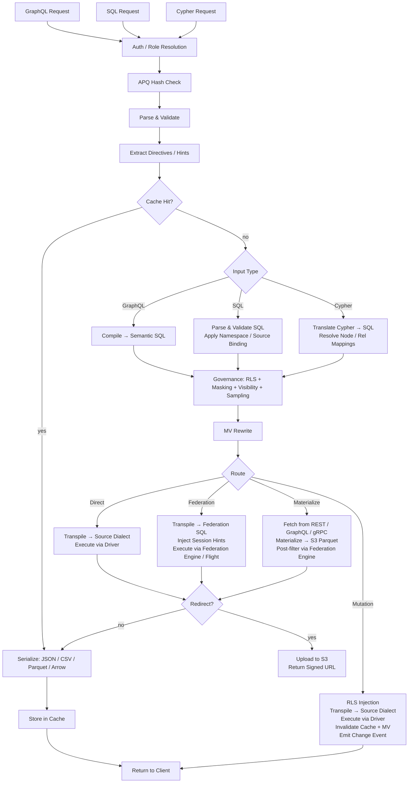

# Provisa 架构

## 概述

Provisa 是一个由配置驱动的数据虚拟化平台，专为驱动语义层而设计——从小型团队到企业级规模均可使用。它为异构数据源提供统一 API，并内置治理、安全性与性能优化。客户端可通过 SQL、GraphQL 或 Cypher 查询；三者都是一级接口，应用相同的治理。(REQ-002, REQ-038)

语义层的区分很重要。要扩展语义层，必须在数据虚拟化层内创建新的数据源或聚合。这样便形成了清晰的分隔——平台之外不能对语义做出新的添加，从而实现真正的数据治理。(REQ-136) 执行发生在编译器层面：已批准的关系目录是事实的来源，与使用哪种查询语言无关。(REQ-002)

Provisa 的设计目标是：在满足运营需求时具备高性能，在满足企业级分析需求时具备高可扩展性。单一平台同时服务这两类需求，不牺牲速度或可扩展性。

```text
Config YAML → PG Metadata → Federation Catalogs
                               ↓
         Federation engine metadata → Schema Generator → SDL / SQL catalog / Cypher labels / gRPC proto (per role)
                                     ↓
                     Query → Parser → SQL Compiler → Transpiler
                                     ↓
                             Router (Smart Dispatch)
                         /           |            \
                    Federation  Direct PG      Direct MySQL/etc.
                         \           |            /
                              Executor Pool
                                     ↓
                         ┌───── Inline ─────┐     ┌──── Redirect ────┐
                         │  JSON (HTTP)     │     │  CTAS → S3       │
                         │  Arrow (Flight)  │     │  (Parquet, ORC)  │
                         │  Protobuf (gRPC) │     │  Provisa → S3    │
                         └─────────────────-┘     │  (JSON, CSV, …)  │
                                                  └─────────────────-┘
```

## 查询接口

每个接口都是独立的传输方式。四者都应用相同的安全管道（行级安全、数据脱敏、抽样、角色检查）。(REQ-002, REQ-038) 客户端从不直接与联邦引擎通信。(REQ-266)「查询语言」（SQL / GraphQL / Cypher）与传输方式相互独立——多种语言可以通过同一种传输方式到达。

| Port | Transport | Accepted query languages | Use case |
| ------ | ----------- | -------------------------- | ---------- |
| 8001 | HTTP | GraphQL, SQL, Cypher | Web clients, BI tools, curl, REST consumers |
| 8815 | Arrow Flight (gRPC) | SQL (via Arrow Flight SQL) | Data tools (Pandas, DuckDB, Spark, ADBC) |
| 50051 | Protobuf gRPC | Per-role generated proto RPCs | Service-to-service with typed contracts |
| configurable¹ | PostgreSQL wire protocol (pgwire) | SQL | psql, DBeaver, SQLAlchemy, any PG-compatible client |

¹ 设置 `PROVISA_PGWIRE_PORT`（例如 5433）。若未设置或设为 `0`，则禁用。

### HTTP（Port 8001）

同一端口下有多个端点，以路径区分：

| Path | Language | Notes |
| ------ | ---------- | ------- |
| `POST /data/graphql` | GraphQL | Reads and mutations; APQ hash accepted via `extensions.persistedQuery` |
| `POST /data/sql` | SQL | Read-only; no capability gate — governed by object visibility + RLS + masking (REQ-001, REQ-267) |
| `POST /data/query` | Cypher | Read-only; standard role |
| `GET /data/nl` | Natural language | Translates to SQL/GraphQL/Cypher based on source type |
| `GET /data/subscribe/{table}` | GraphQL | SSE subscription stream |
| `GET /neo4j/...` | Cypher (Neo4j compat) | Neo4j HTTP API compatibility shim |
| `POST /admin/graphql` | GraphQL | Admin API (superuser/admin role required) |

所有路径默认返回 JSON。通过内容协商，支持 `Accept: text/csv`、`application/vnd.apache.parquet`、`application/vnd.apache.arrow.stream` 及 `application/octet-stream`（原始二进制数据）。超过所配置大小阈值的结果，会自动重定向到已签名的 S3 URL。(REQ-029, REQ-137)

### Arrow Flight（Port 8815）

通过 gRPC 提供原生列式 Arrow 传输。(REQ-045, REQ-143) 客户端发送 JSON ticket：

```json
{"query": "SELECT name, email FROM customers", "role": "analyst"}
```

并以惰性流式方式接收 Arrow RecordBatch。当 Zaychik Arrow Flight SQL 代理可用时，数据会以端到端连续的 Arrow record batch 流方式流动：(REQ-144)

```text
Client ←(Arrow batches)← Provisa Flight Server ←(Arrow batches)← Zaychik ←(JDBC)← Federation Engine
```

完整结果从不会在 Provisa 内存中被物化——批次一到达就会被转发。(REQ-145) 这使 Arrow Flight 成为一条无边界的路径，适用于任意大小的结果。

### Protobuf gRPC（Port 50051）

根据数据架构按角色自动生成 `.proto` 文件。(REQ-525) 流式查询（每行一条消息）、一元（unary）变更。已启用服务器反射（server reflection）。(REQ-526) 角色通过元数据键 `x-provisa-role` 传递。

### PostgreSQL 线路协议 / pgwire（可配置端口）

使用 `buenavista` 库实现 PostgreSQL 前端/后端线路协议。(REQ-527) 任何兼容 PostgreSQL 的客户端——`psql`、DBeaver、使用 `psycopg2` 的 SQLAlchemy、JDBC——都可以在不做任何修改的情况下连接。仅接受 SQL。完整的治理管道（行级安全、数据脱敏、域权限）以相同方式应用于 pgwire 连接。(REQ-266, REQ-002) 将 `PROVISA_PGWIRE_PORT` 设置为非零端口即可启用。

## 请求管道

系统接受三种查询语言。所有语言在各自的解析/编译步骤之后都汇聚到治理阶段。(REQ-262, REQ-263) 只有 GraphQL 支持写入。(REQ-037) 查询本身没有能力门（capability gate）——任何已认证身份都可以用任何语言查询，数据完全由对象可见性、行级安全和数据脱敏来治理。(REQ-001)

| Interface | Reads | Writes | Query gate |
| --- | --- | --- | --- |
| GraphQL (`/data/graphql`) | Yes | Yes (mutations) | None — data-layer governance only |
| SQL (`/data/sql`) | Yes | No | None — data-layer governance only (REQ-267) |
| Cypher (`/data/query`) | Yes | No | None — data-layer governance only |



**路由决策：**

| Route | When |
| --- | --- |
| **Cache** | Result cache hit — evaluated first, serves the stored result with no execution (REQ-865) |
| **Cheap-count** | `count(*)`-shaped query over an unmaterialized source that exposes an exact native count — routed to the native count call instead of materializing to count (REQ-875) |
| **Direct** | Single source + has native driver + has federation connector |
| **Federation** | Multi-source federation, or source has connector but no driver |
| **Materialize** | Source has no federation connector — fetch and cache to S3/PG first |
| **Mutation** | GraphQL mutation — always direct, never federated |

路由使用的是治理之后优化阶段的输出，而不是优化之前经过治理的 SQL。治理可以增加数据源（行级安全子查询谓词）；优化阶段则可以移除数据源（为热表内联 VALUES CTE、API 缓存重写、联合分支剪枝）。因此，一个在内联之后仅剩单一活跃数据源的联邦查询，会被重新路由为直连查询。(REQ-863)

### 多根查询

具有多个根字段的 GraphQL 查询（例如 `{ orders { id } customers { name } }`）会被编译为独立的 SQL 查询，并分别执行。(REQ-534) SQL 和 Cypher 请求按定义都是单根查询。结果会合并到单个响应中：

- 低于重定向阈值的字段会内联返回在 `data` 中
- 高于阈值的字段会被重定向，并在 `redirects` 中按字段列出条目
- 二进制格式（Parquet、Arrow）仅支持单根查询

## 联邦执行路径

| Path | Transport | Via | When used |
| ------ | ----------- | ----- | ----------- |
| REST | federation engine client (HTTP :8080) | Direct query | Default, always available |
| Flight SQL | `adbc-driver-flightsql` (gRPC :8480) | Zaychik proxy → JDBC | When Zaychik is running |
| CTAS | federation engine client (HTTP :8080) | Direct write, Iceberg to S3 | Parquet/ORC redirect |

### Zaychik Arrow Flight SQL 代理

联邦引擎并非原生支持 Arrow Flight SQL 协议。[Zaychik](https://github.com/Raiffeisen-DGTL/zaychik-trino-proxy) 是一个 Java 代理，实现了 Arrow Flight SQL 的 gRPC 接口，将请求转换为 JDBC 查询，并以 Arrow record batch 流式方式返回结果。(REQ-144)

```text
ADBC client → gRPC :8480 → Zaychik → JDBC :8080 → Federation Engine → results → Arrow batches → client
```

Provisa Flight Server（端口 8815）以 ADBC 客户端身份连接到 Zaychik，实现端到端的 Arrow 流式传输，而无需物化结果。(REQ-145)

### Iceberg 结果目录

CTAS 重定向使用一个基于现有 PostgreSQL 实例上 JDBC 目录的 Iceberg 连接器（目录 `results`）。(REQ-169) Iceberg 通过原生 S3 文件系统（`fs.native-s3.enabled=true`）直接将 Parquet/ORC 文件写入 MinIO/S3。

## 联邦引擎

Provisa 在启动时通过环境变量 `PROVISA_ENGINE`、已持久化的 Admin UI 配置，或默认值来选择联邦引擎。若未设置任何值，默认使用 DuckDB——完全在进程内运行，无需外部服务（REQ-989）。选择详情参见 [Configuration](configuration.md#_29)。

每个引擎都是一个 `FederationEngine` 实例，定义于 `provisa/federation/engine.py`。该实例持有一组连接器集合，用于决定引擎可以实时读取（ATTACH）哪些源类型，以及哪些必须先落地到引擎的物化存储中。[tool-verified: `engine.py` `_ENGINE_BUILDERS`, `ENGINE_REGISTRY`]

### 驱动程序类别（REQ-840）[tool-verified: `engine.py` `DriverClass`]

| Class | Meaning | Examples |
| ------- | --------- | --------- |
| `BROAD` | Reaches many external source types via native connectors | Trino |
| `PARTIAL` | Reaches a subset (relational, files, cloud object/lake) plus lands everything else | DuckDB, PostgreSQL, ClickHouse, Databricks, Snowflake, BigQuery, Fabric, Synapse |
| `SELF_ONLY` | Reaches only its own store; every other source lands in | SQLAlchemy |

### 可用引擎 [tool-verified: `engine.py` `_ENGINE_BUILDERS`]

| Engine key | Dialect | MPP | External-link mechanism | Auth |
| ----------- | --------- | ----- | ------------------------ | ------ |
| `trino` / `trino-byo` | Trino SQL | Yes | Trino catalogs (broad connector set) | JDBC credentials |
| `pg` | PostgreSQL | No | FDW / pg_duckdb | PostgreSQL credentials |
| `duckdb` | DuckDB | No | Extension-native ATTACH | None (in-process) |
| `clickhouse` / `clickhouse-server` | ClickHouse | Yes (shards) | S3 / IcebergS3 / DeltaLake table engines (REQ-986) | ClickHouse credentials |
| `snowflake` | Snowflake | Yes | External stage + external table (REQ-988) | `PROVISA_ENGINE_URL` |
| `databricks` | Databricks SQL | Yes | Unity Catalog external tables via REST (REQ-987) | Bearer token (`http_path` in `federation_hints`) |
| `bigquery` | BigQuery | Yes (Dremel) | BigQuery external / BigLake tables | `GOOGLE_APPLICATION_CREDENTIALS` service-account key |
| `fabric` | T-SQL | Yes | OneLake shortcuts → OPENROWSET | Azure AD (`az login` / managed identity) |
| `synapse` | T-SQL | Yes | ADLS OPENROWSET / external tables | Azure AD |
| `sqlalchemy` | Any SQLAlchemy dialect | No | None (land-only) | Per-dialect credentials |

### 免配置默认值：DuckDB（REQ-989）[tool-verified: `engine.py` `build_duckdb_engine`, `_embedded_duckdb_materialize_default`]

当 `PROVISA_ENGINE` 未设置时，Provisa 使用完全内嵌、在进程内运行的 DuckDB 引擎。DuckDB 的物化存储是位于 `$PROVISA_DATA_DIR/materialize.duckdb`（默认：`~/.provisa/materialize.duckdb`）的内嵌 DuckDB 文件。不需要任何外部数据库或服务。

由于 DuckDB 每个文件只允许单一写入进程，`store_connection.py` 通过引擎自身的连接写入内嵌存储——从不通过第二个独立连接。这是引擎与物化存储有意共享同一文件句柄的唯一情况。[tool-verified: `store_connection.py` module docstring]

### 原生 Arrow 读取传输（REQ-986, REQ-987, REQ-988）[tool-verified: `engine.py` `build_*_engine` `capabilities=`]

ClickHouse、DuckDB、Snowflake、Databricks、BigQuery、Fabric 和 Synapse 都会报告 `EngineCapability.ARROW` 和 `EngineCapability.ARROW_STREAM`。针对这些引擎的查询会直接返回 Arrow RecordBatch——完全绕过逐行序列化路径。Flight Server 会将这些批次流式传输给客户端，而不会在 Provisa 的进程内存中物化完整结果。对于 Trino，Arrow 流式传输依赖 Zaychik 代理；对于数据仓库引擎，各引擎自身原生的 Arrow API（Databricks 的 Cloud Fetch、BigQuery 的 Storage Read API、DuckDB 和 Snowflake 的 `fetch_arrow_table`）驱动 Flight 流。

### 外部数据链接（ATTACH）[tool-verified: `engine.py` `_warehouse_connectors`]

每个数据仓库引擎都可以就地扫描云对象/湖数据，而无需落地副本。位于 S3、GCS 或 OneLake 上的 Parquet、CSV、Iceberg 和 Delta Lake 文件，会被直接挂接到引擎，如同原生表一样。所采用的策略——ATTACH（就地扫描）或 LAND（复制到存储）——由连接器所声明的 `Mechanism` 决定；规划器中不存在按引擎区分的分支逻辑。`Mechanism.ATTACH_R` 连接器会触发免复制扫描；`Mechanism.DIRECT` 连接器或缺少连接器则会触发落地。[tool-verified: `connector_base.py` `Mechanism`, `engine.py` `_warehouse_connectors`]

Attach 会在挂接时自动配置所有前置条件：

| Engine | Object/lake formats | Mechanism | Auto-provisioning [tool-verified] |
| -------- | ------------------- | ---------- | ---------------------------------- |
| Databricks | parquet, csv, iceberg, delta_lake | UC external table (`ATTACH_R`) | REST installs Unity Catalog storage credential + external location, then `CREATE TABLE … USING <format> LOCATION …` — live-verified over Cloudflare R2 |
| BigQuery | parquet, csv, json, iceberg, delta_lake | BigQuery external / BigLake table (`ATTACH_R`) | `CREATE OR REPLACE EXTERNAL TABLE … OPTIONS(format=…, uris=[…])` — live-verified |
| ClickHouse | csv, parquet, iceberg, delta_lake | S3 / IcebergS3 / DeltaLake table engine (`ATTACH_R`) | Validation probe executed at attach time — live-verified over Cloudflare R2 |
| Fabric | parquet, csv, iceberg, delta_lake | OneLake shortcut → OPENROWSET (`ATTACH_R`) | REST creates an `AmazonS3Compatible` connection + lakehouse + shortcut; returns the OneLake `BULK` path — live-verified reading R2 through Fabric |
| Snowflake | parquet, csv, json, iceberg, delta_lake | External stage + external table (`ATTACH_R`) | `CREATE STAGE … URL=… CREDENTIALS=…`, then `CREATE OR REPLACE EXTERNAL TABLE … LOCATION=@stage FILE_FORMAT=(TYPE=…)` — implemented; not live-tested (no account available) |

云存储的凭据通过数据源的 `federation_hints` 传递（参见 [Sources](sources.md#_15)）。任何无法执行 ATTACH 的源类型，都会先落地到引擎的物化存储中。

### 列式物化写入（REQ-990）[tool-verified: `core/database.py:436`, `store_connection.py:99`]

`provisa/core/database.py` 中的 `Connection.bulk_copy` 会根据存储方言选择最快的批量导入路径：PostgreSQL 存储使用二进制 `COPY`（asyncpg 的 `copy_records_to_table`），其余所有关系型存储则使用单个预编译的 `executemany` 语句。内嵌的 DuckDB 存储通过 `store_connection.py` 中的 `land_duckdb_native` 落地数据——整个批次仅一次 `executemany` 调用，从不逐行循环。

## 大结果重定向

超过行数阈值的结果，会被重定向到兼容 S3 的存储（MinIO），而不是内联返回。(REQ-029)

### 重定向模式

| Mode | How it works | Data touches Provisa? |
| ------ | ------------- | ---------------------- |
| **CTAS** (Parquet, ORC) | Federation engine writes directly to S3 via `CREATE TABLE AS SELECT` | No |
| **Provisa upload** (JSON, NDJSON, CSV, Arrow IPC) | Provisa serializes and uploads via boto3 | Yes |

对于 CTAS 原生格式，Provisa 完全不接触数据——联邦引擎会直接将文件写入 MinIO/S3。(REQ-138) 这是大型分析导出的首选路径。

### 重定向头

| Header | Effect |
| -------- | -------- |
| `X-Provisa-Redirect-Format: <mime>` | Redirect in this format (implies force unless threshold set) |
| `X-Provisa-Redirect-Threshold: N` | Only redirect if result exceeds N rows |
| `X-Provisa-Redirect: true` | Force redirect using default format |

这些请求头实现了由客户端主导的重定向。(REQ-137)

**响应：**

```json
{
  "data": {"orders": null},
  "redirect": {
    "redirect_url": "https://minio:9000/provisa-results/results/abc.parquet?...",
    "row_count": 50000,
    "expires_in": 3600,
    "content_type": "application/vnd.apache.parquet"
  }
}
```

### 服务器端配置

| Env var | Default | Purpose |
| --------- | --------- | --------- |
| `PROVISA_REDIRECT_ENABLED` | `false` | Enable server-side threshold redirect |
| `PROVISA_REDIRECT_THRESHOLD` | `1000` | Default row count threshold |
| `PROVISA_REDIRECT_FORMAT` | `parquet` | Default redirect format |
| `PROVISA_REDIRECT_BUCKET` | `provisa-results` | S3 bucket name |
| `PROVISA_REDIRECT_ENDPOINT` | | S3-compatible endpoint URL |
| `PROVISA_REDIRECT_TTL` | `3600` | Presigned URL TTL (seconds) |

## 路由决策树

```text
Multi-source query? → Federation engine
NoSQL source (MongoDB, Cassandra)? → Federation engine
Uses path columns on non-PG source? → Federation engine
Single RDBMS with driver? → Direct (sub-100ms target)
Single RDBMS without driver? → Federation engine
Steward hint "federated"? → Federation engine (override)
Steward hint "direct"? → Direct (if possible)
Redirect to Parquet/ORC? → Federation engine (CTAS, regardless of source count)
```

(REQ-027, REQ-028, REQ-030, REQ-279)

## 联邦查询优化

Provisa 会自动初始化联邦引擎的基于成本的优化器，使跨数据源的查询计划基于实际数据分布，而不是硬编码的默认值。

### 自动统计信息（`ANALYZE`）

在注册数据源时，Provisa 会对每个已发布的表执行 `ANALYZE catalog.schema.table`。(REQ-275) 该操作会采集：

- 行数
- 每列：空值比例、不同值数量、最小/最大值、直方图（取决于连接器）

优化器会利用这些数值来估算已过滤查询的选择性。如果没有统计信息，系统会回退到固定默认值（例如等值谓词选择性为 10%），这在数据倾斜或高基数情况下会导致连接（join）计划不佳。有了统计信息，估算就足够精确，能在大多数工作负载中，在广播式和分区式连接之间做出正确决策。

**覆盖范围**：统计信息的支持程度因连接器而异。PostgreSQL、MySQL、Hive、Iceberg 和 Delta Lake 完全支持 `ANALYZE`。MongoDB 和 Cassandra 连接器仅提供部分支持或不支持。Provisa 会静默忽略 `ANALYZE` 错误——注册流程永远不会因此被阻塞。(REQ-275)

**选择性的局限**：统计信息提供的是逐列估算。如果谓词存在相关性（例如 `WHERE region = 'US' AND city = 'Seattle'`），优化器会假设各列相互独立，可能会低估行数。这是所有基于成本的优化器中，逐列统计信息的一个已知局限。

**API 数据源**：PostgreSQL 中的 `api_cache_{table_name}` 表，会在每次缓存刷新周期后自动分析，使优化器在将基于 API 的数据源与关系型数据源连接时，能获得最新的行数估算。(REQ-280)

### 管理：刷新统计信息

可根据需要通过 Admin API 重新执行统计信息采集：(REQ-276)

```graphql
mutation {
  refreshSourceStatistics(sourceId: "sales-pg") {
    tablesAnalyzed
    failures { table message }
  }
}
```

适用于某数据源自注册以来已收到大量新数据的情况。

## 物化视图

物化视图（MV）通过预先计算并缓存结果，透明地优化开销较大的查询。

### 关系作为 MV 提示

一条关系声明不仅仅是一个治理产物——它同时也是一种连接（join）形态的结构描述。而这正是 MV 优化器所需要的形态：两张表、两列、一种连接类型。这意味着一条关系可以直接驱动物化。

对于**跨数据源关系**，这在启动时会自动发生：每条带有 `materialize: true` 且其各条腿落在一个以上数据源中的关系，都会生成一个 `JoinPattern` MV（`auto-mv-<rel_id>`）。(REQ-158) 无需单独的 MV 配置。当编译器在查询中检测到该连接时，重写器会透明地用预先物化的结果替换它。同一数据源内的关系不会生成任何东西——那些 JOIN 通过直接执行已经足够快。(REQ-159) [tool-verified: `provisa/api/app_loaders.py`]

**由联结表支撑的关系**物化的是它的遍历，而不是一次直接连接：关联表是第三条腿，因此该模式携带源端跳、联结表跳，以及把行集钉定到单一边类型的判别列，而联结表自身的列会与目标表的列一起落入视图。(REQ-1586) 由于联结表算作一条腿，若某条边的联结表位于与它所连接的两张表不同的数据源，即使那两张表同源，这条边仍是跨数据源的。重写器把这两跳作为一条链来匹配——第二跳必须从第一跳引入的别名出发——因此，一个不经过联结表就触及同样两张表的查询读取的是基表，而为某一个判别值构建的视图，永远不会回答按另一个值过滤的遍历。

实际结果是：批准某条关系的数据管家，实际上也隐含地决定了该连接是否是物化的良好候选。治理行为与优化提示，其实是同一条声明。

### 模式

| Mode | Config | Behavior |
| ------ | -------- | ---------- |
| **Join-pattern** | `join_pattern` in MV config | Rewrites matching JOINs to read from MV table |
| **Custom SQL** | `sql` in MV config | Arbitrary SELECT, optionally exposed in SDL |
| **Auto-materialized relationship** | cross-source relationship (automatic) | Auto-generates a join-pattern MV; no config required |
| **Steward-materialized relationship** | `materialize: true` on same-source relationship | Explicit opt-in for hot same-source join paths |

### 自动物化

跨数据源 JOIN 是开销最大的查询（始终是联邦查询）。跨数据源关系会在启动时自动生成 MV 定义：(REQ-158)

```yaml
relationships:
  - id: orders-to-reviews
    source_table_id: orders        # sales-pg
    target_table_id: product_reviews  # reviews-mongo
    source_column: product_id
    target_column: product_id
    cardinality: one-to-many
    materialize: true              # auto-create MV
    refresh_interval: 600          # refresh every 10 minutes
```

只有跨数据源关系会生成 MV（同一数据源内的 JOIN 已经因直接执行而足够快）。(REQ-159) MV 起始状态为 `STALE`，会由后台刷新循环更新，然后才会被查询优化器使用。(REQ-160)

### 刷新生命周期

```text
STALE → (refresh loop picks up) → REFRESHING → FRESH
  ↑                                                |
  └──── mutation hits source table ────────────────┘
```

刷新循环每 30 秒运行一次，检查 `get_due_for_refresh()`，并通过联邦引擎对 MV 目标表执行 `CREATE TABLE AS SELECT`（首次运行）或 `DELETE + INSERT`（后续运行）。(REQ-160, REQ-234)

## 模块地图

| Module | Purpose |
| -------- | --------- |
| `api/` | FastAPI app, routers, middleware, lifespan management |
| `api/flight/` | Arrow Flight server (gRPC, port 8815) |
| `api/admin/` | Strawberry GraphQL admin API — config, discovery, views |
| `api/rest/` | Auto-generated REST endpoints from registered tables |
| `api/jsonapi/` | Auto-generated JSON:API endpoints with pagination and error handling |
| `api/data/subscribe.py` | SSE subscriptions — LISTEN/NOTIFY, polling, Debezium CDC |
| `compiler/` | GraphQL/SQL parsers, semantic SQL generator, RLS, masking, sampling, two-stage governance (`stage2.py`) |
| `cypher/` | Cypher → SQL translator, parser, label map (REQ-351), write translator for Cypher mutations |
| `pgwire/` | PostgreSQL wire-protocol server; `catalog.py` intercepts pg_catalog/information_schema for per-role object visibility (REQ-527, REQ-883, REQ-891) |
| `vector/` | Vector search — model registry, embedding providers (openai/ollama/huggingface), `cosine_similarity()` translation, pgvector fallback cache, declarative embedding generation (REQ-419–431) |
| `compiler/federation.py` | Apollo Federation v2 subgraph support |
| `transpiler/` | Dialect transpilation, routing logic |
| `executor/` | Federated/direct execution, serialization, output formats |
| `executor/drivers/` | Direct source drivers (PostgreSQL, MySQL, DuckDB, Snowflake, Databricks, ClickHouse, …) |
| `executor/trino_flight.py` | ADBC Flight SQL client for the federation engine |
| `executor/ctas_write.py` | CTAS-based redirect (federation engine writes to S3) |
| `executor/redirect.py` | S3 redirect logic, Provisa-side upload |
| `federation/engine.py` | `FederationEngine`, `DriverClass`, `_ENGINE_BUILDERS`, `ENGINE_REGISTRY`, `build_engine` |
| `federation/connector.py` | Connector abstractions — Trino, ClickHouse; `Mechanism`, `WarehouseNativeConnector` |
| `federation/connector_duckdb.py` | DuckDB and PostgreSQL FDW connector definitions |
| `federation/snowflake_connectors.py` | Snowflake external stage + external table ATTACH connectors (REQ-988) |
| `federation/databricks_connectors.py` | Databricks UC external table ATTACH connectors (REQ-987) |
| `federation/bigquery_connectors.py` | BigQuery external / BigLake ATTACH connectors |
| `federation/databricks_uc.py` | Unity Catalog credential + external location auto-provisioning |
| `federation/databricks_backend.py` | Databricks SQL warehouse execution backend |
| `federation/snowflake_backend.py` | Snowflake execution backend |
| `federation/bigquery_backend.py` | BigQuery execution backend (Storage Read API Arrow transport) |
| `federation/mssql_warehouse_backend.py` | Fabric Warehouse + Synapse execution backends (T-SQL over ODBC) |
| `federation/mssql_warehouse_connectors.py` | OPENROWSET ATTACH connectors for Fabric / Synapse |
| `federation/fabric_shortcuts.py` | OneLake shortcut auto-provisioning (connection → lakehouse → shortcut) |
| `federation/clickhouse_backend.py` | ClickHouse execution backend |
| `federation/duckdb_backend.py` | DuckDB in-process execution backend |
| `federation/pg_backend.py` | PostgreSQL execution backend |
| `federation/store_connection.py` | DuckDB-native materialization store write face (REQ-989, REQ-990) |
| `registry/` | Persisted query registry, governance |
| `security/` | Visibility, rights, column masking |
| `cache/` | Redis-backed query result caching (hot tier) |
| `mv/` | Materialized view registry, refresh, SQL rewriter |
| `events/` | Dataset change events and trigger dispatch |
| `webhooks/` | Outbound webhook execution for mutations and events |
| `scheduler/` | APScheduler-based background job management — cron and interval triggers that fire webhooks, mutations, or Kafka sink publishes |
| `apq/` | Apollo APQ wire protocol — Redis-backed query hash cache; separate from result caching |
| `compiler/cursor.py` | Relay-style cursor pagination — `first`/`after`/`last`/`before` arguments and `pageInfo` generation on all list queries |
| `compiler/aggregate_gen.py` | Auto-generated `{table}_aggregate` query types with `count`, `sum`, `avg`, `min`, `max` sub-fields and filtered `nodes` access |
| `compiler/enum_detect.py` | Enum type auto-detection — PostgreSQL native enum types (`pg_enum`) exposed as GraphQL enum types rather than string scalars |
| `compiler/hints.py` | Federation performance hints — query-level routing directives embedded as SQL comments (`/* @provisa route=federated */`) that override automatic routing |
| `compiler/mutation_gen.py` | Mutation compiler; column presets — server-side static or session-variable values applied on insert/update, not exposed in the mutation input type |
| `auth/approval_hook.py` | ABAC approval hook — pluggable external authorization called before query execution; webhook, gRPC, and unix_socket transports; per-table/source/global scope; configurable fallback policy |
| `subscriptions/` | SSE subscription state and delivery |
| `discovery/` | LLM relationship discovery (Claude API) |
| `grpc/` | Proto generation, gRPC server, reflection |
| `api_source/` | REST/GraphQL/gRPC API sources with PG cache |
| `kafka/` | Kafka topic sources, sink, Schema Registry |
| `auth/` | Pluggable auth providers, middleware, role mapping |
| `core/` | Config, models, DB, repositories, secrets; role model supports `parent_role_id` and `flatten_roles()` for recursive role inheritance |
| `hasura_v2/` | Hasura v2 metadata → Provisa config converter |
| `ddn/` | Hasura DDN supergraph → Provisa config converter |
| `mongodb/` | MongoDB source connector |
| `elasticsearch/` | Elasticsearch source connector |
| `cassandra/` | Cassandra source connector |
| `prometheus/` | Prometheus metrics source connector |
| `source_adapters/` | Generic adapter layer for source connections |

## Admin API

Strawberry GraphQL Admin API 挂载于 `/admin/graphql`（HTTP 端口 8001）。它与数据 GraphQL 端点分离，需要超级用户或管理员角色。

| Capability | Description |
| ----------- | ------------- |
| Config download/upload | Export or replace the full Provisa YAML config |
| Relationship editor | Create, update, delete relationship definitions |
| AI FK discovery | Trigger Claude-powered FK candidate analysis |
| Schema introspection | Browse published tables, columns, and roles |
| View management | Register and manage materialized view definitions |

(REQ-164, REQ-165, REQ-166, REQ-167)

## AI 模型配置

`GET /admin/ai-models` 和 `PUT /admin/ai-models` 用于配置每个组织的 LLM 流水线。(REQ-464, REQ-419, REQ-500, REQ-370, REQ-1349)

配置是**组织范围**的：每个组织的选择叠加在部署配置之上，并在下一次请求时生效——无需重启。(REQ-1349) [tool-verified: `provisa/api/admin/ai_models_router.py:38-39`]

**按操作分配模型。** 五种 NL 操作各自拥有可配置的供应商与模型字符串：

| 操作 | 作用 |
| --------- | -------------- |
| `table_description` | LLM 生成的表描述 |
| `column_description` | LLM 生成的列描述 |
| `relationship_inference` | FK 候选发现 |
| `sql_generation` | NL → SQL 生成 |
| `table_selection` | 选择哪些表纳入 NL 提示词 |

供应商字段接受任何与 `aisuite` 兼容的供应商（`anthropic`、`openai`、`groq`、`mistral`、`cohere` 等）或本地端点（`ollama`、`lmstudio`）。留空模型字符串会移除该组织的覆盖设置，恢复为部署默认值。[tool-verified: `provisa/api/admin/ai_models_router.py:29-35`, `provisa-ui/src/components/admin/AiModelsTab.tsx:43-60`]

**NL 速率限制。** 一个可选的按角色应用的单位时间请求数上限。超出的请求返回 `429`，附带 `Retry-After`。[tool-verified: `provisa-ui/src/components/admin/AiModelsTab.tsx:306-313`]

**向量模型注册表。** 嵌入模型列表（字段：`id`、`provider`、`dimensions`，可选 `api_key_env` 与 `base_url`、`enabled` 标志）。整表替换：每条记录都必须包含 `id`、`provider` 和 `dimensions`，否则写入被拒绝，返回 `400`。[tool-verified: `provisa/api/admin/ai_models_router.py:122-131`]

**API 密钥。** 每个供应商的 LLM API 密钥通过 `provisa.core.org_secrets` 加密存储（见下文）。`GET` 响应仅报告每个供应商是否已设置密钥——密钥值永远不会被返回。为某供应商发送空字符串会清除该密钥，使该供应商的 LLM 调用回退到部署的环境变量凭据。(REQ-1395, REQ-1398) [tool-verified: `provisa/api/admin/ai_models_router.py:76-78`, `provisa/api/admin/ai_models_router.py:149-165`]

## 按组织加密的密钥

`provisa/core/org_secrets.py` 存储那些绝不能以明文形式出现在数据库中的凭据。目前仅限于 LLM 供应商 API 密钥（`{vendor}_api_key`）。(REQ-1395, REQ-1398) [tool-verified: `provisa/core/org_secrets.py`]

密钥值通过进程级的 `encryption_service`（来自 `provisa.encryption.runtime`）加密——与 `api_sources.auth` 使用的机制相同。[tool-verified: `provisa/core/org_secrets.py:16-17`]

支持十二个与 `aisuite` 兼容的供应商：`anthropic`、`openai`、`cohere`、`groq`、`mistral`、`xai`、`deepseek`、`together`、`fireworks`、`nebius`、`sambanova` 和 `inception`。Google、AWS 和 Azure 被排除在外，因为它们需要超出普通 API 密钥的配置（项目 ID、IAM 角色、区域）。本地端点供应商（`ollama`、`lmstudio`）没有密钥，同样被排除。[tool-verified: `provisa/core/org_secrets.py:33-53`]

向 `write_org_secret` 传入 `value=None` 会删除该记录。读取密钥的调用方应立即消费它（例如用于构造 LLM 客户端），且不得在任何 API 响应中回显它。[tool-verified: `provisa/core/org_secrets.py:97-117`]

## 自动生成的 REST 与 JSON:API 端点

已注册的表除 GraphQL 接口外，还会以 REST 和 JSON:API 端点的形式公开。(REQ-256, REQ-257)

| Interface | Mount path | Spec |
| ----------- | ----------- | ------ |
| REST | `/rest/<table-id>` | Simple GET/POST with query parameters |
| JSON:API | `/jsonapi/<table-id>` | [jsonapi.org](https://jsonapi.org) compliant — pagination, relationships, error objects |

这些端点应用与 GraphQL 端点相同的安全管道（行级安全、数据脱敏、角色检查）。(REQ-002, REQ-038)

## 订阅

SSE 订阅通过 `GET /data/subscribe/{table}` 公开。有三种投递模式：(REQ-258)

| Mode | Mechanism | When used |
| ------ | ----------- | ----------- |
| **LISTEN/NOTIFY** | PostgreSQL `LISTEN` on a channel | PG sources with mutation activity |
| **Polling** | Re-execute query on interval | Non-PG sources, or when CDC unavailable |
| **Debezium CDC** | Kafka topic from Debezium connector | High-frequency change streams |

(REQ-258, REQ-260, REQ-261)

客户端会收到 `text/event-stream`，每一行变更或差异都对应一个 JSON 事件。

## 事件与 Webhook 系统

数据库变更（INSERT/UPDATE/DELETE）可以通过 `events/` 和 `webhooks/` 模块触发出站事件。(REQ-172, REQ-173, REQ-220)

```text
Mutation executed → EventDispatcher → match event trigger rules
                                          ↓
                               WebhookExecutor → HTTP POST to configured URL
```

事件触发器在配置中定义，并按表、操作类型和可选的行过滤条件进行映射。Webhook 载荷包含操作类型、变更的行，以及角色上下文。

## 后台服务

四个后台循环会在应用程序的生命周期（lifespan）阶段启动（`api/app.py`）：

| Service | Interval | Purpose |
| --------- | ---------- | --------- |
| MV refresh loop | 30 s | Polls `get_due_for_refresh()`, executes CTAS or DELETE+INSERT on stale MVs |
| Warm table manager | Configurable | Promotes frequently-queried tables to Iceberg local SSD cache |
| Hot table loader | Configurable | Loads small reference tables into in-memory cache for sub-millisecond access |
| API source poller | Per-source interval | Re-fetches and re-caches remote REST/GraphQL/gRPC sources |

(REQ-160, REQ-238, REQ-239, REQ-236)

### 热/暖表缓存层级

| Tier | Storage | Promotion criteria | Access latency |
| ------ | --------- | ------------------- | ---------------- |
| Hot | In-process memory | Row count < threshold, or is a relationship target | <1 ms |
| Warm | Iceberg on local SSD | Query frequency threshold exceeded | ~5–20 ms |
| Cold | Remote source | Default | 50–500 ms |

(REQ-230, REQ-236, REQ-238, REQ-241)

## 元数据导入（Hasura v2 / DDN）

现有的 Hasura 部署可以转换为 Provisa 配置，而无需手动重写。(REQ-182, REQ-183)

| Module | Input | Output |
| -------- | ------- | -------- |
| `hasura_v2/` | Hasura v2 `metadata.yaml` | Provisa `config.yaml` |
| `ddn/` | Hasura DDN supergraph JSON | Provisa `config.yaml` |

两个转换器都会映射已跟踪的表、关系、权限和远程模式。结果是一份完整、可直接使用的 Provisa 配置。(REQ-182, REQ-183)

## Apollo Federation

`compiler/federation.py` 将 Provisa 公开为 Apollo Federation v2 子图（subgraph）。(REQ-259) 子图 SDL 会根据已发布的模式自动生成，主键列上带有 `@key` 指令，跨数据源关系上带有 `@external`/`@provides` 注解。Provisa 会响应 Federation Gateway 所需的 `_entities` 和 `_service` 查询。(REQ-259)

## 基于游标的分页

所有列表查询都通过 `compiler/cursor.py` 支持 Relay 风格的游标分页。(REQ-218) 客户端传递 `first`/`after`（向前）或 `last`/`before`（向后）参数。编译器会将行位置编码为不透明的 Base64 游标，并插入相应的 `WHERE`/`LIMIT` 子句。每个列表查询都会返回一个 `pageInfo` 对象：

| Field | Type | Description |
| ------- | ------ | ------------- |
| `hasNextPage` | Boolean | True if more results exist after this page |
| `hasPreviousPage` | Boolean | True if results exist before this page |
| `startCursor` | String | Cursor of the first node in this page |
| `endCursor` | String | Cursor of the last node in this page |

## 聚合查询

每个已注册的表都会获得一个自动生成的 `{table}_aggregate` 根字段（`compiler/aggregate_gen.py`）。(REQ-196) 聚合类型为每个数值列提供 `count`、`sum`、`avg`、`min`、`max`，以及 `nodes`——具备完整字段选择能力的已过滤行访问（与基础查询相同的行级安全/数据脱敏）。(REQ-196, REQ-198) 聚合查询适用于聚合 MV 路由——参见 `mv/aggregate_catalog.py`。(REQ-198)

## Automatic Persisted Queries（APQ）

`apq/cache.py` 实现了 Apollo 的 APQ 线路协议。(REQ-288) 当客户端只发送一个查询哈希（`extensions.persistedQuery`）时，Provisa 会在 Redis 中查找它。(REQ-289) 如果未命中，会返回 `PersistedQueryNotFound` 错误；客户端会用完整查询文本重试，Provisa 随即将其存储。(REQ-288) 这与结果缓存（`cache/`）相互独立。

## 继承角色

`core/models.py` 中的角色可以引用一个 `parent_role_id`。(REQ-215) `flatten_roles()` 会递归解析继承链，合并行级安全 WHERE 子句（以 AND 连接）、列可见性（并集，以最严格者为准），以及数据脱敏策略（子角色按列覆盖父角色）。这样可以避免在相似角色之间出现重复的权限集（例如 `analyst` 继承自 `reader`）。(REQ-215)

## ABAC 审批钩子

`auth/approval_hook.py` 是一个可插拔的授权钩子，在查询执行之前、行级安全和数据脱敏之后被调用。(REQ-203) 它可以与外部策略引擎（OPA、自定义 ABAC 服务）集成。

| Setting | Description |
| --------- | ------------- |
| Transport | `webhook` (HTTP POST), `grpc`, or `unix_socket` |
| Scope | Per-table, per-source, or global |
| Fallback policy | `allow` or `deny` when the hook endpoint is unreachable |

(REQ-246, REQ-247, REQ-204)

## 枚举类型自动检测

`compiler/enum_detect.py` 会在模式生成时，对 PostgreSQL 原生枚举类型（`pg_enum`）进行内省（introspection）。(REQ-221) 使用自定义 PostgreSQL 枚举类型的列，会被提升为 GraphQL 枚举类型——其值成为枚举成员，而不是字符串标量。

## 计划触发器

`scheduler/jobs.py` 使用 APScheduler 来运行以 cron 或间隔触发器定义的后台作业。(REQ-216) 每个作业都可以向已配置的 webhook URL 发出 POST 请求、对数据端点执行变更，或将查询结果发布到 Kafka topic。触发器可以通过 Admin API（`scheduledTrigger` 变更）或 YAML 配置中的 `scheduled_triggers` 键进行配置。(REQ-216)

## 联邦性能提示

`compiler/hints.py` 会分析以 Provisa 注释语法嵌入查询中的数据管家提示。(REQ-279) 提示的格式因查询语言而异：

```graphql
# @provisa route=federated
{ orders { id amount } }
```

```sql
/* @provisa route=federated */
SELECT id, amount FROM orders
```

```cypher
// @provisa route=federated
MATCH (o:Order) RETURN o.id, o.amount
```

| Hint | Effect |
| ------ | -------- |
| `route=federated` | Force federation through the federation engine, bypassing direct-driver routing |
| `route=direct` | Force direct-driver execution |

(REQ-279, REQ-277, REQ-278)

## 变更中的列预设值

`compiler/mutation_gen.py` 支持按列的服务器端预设值，在 `INSERT` 或 `UPDATE` 时应用。(REQ-214) 预设值不会出现在自动生成的 GraphQL 变更输入类型中——编译器会透明地插入它们。预设值类型：`static`（字面值）或 `session`（取自请求的会话/请求头，例如 `x-hasura-user-id`）。(REQ-214)

## GraphQL Voyager 模式浏览器

Admin UI（`provisa-ui/src/pages/SchemaExplorer.tsx`）内嵌了 GraphQL Voyager，作为交互式模式可视化工具。(REQ-248) 它会将按角色限定范围的模式，呈现为可导航的实体关系图——表作为节点，关系作为边。所显示的模式，始终按当前所选角色进行过滤。

## 安全执行顺序

查询本身没有能力门——治理完全通过数据层的控制来表达。(REQ-001) 未经处理的原始 SQL 请求，会在治理执行之前，先拒绝（HTTP 403）任何超出角色对象范围的表。(REQ-267)

1. **对象可见性**：按角色区分的模式会隐藏未授权的表/列；原始 SQL 中超出范围的表会被拒绝 (REQ-039, REQ-267)
2. **关系强制**：遍历（traversal）必须存在于已批准的关系目录中，除非该角色具有 `ignore_relationships`——在预置的系统角色中只有 `modeler` 具有它 (REQ-001, REQ-1297)。在高安全模式下该能力被忽略，任何遍历都无法逃出目录 (REQ-693)
3. **行级安全**：按表和角色注入 WHERE 子句 (REQ-040, REQ-041, REQ-263)
4. **列脱敏**：按列和角色进行数据转换 (REQ-263)
5. **行数上限（LIMIT）**：对没有 `full_results` 的角色设有行数上限；随机统计抽样是另一项独立的用户查询功能 (REQ-263, REQ-478)

全部四个查询接口（HTTP、Flight、gRPC、pgwire）都执行相同的第二阶段治理管道；任何客户端路径都无法在不绕过服务器的情况下绕过它。(REQ-002, REQ-038, REQ-266)

## 可扩展性限制

Provisa 是一个轻薄的编译与路由层——只为查询延迟增加个位数毫秒。但是，Provisa 序列化结果数据的路径，都受制于进程内存。有两条路径是真正无边界的：

| Path | Memory bound? | Suitable for |
| ------ | -------------- | ------------- |
| JSON inline (HTTP) | Yes | Small-medium results |
| **Arrow Flight streaming (gRPC :8815)** | **No** | **Unbounded — streaming via Zaychik or warehouse Arrow API** |
| Protobuf gRPC inline (:50051) | Yes | Medium results, service-to-service |
| Redirect: Provisa upload (JSON, CSV, NDJSON, Arrow IPC) | Yes | Medium results, file download |
| **Redirect: CTAS (Parquet, ORC)** | **No** | **Unbounded — federation engine writes to S3** |

(REQ-145, REQ-138)

### 阈值探测

对于基于阈值的重定向，Provisa 会在查询中插入 `LIMIT threshold + 1` 作为探测。(REQ-140) 如果结果行数较少，就会内联返回（完整结果，不浪费任何计算）。如果结果达到上限，探测会被丢弃，并通过 CTAS 或 Provisa 上传重新执行完整查询。这样可以避免使用 `SELECT COUNT(*)`（部分数据源没有对其进行优化），并且适用于任何数据源。

对于大型分析工作负载，可使用以下选项之一：

- **Arrow Flight**（端口 8815）用于流式传输到数据工具——批次流经 Provisa 而不会被物化 (REQ-145)
- **Parquet/ORC 重定向**用于基于文件的导出——联邦引擎直接写入 S3，Provisa 返回一个预签名 URL (REQ-138, REQ-044)

## 基础设施

| Service | Image | Port | Purpose |
| --------- | ------- | ------ | --------- |
| Provisa API | (host process) | 8001 | HTTP/REST endpoint |
| Provisa Flight | (host process) | 8815 | Arrow Flight gRPC server |
| Provisa gRPC | (host process) | 50051 | Protobuf gRPC server |
| Federation Engine | `trinodb/trino` (default) or external warehouse | 8080 / varies | Query federation engine — Trino for the embedded stack; Snowflake/Databricks/BigQuery/Fabric/Synapse/DuckDB for warehouse targets |
| Zaychik | `provisa-zaychik` (built from source) | 8480 | Arrow Flight SQL proxy for Trino; not required for warehouse engines |
| PostgreSQL | `postgres:16` | 5432 | Config metadata + Iceberg catalog |
| MongoDB | `mongo:7` | 27017 | Demo NoSQL data source |
| MinIO | `minio/minio` | 9000/9001 | S3-compatible object storage |
| Redis | `redis:7-alpine` | 6379 | Query result cache |
| PgBouncer | `edoburu/pgbouncer` | 6432 | Connection pooling for PG |
| Kafka | `confluentinc/cp-kafka:7.6.0` | 9092 | Streaming data sources |
| Schema Registry | `confluentinc/cp-schema-registry:7.6.0` | 8081 | Avro/Protobuf schema management |

(REQ-055, REQ-169)
